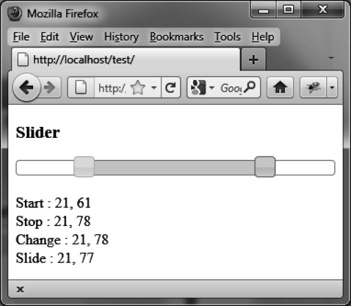

### 7.5.2　显示两个游标的值

使用两个游标，在每个事件发生时显示它们的值。除了 `options.range` 设置为 `true` 及游标的值是用 `slider ("values")` 方法获得的以外，程序和先前的几乎是一样的。

将 `options.range` 设置为 `true` 时，可以修改滑块轴上两个游标之间的空间的样式（默认是灰色的背景）。

```css
<!DOCTYPE html>
<script src = jquery.js></script>
<script src = jqueryui/js/jquery-ui-1.8.16.custom.min.js></script>
<link rel=stylesheet type=text/css
　　　 href=jqueryui/css/smoothness/jquery-ui-1.8.16.custom.css />
<h3> Slider </h3>
<div id=slider></div><br />
Start : <span id=valuestart></span><br />
Stop : <span id=valuestop></span><br />
Change : <span id=valuechange></span><br />
Slide : <span id=valueslide></span>
<script>
$("div#slider").slider ({
　animate : true,
　range : true, 
　values : [0, 0], 　　　　　// 游标的初始值
　start : function (event) 
　{
　　var values = $("div#slider").slider ("values");
　　$("#valuestart").html (values[0] + ", " + values[1]);
　},
　stop : function (event) 
　{
　　var values = $("div#slider").slider ("values");
　　$("#valuestop").html (values[0] + ", " + values[1]);
　},
　change : function (event) 
　{
　　var values = $("div#slider").slider ("values");
　　$("#valuechange").html (values[0] + ", " + values[1]);
　},
　slide : function (event) 
　{
　　var values = $("div#slider").slider ("values");
　　$("#valueslide").html (values[0] + ", " + values[1]);
　}
});
</script>
```

脚本执行的结果如图7-5所示。


<center class="my_markdown"><b class="my_markdown">图7-5　在滑块轴上显示两个游标的值</b></center>

