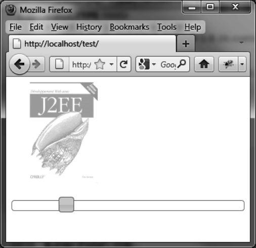

### 7.5.3　使用滑块来调整图片的透明度

下面是一个实际的例子：使用滑块来更改图片的透明度（如图7-6所示）。透明度可以是在0至1之间的不同值。程序启动时，透明度是1，游标位于最大值处。

正常情况下，游标的值在0和100之间。下面的例子中，把游标的值除以100，这样值在0和1之间，可以当作是透明度的值。

```css
<!DOCTYPE html>
<script src = jquery.js></script>
<script src = jqueryui/js/jquery-ui-1.8.16.custom.min.js></script>
<link rel=stylesheet type=text/css
　　　 href=jqueryui/css/smoothness/jquery-ui-1.8.16.custom.css />
<br /><br />
<div id=slider></div><br />
<script>
$("div#slider").slider ({
　animate : true, 
　slide : function (event) 
　{
　　var value = $("div#slider").slider ("value");
　　var opacity = value / 100; 
　　$("img").css({ opacity : opacity });
　}
}).slider ("value", 100); 
</script>
```


<center class="my_markdown"><b class="my_markdown">图7-6　根据指定的值来设置图片的透明度</b></center>

<a class="my_markdown" href="['#ac71']">①</a>　在滑块轴上直接单击来移动游标，也会调用该方法，即不管何种形式，只要游标移动了，就会调用这个方法。——译者注


