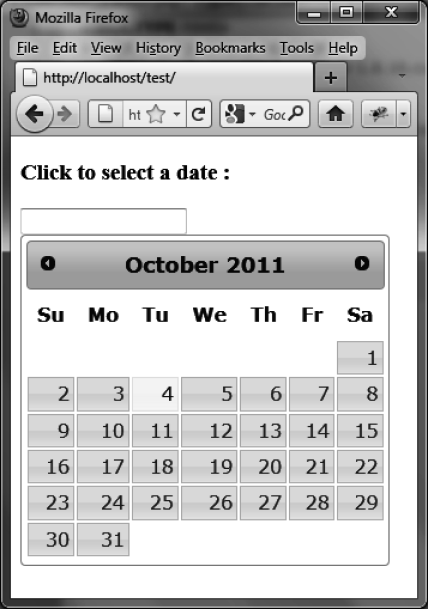

### 8.1　日历的基本用法

假设我们想编写一段HTML代码图8-1所示的日历。用户在日期输入框里单击时这个日历就会显示。日历右上角和左上角的箭头可以用来滚动选择月份，如果选择了日历上的某一天，就会把这一天填入到输入框里面。


<center class="my_markdown"><b class="my_markdown">图8-1　HTML页面中的日历</b></center>

下面是根据jQuery UI的约定来编写的代码，包括在 `<script>` 标签里面调用 `datepicker ()` 方法。

我们使用一个标识符（即 `id` ）为date的 `<input>` 元素，它是日期的输入框。此时，当用户单击输入框时日历就会自动显示在输入框的正下方。当用户在输入框外单击或者选择了一个日期时日历就会隐藏（选择的日期会显示在输入框里面）。

```css
<script src = jquery.js></script>
<script src = jqueryui/js/jquery-ui-1.8.16.custom.min.js></script>
<link rel=stylesheet type=text/css
　　　 href=jqueryui/css/smoothness/jquery-ui-1.8.16.custom.css />
<h3>Click to select a date :</h3>
<input id=date />
<script>
$("input#date").datepicker ();
</script>
```

如果用 `<div>` 或者 `<span>` 元素来替换 `<input>` 元素，日历会直接显示在页面上，而不用用户在输入框里面单击才显示。

