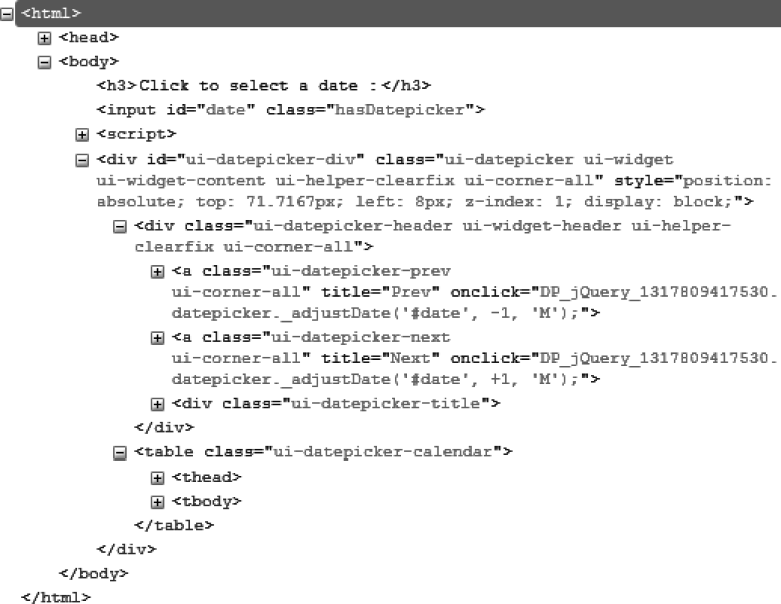
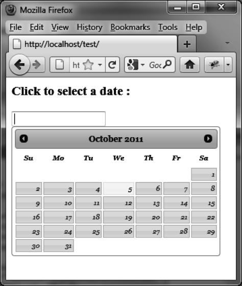

### 8.2　格式化内容

`datepicker ()` 方法会通过添加一些新的CSS类来改变页面上HTML元素的外观。

图8-2展示了在 `datepicker ()` 方法执行后由jQuery UI生成的HTML代码（该代码是用Firefox的Firebug扩展查看的）。

输入框有些许修改，添加了 `hasDatepicker` CSS类，在HTML中也插入了一个与日历对应的 `<div>` 元素（含有 `ui-datepicker-div`  CSS类）。这个 `<div>` 元素是显示还是隐藏，取决于用户是否想使用日历。

这段HTML的结构很简单：除了包含整个日历的 `<div>` 元素外，它还有一个包含了日历第一行内容的 `<div>` 元素（月份和年份的标题，月份有两个箭头按钮），紧接着是一个表格元素： `<thead>` 标签中的是星期中的天的名称， `<tbody>` 标签中的是对应月份中的日期。

可以对HTML元素使用CSS类来自定义元素的样式。例如，如果更改与 `<div>` 元素关联的 `ui-`   `datepicker-header` CSS类以与和 `<table>` 元素关联的 `ui-datepicker-calendar` CSS类，就能得到新的日历外观（如图8-3所示）。在HTML中添加一个 `<style>` 标签来修改这些类的值。


<center class="my_markdown"><b class="my_markdown">图8-2　 `datepicker ()` 方法生成的HTML代码</b></center>

```css
<script src = jquery.js></script>
<script src = jqueryui/js/jquery-ui-1.8.16.custom.min.js></script>
<link rel=stylesheet type=text/css
　　　 href=jqueryui/css/smoothness/jquery-ui-1.8.16.custom.css />
<style type=text/css>
　div.ui-datepicker-header {
　　font-size : 12px; 
　　font-family : georgia; 
　}
　table.ui-datepicker-calendar {
　　font-size : 10px; 
　　font-family : georgia; 
　　font-style : italic; 
　}
</style>
<h3>Click to select a date :</h3>
<input id=date />
<script>
$("input#date").datepicker ();
</script>
```


<center class="my_markdown"><b class="my_markdown">图8-3　自定义的日历</b></center>

