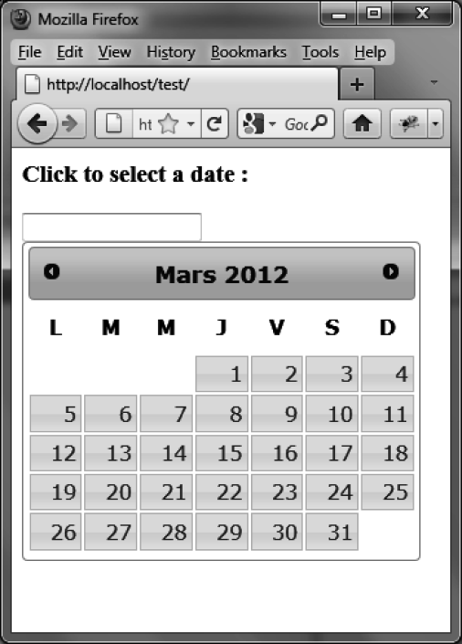

### 8.4.1　用其他语言显示日历

想以其他语言显示日历（如图8-4所示），仅需引入对应该语言的JavaScript语言文件即可。该文件位于jqueryui/development-bundle/ui/i18n目录下面。比如jqueryui/development-bundle/ ui/i18n/jquery.ui.datepicker-fr.js是法语文件：

```css
<script src = jquery.js></script>
<script src = jqueryui/js/jquery-ui-1.8.16.custom.min.js></script>
<script src=jqueryui/development-bundle/ui/i18n/jquery.ui.datepicker-fr.js></script>
<link rel=stylesheet type=text/css
　　　 href=jqueryui/css/smoothness/jquery-ui-1.8.16.custom.css />
<h3>Click to select a date :</h3>
<input id=date />
<script>
$("input#date").datepicker ();
</script>
```


<center class="my_markdown"><b class="my_markdown">图8-4　法语日历</b></center>

