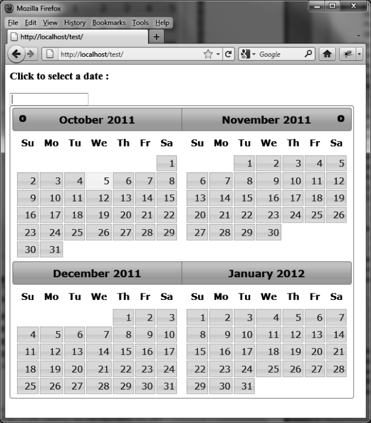
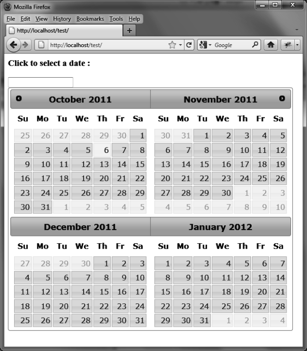

### 8.4.2　在日历中显示多个月份

日历中可以显示多个月份（如图8-5所示）。为此，我们使用 `options.numberOfMonths` 选项，该选项指定了想要显示的月份个数或者是数组[x, y]，包含了显示月份的行数（x）及列数（y）。

使用下面的代码（粗体显示部分）在日历中显示4个月份（2行，每行2个月份，如图8-5所示）。

```css
<script src=jquery.js></script>
<script src=jqueryui/development-bundle/ui/jquery-ui-1.8.4.custom.js></script>
<script src=jqueryui/development-bundle/ui/i18n/jquery.ui.datepicker-fr.js>
</script>
<link rel=stylesheet type=text/css
　　　 href="jqueryui/development-bundle/themes/smoothness/jquery.ui.all.css"/>
<body>
<input id=date />
</body>
<script>
$("input#date").datepicker ({
　numberOfMonths : [2, 2] 
});
</script>
```

在这个示例中我们看到每个月第一天之前及每个月最后一天之后的单元格都是空的。我们相信，在这些空白的单元格中填入上个月及下个月的日期看起来会更加协调，如图8-6所示。将 `options.showOtherMonths` 选项设置为 `true` ，就可以了。

```css
<script src = jquery.js></script>
<script src = jqueryui/js/jquery-ui-1.8.16.custom.min.js></script>
<link rel=stylesheet type=text/css
　　　 href=jqueryui/css/smoothness/jquery-ui-1.8.16.custom.css />
<h3>Click to select a date :</h3>
<input id=date />
<script>
$("input#date").datepicker ({
　 numberOfMonths : [2, 2],
　 showOtherMonths : true
});
</script>
```


<center class="my_markdown"><b class="my_markdown">图8-5　显示多个月份</b></center>


<center class="my_markdown"><b class="my_markdown">图8-6　在日历中加入额外的日期</b></center>

