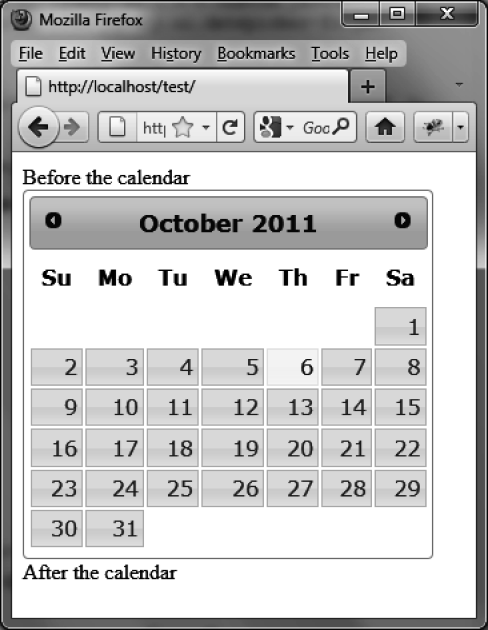

### 8.4.3　显示静态日历

可以在HTML页面中直接显示日历，而不是只有当用户在与日历关联的输入框里面单击时才显示（如图8-7所示）。为此，把输入框替换成 `<span>` 或者 `<div>` 元素即可：

```css
<script src = jquery.js></script>
<script src = jqueryui/js/jquery-ui-1.8.16.custom.min.js></script>
<link rel=stylesheet type=text/css
　　　 href=jqueryui/css/smoothness/jquery-ui-1.8.16.custom.css />
<div> Before the calendar </div>
<div id=date></div>
<div> After the calendar </div>
<script>
$("div#date").datepicker ();
</script>
```


<center class="my_markdown"><b class="my_markdown">图8-7　静态日历</b></center>

