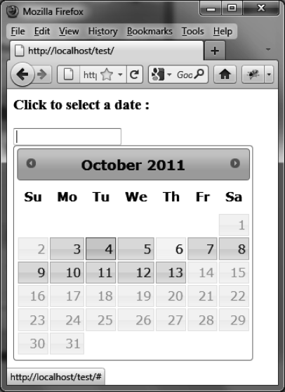

### 8.4.4　指定最小及最大日期

`options.minDate` 和 `options.maxDate` 选项可以指定最小和最大的日期。例如，阻止选择早于当前日期三天的日期或者晚于当前日期一个星期的日期（如图8-8所示），代码如下：

```css
<script src = jquery.js></script>
<script src = jqueryui/js/jquery-ui-1.8.16.custom.min.js></script>
<link rel=stylesheet type=text/css
　　　 href=jqueryui/css/smoothness/jquery-ui-1.8.16.custom.css />
<h3>Click to select a date :</h3>
<input id=date />
<script>
$("input#date").datepicker ({
　 minDate : −3,　　　// 最小的日期早于当前日期三天
　 maxDate : "1w" 　　// 最大的日期晚于当前日期一个星期
});
</script>
```


<center class="my_markdown"><b class="my_markdown">图8-8　最小和最大的日期</b></center>

假设当前日期是2011年10月6日。在该日期周围，可以选择的日期的背景色是灰的且颜色较暗，而不可选择的日期背景色是浅灰色的且不能响应鼠标事件。

