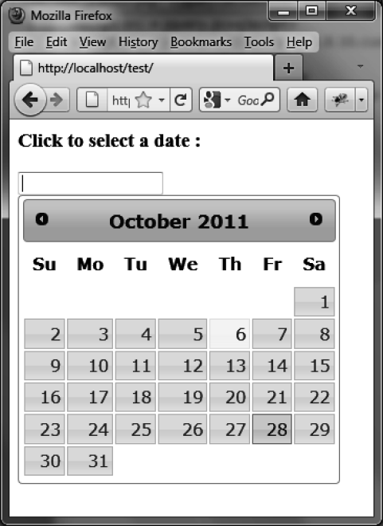
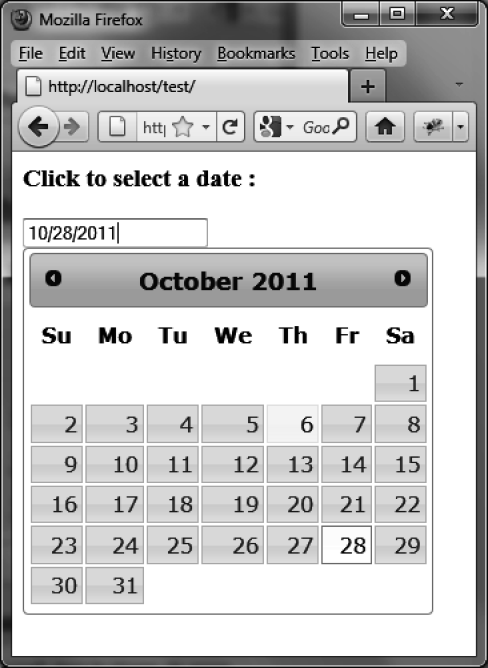
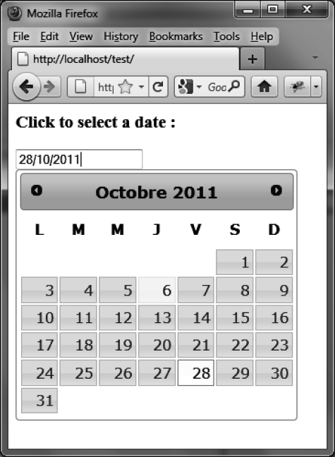

### 8.4.6　预先选择任意日期

默认的预设日期是当前日期。使用 `options.defaultDate` 选项或者 `datepicker ("setDate")` 可以预选不同的日期。

#### 1．使用 `options.defaultDate` 

虽然当前的日期是10月6日，我们想要预选的日期是10月28日（如图8-10所示）。

```css
<script src = jquery.js></script>
<script src = jqueryui/js/jquery-ui-1.8.16.custom.min.js></script>
<link rel=stylesheet type=text/css
　　　 href=jqueryui/css/smoothness/jquery-ui-1.8.16.custom.css />
<h3>Click to select a date :</h3>
<input id=date />
<script>
$("input#date").datepicker ({
　defaultDate : "3w+1"
});
</script>
```


<center class="my_markdown"><b class="my_markdown">图8-10　预选的日期为非当前日期</b></center>

#### 2．使用 `datepicker ("setDate", date)` 

也可以使用 `datepicker ("setDate", date)` 方法来预选日期。和刚才一样，预选的日期晚于当前日期三周：

```css
<script src = jquery.js></script>
<script src = jqueryui/js/jquery-ui-1.8.16.custom.min.js></script>
<link rel=stylesheet type=text/css
　　　 href=jqueryui/css/smoothness/jquery-ui-1.8.16.custom.css />
<h3>Click to select a date :</h3>
<input id=date />
<script>
$("input#date").datepicker ().datepicker ("setDate", "3w+1");
</script>
```

前面的示例和这种方法的不同之处是日期输入框的初始值是指定的日期（如图8-11所示）。


<center class="my_markdown"><b class="my_markdown">图8-11　预选的日期出现在了输入框里面</b></center>

#### 3．日期格式的特殊情况

如果日历使用的是英语之外的语言，还必须通过 `options.dateFormat` 选项指定该国家选择的日期格式。默认格式是“mm/dd/yy”，为英文日历。比如，要在法语日历中预设日期，代码如下：

```css
<script src = jquery.js></script>
<script src = jqueryui/js/jquery-ui-1.8.16.custom.min.js></script>
<script src=jqueryui/development-bundle/ui/i18n/jquery.ui.datepicker-fr.js></script>
<link rel=stylesheet type=text/css
　　　 href=jqueryui/css/smoothness/jquery-ui-1.8.16.custom.css />
<h3>Click to select a date :</h3>
<input id=date />
<script>
$("input#date").datepicker ({
　 dateFormat : "dd/mm/yy" // 使用 setDate时需要设置该选项
}).datepicker ("setDate", "3w+1");
</script>
```

结果如图8-12所示。


<center class="my_markdown"><b class="my_markdown">图8-12　在法语日历中预设日期</b></center>

