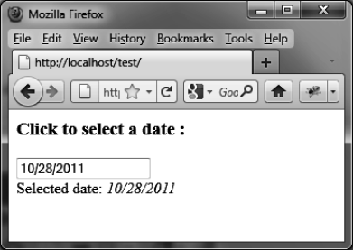

### 8.4.7　在选择日期时执行Ajax请求

在选择日期时执行Ajax请求是很常见的。在这个示例中，我们在日历中选择某个日期，然后把它发送给服务器，服务器把日期返回给我们。这验证了信息传输的整个过程：

```css
<script src = jquery.js></script>
<script src = jqueryui/js/jquery-ui-1.8.16.custom.min.js></script>
<link rel=stylesheet type=text/css
　　　 href=jqueryui/css/smoothness/jquery-ui-1.8.16.custom.css />
<h3>Click to select a date :</h3>
<input id=date />
<div id=datereturn></div>
<script>
$("input#date").datepicker ({
onSelect : function (dateText) 
　{
　　var data = { date : dateText };
　　$.ajax({
　　url : "action.php",
　　data : data, 
　　complete : function (xhr, result) 
　　{
　　　if (result != "success") return; 
　　　var response = xhr.responseText; 
　　　$("#datereturn").html (response); 
　　}
　});
　}
});
</script>
```

服务器返回的文本会被插入到标识符为 `datereturn` 的 `<div>` 元素中。action.php文件中的服务器端代码如下：

```css
<?
　$date = $_REQUEST["date"];
　$txt = "Selected date: <i> $date </i>";
　$txt = utf8_encode($txt);
　echo($txt);
?>
```

请注意，<a class="my_markdown" href="['http://localhost/test']">http://localhost/test</a>是一个HTTP URL。如果不是，Ajax请求是不会工作的。

在选择日期之后，日期会显示在输入框的下方（如图8-13所示）。


<center class="my_markdown"><b class="my_markdown">图8-13　向服务器发送选择的日期</b></center>


