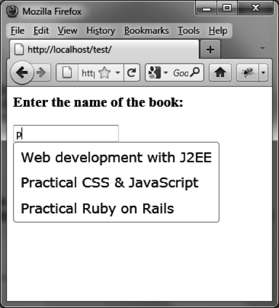

### 9.1　自动补全的基本用法

如果我们想编写一段HTML代码来显示图9-1所示的建议列表，即当用户刚刚输入字母“p”的时候，立即显示一个列表，其中的各项都包含了至少一个字母“p”。


<center class="my_markdown"><b class="my_markdown">图9-1　建议列表</b></center>

我们用一个ID名为book的<input>标签作为输入区域：

```css
<script src = jquery.js></script>
<script src = jqueryui/js/jquery-ui-1.8.16.custom.min.js></script>
<link rel=stylesheet type=text/css
　　　 href=jqueryui/css/smoothness/jquery-ui-1.8.16.custom.css />
<h3>Enter the name of the book:</h3>
<input id=book />
<script>
// 建议列表中待匹配的数组项
var books = ["Web development with J2EE", "Practical CSS & JavaScript",
　　　　　　　 "Practical Ruby on Rails", "Introduction to HTML & CSS",
　　　　　　　 "jQuery UI"];
$("input#book").autocomplete ({
　 source : books
});
</script>
```

在HTML页面的 `<script>` 标签内，我们需要指定建议列表（ `var books` ），同时监听输入框事件，以控制建议列表的显示。实现这些的代码非常简单，只需声明<input>输入框由jQuery UI的 `autocomplete ()` 方法管理即可。而 `{source: books}` 参数则指定了用于显示建议列表的具体选项。

