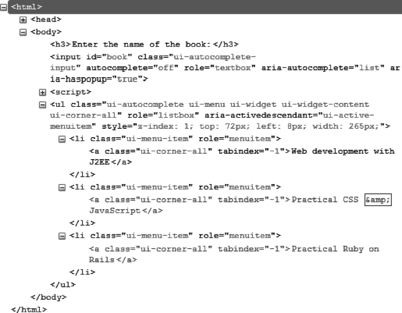

### 9.2　格式化内容

`autocomplete ()` 方法会自动在输入框下方创建一个建议列表，同时给相关的元素添加一些新的CSS类，用以为其赋予合适的样式。

如图9-2所示，在 `autocomplete ()` 方法之后，由jQuery UI生成的HTML代码已经改变了（图中的代码是用Firefox的Firebug扩展查看的）。


<center class="my_markdown"><b class="my_markdown">图9-2　由 `autocomplete ()` 方法生成的HTML代码</b></center>

`<input>` 元素有些许的修改。现在HTML代码中新增了一个 `<ul>` 元素，对应的即为显示在输入框下方的列表。列表中的每一个元素都是一个CSS类名为 `ui-menu-item` 的 `<li>` 元素。

我们可以添加一个 `<style>` 标签，在其中修改相应的CSS类名，用于定制列表的外观。例如，我们可以修改和 `<li>` 元素关联的 `ui-menu-item` 类来更换建议列表中使用的字体，结果如图9-3所示。

```css
<script src = jquery.js></script>
<script src = jqueryui/js/jquery-ui-1.8.16.custom.min.js></script>
<link rel=stylesheet type=text/css
　　　 href=jqueryui/css/smoothness/jquery-ui-1.8.16.custom.css />
<style type=text/css>
　li.ui-menu-item {
　　font-size : 12px; 
　　font-family : georgia; 
　}
</style>
<h3>Enter the name of the book:</h3>
<input id=book />
<script>
// 在建议列表中提出的项目数组
var books = ["Web development with J2EE", "Practical CSS & JavaScript",
　　　　　　　"Practical Ruby on Rails", "Introduction to HTML & CSS",
　　　　　　　"jQuery UI"];
$("input#book").autocomplete ({
　source : books
});
</script>
```


<center class="my_markdown"><b class="my_markdown">图9-3　定制字体的建议列表</b></center>

