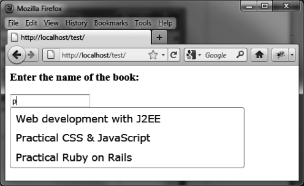

### 9.5.1　指定建议列表的宽度

jQuery UI自身会基于内容来计算建议列表的宽度。但有时候，我们也需要手动指定列表宽度。在下面这个例子里，我们将建议列表的宽度设为了400像素宽（见图9-4）。

```css
 <script src = jquery.js></script>
 <script src = jqueryui/js/jquery-ui-1.8.16.custom.min.js></script>
 <link rel=stylesheet type=text/css
　　　　href=jqueryui/css/smoothness/jquery-ui-1.8.16.custom.css />
 <h3>Enter the name of the book:</h3>
 <input id=book />
 <script>
 // 建议列表中待匹配的数组项
 var books = ["Web development with J2EE", "Practical CSS & JavaScript",
　　　　　　　　"Practical Ruby on Rails", "Introduction to HTML & CSS",
　　　　　　　　"jQuery UI"];
 $("input#book").autocomplete ({
　　source : books, 
　　open : function (event) 
 {
　　var $ul = $(this).autocomplete ("widget");
　　$ul.css ("width", "400px");
 }
});
</script>
```


<center class="my_markdown"><b class="my_markdown">图9-4　手动设置一个建议列表的宽度</b></center>

列表对应的是 `<ul>` 元素（使用 `autocomplete (options` )方法时由jQuery UI自动创建）。我们之前有解释过使用 `autocomplete ("widget")` 方法可以方便地访问这个元素。

当我们获得了 `<ul>` 元素之后（以jQuery类对象的形式），即可简单地使用 `css ()` 方法修改它的尺寸。只有在列表被显示了的前提下才可以这样做，因此要使用 `options.open` 选项。

