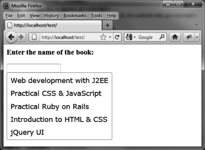

### 9.5.2　打开HTML页面时即显示建议列表

建议列表会在输入框中的输入达到最低字符数量（在 `options.minLength` 中指定）时显示。也就是说，至少需要输入一个字符（要想立即显示建议列表，仅将 `options.minLength` 的值设置为0是不够的）。

我们来尝试创建一个在脚本运行时便能立刻显示的建议列表（用户无需在输入框中有任何输入）。要实现这一点，只需在脚本的一开始使用 `autocomplete ("search","")` 方法。指定空字符串""可以让我们无需输入任何字符。列表会显示并列出所有的值，而此时焦点还未落到输入框中，用户尚无法输入（见图9-5）。

```css
<script src = jquery.js></script> 
<script src = jqueryui/js/jquery-ui-1.8.16.custom.min.js></script> 
<link rel=stylesheet type=text/css 
　　　 href=jqueryui/css/smoothness/jquery-ui-1.8.16.custom.css /> 
<h3>Enter the name of the book:</h3> 
<input id=book /> 
<script>
 // 建议列表中待匹配的数组项
var books = ["Web development with J2EE", "Practical CSS & JavaScript",
　　　　　　　 "Practical Ruby on Rails", "Introduction to HTML & CSS",
　　　　　　　 "jQuery UI"]; 
$("input#book").autocomplete ({ 
　 source : books, 
　 minLength : 0 
}).autocomplete ("search", ""); 
</script> 
```


<center class="my_markdown"><b class="my_markdown">图9-5　读取页面时即显示建议列表</b></center>

