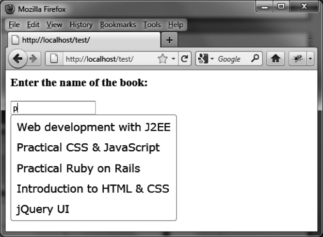

### 9.5.5　动态创建建议列表

前面的例子使用的都是静态的建议列表，在编写脚本的一开始就是已知的。jQuery UI允许在 `options.source` 中将数据源指定为一个回调函数，用它来构建建议列表。

```css
<script src = jquery.js></script> 
<script src = jqueryui/js/jquery-ui-1.8.16.custom.min.js></script> 
<link rel=stylesheet type=text/css 
　　　 href=jqueryui/css/smoothness/jquery-ui-1.8.16.custom.css /> 
<h3>Enter the name of the book:</h3> 
<input id=book /> 
<script> 
$("input#book").autocomplete ({ 
　source : function (request, callback) 
　{ 
　 // 建议列表中待匹配的数组项 
　 var books = ["Web development with J2EE", "Practical CSS & JavaScript", 
　　　　　　　　　"Practical Ruby on Rails", "Introduction to HTML & CSS", 
　　　　　　　　　"jQuery UI"]; 
　 callback (books); 
　} 
a}); 
</script> 
```

在 `options.source` 中，我们指定一个用来构建建议列表的函数。这个函数接受两个　 参数：

+ `request` 对象有一个名为 `term` 的属性，其值即为输入框中用户输入的文本（但在这里并没有使用这一属性）。
+ `callback` 是一个必须最后处理的函数。它需要以数组的形式指定一个用作建议列表的数据参数（这里是 `books` ）。

本例中并没有利用用户输入的文本，所以无论用户输入什么值，返回的列表结果始终是一样的（如图9-6所示）。我们会在接下来的一节中看到如何考虑输入框中已输入字符。


<center class="my_markdown"><b class="my_markdown">图9-6　动态创建的建议列表</b></center>

