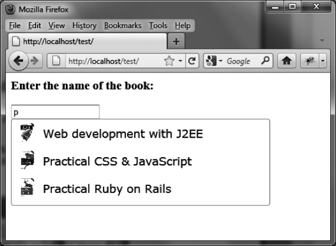

### 9.5.7　在建议列表中插入图片

标准情况下，jQuery UI提供的自动补全功能并不会插入文本以外的内容形式。当然你可以通过操纵DOM树来为列表插入其他的HTML元素。

我们还是用前文的书籍程序例子来解释这一做法。现在我们想要在每本书的书名前添加一张图片。如果某本书没有可用的图片，则用一张默认图替代显示（如图9-7所示）。


<center class="my_markdown"><b class="my_markdown">图9-7　建议列表中的图片</b></center>

要做到这一点，你可以在前面写过的程序上继续做些修改。将数据库稍加改动，用一个 `picture` 字段来存储每本书相关的图片文件名。如果要显示默认图片，将数据库中的此字段设置为NULL即可。

```css
CREATE DATABASE IF NOT EXISTS test; 
USE test; 
DROP TABLE IF EXISTS books; 
CREATE TABLE books ( 
　id int(10) unsigned NOT NULL auto_increment, 
　title varchar(100) NOT NULL, 
　picture varchar(100), 
　PRIMARY KEY (id) 
); 
INSERT INTO books (id, title, picture) VALUES 
　(1,"Web development with J2EE", "j2ee.jpg"), 
　(2,"Practical CSS & JavaScript", "javascript.jpg"), 
　(3,"Practical Ruby on Rails", "rails.jpg"), 
　(4,"Introduction to HTML & CSS", "html.jpg"), 
　(5,"jQuery UI", NULL); 
```

jQuery UI这本书并没有相关的图片，所以它在picture字段中插入了一个空（null）值。每个图片文件（如j2ee.jpg、javascript.jpg等）都会存入到服务器上的images目录中。

服务器端程序改为如下所示的action.php文件：

```css
<?
　$term = $_REQUEST["term"]; 
　$term = utf8_decode ($term); 
　$bd = mysql_connect ("localhost", "root", "pwd"); 
　$ret = mysql_select_db ("test", $bd); 
　$query = sprintf ( 
　　　　 "SELECT * FROM books WHERE title LIKE '%%%s%%'", 
　　　　 mysql_real_escape_string($term)); 
　// 执行查询 
　$result = mysql_query($query); 
　if ($result) 
　{ 
　　// 将查询结果发回给浏览器 
　　header ("content-type:text/xml");　　　　　 // 这次发送XML格式的数据! 
　　echo ("<books>"); 
　　while ($row = mysql_fetch_assoc($result)) 
　{
　　echo ("<li>"); 
　　echo ("<title>" 
　　　 . 
　utf8_encode (str_replace ("&", "&", $row["title"])) 
　　　 . 
　"</title>"); 
　　echo ("<picture>" . utf8_encode($row["picture"]) . "</picture>"); 
　　echo ("</li>"); 
　 } 
　 echo ("</books>"); 
　 mysql_free_result ($result); 
　}
　mysql_close ($bd); 
?>
```

和之前的版本相比，主要修改了返回的数据的格式。这次我们必须返回书的书名和图片文件的文件名，要做到这一点，我们使用打包在一个 `<li>` 标签中的 `<title>` 和 `<picture>` 标签。由于我们使用了非HTML的标签名（例如 `<picture>` ），因而必须使用 `header ("content-type:text/xml")` 语句，指明服务器端返回的是XML格式。

此外，书的书名中有可能含有特殊的XML字符，如&。这个字符必须被转义为 `&amp` ，JavaScript程序才能正确解释服务器返回的结果。

这个HTML页面的程序内容如下：

```css
<script src = jquery.js></script> 
<script src = jqueryui/js/jquery-ui-1.8.16.custom.min.js></script> 
<link rel=stylesheet type=text/css 
　　　 href=jqueryui/css/smoothness/jquery-ui-1.8.16.custom.css /> 
<h3>Enter the name of the book:</h3> 
<input id=book /> 
<script> 
$("input#book").autocomplete ({ 
　source : function (request, callback) 
　{
　　var data = { term : request.term }; 
　　$.ajax ({ 
　　　 url : "action.php", 
　　　 data : data, 
　　　 complete : function (xhr, result) 
　　　 { 
　　　　 if (result != "success") return; 
　　　　 var response = xhr.responseXML; 
　　　　 var books = []; 
　　　　 // 获取书名 
　　　　 $(response).find ("li title").each (function () 
　　　　 { 
　　　　　 books.push ($(this).text ()); 
　　　　 }); 
　　　　 // 插入书名 
　　　　 callback (books); 
　　　　 // 插入图片
　　　　 var $ul = $("input#book").autocomplete ("widget"); 
　　　　 $(response).find ("li picture").each (function (index) 
　　　　 { 
　　　　　　var src = $(this).text () || "default.jpg"; 
　　　　　　$ul.find ("li:eq(" + index +") a") 
　　　　　　　　 .wrapInner ("<span style=position:relative;" + 
　　　　　　　　　　　　　　　 "top:-7px;left:10px></span>") 
　　　　　　　　 .prepend (""); 
　　　　 }); 
　　　 }
　　}); 
　　}, 
　　 open : function (event) 
　　{ 
　　　 var $ul = $(this).autocomplete ("widget"); 
　　　 $ul.css ("width", "400px"); 
　　} 
　}); 
　</script> 
```

原理如下：首先使用书名来创建列表（通过 `callback (books)` 方法），然后修改DOM树，在每个书名前插入一张图片。

要达到这一目的，可以先通过 `$(response).find ("li title")` 来获取书籍的书名，通过 `$(response).find ("li picture")` 来获取图片文件的URL。由于之前的 `callback (books)` 已经创建了每张图片（如果图片不存在，则使用default.jpg来替代）所需的 `<a>` 链接，而这个链接足够将一个包含这一链接文本的 `<span>` 元素嵌入在内（使用 `wrapInner ()` 方法），最后只需在其链接的开始部分插入这张图片（使用 `prepend ()` 方法）即可。

<a class="my_markdown" href="['#ac91']">①</a>　译者并没能重现作者所说的问题，经邮件咨询原作者了解到，这可能是一个个案。读者可放心使用各种视觉特效。——译者注


