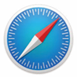

# 前言

如果你在Web设计和开发的岗位做得时间足够长，那么你的书架和电子书架上应该已经塞满了关于HTML和CSS方面的书籍，甚至也许已经买过我之前出版的《超越CSS——Web设计艺术精髓》。那么，为什么你还需要这本书？

这是一本面向那些富有创造力、渴望理解WHEN（何时）、HOW（如何）和WHY（为什么），以及积极实践HTML和CSS新特性的Web设计师和前端工程师的书。拥抱新技术，就从现在就开始，不是明天或者下周。这本书不会教你如何书写基本的HTML标签或者CSS样式，而是会传授对于学习新知如饥似渴的你，如何正确使用这些新特性与技术，让你的网站更有创造力和想象力，更加适应不同的设备与环境。

如果你非常在乎标签的使用与清晰的表达，那么在本书中，你将会学习到如何使用富语义化的HTML标签来构建网页。内容将会从微格式涵盖到WAI-ARIR无障碍访问。了解这些内容，会帮助你减少对那些非语义化标签的依赖，从而使你的网站性能更加卓越。

如果你是一位设计师，希望了解最新的CSS技术以及了解它能带来什么样的创意灵感，那么本书将会教你，如何在支持这些特性的浏览器中更好地使用它们，以及如何更加优雅地兼容那些老的、且支持效果不好的浏览器。

## 为什么更新本书

我们在2010年出版了本书的第1版，至今尽管只有短短的五年时间（本书最新英文版于2015年出版），但是就在我创作新书期间，无数Web设计理念与技术都已发生了改变。在2010年本书第1版出版前的数周，苹果公司发布了iPad，随后它改变了人们与网站的互动方式；在第1版出版前的5个月，Ethan Marcotte发表了他的“响应式设计”一文，这一思想不可避免地造成了Web访问的变化，这一全新理念冲击了当时的Web设计和开发行业；在2010年的那个时间节点，设计师与工程师们还在为迁就那些老旧桌面浏览器的缺陷而殚精竭虑，鲜有人去展望未来。现今，人们更多都是在使用智能手机来访问互联网。

这些年，那些拖后腿的老旧浏览器已经逐渐退出历史舞台。我们不必再为那些不支持圆角、阴影、透明度甚至是RGB色值的浏览器去写一些hack的方法。来自苹果、火狐、谷歌、Opera甚至是微软的现代浏览器，都对CSS有很高的支持度，但是它们依然是对一些仅自己支持的特性更加友好。

对于大多数老板和客户，他们的焦点目前都放在了设计数字化产品上，而不是网站。不管我们如何去做，只设计静态网页视觉稿的传统方式，已经被组件化的设计所取代。如今，我们在设计环节使用HTML和CSS做原型设计，在随后的迭代中通过代码来不断完善产品，而不是设计更多的视觉稿。事实上，我们的客户早已习惯于这样的流程，并且很多人还满怀期待。因为他们可以很快地在自己的智能手机或平板电脑上亲眼看到我们的响应式设计理念。

五年的时间会改变很多事，但是我们对于设计和开发的心态却从未改变。以前我们可能困扰于类似border-radius这样的CSS属性的兼容情况，现在同样对于使用flexbox心存担忧。在各种各样的CSS研讨会上，我常常惊诧于如此之多的人到现在还拒绝使用类似border-image、background-blend-mode、filter等等这样的属性，即便现代浏览器已经支持这些特性了。

Web技术在不断进步，但万变不离其宗，这也是为什么本书所阐述的方法依然有效的原因，甚至这些经验在移动端显得更加重要。现在针对多设备的响应式设计，要比本书第1版出版的时候多了太多。你准备好开始这趟Web设计的奇幻之旅了吗？系紧安全带，加大油门，出发吧！

## 阅读提示

这是一本关于最新的CSS和HTML技术的书，我们假定读者都是设计师或前端工程师，且熟知如何书写结构良好的页面，也就是说，你是使用HTML标签与CSS来完成设计的。阅读本书是否需要知晓全部的CSS知识？不需要，不过如果你能理解选择器以及当前层这样的技术概念，将会对阅读大有裨益。如果你刚接触CSS，我希望本书可以给予你启发和鼓舞，并且能够让你了解到“硬派”的意义。

## 你需要做什么

你需要准备一台Mac或者PC电脑，上面安装几个现代浏览器和它们的开发者工具插件，如果有智能手机或者平板电脑更佳。你可以使用自己的设备，来访问“Get Hardboiled”网站上的案例，体验在不同的屏幕分辨率，不同设备上的浏览感受。我强烈建议您安装如下浏览器。

## Safari

在Mac上打开Safari，点击Safari的Preferences按钮，点击“高级”选项卡，然后选择“Show Develop menu in menu bar”这将会开启Safari的开发者工具。Safari是OSX下的默认浏览器，使用的是iOS渲染引擎。

## Chrome

鉴于Safari浏览器使用了WebKit的渲染引擎，于是谷歌旗下的Chrome改用了自己研发的Blink引擎，Chrome浏览器拥有非常好的扩展工具，可以帮助我们在设计和开发网站的时候，十分方便地在浏览器中调试。

## Firefox

安装最新版的Firefox（火狐浏览器）以及最近可用的beta版。它以其丰富的扩展而闻名，目前它仍是广受用户欢迎的浏览器。

## Edge

Edge是微软最新款的浏览器，它的LOGO很容易让人追忆起IE浏览器，但是它抛弃了前辈过往的包袱。Edge目前只支持Windows 10操作系统的PC、智能手机、平板电脑以及Xbox的命令行。对于旧的操作系统，暂时不提供支持。

## Opera

旧版Opera浏览器使用的是自家研发的Presto渲染引擎，目前最新的版本已经改为和Chrome一样的Blink内核了。

你无须特意准备任何写代码的软件，找个你喜欢的文本编辑工具即可，我用的仍然是Espresso。

## 本书案例网站“Get Hardboiled”

在本书中，我为读者建立了一个名为“Get Hardboiled”的网站，并通过每一章节的案例，帮助读者理解本书的内容。这些案例使用了最新Web技术，展现了精彩绝伦的体验。看过之后，你会忘记那些在老掉牙浏览器中做Web设计的痛苦。

你可以在GitHub上找到这些代码。

“Get Hardboiled”上的大量案例可以激发你的灵感，同时帮助你更快更好地使用最新的HTML和CSS特性。

## 必读书单

《红色收获》 Dashiell Hammett，1929

《马耳他之鹰》 Dashiell Hammett，1930

《邮差总是按两次铃》 James M.Cain，1934

《双重赔偿》 James M.Cain，1943

《长眠不醒》 Raymond Chandler，1939

