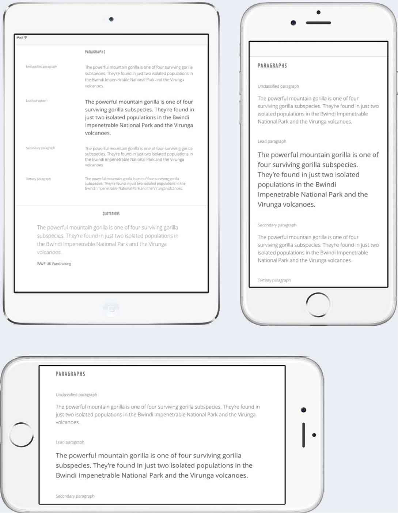
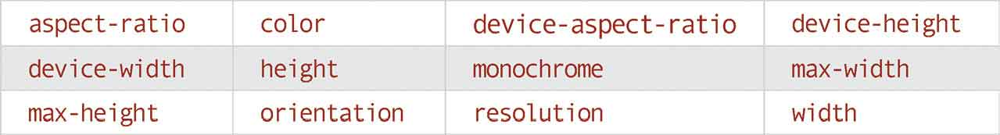
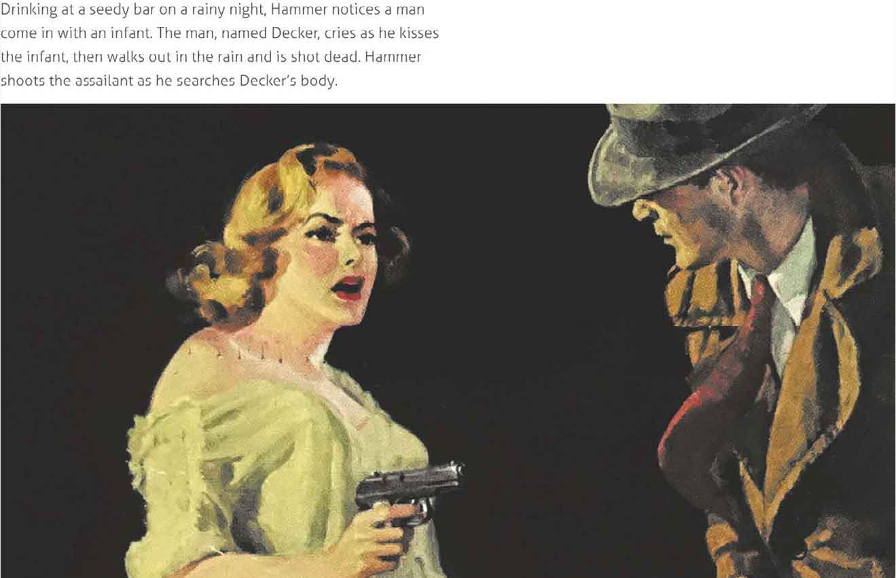
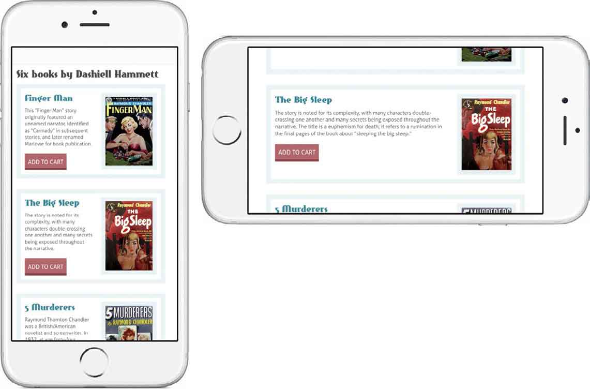
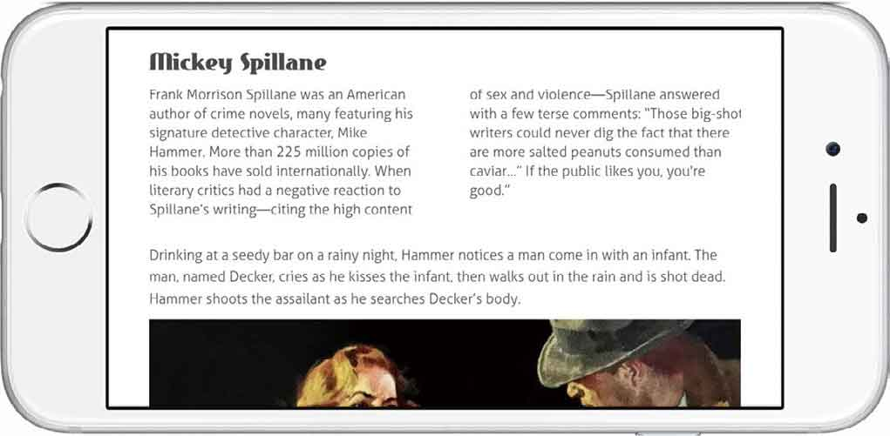
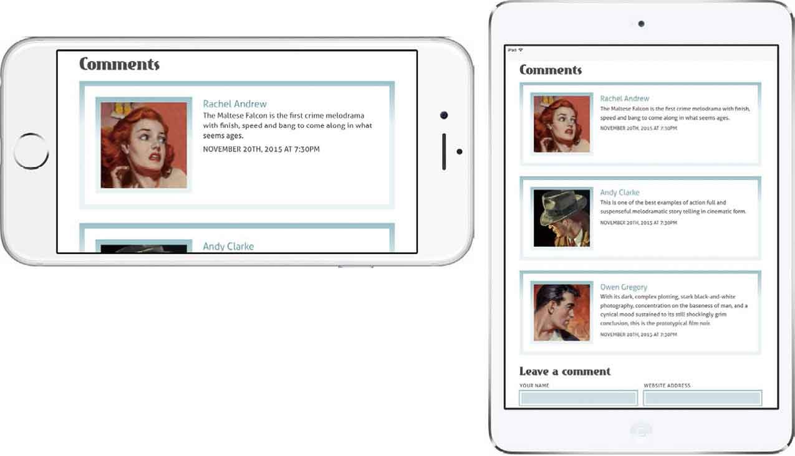
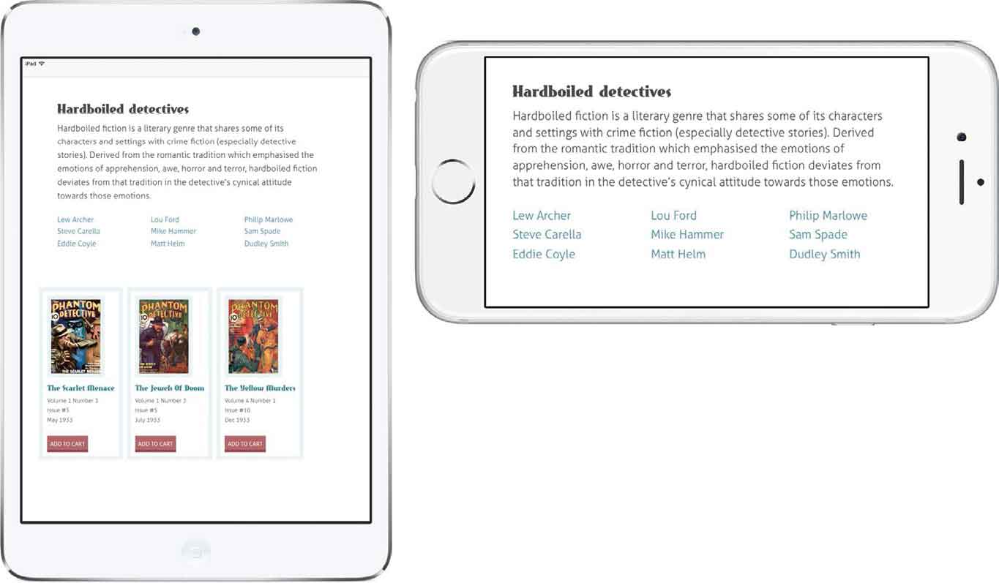
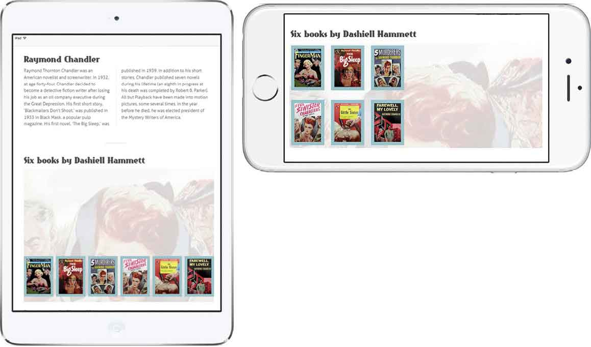
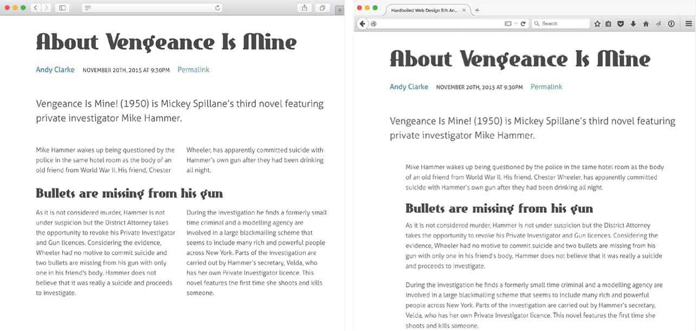
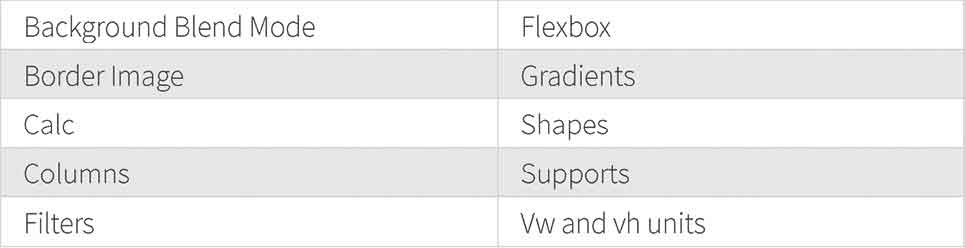

# 第10章　CSS基础

> 响应式设计经常迫切需要对排版的完美控制。其中最有效的一个办法是通过调整文本大小，以及行高这些与宽度有关的特性，来提升可读性。
> 
> <center class="my_markdown"><b class="my_markdown">对于我们的WWF案例网站，当屏幕宽度增加时，我们也适时地增加了段落和其他文字部分的行高，这里显示了在iPhone横竖屏以及iPad上的显示状态。</b></center>
> 作为一个普遍的经验法则，行高应该随着尺寸增长而变大。这样有利于我们的眼睛，去分辨每行的开始和结束位置。媒体查询允许我们利用视窗宽度或者设备宽度以及相关的CSS选择器，精确地控制行高。在下例中，我们将会把最小的屏幕和最窄的列的 `line-height` 设置为 `1.4` 。
> 随着屏幕和列越来越宽，行高应该随之变大。而这个增长数值依赖于我们选择字体的字号大小。我们设计行高将会以渐进方式逐渐增加，在最小宽度 `48rem` 时设置行高值为 `1.5` 。
> 最终，我们会在最小视窗宽度为 `64rem` 时候，设置行高值为 `1.6` 。
> 随着宽度的不断增加，行高值也会越来越大。而宽度越窄，行高也会越紧凑，这样不仅提升了可读性，也提升了设计排版方面的体验。

## 行高比例媒体查询

现在回顾过往，都会觉得有些不可思议，在本书第1版中，我将介绍CSS媒体查询的章节作为全书的结尾，而在那本书中就再无提及CSS媒体查询。而配合那本书来展示媒体查询效果的示例网站，居然都只是一些著名设计师或工程师的个人网站，鲜有商业网站的成熟案例，因为在那个时期，设计师和开发者们还没法征服响应式设计中的诸多挑战。

本书上一版的结尾章节，如今变成了新版书中的一个专门章节。因为在今天的Web工业中，我们的所想和所做和过去真的很不同了。如果不去拥抱本章中所介绍的这些工具和技术的话，我们将很难实现超越平凡的设计。

## CSS媒体查询

CSS2中为我们介绍了媒体类型这个属性，它可以让我们具备指定不同样式表的能力，甚至可以为不同的设备指定不同的CSS样式表。下面的代码示例中， `screen.css` 只会在设备屏幕中起作用，而 `print.css` 样式表只会在打印机中起作用。

区别设置屏幕以及打印机的替代样式很简单，只需要加一个 `media` 属性即可。

```html
p { 
line-height : 1.4; }
```

```html
<link rel="stylesheet" media="screen" href="screen.css"> 
<link rel="stylesheet" media="print" href="print.css">
```

CSS3的媒体查询，让我们可以更加精准地定义在哪种情况下应用哪种样式。它通过查询表中的设备特征，来实现对不同设备的区别。

```html
@media (min-width: 48rem) { 
p { 
line-height : 1.5; } 
}
```


一个媒体查询包含了一个媒体类型（比如是屏幕设备还是打印机），以及一个设备或者屏幕属性（比如像屏幕尺寸、形状或者其他特征）。这个包含了两个或者更多查询的组合体，使我们能够在匹配到这些查询时候，让对应的样式声明生效。

```html
@media (min-width: 64rem) { 
p { 
line-height : 1.6; } 
}
```

### 链接媒体查询

应用媒体查询有两种办法：第一种是在外联的样式表上指定特定的查询条件，比如指定大中小屏。我们将在 `link` 元素中增加查询条件，指定了一些样式规则只在最小宽度为 `48rem` 的屏幕设备中显示。

利用这种方法，可以在第一个样式表中，给所有浏览器提供一个普适的样式，然后在紧接着的样式表上通过媒体查询，指定不同的展示样式。

```html
<link rel="stylesheet" media="screen and (min-width: 48rem)" 
href="medium.css"> 
<link rel="stylesheet" media="screen and (min-width: 64rem)" 
href="large.css">
```

这个方法初看起来似乎在区分不同媒体查询的时候非常有效，但是当心，浏览器会下载每一个外联的样式表，无论这些样式在当前设备中是否有效，这将会大大降低网站或者APP的性能。

## 嵌入式查询

我们也可以在CSS规则中，使用 `@media` 插入一些额外的样式表，来实现媒体查询。这样的方式虽然增大了单个的样式表体积，但是同时却减少了请求数，这对于Web性能具有促进意义。在下面的例子中，我们将使用 `display:flex` 和 `flex-direction:row-reverse` ，来使 `figure` 元素的说明文字在宽度大于 `48rem` 的时候居于顶部。

```html
@media (min-width: 48rem) { 
.figure--horizontal-reverse { 
display : flex; 
flex-direction : row-reverse; } 
}
```


<center class="my_markdown"><b class="my_markdown">除了改变页面布局，我们也可以使用媒体查询，在不同的响应断点处为某些页面元素做增强处理。</b></center>

在媒体查询中，我们可以给宽度和高度来设置任意的最大或最小值，能够使用很多CSS中的单位，如 `px` 、 `em` 和 `rem` 。但是问题来了，我们该如何设置断点，以便判断何时加入新的样式呢？

## 从最普通的样式开始

理智告诉我们，不应该去写那些不常用的样式，这一点对于网站或者APP的性能优化来说十分重要。但是在实际中，我们常常会看到穿插在不同的样式表或者媒体查询中重复多次的CSS声明。所以，我们在开发时应该使用递进式的布局样式，从最小的兼容布局开始。

我们要确保书写的样式在不同的响应式界面下保持相同的风格和基调。毫无疑问，我们会改变字号或者行高，但是像字体无论是在最大的屏幕还是在最小的屏幕上，都应该是几乎一致的。按钮的内边距和表单的元素样式，也许会在响应式设计时发生一些变化，但是它们的基本样式将保持完全相同。


<center class="my_markdown"><b class="my_markdown">在响应式设计中，内容处理方法之一，也是小屏幕样式处理的基础法则，即在布局样式书写之前，先把颜色、字体、元素素材等样式书写出来。</b></center>

在向页面中添加第一个媒体查询之前，应该首先从我们的设计风格中提炼和组织样式。每个人组织样式表的方式都不同，我个人会将以下六类元素归类。

+ Rest或normalise
+ 全站页面公共样式
+ 字体
+ 表单元素
+ 表格
+ 图像

这样组织样式表，可以让样式声明更加简单，同时也让元素在触发响应式断点时，能够更加符合设计要求。与此同时，我们可能会在稍后针对响应式的断点，做无数的调整和改变。这种小屏优先的策略，意味着我们只创建必需的核心样式，以及更加简单和可维护的样式表。

## 选择响应断点

当设计师与工程师们在第一次处理响应式设计时，一个最常见的情况，就是要一起找出特定设备的精确断点宽度。首先考虑的是大部分型号的iPhone，然后是iPad，最后是其他更小的设备。

我们万万不可被老板或者客户带到沟里，比如他们要求你为网站或者APP开发一个“iPhone或者iPad版本”。随着设备和屏幕尺寸的几何级增长，这种方法是十分不可取的，也非常低效。

定义响应式断点通常是为了适应内容，而不是适应设备尺寸，这个概念越来越被普遍接受。事实上，用这样的原则去选择响应断点并不总是简单的，它要求我们在实施设计方案的时候，要用不同的方式切入。但是最终，通过这样的努力，它会让我们的设计更加具有适应性。

让我们来看下面这个例子，它将要使用CSS的多列布局属性，来为 `div` 做分栏布局。你将能很快从本例中学会如何实现它。

如果我们使用只兼容特定设备的方法，也许会根据设备的宽度来决定设置几栏，例如，iPhone 6s在横屏状态下：

```html
@media only screen 
and (max-device-width : 41.6875rem) { 
section { 
column-count : 2; } 
}
```

对比这种不正确的方式，我们更应该依据自己的排版知识，通过衡量内容的可读性来设置分栏。如果每一行的字符太少，阅读体验会很弱；反之阅读起来会有困难。


<center class="my_markdown"><b class="my_markdown">当我们在部署样式，为页面设置响应式断点的时候，其实并没有什么一成不变的捷径，我们要考虑的是如何让内容更具有意义。</b></center>

基于对字号的认识，我们能够计算出一行文字大概有多少个字母或者中文字符，然后据此添加相应的分栏，完成一个提升阅读体验的布局。

```html
@media only screen 
and (min-width: 48rem) { 
section { 
column-count : 2; } 
} 
@media only screen 
and (min-width: 76.250rem) { 
section { 
column-count : 3; } 
}
```

我把过往基于设备类型的断点方式，改变成基于内容的媒体查询，它们之间的差异大得超乎了我的想象。仔细思考了我过往的所有设计，除了内容本身，还有很多持续多年的旧做法，也因为这种改变而被我扔进了垃圾桶。这也驱动我去使用一种过渡的方法，一种包括了大体的、主要的兼容范围，又能兼顾基本内容展示和调整的断点方式。

## 过渡断点方式

Brad Frost曾写道：

“每当你看到使用320px、480px、768px、1024px作为断点值，就会看到小猫脑袋被天使咬掉之类的情况。”

我不是猫奴，也非常确定世界上没有天使，但是我非常赞同Brad Frost的观点。我们不应该使用具体的像素值来作为响应式断点的单位。而一种不错的选择，是使用一定宽度范围内的组合，来实现基于内容的媒体查询。事实上，这是我现在每天都在用的方法。

大屏智能手机和小尺寸平板电脑之间的区分越来越模糊，同样的事也发生在大屏平板电脑和小尺寸PC电脑上。现在在iPhone 6s上的横屏设计，与iPad mini上的展示几乎无异。


<center class="my_markdown"><b class="my_markdown">现如今有如此多的设备类型和屏幕尺寸，企图为所有的设备部署样式是非常愚蠢的，取而代之的是，我们应该让设计尽可能与大小无关。</b></center>

代替基于屏幕尺寸的像素单位，我更推荐大家使用 `em` 或者 `rem` 单位，来实现更加灵活的媒体查询。这些单位都是基于文字尺寸来计算的，布局会借此与内容展示尺寸关联，从而实现更加合理的响应式断点。当用户使用浏览器缩放功能时，采用 `em` 或 `rem` 单位布局的页面，会做出相应的调整，用户会看到页面版式和内容随着缩放动作而做出变化。

我们可以把最值得注意的几个屏幕尺寸样式编成一组放在一起，特别是它们的布局，是可以变化的。以下这组主要屏幕的响应式断点，是从我们工作室的开发工具包中提取的。

```html
/* 768px/16px (base font size) = 48rem */
@media (min-width: 48rem) { 
[…]
} 
/* 1024px/16px (base font size) = 64em */
@media (min-width: 64em) { 
[…]
} 
/* 1220px/16px (base font size) = 76.25em */
@media (min-width: 76.25em) { 
[…]
} 
/* 1400px/16px (base font size) = 87.5em */
@media (min-width: 87.5em) { 
[…]
}
```

当屏幕宽度增加时，这些断点里的样式就会接力生效。

## 确定主要和可调节的响应式断点

即使我们遵从基于内容的方法选择响应式断点，依然会在实际工作中，碰到在一些主要断点处，出现较大样式调整的情况。使用flexbox布局时，我们也许会把导航从页脚调整到页头；我们也许在屏幕宽度允许的情况下，给页面增加一个侧栏；又或者会把内容的分栏从两列调整成三列。但是，不是每一个调整都会在主要断点处得到体现。

也许我们喜欢把一个无序列表拆成两列展开，以便最大化地利用空间；也许我们需要把一组按钮的间距做下调整，以防止排成一行的按钮变成两行；有时，我们需要调整元素的样式，让它们看起来，与我们早前选择的主要断点样式有很大改变。这其实都不是问题 ，关注细节本就是响应式设计的精髓所在。


<center class="my_markdown"><b class="my_markdown">元素的排列和布局在大的断点触发时，发生了较大变化，但是在少数断点的细微处的细节处理，让一个平庸的设计变得非常独特。</b></center>

直到屏幕宽度达到 `48rem` 时，才会触发我们的第一个主要断点样式，即使这样，也要在这个条件成立前，保证我们设置的按钮组展示没问题。

```html
/* Minor breakpoint */
@media (min-width: 30rem) { 
.btn { 
padding : 1rem 1rem .75rem; } 
} 
/* Major breakpoint */
@media (min-width: 48rem) { 
.btn { 
padding : 1.25rem 1.25rem 1rem; } 
}
```

Jeremy Keith有一个描述这些枯燥的技术名词的诀窍 ，他把这些少数断点，称为微调点。

“把它们叫做断点非常古怪，布局并没有被它们打断。这些媒体查询语句，只不过是稍稍调整了布局。它们不是断点，而是微调点。”

除了像黑莓手机这种正方形屏幕设备外，大部分我知道的智能手机或者平板电脑，都具备两个方向：竖屏方向，即屏幕的高度大于宽度；横屏方向，与竖屏相反。

## 方向查询

在努力保证屏幕独立性的同时，我们也许会遇到这样的场景，针对屏幕的方向来书写样式，而不仅仅是依赖视窗宽度。

在上面这个例子中，在用户竖屏使用手机的时候，我们会将一个 `figure` 元素的说明文字置于图片上方。

```html
@media (orientation:portrait) { 
.figure { 
display : flex; 
flex-direction : row-reverse; } 
}
```

现在，当用户变为横屏使用的时候，我们需要为其准备一个展示样式。我们会改变 `figure` 元素的布局，图片置于左侧，而图释文字使用更小号的 `figcaption` 置于右侧。


<center class="my_markdown"><b class="my_markdown">谁说图注必须在图片的下方，一个意想不到的变化，会为用户带去惊喜，所以勇于创新吧。</b></center>


<center class="my_markdown"><b class="my_markdown">最大化地利用空间，对于小屏幕来说非常重要，而媒体查询也成为横竖屏Web设计的神器之一。</b></center>

为了让这个 `figure` 元素的设计更加整齐，我们将会设置图片和图释，在它的底部垂直对齐。

```html
@media (orientation:landscape) { 
.figure { 
display : flex; 
align-items : flex-end; } 
img { 
flex : 2 0 360px; } 
figcaption { 
flex : 1; } 
}
```

不管用户使用小屏智能手机，还是使用中号屏幕的平板电脑，这个图片元素的布局，都会在横竖屏切换时做出相应的变化。

## 基于宽高比的媒体查询

一个项目是否有可能基于屏幕的宽高比来让元素样式响应呢？有两个属性可以帮到我们： `aspect-ratio` 和 `device-aspect-ratio` 。

`aspect-ratio` 是和浏览器的窗口宽高比密切相关的，样式只有在达到设定的宽高数时才会触发。如果用户拖拽浏览器窗口，改变了宽高比，这些样式将不会有任何变化。 `device-aspect-ratio` 指设备本身的宽高比。

宽高比是由两个被冒号分割的数字来表示，最常见的是4：3和16：9，第一个数字表示水平方向的值，第二个表示垂直方向的值。在CSS里，这两个数字改为用斜线来分割。

在下例中，我们将会把侦探小说著作列表做一下变化，以便于让这个列表来适应4：3比例的屏幕。

```html
@media (device-aspect-ratio: 4/3) { 
[…]
}
```


<center class="my_markdown"><b class="my_markdown">在iPad的4：3比例屏幕下采用较大的展示形式，在iPhone的16：9比例屏幕下采用较小的展示形式。</b></center>

然后是对16：9比例的设置。

```html
@media (device-aspect-ratio: 16/9) { 
[…]
}
```

虽然在大部分项目中，宽高比都不太可能被用到，但是当你的设计需要适应不同的尺寸和类型的屏幕来做细节调整的时候，却它能发挥很大的作用。毕竟，这是响应式设计的精华之一。

## 基于高度的查询

截至目前，我们讨论的媒体查询，似乎都是以宽度作为最重要的影响因素的，但是设备的高度，也在响应式布局里扮演这非常重要的角色。我们不能总是假设每个用户使用足够高和足够舒服的屏幕。

苹果出品的11寸的MacBook Air，是一款非常棒的便携式电脑，但是它的屏幕高度比较低，很多设计在屏幕中的显示效果，看起来很笨拙。幸运的是，有几组媒体查询可以帮助我们来改善设计： `height` 、 `min-height` 和  `max-height` ； `device-height` 、 `min-device-height` 和 `max-device-height` 。

对于MacBook Air或者类似这样的屏幕比较矮小的设备，我们可以减少垂直间距或元素，比如减小行高、头尾的banner以及导航的内边距值。

```html
p { 
line-height : 1.5; } 
[role="banner"], 
[role="navigation"] { 
margin-top : 1.5rem; } 
@media (device-height: 56.25rem) { 
p { 
line-height : 1.4; } 
[role="banner"], 
[role="navigation"] { 
margin-top : 1.3rem; } 
}
```

这样一个微小的调整，却能为用户体验带去极大的改善。

## 混合查询

我们可以使用两种或者更多的查询条件，来更加精准地命中使用11寸MacBook Air的用户。在查询条件中插入类似 `and` 、 `not` 和 `only` 这样的连接词就可以实现，如下所示。

```html
@media screen 
and (min-width: 48rem) { 
[…]
}
```

这个CSS声明中的样式规则，只会在宽度大于48rem的设备上生效。而符合这个宽度规则的打印机设备，亦不会采用这段规则。

在下面的例子中，样式规则只会在 `device-height` 值大于900px的屏幕设备上生效。

```html
@media only screen 
and (min-device-height: 56.25rem) { 
[…]
}
```

我们可以使用 `min-device-height` 和 `device-aspect-ratio` 这样的媒体查询，来组成一个查询组合，从而实现对11寸MacBook Air的极精密和精准的匹配。

```html
@media only screen 
and (min-device-height: 56.25rem) 
and (device-aspect-ratio: 16/10) { 
[…]
}
```

截至目前，所有的规则都是包含在一条查询中，样式只有在查询结果返回为真的时候才生效。如果我们想要两条查询，也许只是来区分下11寸MacBook Air的不同分辨率，我们只需要用逗号来对媒体查询做下分割，而分割开的两条查询只要有一条返回为真，包含的CSS规则都会生效。

```html
@media only screen 
and (min-device-height: 56.25rem) 
and (device-aspect-ratio: 16/10), 
screen 
and (min-device-height: 37.5rem) 
and (device-aspect-ratio: 4/3) { 
[…]
}
```

## 旋转屏幕的处理

原来当我们说起响应式设计的时候，我们一般针对的都是特定的设备。过去来说就是iPhone和iPad，而现在，人们访问我们的网站时，使用的设备类型五花八门，屏幕及尺寸也是各式各样，过去的经验在今天是行不通的。

然而，当我们想为某特定设备添加样式的时候，会出现一些情况，也许是某个APP被使用iPad Pro横屏的用户所访问。而针对特定的设备识别，可以使用包含组合两个或更多的查询，以形成一个长条件的响应式查询。所以针对前面的情况，我们可以使用 `min-device-width` 和 `max-device-width` 组合来甄别出使用横屏iPad Pro的用户，最终只需要一个屏幕方向查询加一个低分辨率的过滤就可以搞定了。

```html
@media only screen 
and (min-device-width: 96rem) 
and (max-device-width: 128rem) 
and (orientation: landscape) 
and (-webkit-min-device-pixel-ratio: 2) { }
```

## 特征查询

媒体查询使用 `@media` 作为查询标志，然而它并不是仅有的CSS条件语句。特征查询使用 `@supports` ，来为支持特定CSS声明的浏览器，添加独有的样式内容。

在第一个例子中，我们将会对支持 `display:flex` 的浏览器，设置对于 `figcaption` 元素删除 `font-size` 属性，这会使图释在更小的宽度的时候更具可读性。

```html
@supports (display:flex) { 
.figure--horizontal figcaption { 
display : flex; } 
}
```

仔细观察上例，你也许会注意到，这个查询并不是简单的测试下是否支持 `display` 属性，而是包含了属性和值两个设置。在实际操作中，这意味着我们有能力去做更加精确的支持。比如，我们也许想针对支持 `column-span:all` 声明的浏览器，设置CSS多列布局。这个特性还不被Firefox支持，可以像如下设置一样，让多列布局更加实用。

```html
@supports (column-span:all) { 
section { 
column-count : 2; } 
}
```

不像我们创建媒体查询，使用特征查询提供两种可供选择的样式的最佳实践，依赖于浏览器是否对该CSS声明支持。

我们可以使用 `not` 运算符来配合使用。针对上面这个例子，让我们来优化多列布局的体验，针对像Firefox这样还不支持 `column-span:all` 的浏览器，通过添加内边距 `padding` 属性以减小尺寸。

```html
@supports (column-span:all) { 
section { 
column-count : 2; } 
} 
@supports not (column-span:all) { 
section { 
padding : 0 4rem; } 
}
```


<center class="my_markdown"><b class="my_markdown">所有支持 `column-span:all` 的浏览器将会自动渲染成两列，而像Firefox这样不支持多列布局的浏览器，将会在章节上增内边距值来增强体验。</b></center>

如同本例所示，我们可以很方便地通过 `@supports` 测试，来为浏览器增加两个或更多的样式。这种做法对于识别浏览器是否支持原生CSS特性，或者是浏览器私有的CSS特性十分有用。我们可以使用 `or` 操作符来实现。

```html
@supports (column-count:2) 
or (-webkit-column-count:2) { 
section { 
column-count : 2; } 
}
```

我们也许也会配合 `and` 操作符使用，来确认浏览器是否支持两个或更多的声明。继续引用上面的例子，我们可以写一个特征查询，用来为同时支持 `column-count:2` 和 `column-span:all` 声明的浏览器，添加一个 `section` 的样式。

```html
@supports (column-count:2) 
and (column-span:all) { 
section { 
column-count : 2; } 
}
```

## 支持的浏览器

微软Edge浏览器，是第一款支持CSS特性查询的浏览器，同时Edge也在极力促成所有现代的桌面和移动浏览器，对于 `@supports` 的支持完善度。除非你是为比IE还老的浏览器书写CSS样式，否则没有什么理由不使用 `@supports` 。

## Modernizr

当年我正策划本书第一版的时候，曾经收到过一封电子邮件，询问我是否有兴趣试用一款还未发布的JavaScript特性嗅探库。当时我还没有意识到，Modernizr将会如此重要，而且它会成为本书第一版的概念构成基石之一。

尽管现在Modernizr中的技术早已和当初发布时相去甚远，但是实现原理和使用方法依然没有变化。Modernizr是一款轻量JavaScript库，用来检测浏览器是否支持某一个HTML或者CSS特性。当页面加载的时候，Modernizr会运行它的特性测试，并在 `html` 元素上添加相应测试结果的 `class` 属性和值。以下是我推荐的一些Modernizr特性测试配置。


<center class="my_markdown"><b class="my_markdown">我们可以利用这些 `class` ，来为支持或者不支持的浏览器添加不同的样式。</b></center>

## 如今Modernizr还有用吗？

这是一个非常犀利的问题。当Modernizr发布，以及随后几个月本书第一版出版的时候，浏览器对于很多新的CSS特性的支持顶多算是差强人意。在最好的和最差的浏览器之间还存在一个显著的差距，而像Modernizr，还是一款用来区分样式是否支持，或者是为渐进增强的元素，添加更多特定选择器的必备工具，如下所示。

```html
section { 
padding : 0 4rem; } 
.csscolumns section { 
padding : 0; 
column-count : 2; }
```

今天，浏览器间对于CSS特性的支持的差距，在不论是桌面浏览器还是移动浏览器都越来越小。而相较于五年前我在每一个站点上都添加Moderniz的做法，在今天我更加有针对性的使用它。对于一些特定的CSS技术来做检测，特别是分栏、flexbox布局以及SVG支持这样的。对于这些特性测试，Modernizr仍然是一款非常有用和强大的工具。

## 使用Modernizr

我们需要一款便携的工具，来帮助我们创造超越平凡的设计，而Modernizr正是我们所需要的。

在Modernizr网站上，选择一个大的开发者版本脚本，或者是一个包含了我们需要使用的特性测试的定制版本。在性能优化如此重要的今天，我们不应该在线上站点使用开发者版本。配置好项目后，下载脚本并链接到文档中。

```html
<script src="js/modernizr.js"></script>
```

在脑中始终保持渐进增强的理念——引入任何脚本的时候，都要考虑脚本不能被激活的状况。在 `html` 元素上,增加相应的 `no-js` 样式，为不支持JavaScript的浏览器设置基本的样式，激活Modernizr的功能。

```html
<html class="no-js"> 
</html>
```

当Modernizr运行时，它会在JavaScript被激活时候，使用 `js` 来替代 `no-js` 样式。Modernizr会帮助我们来评估浏览器，它会根据检测结果，向 `html` 元素上添加相应的 `class` 属性和值，而不是使用用户代理字符串嗅探的方式。

```html
<html class="js backgroundblendmode borderimage csscalc csscolumns cssfilters flexbox flexboxlegacy flexboxtweener cssgradients shapes cssvhunit cssvmaxunit cssvminunit cssvwunit">
```

当浏览器不支持某一个特性的时候，Modernizr会自动在这个 `class` 上增加一个 `no-` 前缀。

```html
<html class="js no-backgroundblendmode no-borderimage no-csscalc no-csscolumns no-cssfilters no-flexbox no-flexboxlegacy no-flexboxtweener no-cssgradients no-shapes no-cssvhunit no-cssvmaxunit no-cssvminunit no-cssvwunit">
```

我们可以利用这些属性和值，根据浏览器对CSS属性的支持情况，调整页面来适应。

在下面的例子中，我们使用了多重背景图片，我们也许会从CSS支持能力最差的浏览器开始，为其构建一个基本样式。在这个例子里，我们为 `section` 元素设置一个背景图片。

```html
section { 
background : url(section.png) no-repeat 50% 0; }
```

当Modernizr库检测到浏览器支持多重背景渲染时，我们可以通过额外的特定选择器，为元素增加多重背景图片。

```html
.multiplebgs section { 
background-image : url(section-left.png), url(section-right.png); 
background-repeat : no-repeat, no-repeat; 
background-position : 0 0, 100% 0; }
```

Modernizr的目的并不是要对浏览器不支持的特性进行支持，它不会让所有浏览器里的展示变得一模一样。相反的，它会基于不同的特性检测结果，来呈现不同的设计。这意味着，Modernizr仍然是一款专业Web开发工具。

## 打破传统

随着新的设备类型和屏幕类型的与日俱增，我们过去所坚持的所有浏览器高保真还原Web设计的理念，将成为回忆。为通过不同渠道访问网站内容的用户设计响应式的界面，已经成为我们的基础工作。CSS3的媒体查询，在每一个现代浏览器中都得到了提升，所以我们不应该再讨论是否要使用媒体查询，而是如何在我们的设计中，以及用户的交互中，更好地使用它们。


