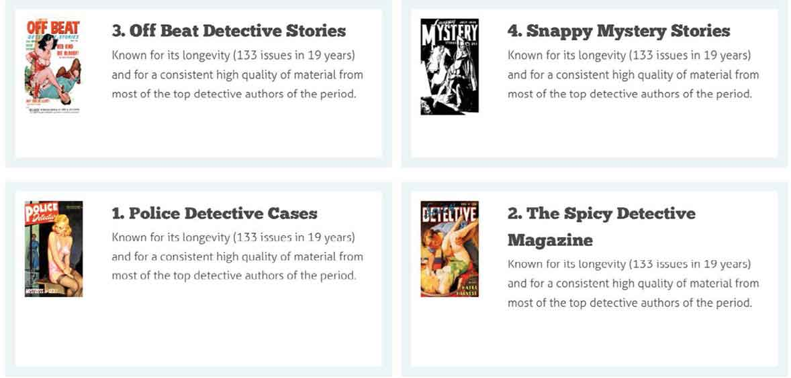

# 第11章　flexbox布局

> 在弹性布局中， `flex-grow` 并不是唯一一种控制元素大小的属性。后文中我们将学习 `flex-shrink`  ，它与扩展比例相对应的收缩比例。此外，还有 `flex-basis` 属性，即弹性元素的伸缩基准值。眼下，我们只需要了解 `flex-grow` 一般会和其他的属性配合使用，并且被简写包含在 `flex` 属性中。从现在开始，我们将使用 `flex` 属性来替代这些冗长的属性名。

> 一如我早前提到的，我们能够也应该把 `flex-grow` 、 `flex-shrink` 和 `flex-basis` 三者简写在 `flex` 属性里，浏览器会按如下顺序解释。
> 如果我们漏掉了 `flex-shrink` ，浏览器默认会将它设置为 `1` ，而 `flex-basis` 的浏览器默认值是 `0%` 。

> flexbox布局有一个悠久且势头良好的发展过程，它的语法经过了数次的迭代和修订。如果本书是两年前写的，我可能会鼓励大家尽可能使用浏览器私有前缀属性，以便弹性布局能够兼容不同的浏览器。
> 幸运的是，当前几乎所有的现代桌面和移动浏览器对于flexbox布局的支持鲜有差异。除非，你的网站或者APP仍然需要考虑老旧的浏览器，如IE11、OS X之前的浏览器，以及iOS下的Safari8，否则几乎完全无需写额外的浏览器私有前缀。在我的公司，我们只在客户要求支持一些老旧浏览器的时候，才使用 `-webkit-` 前缀属性以及一些其他的hack方法。下面是一个有代表性的弹性布局声明，带前缀的属性在最前面，后面跟着标准语法。
> 像很多人一样，我很少手工书写如此之多的私有属性。取而代之的，我会使用Autoprefixer工具，它是可以自动为CSS添加可用、有效的私有前缀。它运行在命令行模式下，不过如果你也有终端恐惧症，你也可以在网上找到编译好的可视化版本，比Codekit。
> Modernizr是一款强大的特性嗅探库，在本书第一版中，它扮演了非常重要的角色。它会根据浏览器的分级支持情况，检测每个浏览器可用的弹性布局语法，从最开始的草案版本到最新的版本，并给 `class` 增加相应的样式名。我们可以利用这些样式，来区分对待现代浏览器和老旧浏览器。
> 尽管相较于五年前，我们现在无需那么频繁地使用Modernizr来做前沿的CSS属性支持检测，但它仍然是为老旧浏览器做弹性布局的神器。

## 使用简写模式

## 跨浏览器flexbox布局

### 理解flex简写模式

学习CSS页面布局哪家强？无数教程帮你忙！我立刻能想起来就有Rob Chandanais的Blue Robot Layout Reservoir（“蓝色机器人教程”）、Eric Costello的CSS Layout Techniques（“CSS布局技巧教程”），等等。

今天很难想象，当初这些教程教授的技术是多么的有新意，以及定位布局是多么的不靠谱。通过这些教程回顾历史，我们可以去一窥CSS带来的无限可能。浮动布局技术作为网站排版的第一选择离我们的时间并不远，差不多在最近15年的时间里，有无数的网站采用了 `float` 技术来实现网站布局。

```html
.item { 
flex : 1 1 420px; }
```


```html
.hb-shelf { 
display : -webkit-flex; 
-webkit-flex-direction : column; 
-webkit-flex-wrap : wrap; 
display : flex; 
flex-direction : column; 
flex-wrap : wrap; 
flex : 1; }
```

<center class="my_markdown"><b class="my_markdown">蓝色机器人教程，曾是最重要Web布局教程网站之一。如今它已成为过去，用户只能通过搜索快照来访问它，这让人有些感伤。</b></center>

### Autoprefixer

所有在浮动布局的大坑里挣扎过的人都知道，它从来不是一款理想的布局工具，它经常被浏览器bug以及盒模型问题所困扰。让我们难以忘怀的，还有清除浮动等。浮动成为了一个不完美的标准，而总有人试图在日益复杂的响应式布局中试图改造它，让其成为一款称手的布局工具时，但这只会带来更加糟糕的结果。

当flexbox布局或者flexbox标准刚刚出现的时候，它们并不是很稳定，所以本书第一版中并未涉及此方面的内容。但是事情其实从那时候开始就发生了变化。

### Modernizr

现在浏览器不仅仅支持flexbox，而且所有的现代桌面和移动浏览器中，这个特性都是稳定可依赖的，而flexbox也获得了设计师和开发者的注意与想象发挥。

相较于老套的布局方式，使用flexbox将会让你得到巨大的实惠。它是一款次世代布局工具，而且支持更多的响应式布局，并且无需对于标记处理就可以重排内容版式，同时也解决了背景高度相同而列高不同等类似的问题。

```html
.hb-shelf { 
display : flex; } 
.no-flexbox .hb-shelf { 
display : table; }
```

此时此刻，我并不是在与你讨论是否要使用flexbox，你应该使用它。除非你还在为IE9和10提供访问服务，否则真的没有什么理由拒绝在网站和APP上使用flexbox布局。

## 深入flexbox

学习flexbox的难点在于理解它的视觉模型。如你所见，浮动布局模型是很好理解的，它们沿着一维水平方向排列。而flexbox的运转则包含了水平和垂直两个维度。

当设置某一元素弹性时，我们为其设置了一个主要的轴，另外一个轴则穿过它——有时两个轴都会设置。这种能力是使用浮动布局所不能给予我们的。

把弹性收缩想象成一条穿过并固定在盒子或者容器两面的线，会有利于理解flexbox的概念。在flexbox中，这第一条穿过盒子的线，我们称其为主轴，而沿着这条线分布的元素，我们都称之为弹性元素。这些弹性元素可以是任何构成布局的HTML元素。

就像设置文本的左、右、居中对齐一样，我们同样可以在主轴上如此设置弹性元素。在实践中，这意味着弹性元素可以贴在弹性容器的一边或者另外一边展示，甚至是按弹性线居中停留。

通过改变标记中的设置，可以将弹性扩展方向改为相反的方向，这样就可以让弹性元素沿着我们期望的方向排列。与传统的布局技术相比，这有着巨大优势，人们终于可以透过源代码，清晰地脑补出屏幕上的显示效果。

flexbox布局更强大，甚至支持通过改变 `flex` 属性的值，来轻松的实现水平行到垂直列的切换转变。

最后，也许是最有意思的是，我们可以更改创建布局所需显示的元素，以便适应特定的视窗大小。毫无疑问，flexbox是一款非常强大的工具，所以，让我们先用它来创建一个小说列表的例子，这也是本书所用一系列案例的基础。

## 创建弹性容器

在本书第一部分中，我们列举了大量的设计案例，但是当你稍后查看这些网页时，你一定会惊讶，这些形形色色的设计案例，它们的主要标签结构都是相同的。


<center class="my_markdown"><b class="my_markdown">利用flexbox技术，制作一个包含侦探小说的列表，列表内容包括该小说的封面和内容简介。</b></center>

首先，我们写一个 `div` 结构，并给它挂载一个名为 `item` 的样式类名。在这个 `div` 内部，增加两个并列的 `div` 子元素，一个用来展示封面，一个用来展示内容简介。

```html
<div class="item"> 
   <div class="item__img"> 
       </a> 
   </div> 
   <div class="item__description"> 
       <h3>The Scarlet Menace</h3> 
   </div> 
</div>
```

根据在源码里的排列顺序，小说封面和内容简介，都将呈现自然的垂直排列状态，即一个在另外一个的上面。我们可以轻松地改变这个自然状态，通过设置 `item` 元素，将其转变为一个弹性容器。 `flex` 是一个新的 `display` 属性值，目前它的值包括 `block` 、 `inline` 、 `inline-block` 、 `none` 和 `table` 等。

```html
.item { 
display : flex; }
```

`flex` 将 `item` 设置为弹性容器，但是并没有移除它的 `block` 属性, 所以这个 `div` 结构继续占据其父元素的可用空间。


<center class="my_markdown"><b class="my_markdown">像所有的块级元素一样， `item` 项将占满其父元素的一整行空间，除非我们做了特别设置。</b></center>

当不需要 `item` 元素占满一行，或者想在弹性容器中增加内联元素的时候，我们可以按照如下方式设置。

```html
.item { 
display : inline-flex; }
```

观察第一个例子，我们会发现为 `item` 设置了 `display:flex` 后，小说封面和内容简介都不再是垂直显示的了。这是因为我们将父元素设置成了弹性容器，它的子元素默认就变成了弹性元素，并会自动沿主轴方向横向排列。flexbox布局的发明者，设置了很多类似的非常聪明的默认项；对于一些开发者来说，这将会是非常非常有用的。

## flexbox布局方向

通过设置弹性元素的方向，实现横向或者竖向的排列，是实现对不同视窗大小或方向布局的另一种非常有效的方式。当我们给元素设置 `flex-direction` 时，也同时设置了主轴的方向。如果没有设置任何方向，默认值是 `flex-direction:row` 。让我们回到小说列表的例子，给它指定一个 `flex-direction` 。

```html
.item { 
flex-direction : row; }
```

对于从右向左书写的语言，我们为其设置 `dir` 属性为 `rtl` ；否则文本书写方向默认会从左边开始，在右边结束。 `row` 是默认值，除非你需要覆盖之前的 `flex-direction` 声明，否则你无需显式声明 `row` 这个值。

## 反转行

你也许还记得在列表例子的源码中，小说封面图片区域子元素在前，内容简介子元素在后。当我们需要把小说封面展示在右边，内容简介展示在左边时，无需更改HTML代码，只要简单地改变flexbox的布局方向即可。

```html
.item { 
flex-direction : row-reverse; }
```


<center class="my_markdown"><b class="my_markdown">将 `flex-direction` 值设置为反转，无需修改HTML代码，轻松实现水平布局的变化。</b></center>

把 `dir` 属性设置为 `rtl` ，flexbox的文本方向从右变为左，而弹性元素也会按反向排列。这个微小的变化，却给布局技术带去了巨大的影响。

### 反转列

不像只有水平方向维度的浮动布局，弹性容器有水平行和垂直列两个维度。虽然块级元素默认是垂直排列的，但是你很快会看到，当我们需要定义一个列的时候，如何通过指定 `flex-direction` 来实现。

```html
.figure--classic { 
flex-direction : column; }
```

在下一个例子中，我们将会使用 `flex-direction` ，让 `figure` 元素以及它的图释更加有趣。HTML标记包含一个 `figure` 图像和与其相关的 `figcaption` 。

```html
<figure class="figure--classic"> 
    
   <figcaption>Pulp magazines were inexpensive fiction magazines
published until the '50s.</figcaption> 
</figure>
```


<center class="my_markdown"><b class="my_markdown">在这个传统的插画设计中，默认布局与源码排列顺序相同。</b></center>

例子中的图释 `figcaption` 元素显示在图片元素下面，和它在源码里的位置相同。但要想让插图设计更加有趣，我们可以使用 `flex-direction` 来把图释调整到图片的上方。

```html
.figure--reverse { 
flex-direction : column-reverse; }
```


<center class="my_markdown"><b class="my_markdown">通过为 `flex-direction` 设置反转属性，让设计更加有趣。</b></center>

如此简单，但是却非常有效地使插画设计更加有趣。现在，在中等或者大屏幕上，设置图释的最大宽度为50%。

```html
.figure--reverse figcaption { 
max-width : 50%; }
```


<center class="my_markdown"><b class="my_markdown">这样的细节虽然微小，但是跳出了俗套。</b></center>

在随后的内容中，我们将会来分享，当使用flexbox来实现复杂布局时，如何使用主轴和侧轴，来让设计更加有效和有趣。

## 创建弹性布局轴

在考虑布局方式的时候，浮动行为似乎已经变得根深蒂固。比如，当两个浮动元素宽度超出它们的父级元素的时候，其中一个元素将会折行显示在另外一个下面。而flexbox布局有一个不同的模型，弹性元素会灵活地根据弹性容器的宽度来表现。

我将会举例说明浮动模型与flexbox模型的区别，例子中将会在一个 `section` 元素中设置四个 `article` 元素。

```html
<section class="hb-shelf"> 
   <article class="item"> […] </article> 
   <article class="item"> […] </article> 
   <article class="item"> […] </article> 
   <article class="item"> […] </article> 
</section>
```

在没有设置任何样式的情况下，这些 `article` 元素将会垂直排列。


<center class="my_markdown"><b class="my_markdown">这个列表在针对更小的屏幕时，我们不用或者只用做很小的调整。</b></center>

现在，我们为 `section` 元素设置 `display:flex` ，刷新后会看到，浏览器会创建一个横向的主轴， `article` 元素将沿着水平方向分布。无需再定义任何额外的flexbox属性，浏览器会自动等分 `section` 元素的宽度，让 `article` 元素充满父元素的全部可用空间。


<center class="my_markdown"><b class="my_markdown">文章会沿着 `section` 元素的默认主轴方向排列。</b></center>

当给每一个 `article` 元素设置宽度的时候，你也许会感到惊讶。

```html
.item { 
width : 400px; }
```

在浮动布局中，浏览器只要有空间就会尽可能显示 `article` 元素，直到填满一整行再折行显示。

而当增加 `article` 元素的宽度时，浮动布局下会很快折行显示。而无论怎样，在flexbox布局中， `flex-wrap:nowrap` 值优先级高于 `article` 元素的宽度值 `width` 。

## 包裹弹性元素

与浮动布局不同，在弹性布局中，弹性容器会自动扩展宽度，以适应它包含的弹性元素组合的宽度。这是因为弹性布局的发明者当时做了一个比较明智的选择，给 `flex-wrap` 属性设置的默认值就是 `nowrap` 。而把 `flex-wrap` 的值改为 `wrap` 后，完全不同的事发生了，浏览器会自动计算每一项的宽度，并在填满 `section` 弹性容器的一整行后，再折行显示。

```html
.hb-shelf { 
flex-wrap : wrap-reverse; }
```

也许你已经注意到，例子中的四本小说带有1至4的序号。无论有没有设置 `nowrap` 或者 `wrap` ，这些小说的显示顺序，和源代码里的排列顺序一样，都是从左上角方向开始。弹性布局给予我们更多和更灵活的方法来控制包裹方式，比如切换 `flex-wrap` 的值为 `wrap-reverse` ，这些小说就会从左下角方向开始排列。


<center class="my_markdown"><b class="my_markdown">将 `flex-wrap` 值从默认的 `nowrap` 改为 `wrap` 后，看起来有点类似浮动布局的感觉，不过有一些值得注意的不同点。</b></center>

```html
.hb-shelf { 
flex-wrap : wrap-reverse; }
```


<center class="my_markdown"><b class="my_markdown">包裹的弹性元素反转后，它们的起始位置发生了变化。</b></center>

此时你肯定想问：“这和对 `flex-direction` 设置 `row-reverse` 有什么区别？”这是一个好问题，让我们把 `flex-wrap` 的值恢复为 `wrap` ，然后使用 `flex-direction` 的 `row-reverse` 来看看。

```html
.hb-shelf { 
flex-wrap : wrap; 
flex-direction : row-reverse; }
```

如此一番，我们可以看到被包裹的弹性元素的起始位置从左下角变为了右上角。


<center class="my_markdown"><b class="my_markdown">仔细观察 `flex-wrap` 与 `flex-direction` 之间的区别，可以让我们更好地理解flexbox布局的潜力。</b></center>

## flex-flow属性

`flex-flow` 是一个对 `flex-direction` 和 `flex-wrap` 的混合简写。也许你还记得， `flex-direction` 的默认值是 `row` ， `flex-wrap` 的默认值是 `nowrap` ，所以下面的值无需再显式声明。

```html
.hb-shelf { 
flex-flow : row nowrap; }
```

无论是 `flex-direction` 还是 `flex-wrap` ，都是强大的布局属性，但是当组合使用它们时，会让很多新手感觉非常困难，甚至很多已经用惯的老方法无法使用。可以理解，flexbox技术才刚刚起步，当你看到那些改变弹性元素大小或者元素排列的奇巧淫技时，我相信你一定会和我一样，兴高采烈地使用这个富有想象力的技术来改进设计。

## 调整弹性元素大小

使用浮动布局，你就需要做大量的数学计算，这真让人无奈。即使是最简单的布局，也需要我们计算父容器中能放多少个子元素，每个子元素的宽度是多少。两个元素，宽度各50%；三个元素，每个33%的宽度，诸如此类。元素间的外边距，同样需要做大量的计算，这让Web设计更像是一场数学挑战，而不是艺术创作。

弹性布局改变了这一窘境，让我们可以更加轻松地创作有趣的设计。更重要的是，布局结果更加灵活。继续我们的例子，来看看它到底是如何让布局变得如此简单和美好。这次我们给列表里的 `article` 元素设置宽度。

```html
.item { 
width : 240px; }
```

在小屏幕上，弹性元素在主轴上等分排列。


<center class="my_markdown"><b class="my_markdown">让我们的弹性容器 `section` 中的弹性元素沿主轴排列，但是有时候填充不满一行。</b></center>

当弹性容器的宽度大于弹性元素组合起来的宽度，那么在右侧一般会出现空白的现象。对于一些设计来说，留白是可以接受的，但是对于另外一些设计，最好还是可以完美地填充满一行。flexbox布局也提供了相关的属性，可以让工程师去选择弹性元素在父容器中扩展或者收缩展示。

## flex-grow属性

`flex-grow` 会设置弹性元素的扩展比例。扩展比例会定义一个弹性元素，当父容器中留有可用空间时，相较其他元素会扩展多少。 `flex-grow` 是flexbox模型中最难理解的概念之一，所以让我们还是用例子来演示吧。

在上个例子中，我们给四个 `article` 元素分别设置了240像素的宽度。在小于960像素的环境下，对弹性容器设置 `display:flex` ，保证所有的 `article` 元素都会等分扩展填充。大于960像素的环境下，右侧留白。

继续修改上面的例子，给所有的弹性元素都设置同样的扩展比例，让这些元素平均等分父容器的空间。

```html
.item { 
flex-grow : 1; }
```


<center class="my_markdown"><b class="my_markdown">给所有的弹性元素设置相同的扩展比例，保证它们平均等分所有空间。</b></center>

所有的 `artice` 元素在容器中等分排列，每一个的宽度都大于我们设置的 `240` 像素。但是，如果想调整这些弹性元素的大小，该怎么办呢？如果我们想把父元素的可用空间，以不同比例来切分，又该怎么办呢？为了让大家理解，在下面的例子中，我们会给第二个弹性元素分配两倍的空间。如你所见，我们会对所有的弹性元素设置扩展比例为 `1` ，对第二个设置为 `2` 。

```html
.item { 
flex-grow : 1; } 
.item:nth-of-type(2) { 
flex-grow : 2; }
```


<center class="my_markdown"><b class="my_markdown">给各个弹性元素分配不同的缩放比例，是使用弹性布局的基本原则之一。</b></center>

第二个元素被分配了两倍的缩放比例，所以它的宽度是相邻元素要的两倍。

## flex属性实战

为了帮助理解 `flex-grow` 概念，以及如何通过使用各种HTML元素来构建弹性布局，巩固所学知识，我们将会对一组被 `figure` 元素包裹的图片和图释做响应式布局。这是一个仅用几行代码实现的理想flexbox布局，它的形式在互联网上比较少见，但却是传统报纸和杂志里随处可见的布局。构成它的HTML标签没有什么特别的。

```html
<figure class="figure--horizontal"> 
    
   <figcaption>Pulp magazines were inexpensive fiction magazines
published until the '50s.</figcaption> 
</figure>
```

如果我们什么都不做，那么 `figcaption` 元素默认在图片下面显示，但是我们可以让它更好看些。在大屏设备上，我们首先将 `figure` 元素的 `display` 属性设置为 `flex` ，将其设置为弹性容器。它的默认值是 `row` 和 `nowrap` ，我们无需定义默认值。

```html
@media (min-width: 48rem) { 
.figure--horizontal { 
display : flex; } 
}
```

这组图片和图注现在已经变成了弹性元素，按照默认的主轴排列分布。到目前为止看起来还不错，由于图片元素在源代码里是第一个，所以它在浏览器中会显示在左侧，因为 `flex-direction` 的默认值是 `row` ，而 `figcaption` 元素会作为第二个，显在右侧。

我想让图片的宽度是图释部分的四倍，所以我们给图片添加 `flex-grow` ，值为 `4` ，而给图释部分设置值为 `1` 。

```html
@media (min-width: 48rem) { 
.figure--horizontal img { 
flex : 4;} 
.figure--horizontal figcaption { 
flex : 1; } 
}
```


<center class="my_markdown"><b class="my_markdown">让图片和图释按照主轴方向排列，并且按特定比例扩展或者缩放自身宽度，形成一个良好的布局，这比起传统的浮动要简单得多。</b></center>

如果我们想做一点点变化，改变图片和图释的展示顺序，该怎么办？无需改变HTML源代码，只需要改变 `flex-direction` 的默认值，即把 `row` 改为 `row-reverse` 。

```html
@media (min-width: 48rem) { 
.figure--horizontal-reverse { 
flex-direction : row-reverse; } 
}
```


<center class="my_markdown"><b class="my_markdown">无需改变HTML源代码，就能改变元素展示顺序。</b></center>

## 

## 元素伸缩基准属性

`flex` 这个简写的属性，是flexbox中最强大的一个，因为它实际包含了 `flex-grow` 、 `flex-basis` 以及 `flex-shrink` 三个属性。虽然我们经常使用这个强大的简写属性来对弹性布局的容器进行比例分割，但理解它背后包含的三个属性才是更加重要的。我们从 `flex-basis` 开始。

截至目前，我们了解了当弹性容器改变大小，以及变成响应式布局时，它包含的弹性元素该如何扩展和收缩。我们允许这些弹性元素自由流动，且不给它们指定任何的大小值。有某些特别的情况，比如当弹性元素在一开始需要以特定大小展示，而我们还没有给它定义扩展比例或者收缩比例。在弹性布局中，我们使用 `flex-basis` 属性，来为一个元素设置其初始大小值。

为了说明这种情况，我们将回到之前的例子，这一次只包含两个元素。

```html
<section class="hb-shelf"> 
   <article class="item"> […] </article> 
   <article class="item"> […] </article> 
</section>
```

通过给 `section` 设置 `display:flex` ，将其变为一个弹性容器。无需特别指定 `flex-direction:row` 或 `flex-wrap:row` ，它们都是默认初始值。

```html
.hb-shelf { 
display : flex; }
```

然而，这次在对弹性元素 `article` 设置宽度前，我们先会定义每个元素的初始宽度为 `420px` 。

```html
.item {flex-basis : 420px; }
```

在水平布局中， `flex-basis` 的作用等同于 `width` 。需要注意的是，当屏幕宽度大于弹性元素组合的宽度，即 `840px` 的时候，在容器右侧会出现留白空间。


<center class="my_markdown"><b class="my_markdown">设置 `flex-basis` 属性让我们可以精准地控制弹性元素大小。</b></center>

我们将要调整这个布局，当调整第一个元素的时候，奇迹发生了：我们设置第一个元素弹性缩放，占满剩余空间，而第二个元素依然按照 `flex-basis` 设置的 `420px` 宽度占位。

```html
.item:first-of-type { 
flex-grow : 1; }
```


<center class="my_markdown"><b class="my_markdown">让其中一个弹性元素增加宽度，占满剩余的空间，另外一个保持不变。</b></center>

## flex-shrink属性

`flex-grow` 定义了弹性元素的扩展比例，它告诉该元素，当父元素的宽度大于弹性元素组合的宽度时该如何增加宽度。而 `flex-shrink` 恰恰相反，它定义当父元素宽度小于弹性元素组合宽度时，该如何缩小弹性元素的宽度。简而言之， `flex-grow` 指定弹性元素将获得的空间；而 `flex-shrink` 则指定其要失去的空间。

当我们将 `flex` 这个简写属性的值设置为 `1` 时，其实就是设置了相应的弹性元素的扩展和伸缩比例都为 `1` ，如下所示。

```html
.item { 
flex : 1; }
```

等同于：

```html
.item { 
flex-grow : 1; 
flex-shrink : 1; }
```

这是因为，在flexbox中，当弹性容器的空间不足以显示子元素时，浏览器会根据弹性元素个数自动均分父容器空间。但是这个行为导致的布局结果并不是我们想要的，我们可以修改这个默认行为——更改弹性元素的缩放比例，即定义 `flex-shrink` 值。

这是弹性布局中又一个非常难理解的概念，为了帮助你理解，我们将会对第一个弹性元素添加一个略夸张的 `flex-shrink` 值，设置这个值以 `8` 开始。

```html
.item:first-of-type { 
flex-shrink : 8; }
```

调整浏览器宽度，你会注意到，当父容器大小可以放下这两个元素的时候，布局是没有任何变化的。当继续缩小浏览器时，奇迹发生了，即弹性父容器的宽度小于弹性子元素组合的 `flex-basis` 值之和时，可以看到第二个元素没有变化，它的大小依然与 `flex-basis` 所定义的相同，而第一个元素则根据伸缩比例动态缩小了。


<center class="my_markdown"><b class="my_markdown">为元素指定减少空间的比例，可以有效帮助我们在小屏幕上控制元素展示效果。</b></center>

减小 `flex-shrink` 的值到 `2` ，你会发现第一个弹性元素变大了，而随着屏幕尺寸的减小，元素的缩小比例也相应变小了。

```html
.item:first-of-type { 
flex-shrink : 2; }
```

使用 `flex-shrink` ，我们牢牢地控制住了弹性元素的伸缩比例。通过用不同的数值做实验，我们也观察到了屏幕尺寸变化时整个布局的变化情况。

## flexbox排序

让我们先暂时忘掉flexbox。但是别担心，在随后的章节里我们将会学习更多的神奇的CSS属性。下面，我来隆重介绍一种无需切换HTML代码顺序，就能改变展示结果上顺序的CSS能力。

现在，你肯定想知道它是什么。它就是 `order` 属性，一种可以在 `flex-direction` 上实现更加精准的元素控制的属性。

为了演示flexbox的 `order` 属性，我们将把一系列 `article` 元素加入到一个 `section` 中，并分别设置它们为弹性元素和弹性容器，如下所示。

```html
<section class="hb-shelf"> 
   <article class="item">1 […] </article> 
   <article class="item">2 […] </article> 
   <article class="item">3 […] </article> 
   <article class="item">4 […] </article> 
</section>
```

这些文章标签上并没有标注 `id` ，每一个 `article` 元素都有一个编号，按从上到下顺序排列展示。

在flexbox中，弹性元素的展示亦如它们在代码中的顺序一样，但是在实际操作中，我们常常需要调整这个列表的展示顺序。我们可以先把 `section` 变成一个弹性容器，接着把其 `flex-direction` 的值设为 `column` 。

```html
.hb-shelf { 
display : flex; 
flex-direction : column; }
```


<center class="my_markdown"><b class="my_markdown">弹性元素堆叠显示成分栏状。每一个 `article` 元素都有一个序号，我们可以通过调整它们各自的 `oreder` 属性，来调整它们的位置。</b></center>

也许你会好奇，为什么要使用 `display:flex` ，尤其是块级元素默认都会这么显示，但是我们的确需要这个属性，以便于我们可以方便地改变里面元素的展示顺序。好吧，让我们继续，使用 `order` 属性，让最后一个 `article` 元素显示到第一个。需要注意的是， `order` 属性不同于其他的弹性属性，它没有 `flex-` 的前缀。

```html
.item:last-of-type { 
order : -1; }
```

每一个弹性元素都有一个 `order` 初始默认值（ `0` ），所以不必每个都设置。任何一个 `order` 值都是从这组元素结尾开始计算的.所以在上面例子中，我们给 `order` 设置为 `-1` ，来让最后一个元素显示在本组的最前面。

如果我们打算给所有元素都设置 `order` 值，除了特定效果，其他值都为 `1` ，如下所示。

```html
.item { 
order : 1; }
```


<center class="my_markdown"><b class="my_markdown">使用 `order` 属性调整了元素的展示顺序，并没有改变DOM中的元素顺序，这一点对于SEO和无障碍阅读很有帮助。</b></center>

给一组弹性元素设置一个小数字，这让给每个元素分别设置 `order` 值成为了可能，这种做法与通过调整HTML源代码的顺序大相径庭。

```html
.item:nth-of-type(1) { 
order : 3; } 
.item:nth-of-type(2) { 
order : 4; } 
.item:nth-of-type(3) { 
order : 1; } 
.item:nth-of-type(4) { 
order : 2; }
```

让我们忘记这些小案例吧，继续看看flexbox顺序属性到底能为我们带来什么惊喜，我已经迫不及待地开始想象：为不同尺寸的屏幕制作响应式页面，当触发响应变化阈值时，动态调整页面段落的顺序，以便为用户提供更好的体验。


<center class="my_markdown"><b class="my_markdown">使用 `nth-of-type` 这样的伪类选择器，能够精准地捕捉到元素，而不用额外外挂 `id` 或者 `class` 。</b></center>

## order属性实战

我在开发响应式网站时，经常需要改变页面元素的显示顺序，比如在我想改变某个网站导航在页面里的显示位置的时候。通常，一个网页大体的HTML源码差不多都如下所示。

```html
<header> […] </header> 
<nav> […] </nav> 
<section> […] </section> 
<footer> […] </footer>
```

为什么我们需要调整 `header` 或者 `footer` 的显示顺序？虽然讲不出什么大道理，但是我见过大量的案例，比如，为了照顾使用小屏手机的用户，而将导航栏从页面顶部调整到页面底部，这样，用户在看完长长的一篇文章后，不必再滑动很久回到顶部找导航。

`order` 属性正是完美实现这种体验的属性，所以我们首先给页面的 `body` 标签设置一个 `display:flex` ，把它变为一个弹性容器。它包含的元素会按垂直方向排列，我们同时定义 `body` 标签的 `flex-direction` 值为 `column` 。

```html
body { 
display : flex; 
flex-direction : column; }
```

接着，我们给每个弹性元素设置它们的 `order` 值。

```html
header { 
order : 1; } 
nav { 
order : 2; } 
section { 
order : 3; } 
footer { 
order : 4; }
```


<center class="my_markdown"><b class="my_markdown">弹性元素按照源代码里的顺序排列显示，所以这是一个单纯演示 `order` 效果的例子。</b></center>

我们可以交换 `nav` 元素和 `section` 元素的展示位置，将导航栏显示在 `section` 与 `footer` 之间，这在小屏手机上会让布局看起来更友好。

```html
nav { 
order : 3; } 
section { 
order : 2; }
```


<center class="my_markdown"><b class="my_markdown">调整 `nav` 元素的显示位置，就算用户使用小屏手机访问页面，也不必为了回到页面上方找到导航而频繁滚屏。</b></center>

这个变化对小屏手机用户的确很有帮助。但是在大型显示器上，又有多少用户会在页面底部找导航呢。对于这样的用户，以及使用中等屏幕的用户，你需要在一个媒体查询中重置 `order` 值。

```html
@media (min-width: 48rem) { 
nav { 
order : 2; } 
section { 
order : 3; } 
}
```


<center class="my_markdown"><b class="my_markdown">为中等和大屏用户重置 `order` 值。</b></center>

## 打破传统

早年间使用CSS进行页面布局限制颇多，令人沮丧，同行们也是感同身受。那时候，无论如何也无法设计和开发出和今天相媲美的网站或APP。长久以来，我们急需一个可以灵活的布局方式，好在我们今天拥有了flexbox技术，以及如此众多的现代浏览器可以支持它。

flexbox技术利用众多属性，让响应式设计更加柔性和灵活，但是我们不应止步于此。就像钻研技术一样，我们也应该借由flexbox这样的特性，充分发挥创造力。


