# 第13章　RGBa和不透明度

在CSS中，有很多方法来定义一个颜色：比如颜色名、十六进制值、RGB/RGBa或者HSL/HSLa都可以。无论选择哪种方式手机上、平板上、PC、Mac，甚至电视上展现出来的效果，都是由红（R）绿（G）蓝（B）三种基础颜色混合得来的，它们经常用24bit表示。

在24bit的RGB中，0意味着最暗，255则是最亮。当红绿蓝三个通道全是0时，展现为黑色；当三个通道都是255时，展现为白色。通过组合，这三个通道能表示1600万种颜色。

## 使用RGB

打开Photoshop或者Sketch的拾色器，它们看起来都是类似的，都是用十六进制值来表示。 `#ffffff` 表示白色， `#000000` 表示黑色。

```html
a{ 
color: #388fa2; }
```

在CSS里面，可以使用RGB来表达相同的蓝色。首先，声明一个颜色空间，然后在括号里面写下红绿蓝颜色的值，这些值是0到255之间。

```html
a { 
color : rgb(56, 143, 162); }
```

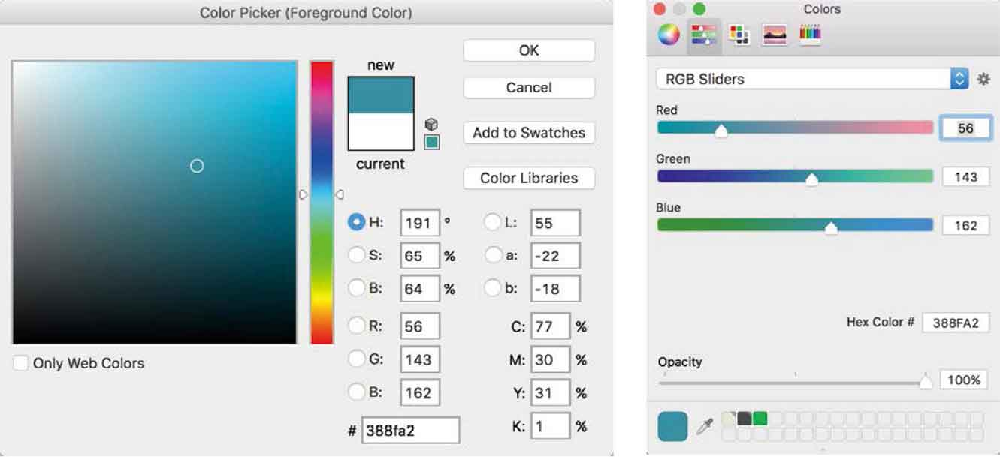
<center class="my_markdown"><b class="my_markdown">我为网站链接所选择的蓝色，其十六位进制值为#388fa2。</b></center>

你可能会问，为什么我选择使用RGB，而非十六进制数字？实际上没有什么技术上的原因，毕竟我们眼睛看到的颜色是由RGB组成的。所以，当我们为样式表选择颜色的时候，十六进制值是很难理解的。我现在问你，#003399是个什么颜色？很困惑吧？

当理解了每个通道的意思之后——0代表没有颜色，255代表颜色最深——RGB就变得简单了，我们只需要在每块上选好颜色就可以了。

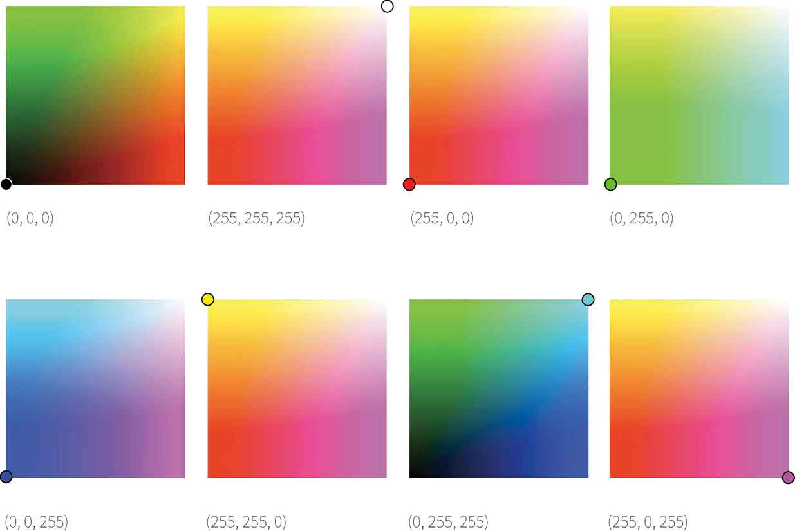
## 使用RGBa给颜色分层

在艺术学校的时候，我就不是敏感的学生，你可能猜到我想要说什么了。而我的朋友Ben，就特别聪明，他使用了几百层的颜色创作出十分绚丽的作品。在CSS里面，RGBa同样可以帮助我们来调节颜色和增加深度。

RGBa是红绿蓝和alpha通道的简称。alpha是一个介于0和1之间的值，用来表示不透明度。如果你使用过Photoshop或者sketch，你应该使用过alpha不透明度。

在Get Hardboiled网站上，背景面板颜色的不透明度是 `0.95` 。通过增加一个alpha通道，让RGB变成RGBa。

```html
.item__description { 
background-color : 
rgba(223,225,226,0.95); }
```

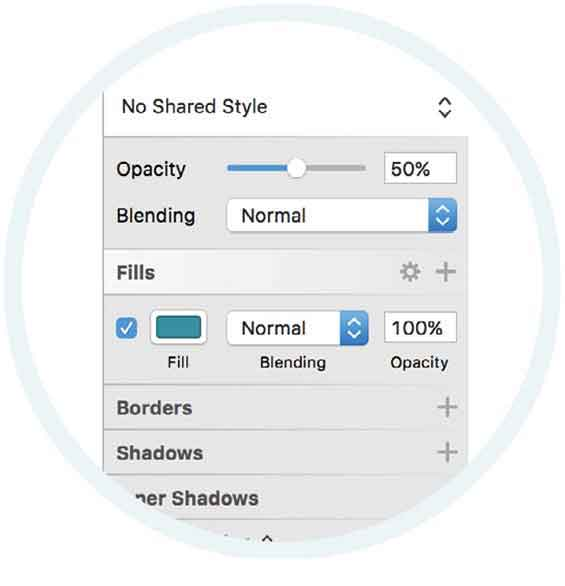
<center class="my_markdown"><b class="my_markdown">在Sketch中，将图层设置为半透明。</b></center>

通过使用RGBa来改变颜色的不透明度，这让设计变得优雅起来。

## RGBa与opacity

我们还有一种CSS属性能让元素变得半透明，那就是 `opacity` 属性。

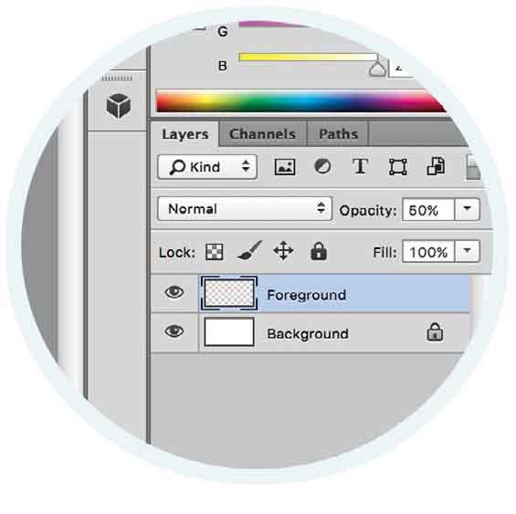
<center class="my_markdown"><b class="my_markdown">调整透明度很简单，你可以在Photoshop或Sketch中轻松设置。</b></center>

在CSS中，RGBa和 `opacity` 都调节alpha通道，但它们之间还是有区别的。RGBa 只调节一个元素的上的不透明度，而 `opacity` 透明度是继承的，它可以影响它的子元素。为了证实这一点，我使用我的网站上的面板来看下效果。

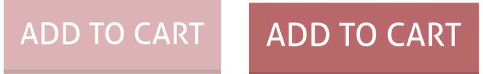
<center class="my_markdown"><b class="my_markdown">左图使用 `opacity` 属性的时候， 文本也变得半透明了；右图使用RGBa的时候，只有背景变为半透明了，文本却没有。</b></center>

## opacity让我们变得？

我们回到Get Harboiled网站，用八张图的网格来隐藏一个秘密。


<center class="my_markdown"><b class="my_markdown">我们将使用绝对定位和不透明度来隐藏网格中图像的信息。</b></center>

为了创建这个界面，我们需要使用一点专业的HTML技巧。首先使用一个包含所有组件的容器。本书中所有的例子，都会使用这个 `hb` 前缀，这样你就能很容易地将其识别出来。

```html
<div class="hb-target"> […] </div>
```

为每个组件添加一个 `item` 的 `class`  属性， 然后给每个 `item` 设置一个 `id` ， 以便我们在后面能区分它们。

```html
<div class="item" id="hb-target-01"> […] </div> 
<div class="item" id="hb-target-02"> […] </div> 
<div class="item" id="hb-target-03"> […] </div> 
<div class="item" id="hb-target-04"> […] </div> 
<div class="item" id="hb-target-05"> […] </div> 
<div class="item" id="hb-target-06"> […] </div> 
<div class="item" id="hb-target-07"> […] </div> 
<div class="item" id="hb-target-08"> […] </div>
```

然后为每个 `item` 增加两个属性， 一个是 `img` 属性， 另一个用来包含内容简介或者其他信息。

```html
<div class="item" id="hb-target-01"> 
   <div class="item__img"> 
         
   </div> 
   <div class="item__description"> 
        <h3 class="item__header">The Scarlet Menace</h3> 
        <ul class="list--plain"> 
                <li>Vol. 1 Number 3</li> 
                <li>Issue #3</li> 
                <li>May '33</li> 
        </ul> 
        <a href="cart.html" class="btn">Add to cart</a> 
   </div> 
</div>
```

我们的设计需要在不同尺寸的屏幕上都能是呈现良好的效果。小屏幕的一般是移动设备，为了让手机APP加载得更快，我们应该设定好CSS的最小屏幕尺寸值。

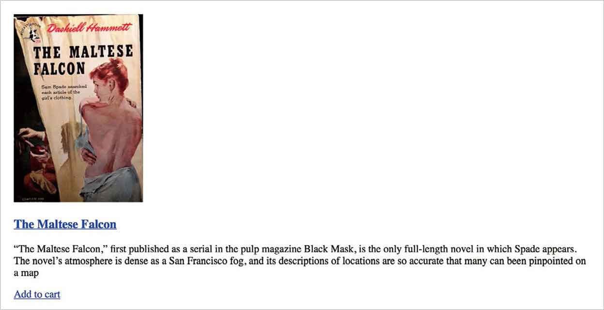
<center class="my_markdown"><b class="my_markdown">设计网页的时候，最好先检查下，考虑好最小的屏幕触发值是多少。</b></center>

对于小屏设备，我们的目标是尽可能降低网页得复杂性，所以我们的设计要更加简单，而且现代化。我们使用flexbox来围绕图像和文字。

```html
.item { 
display : flex; }
```

现在，给我们的组件增加一些边距，让它们彼此分开，然后为图片增加一些边框。

```html
.item {
margin-bottom : 1.35rem;
padding: 10px;
border: 10px solid rgb(235,244,246); }
```

对小屏设备来说，设置 `flex-basis`  属性来修饰图片是很合适的。然后在左边增加一些外边距，有助于分离图像和内容简介。然后给图片增加边框，这是我们的设计风格。

```html
.item__img { 
margin-right : 20px; 
flex: 0 0 133px; } 
.item__img img { 
border: 10px solid rgb(235,244,246); }
```

我个人非常喜欢flexbox，它使用起来很简单，几行代码就能让HTML标记变成好看的侦探小说列表，即使在大屏设备上也一样有好看的显示效果。我们肯定可以做得更好。下一章节中，我会告诉你如何把列表变成交互式的，通过改变不透明度来隐藏内容简介。

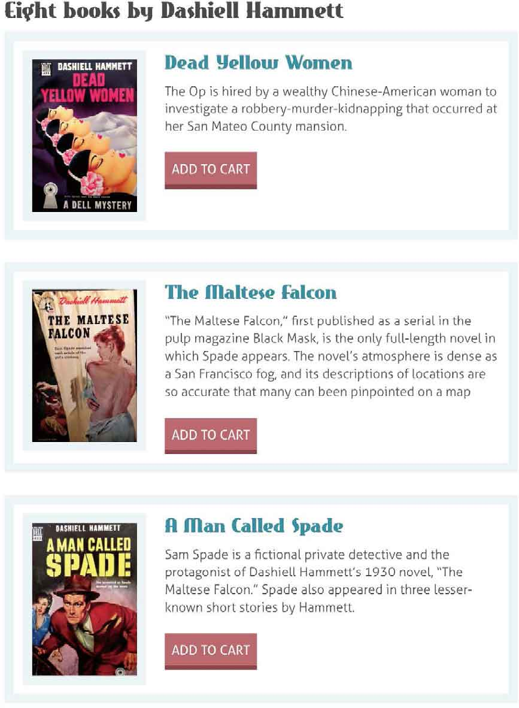
<center class="my_markdown"><b class="my_markdown">我们的设计在小屏设备上既简单又时尚。</b></center>

## flexbox内容对齐

在弹性盒子案例中，我们围绕 `flex-item` 主轴来做布局。与调整文本块的左对齐、居中或者右对齐一样，我们也可以通过justify-content属性来调整弹性容器中的内容。

```html
.item {
justify-content : flex-start; }
```

当我们需要以不同的方式，调整文本的对齐方向时，也可以设置 `flex-end` 来实现，它会将文本对齐在与 `flex-start` 刚好相反的方向。当 `flex-direction` 设置为 `row` 的时候， `flex-end` 值会把文本对齐在容器右侧。而当弹性布局方式设置为 `column` 的时候，它会在容器底部对齐。我猜你应该已经猜出，居中对齐该如何做了吧？


<center class="my_markdown"><b class="my_markdown">尽管 `flex-start` 是默认初始值，我们也不应该频繁的声明这个属性。</b></center>


<center class="my_markdown"><b class="my_markdown">使用声明值为 `flex-end` 的 `justify-content` 属性，我们可以在主轴上方便改变内容展示。</b></center>

还有两个值你可以比较少见到。一个是 `space-around` ，一个是 `space-between` 。使用 `space-between` ,伸缩项目会平均分布在行里。如果剩余空间是负数，或该行只有一个弹性元素，则此值等效于 `flex-start` 。

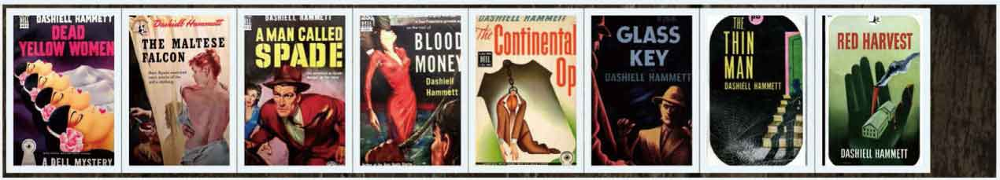
<center class="my_markdown"><b class="my_markdown">使用 `space-around` ， `flex-item` 会沿主轴均匀分布。</b></center>

在其他情况下，第一个项目在主轴起点边的外边距，会与该行在主轴起点的边对齐，同时最后一个项目在主轴终点边的外边距，与该行在主轴终点的边对齐，而剩下的弹性元素在确保两两之间空白相等的情况下。平均分布。

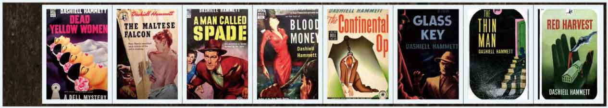
<center class="my_markdown"><b class="my_markdown">记住，弹性元素之间的间距是由浏览器来自动计算的。</b></center>

## 适应更大的屏幕

针对小屏设备的专业HTML已经做好了，接下来我们为大屏设备设计高保真和交互式的体验。首先我们重建垂直列表，把八张小说封面放进一个网格里面，当用户点压它们的时候会显示小说的内容简介。只要使用相对定位就可以，不需要水平或者垂直位移。

```html
@media (min-width: 48rem) { 
.hb-target { 
display : flex; 
flex-wrap : wrap; 
position : relative; 
max-width : 700px; } 
}
```

将 `flex-items` 的基础宽度设置为 `130px` ，然后通过设置内边距，让它们看起来更均匀、水平和垂直。

```html
@media (min-width: 48rem) { 
.item { 
display : block; 
flex : 1 0 130px; 
margin : 0 20px 20px 0; } 
}
```

第四和第五个元素不需要右侧的外边距，所以通过 `:nth-of-type`  伪选择器来设置。

```html
@media (min-width: 48rem) { 
.item:nth-of-type(4) { 
margin-right : 0; } 
.item:nth-of-type(8) { 
margin-right : 0; } 
}
```

为了使这个界面加载的更快，我们可以使用每个图像两次：一次作为主网格，一次作为背景图 `background-image` 。

现在，我们把注意力放到小说的内容简介上。我们把它绝对定位到每个元素左上方（ `top` 和 `left` ）。并且设置全透明，即不透明度为 `0` 。

```html
@media (min-width: 48rem) { 
.item__description { 
opacity : 0; 
position : absolute; 
top : 0; 
left : 0; } 
}
```

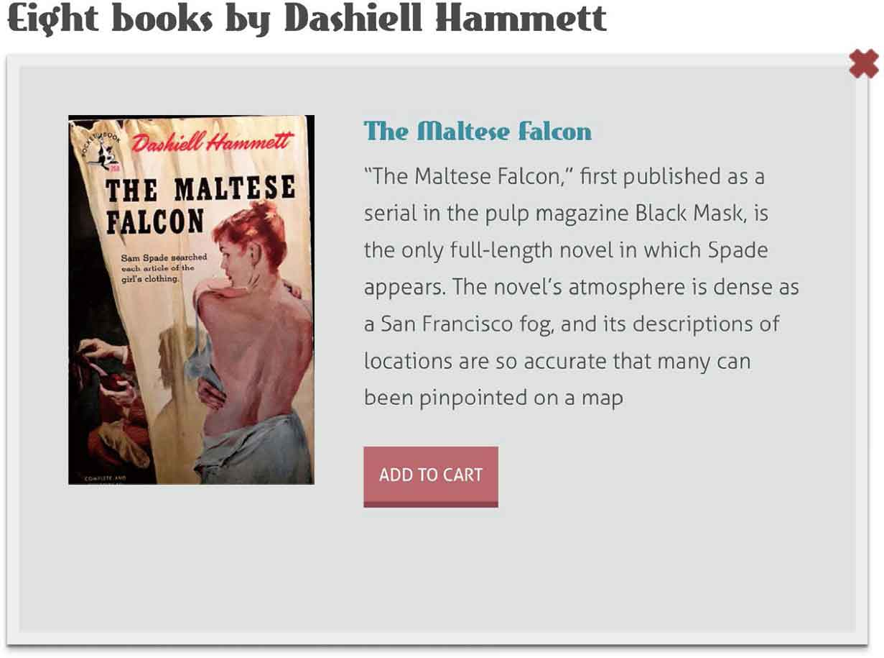
<center class="my_markdown"><b class="my_markdown">大功告成，每个内容简介都通过 `opacity` 隐藏起来，变成不可见的。</b></center>

## flexbox垂直布局

每当谈起弹性布局，我希望你都能回想起这里我所介绍的内容，那就是，元素依靠着主轴、侧轴或者两者都有来布局。依靠浮动效果是做不到这一点的。到目前为止，我们只使用了主轴来布局，下面我们将使用  `align-items` 属性进行侧轴布局。

```html
.item {
align-items : stretch; }
```

我们不需要经常来显示声明，因为 `stretch` 是默认值。

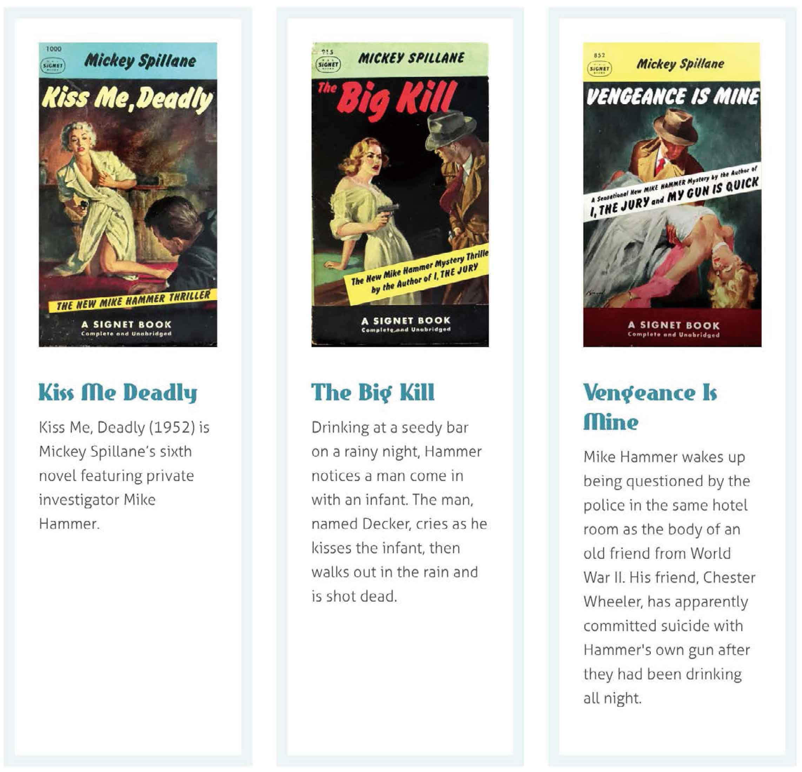
<center class="my_markdown"><b class="my_markdown">沿着侧轴伸展，是flexbox最有用的特性之一。</b></center>

`align-items` 和 `justify-content` 概念类似。 `justify-content` 让内容在主轴上排列，而 `align-items` 让内容在侧轴上排列。弹性盒子有四个非常有用的属性。 `flex-start` 让元素从元素的开头开始排列； `flex-direction` 定义了哪个是主轴。当 `flex-direction` 设置为 `row` 的时候，侧轴的起点就位于面板顶部；当设置为 `column` 时，侧轴的起点就位于面板左侧。

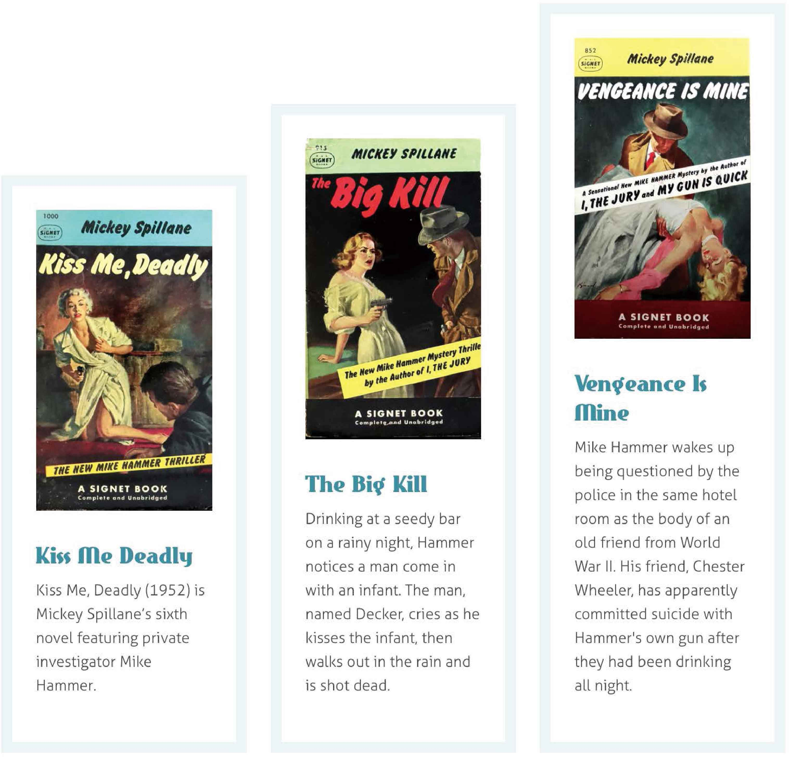
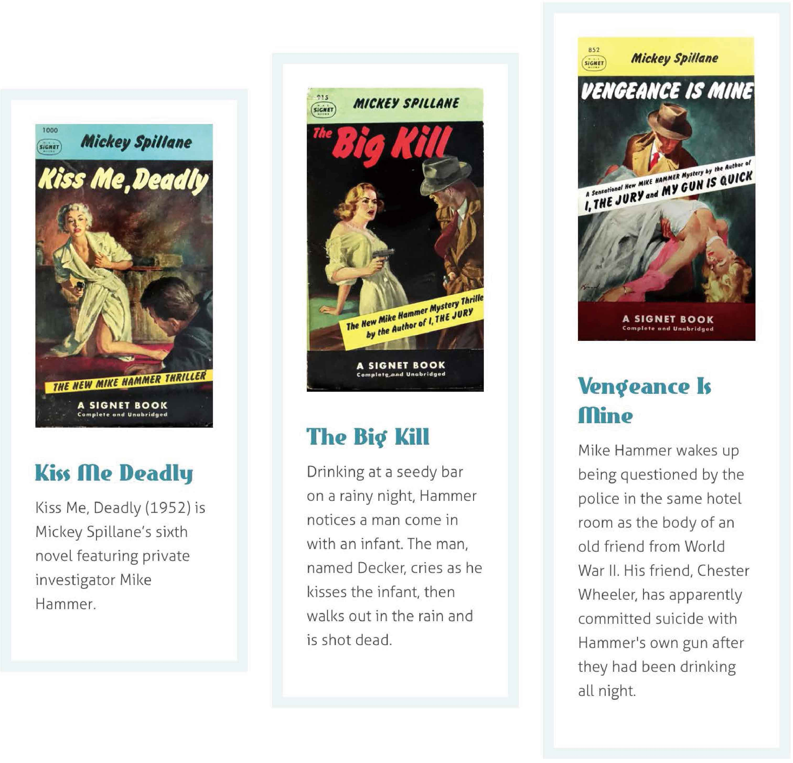
<center class="my_markdown"><b class="my_markdown">要实现这样的布局效果，元素要按照侧轴的结尾布局，这可能是很多设计者期待了很多年的东西。</b></center>

当我们指定元素向中心 `center` 对齐，它们可能在垂直方向上居中对齐。然后结合 `justify-content:center` ，这样我们就能使元素水平垂直居中对齐了。这比之前的布局要简单得多。

## 伪类选择器

通过使用 `id` ，就可以在复杂零散的网页中来标识一个唯一元素。 `:target` 伪类选择器改变了我们定位元素的风格。这是一种更专业的接口，我们可以不用JavaScript，而是通过 `:target` 伪类选择器来定位。

接下来，我们通过 `:target` 伪类选择器改变了声明的样式属性。我们设定好内边距、背景和边框等，更重要的是，我们重置不透明度 `opacity` 为 `1` 。

```html
@media (min-width: 48rem) { 
.item:target .item__description { 
opacity : 1; 
width : 100%; 
height : 480px; 
padding: 40px 40px 40px 280px; 
background-color: rgb(223,225,226); 
background-repeat : no-repeat; 
background-position : 40px 40px; 
border: 10px solid rgb(236,238,239); 
box-shadow: 0 5px 5px 0 rgba(0, 0, 0, 0.25), 0 2px 2px 0 rgba(0, 
0, 0, 0.5); } 
}
```

为什么左边有一部分内边距？我们打算在这个地方放置背景图片 `background-image` 来填充。使用 `:target id` 来表示图像。

```html
@media (min-width: 48rem) { 
#hb-target-01:target .description { 
background-image : url(target-01.jpg); } 
#hb-target-02:target .description { 
background-image : url(target-02.jpg); } 
#hb-target-03:target .description { 
background-image : url(target-03.jpg); } 
#hb-target-04:target .description { 
background-image : url(target-04.jpg); } 
[…]
}
```

要完成这个设计，我们还需要隐藏内容简介的文字信息，并显示图像网格。因此，可以提供指向一个外部元素的链接来回到初始状态。

```html
<a href="#hb-target"></a>
```

使用属性选择器来定位顶部右侧的链接。

```html
@media (min-width: 48rem) { 
a[href="#hb-target"] { 
position : absolute; 
top : -20px; 
right : -20px; 
display : block; 
width : 26px; 
height : 26px; }
```

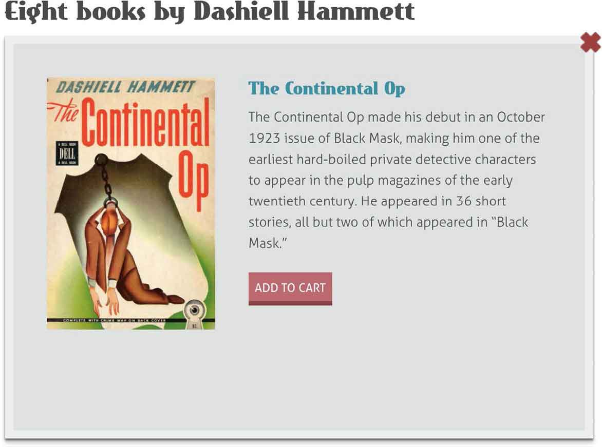
<center class="my_markdown"><b class="my_markdown">没有使用JavaScript，仅仅用 `opacity` 和 `:target`  就完成了这个设计。</b></center>

## 打破传统

设计不必是扁平化的，我们可以借助RGBa和不透明度特性来让设计更有深度。这些富有形式感的元素，可以跨越响应式的问题。与图形设计软件中的不透明度功能不同，我们可以使用RGBa、 `opacity` ，还有一些简单的CSS，来让我们的设计更加贴近生活。


