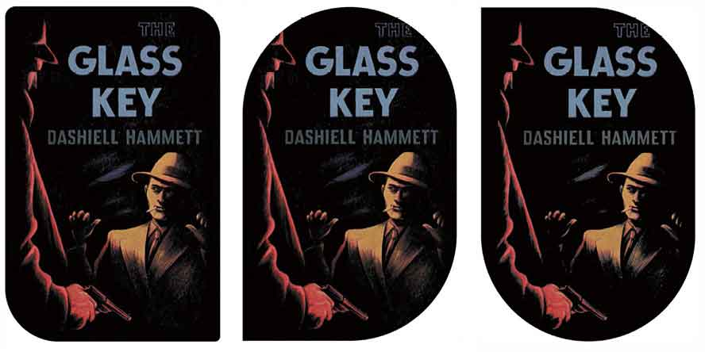

# 第14章　边框

> 通过使用 `box-shadow` 可以实现立体效果。 `box-shadow` 的语法很简单，第一个值是水平偏移，第二个值是垂直偏移，第三个值是模糊半径，第四个值是RGB颜色。
> 除非是头顶烈日，否则任何事物都会有多个阴影。通过设置多重 `box-shadow` ，可以实现更立体的三维效果。多个阴影的值通过逗号分隔。
> 在自然环境下，事物会受到来自四面八方的光线的照射，所以你可以将 `box-shadow` 的水平和垂直偏移设置成正值或负值，来将阴影投向任何方位。

## RGBa半透明box-shadow

在设计师的世界里，边框是不可或缺的一部分，但是普通边框很难让用户兴奋起来。相比之下，CSS边框可就不一样了，它们包含了一些属性，让设计师的创意有了用武之地。其中， `border-radius` 属性几乎可以为任何元素实现令人着迷的圆角效果。此外，还可以在边框里为图像使用 `border-image` 。下面就让我们一起来研究一下。

## 带半径的圆角边框

```html
.item__description { 
box-shadow : 0 1px 3px rgba(0,0,0,.8); }
```

圆角边框，可以用来制作不规则的形状，或者设计链接。它们看起来像是图标，也像去掉了锋利边缘的盒子。在过去，我们通过抠图来创建圆角。谢天谢地，现在不必那么麻烦了，因为使用圆角边框 `border-radius` ，可以更简单地添加统一、不统一或者椭圆角边框。

## 制作链接按钮

```html
.item__description { 
box-shadow : 
0 1px 1px rgba(0,0,0,.8), 
0 6px 9px rgba(0,0,0,.4); }
```

通过使用 `border-radius` ，我们可以通过px、em或者百分比为单位统一设置圆角。下面，我们来设置Get Hardboiled网站商店的链接，来让它看起来更像一个按钮。

```html
<a href="cart.html" class="btn">Add to cart</a>
```

```html
.item__description { 
box-shadow : 
0 -1px 1px rgba(0,0,0,.8), 
0 -6px 9px rgba(0,0,0,.4); }
```

现在，我们将链接转化为一个按钮。我们加入内边距（当用户改变其浏览器的文字大小时，可以适当地缩放）、背景色和深色边框。

```html
.btn { 
padding : 1rem 1.25rem .75rem; 
background-color: rgb(188, 103, 108); 
border: 5px solid rgb(140, 69, 73); }
```

通过设置 `border-radius` ，来使四个边角统一。

```html
.btn { 
border-radius : 1rem; }
```

## 单独设置每个边角

如果把内容简介框的每个角都设置为圆角，那么它看起来就与下面直角小说封面不相配。好在我们可以为每一个边角单独设置参数。

```html
div { 
border-top-left-radius : 1rem; 
border-top-right-radius : 1rem; 
border-bottom-left-radius : 0; 
border-bottom-right-radius : 0; }
```


<center class="my_markdown"><b class="my_markdown">左图展示的是一个微小的问题，上方的圆角与下方的直角相遇在一起，视觉上不太自然；在右图中，根据实际情况调整边角，使小说封面和内容简介之间的关系更加和谐。</b></center>

## 制作不规则图形

圆角并不一定都是圆的，我们使用成对的半径来实现椭圆效果。第一个设定水平半径，第二个设定垂直半径。使用下面的成对的值来使四个角都生效。

```html
.h-card { 
border-radius : 30px 60px; }
```

通过给四个角设置不同的 `border-radius` ，可以创作出更加复杂的图形。

```html
.h-card { 
border-top-left-radius : 5px 30px; 
border-top-right-radius : 30px 60px; 
border-bottom-left-radius : 80px 40px; 
border-bottom-right-radius : 40px 100px; }
```


## 属性简写

长长的一串 `border-radius` 属性值写起来很不方便，其实我们可以通过简写来获得同样的效果。

```html
.h-card { 
border-radius : 15px 30px 45px 60px; }
```

当需要简写椭圆的圆角的时候，可以使用斜杠（ `/` ） 来分隔，如下所示。

```html
.h-card { 
border-radius : 60px / 15px; }
```

对于单个半径，它的值是顺时针设置的：左上（top-left）、右上（top-right）、右下（bottom-right）、左下（bottom-left）。如果我们省略了左下（bottom-left），右上（top-right） 也会被省略。要单独实现椭圆的各个边角，可以分别设置每个角的水平和垂直半径，如下所示。

```html
.h-card { 
border-radius: 5px 30px 80px 40px / 30px 60px 40px 100px; }
```

## 为边框加上图像

当我写本书第一版的时候，设计边框只有几种选择：点状 `dotted` 、虚线 `dashed` 、实线 `solid` 、双线 `double` 、槽形 `groove` 、脊形 `ridge` 、内阴影 `inset`  和外阴影 `outset` 。谁用过后面这四种？反正我没用过。

那时候， CSS  `border-image`  刚可以让设计师在边框上加入图像，只有位图、SVG和CSS渐变格式。这个新的属性让我非常兴奋。毕竟，我们可以在任何元素边框上加入图像了，即使表格和列也可以（除非设置了忽略边框）。

那么 `border-image` 到底怎么用？你在网络上能看到大量巧妙的边框设计吗？并没有。当我问道谁在过去五年里使用过 `border-image` 时，我的CSS培训班中只有寥寥数人举起了手。

我对此非常好奇，因为即便 `border-image` 属性会带来新的挑战，但它对响应式设计却是非常有用的。

考虑到 `border-image` 复杂的语法可能会令人望而却步，因此我现在就来指导你如何使用。下面我们来用它实现一个博客评论框。

```html
<div class="media h-review"> 
   <div class="media__figure"></div> 
   <div class="media__content"> […] </div> 
</div>
```


<center class="my_markdown"><b class="my_markdown">`border-image` 属性是拉伸或重复小图像的神器，以此设计各种尺寸的界面元素。它在流式布局和注重细节的移动端设计中特别有效。</b></center>

## border-image切图

`border-image` 只占用很少的资源，仅仅通过CSS切图，就能设计出更大型的元素。除了使用图像软件切图，使用 `border-image` 也可以把图像切成3×3的九块。

60×60像素的图像大小只有区区几个字节。我们可以使用它的四个角补充给任何元素的边角。左上对左上，右上对右上，一一对应。

`border-image-source` 属性指定了评论框图像的URL地址。在这种情况下，我们使用位图图像。

```html
.h-review { 
border-image-source : url(h-review.png); }
```

`border-image-slice` 规定了上、右、下、左边缘的元素向内偏移。

```html
.h-review { 
border-image-slice : 20 20 20 20; }
```

你会注意到，我们不需要增加 `border-image-slice` 属性值，因为我使用的是位图，所以浏览器会自动识别我们在使用像素。当我们浏览的时候，会覆盖其他类型的图像边框。

不要忘记设置边框宽度，否则就不会显示图像了。

```html
.h-review { 
border-width : 20px 20px 20px 20px; }
```

我们把图像切分为几个部分：四个边角、四条边和一个中心。

在博客评论的设计中，每条边设置为 `20px` ，浏览器将顺时针应用这些值。

写这么多属性有些啰嗦，所以可以把 `border-image-source` 和 `border-image-slice` 整合到简写的 `border-image` 属性中，如下所示。

```html
.h-review { 
border-image : url(h-review.png) 20; 
border-width : 20px 20px 20px 20px; }
```

重复的值可以组合在一起，甚至可以写成单个值，就像我们写CSS外边距和内边距的时候那样。

```html
.h-review { 
border-image : url(h-review.png) 20; 
border-width : 20px; }
```

设置好 `border-image`  切片以及到元素边框的空白，浏览器就自动按照我们设置好的边角风格来呈现页面。


<center class="my_markdown"><b class="my_markdown">小边框图像的切片填充了博客评论框的边角。</b></center>

当我们仅使用一个值的时候，这个值就会无差别地应用到四个边角。但当我们忽略了 `border-bottom` 值的时候，浏览器就会使用 `border-top` 作为唯一的值。同样，如果我们忽略 `border-left` ，浏览器就会使用对应的 `border-right` 。

我们切出来的图像和偏移不必都是对称的。图像分隔不必设置成到四个边角是等距离的。为每个切片设置独立的值，就可以实现边框的不对称效果。

```html
.h-review { 
border-image : url(asymmetrical.png) 10 20 40 80; 
border-width : 10px 20px 40px 80px; }
```

不规则边框图像可以用来灵活应对设计需求，同时也减少了图像大小，提高网页加载速度。

## 边框风格

当在边框里放置图像时，我们要注意边框的四个角，因为在响应式设计中，我们也不知道每个元素的高度和宽度，所以在填充边框时，我们需要精心调整图像的平铺或拉伸。

`stretch` ：当图像特别宽大或光滑，推荐使用拉伸来适应宽度。

```html
.h-review { 
border-image-repeat : stretch; }
```


<center class="my_markdown"><b class="my_markdown">边框图像铺满了边框。</b></center>

`repeat` ：如果边框图像有纹理，如噪点等，那么使用拉伸就不合适了，此时可能需要平铺来适应宽度。

```html
.h-review { 
border-image-repeat : repeat; }
```


<center class="my_markdown"><b class="my_markdown">边框图像通过平铺填充了边框。</b></center>

`round` ：如果某个图形既不能铺满，又需要边缘重复，那就可以使用 `round` 。

```html
.h-review { 
border-image-repeat : round; }
```


<center class="my_markdown"><b class="my_markdown">调整切片大小以确保只有完整的切片来填充边框。</b></center>

`space` ：和 `round` 很像，只有整个切片在边框内显示时才使用 `space` 。浏览器会在平铺的图像间加入空白，而不是调整边框图像的大小。

```html
.h-review { 
border-image-repeat : space; }
```


<center class="my_markdown"><b class="my_markdown">平铺完整的切片，并在切片间添加空白，这样整个边框就被均匀地填充了。</b></center>

当我们需要为每个边框分别设置 `stretch` 、 `repeat` 、 `round` 或 `space` 的时候，可以设置多值属性。

```html
.h-review { 
border-image-repeat : stretch round; }
```

## 边框图像外延

有时候我们需要设置边框图像超出边框，这个时候使用 `border-image-outset` 属性就对了。最简单的方法是在各边均匀扩展 `5px` 。


<center class="my_markdown"><b class="my_markdown">下方的边框比上方的边框扩展了5px。</b></center>

```html
.h-review { 
border-image-outset : 10px; }
```

当然，我们可以分别指定四个边框各自超出多少。

```html
.h-review { 
border-image-outset : 10px 0 10px 0; }
```

同样的，重复的值可以合并起来，就想之前提到的内边距和外边距一样。

```html
.h-review { 
border-image-outset : 10px 0; }
```

`border-image-outset`  属性可以接受任何常见的CSS长度值，包括 `px` 、 `em` 、 `rem` ，甚至是 `vh` 和 `vw` 。

## 中心填充

我们已经使用了四个边角和四个小图像，那剩下的中心部分怎么办呢？ 默认情况下，中心会被忽略，如果我们想使用的话，可以使用 `fill` 关键词来声明。

```html
.h-review { 
border-image-slice : 20 fill; }
```


<center class="my_markdown"><b class="my_markdown">使用小噪点图像平铺到背景中，填充博客评论框。</b></center>

## 使用替代位图

边框图像非常适合实现响应式设计的需求，它允许我们使用最小的位图图像，也可以使用任何风格的边框。我们也可以使用矢量图SVG，甚至是单纯的CSS渐变。在边框内使用矢量图的最简单方法是应用 `border-image-source` ，和使用位图的方法几乎一样。

```html
.h-review { 
border-image-source : url(h-review.svg); }
```

这个方法得到了浏览器很好的支持，只要是支持 `border-image` 的浏览器，都允许我们将SVG设置为 `border-image-source` 。

使用CSS渐变制作边框或许是最巧妙的替代方案，因为它给设计师带来了极大的创作空间，并且它几乎不会增加网页大小。它包含在样式表中，不会有额外的请求， 这使得它非常适合响应式网页设计。

就算你以前没有使用过CSS渐变也不要担心，后面我们会详细讲。现在我们来使用渐变给边框添加斜纹。

```html
.h-review { 
border-image-repeat : repeat; 
border-image-source : repeating-linear-gradient(-45deg, white, 
white 3px, #ebf4f6 3px, #9Bc7d0 6px); 
border-image-slice : 10; 
border-width : 10px; }
```


<center class="my_markdown"><b class="my_markdown">平铺渐变的边框真是个完美的案例， `border-image` 和 `gradient`  这两个CSS属性组合使用可以让响应式设计更快、更有弹性。</b></center>

当然，使用 `border-image` 和 `gradient` 还可以创造出更多效果，而要实现这些效果，其他CSS属性就力不从心了。在接下来的例子中，我们将会使用一个由上至下、由深变浅的蓝色线性渐变。

```html
.h-review { 
border-image-source : linear-gradient(to bottom, #9Bc7d0, 
#ebf4f6 100%); 
border-image-slice : 10; 
border-width : 10px; }
```


<center class="my_markdown"><b class="my_markdown">为边框添加线性渐变可以让设计更具质感，这是其他CSS属性难以实现的。</b></center>

渐变效果在元素的某个高度的位置由上至下变浅，当然，这个高度很大程度上取决于元素包含的内容大小。为了让渐变充满整个评论框，我们将渐变声明从变化的100%调整为一致的，但仍然是弹性的,  `8rem` 。

```html
.h-review { 
border-image-source : linear-gradient(to bottom, #9Bc7d0, 
#ebf4f6 8rem); }
```


<center class="my_markdown"><b class="my_markdown">将渐变的值从百分比改为弹性单位rem，渐变就可以从不同的元素高度开始一致的变化。</b></center>

## 专业名片设计

在这一节，我们将用本章学习的边框图像来设计一张名片。花哨的HTML这里用不上，因为名片包含联系信息，所以使用 `h-card` 这种微格式就行了，如下所示。

```html
<div class="h-card"> 
<h3 class="p-name">S.A.Fari</h3> 
<p class="p-role">Web Inspector</p> 
<h4>Checking all elements</h4> 
<p>Dial <span class="p-tel">4.0.4 5531.21.10</span></p> 
<p>Member of the WebKit team since 2006</p> 
</div>
```


<center class="my_markdown"><b class="my_markdown">这可不是用硬纸板做的。那精致的边框是设计师敲键盘码出来的。</b></center>

首先使用一个小的PNG图像，尺寸为160×160像素， 只有3Kb大小。然后使用边框图像去装饰可以是无数不同尺寸大小的元素。


<center class="my_markdown"><b class="my_markdown">首先使用一个包含了四个边角和图案装饰的小图像，我们用它来装饰名片的边框。</b></center>

首先我们设置一个辅助线作为指导，从我们用来修饰边框样式的图像的每一边各取 `20px` 。然后我们再设定边框宽度，同样是 `20px` 。

```html
.h-card { 
border-image-source : url(safari.png); 
border-image-slice : 20; 
border-width : 20px; }
```

到目前为止，原图像的四个角的装饰就被应用到名片的四个角了。那么边框呢？在这个错综复杂的设计中，我们必须谨慎地控制边框的呈现效果。

对于眼前的这个设计， `stretch`  肯定是不行的；而简单的 `repeat` 会导致图案与边角的不匹配；我们也不想使用 `space` 而在图案中引入空白。所以，我们应该选择 `round` 。这将会轻微改变平铺图案的大小，因此只会显示完整的图案。为了提升设计的整体档次，成为一张超越平凡的名片，让我们来添加两个阴影：第一个更暗、更硬朗；第二个更亮、更柔和。


<center class="my_markdown"><b class="my_markdown">使用 `round`  ，我们让浏览器调整装饰图像，这样，只有完整的切片才能恰当地填充边框。</b></center>

```html
.h-card { 
box-shadow : 0 2px 5px 
rgba(0,0,0,.5), 
0 20px 30px rgba(0,0,0,.2); }
```

## 改变边框图像宽度

到目前为止所有的 `border-image` 案例，边框宽度都是精确匹配切片图像宽度的，如果它们不一样会怎么样呢？

当我们改变边框的宽度，就可以控制图像能够显示的大小。为了看这个的效果，我们把边框的宽度减少到只有 `10px` ，就可以观察到程序把图片缩小来匹配边框的新宽度。

```html
.h-card { 
border-image : url(safari.png) 20 round; 
border-width : 10px; }
```

让边框的宽度大于切片大小会有相反的效果。增加边框的宽度，可以看到边框图像也随之变大了。


## 打破传统

使用 `border-radius` 或者 `border-image` 来制作椭圆、圆角边框，或者使用图像填充它们的时候，我们发现，CSS 其实很有意思。这些属性帮我们节省了时间、解决了普通的实现问题，为设计师提供了创造的空间。所以，你现在可以制作出更加专业的边框了！


