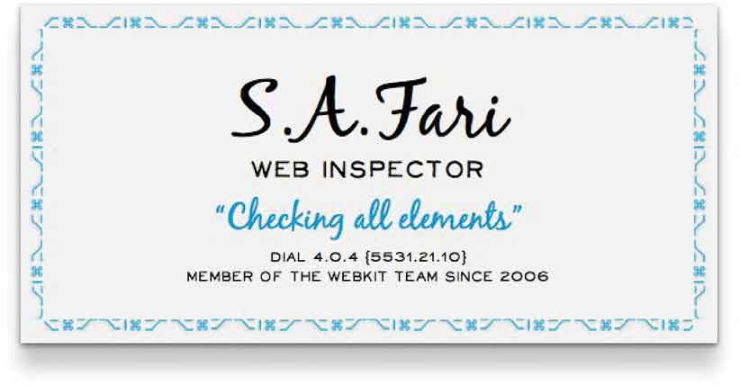
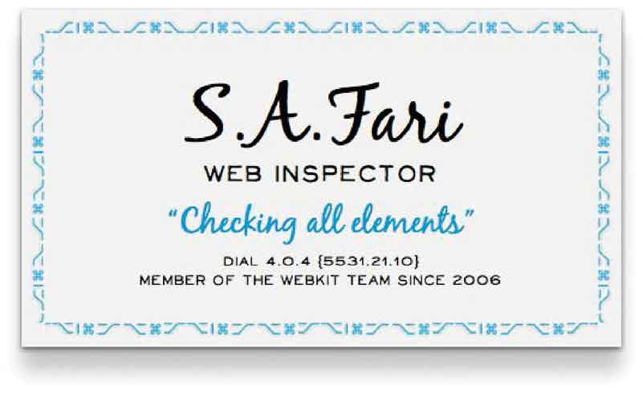
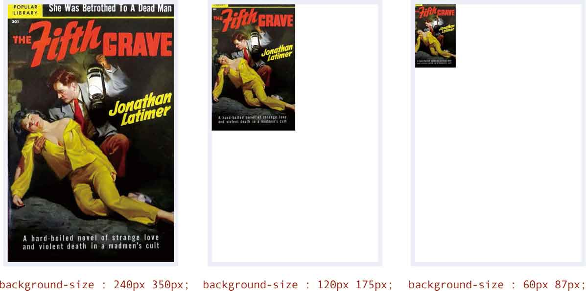
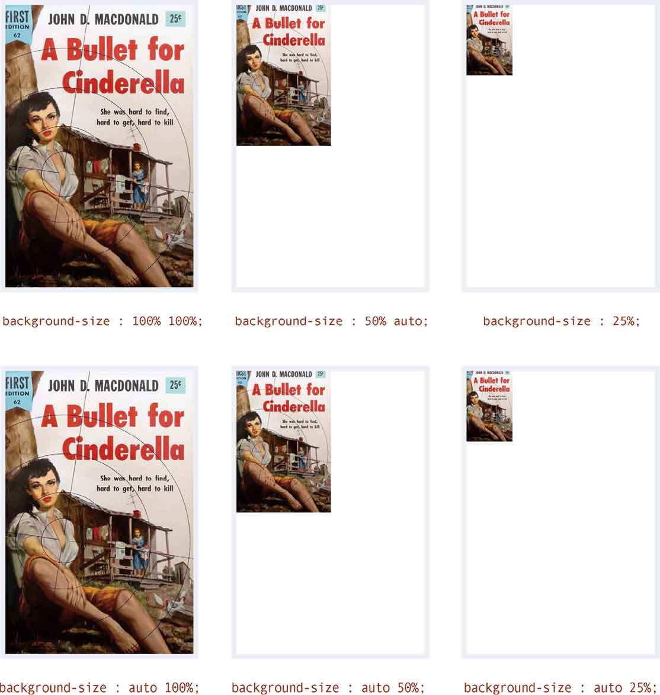
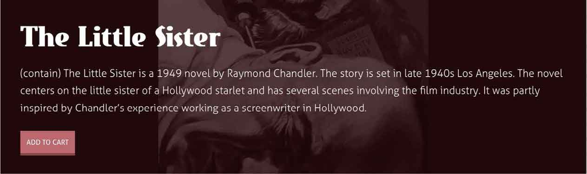
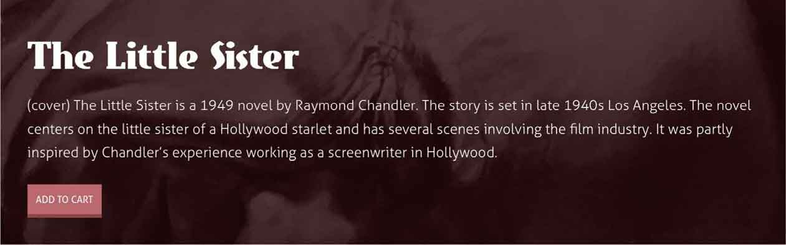
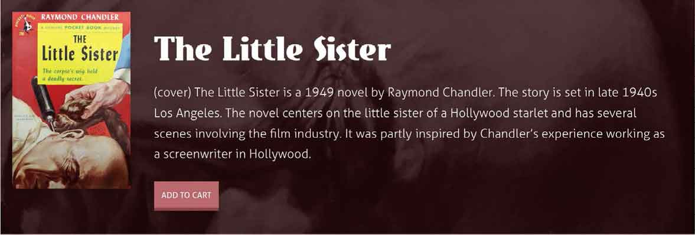

# 第15章　背景图像

就在不久前，在一个元素上定义多个背景图像还是很难的，我们得十分蹩脚地使用HTML来还原设计稿。但是现在，几乎所有的现代浏览器都支持在一个元素上定义多个背景。我们还可以设置背景图像的原点和大小，这有助于我们展开新的创意。让我们开始使用多重背景特性进行设计吧。

## 多个背景图像

对于在一个区域里包含一个标题和一段文章的设计，我们会使用背景图像来实现。在过去，我们需要创建两个嵌套的元素，并分别定义不同的背景来实现。

```html
<div class="left"> 
   <div class="right"> […] </div> 
</div>
```

幸运的是，现在我们只需要使用一个HTML元素 `section` ，给它定义两个背景图像就能实现这种效果。

```html
<section> […] </section>
```

我已经为这个设计做了两个背景图像，一个定位到左边，另一个定位到右边。我们可以为这两个背景图像的指定相同的 `background-image` 值，只需要用逗号分隔开每个图像的路径。

```html
section { 
background-image : 
url(section-left.png), 
url(section-right.png); }
```

与此同时，我们也应该指定背景图像的位置和平铺方式，同样用逗号来分隔开它们。

```html
section { 
background-position : 0 0, 100% 0; 
background-repeat : no-repeat, no-repeat; }
```

为了节省几个字节，我们也可以用样式缩写的方式，把图像路径、平铺方式和位置写在一起。

```html
section { 
background : 
url(section-left.png) no-repeat 0 0, 
url(section-right.png) no-repeat 100% 0; }
```

## 背景重叠

当多个背景图重叠在一起的时候，你可能会认为它们会遵循CSS定位的重叠顺序，后面的元素层级相对越高，或者说离用户的视线相对更近，如下所示。

```html
section { 
background : 
url(background.png) no-repeat 0 0, 
url(middle-ground.png) no-repeat 0 0, 
url(foreground.png) no-repeat 0 0; }
```

那你就错了，第一张图像将会呈现在最上层，并且这样有很充分的理由。如果老版本浏览器不支持多背景图定义，它会在第一个逗号前阻塞，并只显示第一张图像。

```html
section { 
background : 
url(foreground.png) no-repeat 0 0, 
url(middle-ground.png) no-repeat 0 0, 
url(background.png) no-repeat 0 0; }
```

## border-box

我猜你学习CSS时首先学的是盒模型，甚至在这里就栽了跟头。因为在传统的盒模型中，元素大小包含了内边距和边框。

在一个宽和高都为 `100px` 的元素上定义 `10px` 的内边距值和 `5px` 的边框，那么它的宽度和高度将是 `130px` （100px + 20px + 10px = 130px），这是所有现代浏览器里的默认盒模型。在CSS3中，它被称为 `content-box` 。

在固定宽度的设计中，这种传统的盒模型很少出问题，但是当我们开发响应式设计的时候就比较头疼了。因为CSS一直不能很好地混合使用固定单位和百分比单位的尺寸，比如 `px` 和 `em` 。

例如，我们想象一个元素，它占满100%的浏览器窗口。如果给它 `10px` 的内边距值，这时它的宽度是多少？然后，再给它添加一条 `5px` 的边框，这时它的宽度是多少？之前处理这种问题时，我们都是嵌套一个使用像素 `px` 作为单位的元素，然后再使用百分比。

为了解决在同一个元素上混合使用像素 `px` 和百分比单位的问题，CSS引入了另一种盒模型类型—— `border-box` 。 `border-box` 可以使内边距值和边框值算进元素本身的尺寸里，而不是在元素本身尺寸上增加。这使得下面这个 `section` 在拥有像素 `px` 单位的内边距和边框时，依然可以使用百分比单位。

```html
section { 
width : 100% 
padding : 10px; 
border : 5px solid rgb(235, 244, 246); 
box-sizing : border-box; }
```


<center class="my_markdown"><b class="my_markdown">这个例子中使用了 `content-box` ，内边距和边框是添加到元素本身尺寸上的。</b></center>


<center class="my_markdown"><b class="my_markdown">而使用 `border-box` 时，内边距和边框是算到元素本身尺寸里的。</b></center>

`border-box` 的这些尺寸计算方式，是否能让我们绘制出预期的元素，其实在微软IE6浏览器之前的版本上是不行的。

## 背景裁剪

当一个元素同时拥有背景图像、背景色还有边框时，默认情况下，背景会延伸到边框的下方，并延展到盒模型的边缘。CSS3提供了 `border-box` 和 `background-clip` 这两个属性来控制这种行为。

```html
.h-card { 
background-image : url(h-card.png);  
border : 10px dashed rgb(0,0,0); 
background-clip : border-box; }
```

如果我们指定一个盒模型为 `padding-box` ，那么任何背景色或者背景图像都将在延伸到盒模型内边距的边缘后被裁剪掉，而不会延伸到它的边框后面。

```html
.h-card { 
background-clip : padding-box; }
```

## 定义背景图像原点

你应该已经比较了解CSS里的 `background-position` 属性，浏览器会在边框内部，将背景图像相对于元素内边距的边缘来定位。CSS3以 `padding-box` 为基础，结合使用 `background-origin` 的多个属性值，可以创造很多可能性。

`background-origin` 属性中的一种是，使背景图像相对于元素的边缘来定位，甚至延伸到边框下面。它就是 `border-box` 。

```html
.h-card { 
background-origin : border-box; }
```

使用 `content-box` ，那么背景图像将会在元素的内边距以内，相对于实际内容的边缘来定位。

```html
.h-card { 
background-origin : content-box; }
```

## 背景图像的尺寸

大背景图像的处理是我经常头疼的事，过去我总是使用Photoshop来缩放背景图像。CSS里有一个属性—— `background-size` ，它使我们能够控制背景图像的尺寸。这不仅可以节省时间，也为我们开启了一扇创意的大门。

`background-size` 属性接受水平和垂直两个值，这些值可以使用像素或者百分比，然后再加上一个可选的关键字 `cover` 或 `contain` 。

```html
.item__img { 
background-size : 100% 50% contain; }
```

我们从一个元素开始，它的尺寸是 `310px` × `200px` ，我们给它添加一个同样尺寸的的背景图像。

```html
.item__img { 
width : 200px; 
height : 310px; 
background-image : url(magazine.jpg); }
```

当元素和背景图像尺寸相同时，这没什么问题，但是当客户想要改变这里的设计时，没关系， `background-size` 可以解决这个问题，我们也不必再使用软件重新处理图像。

| 像素单位 | 使用像素单位来定义背景图的尺寸 |
| :-----  | :-----  | :-----  | :-----  |
| 百分比 | 相对与元素尺寸的百分比来指定背景图的尺寸 |
| `cover` | 背景图等比缩放直到覆盖满整个元素 |
| `contain` | 背景图等比缩放后完全包含在元素中 |

## 使用像素定义背景图像尺寸

`background-size` 属性允许我们使用像素 `px` 来为背景图像设置一个精确的尺寸，如下所示。

```html
.item__img { 
background-size : 200px 310px; }
```

第一个值定义宽度，第二个定义高度。当没有指定高度时，浏览器会自动保持背景图像的宽高比。下面这些例子，会实现相同的效果。

```html
.item__img { background-size : 200px 310px; } 
.item__img { background-size : 200px auto; } 
.item__img { background-size : 200px; }
```

如果元素的尺寸发生改变，比如变成 `240px` × `350px` ，我们可以为背景图像设置新的尺寸，让它来缩放或者拉伸为合适的大小。我们甚至可以为背景图像设置和元素大小差别很大的尺寸。下面是三个例子。


## 使用百分百设置背景图尺寸

CSS可以让我们使用百分比来缩放背景图像，在下面的一系列示例中，第一行定义了宽度，第二行定义了高度，当我们不指定高度时，浏览器将自动保持图像的宽高比。


## cover和contain

让我们来做一些更大胆的尝试。这是Get Hardboiled网站的一个促销面板，用来促进某本书的销量。先秀出一段专业的HTML代码： `article` 中包含了一个标题和一段文字。

```html
<article class="item"> 
   <h1 class="item__header">The Phantom Detective</h1> 
   <p class="item__description">The Phantom Detective was the
second pulp hero published after The Shadow. The first issue was
released in February 1933. The title continued until 1953, with
a total of 170 issues.</p> 
</article>
```

这个 `article` 的宽度将会占满它的容器，但我们还是需要为它设置以像素 `px` 为单位的内边距值，这种混合使用的方式很让人头疼。但是不用担心，通过声明 `border-box` ，混合使用百分比和像素 `px` 单位就容易了。

```html
.item { 
width : 100%; 
padding : 40px 80px 40px 280px; 
box-sizing : border-box; }
```

如果你想知道为什么左边的内边距值这么大，我用一分钟就能为你解答清楚。现在我们使用一张很大的背景图像，这是这个设计的关键，我们将它水平居中地固定在这个区域的底部。

```html
.item { 
width : 100%; 
padding : 40px 80px 40px 280px; 
background: url(scene.jpg) no-repeat 50% 100%; 
background-size : 200px 300px; 
box-sizing : border-box; }
```

结果看起来挺好，但它并不完美，因为当用户缩小浏览器窗口时，两边的背景图像会被截掉。


<center class="my_markdown"><b class="my_markdown">在右图中，当用户缩小浏览器宽度时，背景图像被被截掉了。</b></center>

CSS的 `background-size` 属性还有两个关键字，它们都是用来等比缩放背景图像的，分别是 `cover` 和 `contain` 。哪种更适合当前这种场景呢？这有点令人困惑。首先，使用 `contain` 缩放背景图像后，保证宽和高都包含在元素内而不被截掉。


<center class="my_markdown"><b class="my_markdown">这张背景图像包含在元素内部。</b></center>

使用 `cover` 的话，背景图像会缩放宽和高，从而覆盖整个元素。


<center class="my_markdown"><b class="my_markdown">元素的尺寸无论如何改变，都会一直被这张背景图像覆盖——完美的响应式设计。</b></center>

在设计完促销面板之后，我们将小说封面图片添加进入，作为第二张背景图像。想到如何来定位它了吗？你可能会这样做：用一个很大的内边距值为左边留出足够的空间，然后把这张背景图像定位到距离顶部和左边各 `40px` 的位置。

用逗号隔开，分别定义每个背景图像的位置、平铺方式和尺寸，并且要记住，我们定义的第一张背景图像的层级更高。

```html
.item { 
background-image : 
url(../Images/cover.jpg) 40px 40px no-repeat, 
url(scene.jpg) 50% 100% no-repeat; 
background-size : 200px 300px, cover; }
```


<center class="my_markdown"><b class="my_markdown">最终，我们用两张背景图像实现了一个响应式设计。第二张背景图像还可以随着容器的尺寸变化，实时地等比缩放尺寸；第一张图像则会使用它的原生尺寸。现在，它就显得很专业了。</b></center>

## 打破传统

当我们需要在一个元素上应用多个背景图像时，我们可以使用CSS背景来实现，以保持HTML的简洁和专业。背景属性使我们可以精确地控制背景图像的尺寸，以及如何渲染元素。你开始使用它们了吗？你还在等什么？马上用起来吧。


