# 第18章　CSS转换

> 你可能之前使用过 `:nth-` 伪元素选择器：比如使用 `:last-child` 从列表中去掉最后一个元素的边框；或者使用 `:first-child` 为一篇文章开始的段落添加一个边框，如下所示。
> 还不错，只是选择首尾的元素来做一些简单的样式定义。只能做到这些吗？当然不是。
> 在处理可预见的情况时（列表中的项或者表格中的行）， `:nth-child` 选择器的表现不错。但当我们不能预知元素的位置时，就需要一个更加灵活的选择。如果能根据类型或者元素在文档中的位置来选择岂不是更好？其实这就是 `:nth-of-type` 伪元素选择器要做的，也是CSS的秘密之一。
> 想选中第一段，不管它出现在文档中的什么位置，都不是问题。那么要选中第四个无序列表例子中的第十三项呢？ `:nth-of-type` 同样可以帮助你。任何目标元素，无论它出现在什么位置，都不需要 `id` 或者 `class` 属性，这确实很强大。
> `:nth-of-type` 可以接受像 `odd` 或者 `even` 这样的关键字，也可以是数字或者表达式。听起来有点复杂，其实并不是，我们一起看几个例子。
> 如果你想为列表里的奇数项（一、三、五、七…）添加边框，使用 `:nth-of-type` 就可以很轻松实现。你不需要为HTML添加class属性或者使用JavaScript hack，只需要用 `odd` 关键字就可以。
> 在下面的例子中，使用 `:nth-of-type` 选择器给文章中的第一段文字加粗。
> 表达式相对复杂些，刚接触时我们都会觉得很烧脑。我的建议是从右往左倒着阅读。在下面的例子中， `3n+1` 表示匹配表格里的第一行（ `1` ），然后是每隔3行（ `3n` ）。
> `6n+3` 将匹配每隔六个元素后的第三个元素。

> CSS3里还包含了一些其他的3D转换属性：  `rotate` 和 `scaleZ` 。 `scaleZ` 允许我像 `scaleX` 和 `scaleY` 一样来缩放元素，只不过它是沿着z轴。或者我们可以用scale3d属性来设置沿着三个轴缩放。

## :nth-of-type详解

## 3D缩放

尽管我们尽了最大努力，但有些时候CSS布局还是有一些壁垒。甚至CSS将它的基础布局就称为盒模型。不过有些新的CSS布局规范正在慢慢成为W3C标准，比如2D和3D转换可以帮助我们突破盒模型的限制。

## 2D转换

```html
p:first-child { 
padding-bottom : 1.5rem; 
border-bottom : 1px solid #ebf4f6; 
font-size : 1rem; }
```

```html
.item { 
transform : scale3d(scaleX, scaleY, scaleZ); }
```

目前所有的浏览器都支持CSS的2D转换，所以它很常用。转换的基本语法很简单，如下所示。

```html
transform : transform type;
```

转换一个元素有很多方法可以使用，如下所示。

+ `translate` ：水平或者垂直的移动元素
+ `skew` ：水平或者垂直的扭曲元素
+ `rotate` ：旋转元素
+ `scale` ：增加或者减小元素的大小

### :nth-of-type参数

## transform: translate（移动）

首先使用 `translate` 来移动元素。这个行为在很多方面都与相对定位类似，在做到视觉上偏移的同时，又保持了元素在文档流中的位置。

`translate` 在x轴或y轴上移动元素。我们可以使用像素 `px` 、 `em` 或者相对于元素的百分比来设置它的值。例如一个 `100px` 大小的元素，移动150%即为 `150px` 。百分比在流式设计或者元素大小动态改变的网站上非常有用。

```html
li:nth-of-type(odd) { 
border-bottom : 1px solid #ebf4f6; }
```

我们将会使用 `translateX` 和它后面括号里的值，把Get Hardboiled网站上的名片向右移动 `100px` 。

```html
.h-card { 
transform : translateX(100px); }
```

```html
article p:nth-of-type(1) { 
font-weight : bold; }
```

我们同样可以使用 `translateY` 把它向下移动 `50%` 。

```html
.h-card { 
transform : translateY(50%); }
```

```html
tr:nth-of-type(3n+1) { 
background-color : #fff; }
```

最后，把 `translateX` 和 `translateY` 组合到一句定义里。

```html
.h-card { 
transform : translate(100px 50%); }
```

```html
tr:nth-of-type(6n+3) { 
opacity : .8; }
```

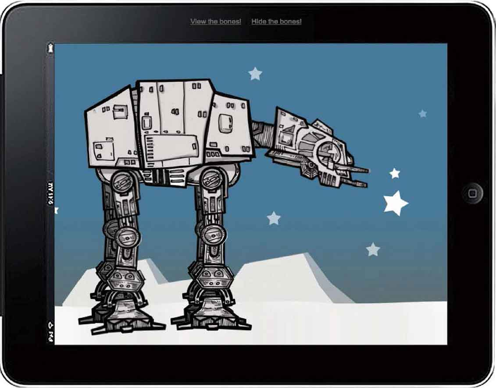
<center class="my_markdown"><b class="my_markdown">Anthony Calzadilla纯靠CSS3平移和旋转创作的“星球大战AT-AT步行机”。或许这个例子就是你学习CSS3的动力。</b></center>

如果一个元素占据了空间，任何转换的元素都可能和它重叠。如果它在文档流里顺序比较靠后，那么它将出现在前面，反之亦然。和相对定位一样，如果我们使用了 `translate` ，那么默认文档流将保持不变，它也不占用文档流里的位置。

学习转换最好的方法就是实践。我们会用像素和百分比从不同的方向转换另一张名片。在每个例子中，虚线框表示名片的原始位置。

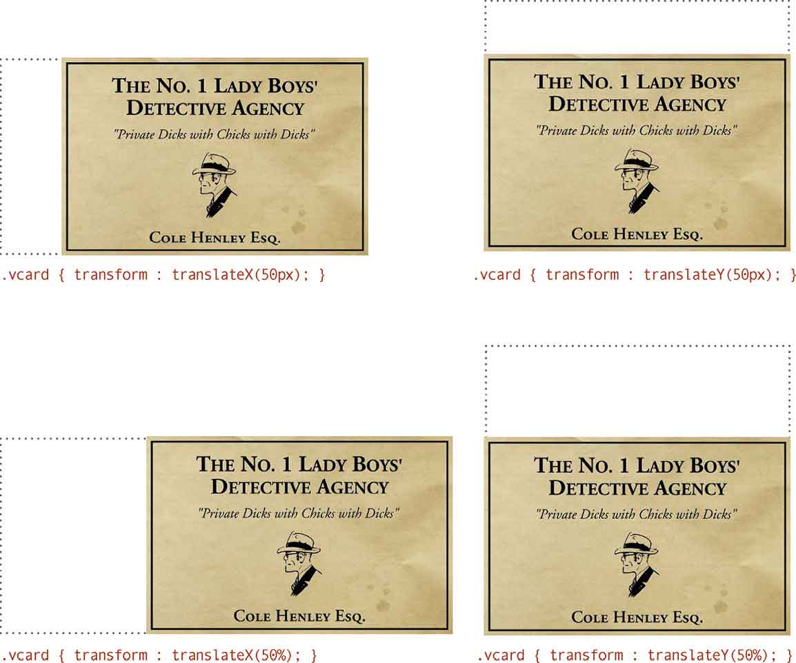
## transform: scale（缩放）

当我们使用 `scale` 时，会改变元素的大小。缩放比例由数值和轴这两个因素来决定。数值介于 `0.99` 和 `0.01` 之间时，元素将变小，相反，数值大于 `1.01` 时，元素将会变大。缩放比例为 `1` 时，元素大小保持不变，它周围的元素并不会因为它的尺寸发生改变而产生重绘。

你可以沿水平或垂直方向缩放元素，或者两者结合。接下来，我们将使用 `scaleX` 将元素水平放大到150%，缩放系数放在括号里。

```html
.h-card { 
transform : scaleX(1.5); }
```

现在用 `scaleY` 把高度缩小到50%。

```html
.h-card { 
transform : scale(1.5, .5); }
```

很显然，括号里的这些值应该用逗号隔开。

继续在实践中观察 `scale` ，我们将用几种方法来改变另一张名片的大小，虚线框依然表示它的初始尺寸。

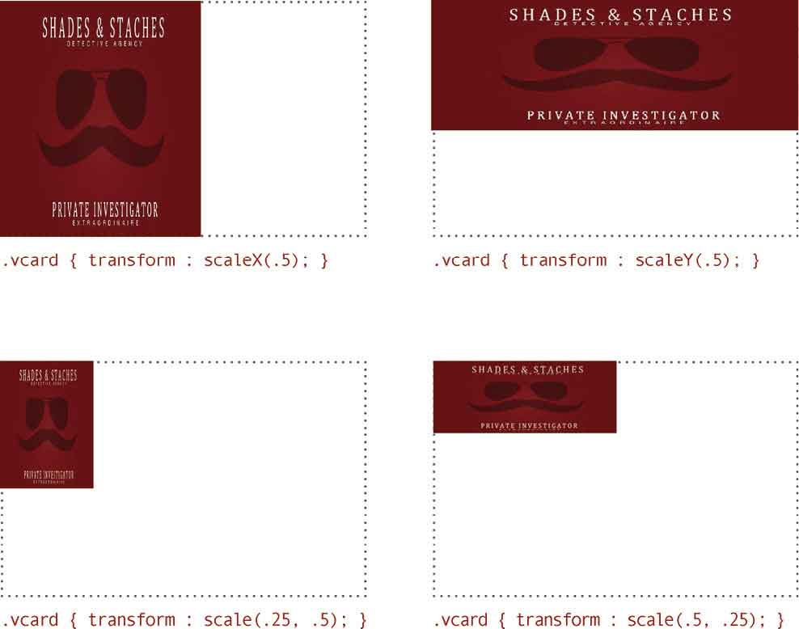
## transform: rotate（旋转）

我们可以使用 `rotate` ，在0度和360度之间顺时针旋转元素，也可以用负值来逆时针旋转。语法学习起来很快。首先声明使用 `rotate` 属性值，然后是括号里的角度，这个例子中使用的是 `45deg` 。

```html
.h-card { 
transform : rotate(45deg); }
```

旋转元素时，页面上的其他元素不会受任何影响。实践一下 `rotate` ，我们使用不同的角度来旋转另一张卡片，虚线框依然表示它的初始位置。

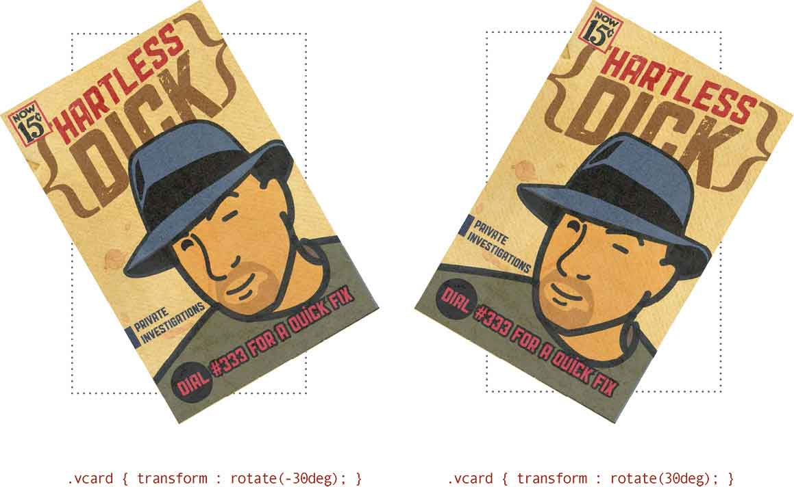
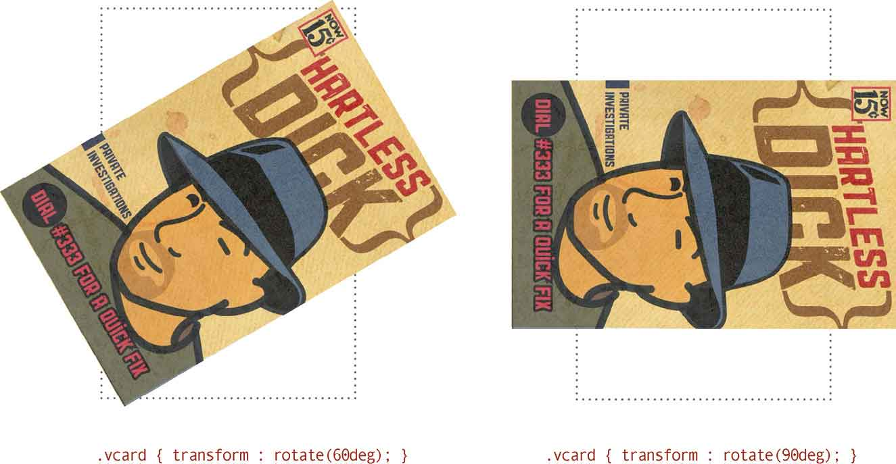
## transform: skew（扭曲）

`skew` 使元素在水平或者垂直方向上扭曲。语法很简单，为了演示，我们使用 `skewX` 来声明水平方向，然后在括号里设置角度，这里使用 `30deg` 。

```html
.h-card { 
transform : skewX(30deg); }
```

现在我们组合使用两个轴，在垂直方向上使用 `skewY` 来倾斜 `15deg` ，组合效果如下所示。

```html
.h-card { 
transform : skewX(30deg); 
transform : skewY(15deg); }
```

我们还可以简写 `skew` 属性，如下所示。

```html
.h-card { 
transform : skew(30deg, 15deg); }
```

最好的学习方法就是在实践中观察它们，我们会在另一张名片上演示水平和垂直，以及正向和反向的扭曲效果，虚线框表示它的初始形状。

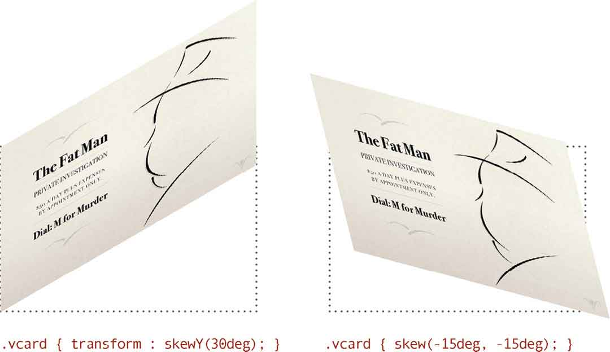
## 设置转换原点

移动、缩放、旋转和扭曲是控制设计细节的强大工具。我们还可以更进一步，为任何给定元素设置转换的原点。

通过使用关键字 `top` 、 `right` 、 `bottom` 、 `left` 和 `center` ，或者使用像素 `px` 、 `em` 和百分比来定义 `transform-origin` 。原点包含水平和垂直两个值。在下面这个例子中，我们将卡片的原点设置为右上角。

```html
.h-card { 
transform-origin : right top; }
```

使用百分比也会得到相同的结果。

```html
.h-card { 
transform-origin : 100% 0; }
```

当我们只设置一个值时，浏览器会默认第二个值为 `center` 。

实践依然是我们理解转换原点最好的方法，所以在下一组例子中，我们会演示一张卡片不同的转换原点，并且逆时针旋转30度。没错，虚线框依然表示卡片的初始位置。

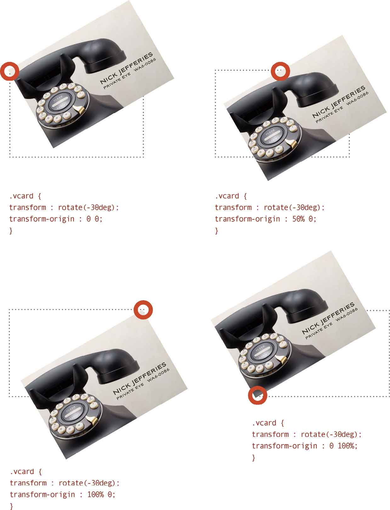
## 组合两个或多个转换

有时我们需要在一个元素上设置两个或更多的转换。设置多个转换值时，将它们串在一起，并用空格分隔。在下面这个例子中，元素旋转 `2deg` ，并且尺寸缩放到原来的 `1.05` 倍。

```html
.h-card { 
transform: rotate(2deg) scale(1.05); }
```

浏览器是按照从左到右的顺序来执行的。在最后一个例子中，元素先顺时针旋转 `2deg` ，然后再把元素尺寸缩放到原来的 `1.05` 倍。看看我们应用的这一系列转换实现的效果吧。

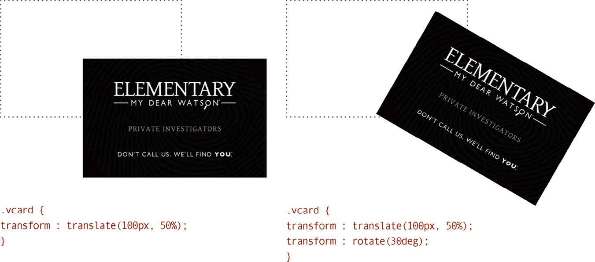
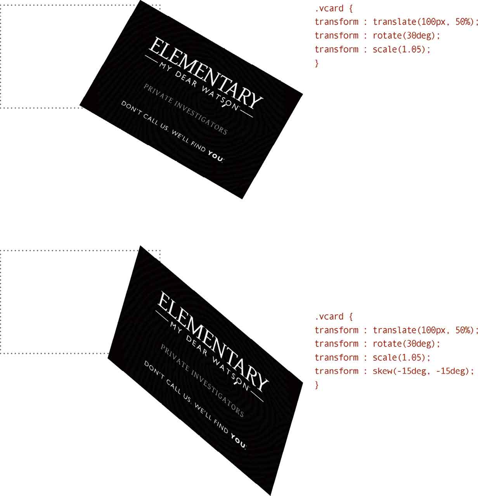
## 2D转换实战

现在我们要给Get Hardboiled网站的侦探办公桌上的名片应用转换。首先用 `transform-origin` 属性来设置原点，并用 `rotate` 转换来实现不规则的设计。

我们将使用的HTML是很专业的，你找不到任何一个表象的元素或者属性。这里有九个微格式 `h-card` ，每个都有其自己的一组值来描述一个侦探的联系信息。所有卡片上都没有定义 `id` 。

```html
<div class="h-card"> 
<h3 class="p-org">The No. 1 Detective Agency</h3> 
</div> 
<div class="h-card"> 
<h3 class="p-name p-org"> 
Shades & Staches Detective Agency</h3> 
</div> 
<div class="h-card"> 
<h3 class="p-name p-org">Command F Detective Services</h3> 
</div> 
<div class="h-card"> 
<h3 class="p-name">The Fat Man</h3> 
</div> 
<div class="h-card"> 
<h3 class="p-name p-org">Hartless Dick</h3> 
</div> 
<div class="h-card"> 
<h3 class="p-name p-org">Nick Jefferies</h3> 
</div> 
<div class="h-card"> 
<h3 class="p-name p-org">Elementary, My Dear Watson</h3> 
</div> 
<div class="h-card"> 
<h3 class="p-name p-org">Shoes Clues</h3> 
</div> 
<div class="h-card"> 
<h3 class="p-name p-org">Smoke</h3> 
</div>
```

首先为 `h-card` 定义通用样式。我们会给所有卡片设定相同的尺寸，并应用 `background-size` 属性来确保不管卡片多大，背景图都能与之适应。

```html
.h-card { 
width : 300px; 
height : 195px; 
background-position : 50% 50%; 
background-repeat : no-repeat; 
background-size : 100% 100%; }
```

我们需要为每个元素定义不同的背景图像，但是我们并没有在HTML里定义 `id` 或者 `class` 属性，这里就要用到 `:nth-of-type` 伪元素选择器了。

现在使用 `:nth-of-type` 伪元素选择器来为每张卡片添加背景图像。

```html
.h-card:nth-of-type(1) { 
background-image : url(card-01.jpg); } 
.h-card:nth-of-type(2) { 
background-image : url(card-02.jpg); } 
.h-card:nth-of-type(3) { 
background-image : url(card-03.jpg); } 
.h-card:nth-of-type(4) { 
background-image : url(card-04.jpg); } 
.h-card:nth-of-type(5) { 
background-image : url(card-05.jpg); } 
.h-card:nth-of-type(6) { 
background-image : url(card-06.jpg); } 
.h-card:nth-of-type(7) { 
background-image : url(card-07.jpg); } 
.h-card:nth-of-type(8) { 
background-image : url(card-08.jpg); } 
.h-card:nth-of-type(9) { 
background-image : url(card-10.jpg)); }
```

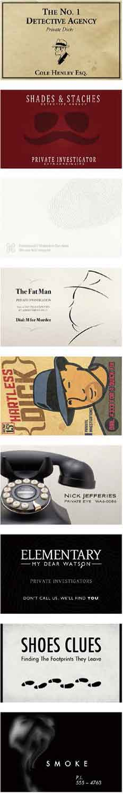
<center class="my_markdown"><b class="my_markdown">在小屏幕上，卡片整齐地摆在一起。</b></center>

因为我们只是希望显示元素的背景图像，所以通过缩进把HTML文本移到屏幕外。

```html
.h-card * { 
text-indent : -9999px; }
```

### 添加转换

那些卡片虽然看起来不错，但是有点呆板，接下来我们给它们添加一些旋转变换的效果。我们不会给特定的卡片应用这些转换，而是通过 `:nth-of-type(n)` 选择器来让设计看起来是随机的。我们把奇数的卡片逆时针旋转2度（ `-2deg` ），让它们显得松散一些。

```html
.h-card:nth-child(odd) { 
transform : rotate(-2deg); 
transform-origin : 0 100%; }
```

现在让我们继续调整，给3、4、6的倍数的每一个卡片设置不同的 `rotate` 值，给6的倍数的卡片设置 `translate` 值，让它们偏离原点。

```html
.h-card:nth-child(3n) { 
transform : rotate(2deg) translateY(-30px); } 
.h-card:nth-child(4n) { 
transform : rotate(2deg); 
transform-origin : 0 100%; } 
.h-card:nth-child(6n) { 
transform : rotate(-5deg); 
transform-origin : 0 0; }
```

<center class="my_markdown"><b class="my_markdown"></b></center>

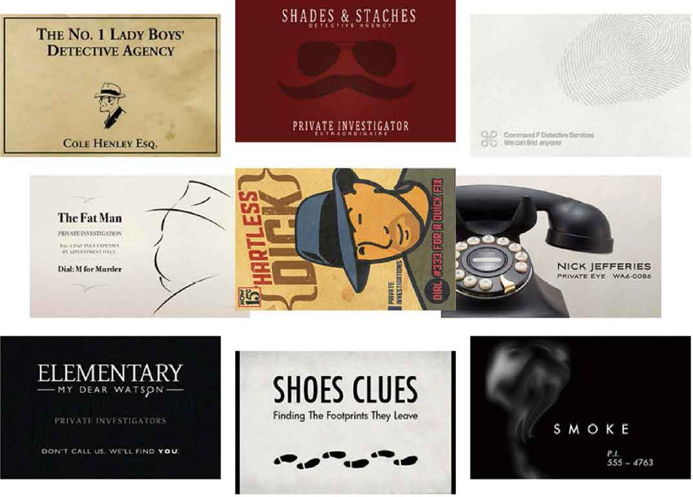
<center class="my_markdown"><b class="my_markdown">多亏了 `transform` 和伪元素选择器，现在这堆卡片变得一团糟。</b></center>

在小屏幕上，那些名片很适合垂直的布局，然而在中大型屏幕上，垂直布局并不能很好地利用可用的空间。所以我们接下来使用伪元素通过定位和一些 `transform` ，将卡片排成一个网格的形状。

再回到设计本身，我们需要给每张卡片设置定位，但又不需要在小屏幕上生效，所以我们使用媒体查询来让这些样式只应用于中大型屏幕。

```html
@media (min-width: 48rem) { 
.h-card { 
position : absolute; } 
}
```

通过定位，给每张卡片的顶部 `top` 和左侧 `left` 设置一些值，用来形成一个松散的网格。

```html
@media (min-width: 48rem) { 
.h-card:nth-of-type(1) { 
top : 100px; 
left : 0; } 
.h-card:nth-of-type(2) { 
top : 80px; 
left : 320px; } 
.h-card:nth-of-type(3) { 
top : 100px; 
left : 640px; } 
.h-card:nth-of-type(4) { 
top : 320px; 
left : 40px; } 
.h-card:nth-of-type(5) { 
top : 270px; 
left : 570px; } 
.h-card:nth-of-type(6) { 
top : 320px; 
left : 600px; } 
.h-card:nth-of-type(7) { 
top : 540px; 
left : 0; } 
.h-card:nth-of-type(8) { 
top : 560px; 
left : 320px; } 
.h-card:nth-of-type(9) { 
top : 540px; 
left : 640px; } 
}
```

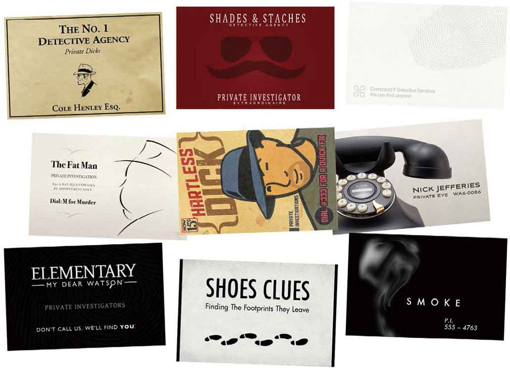
<center class="my_markdown"><b class="my_markdown">通过应用 `rotate` 和 `translate` ，设计看起来更自然。</b></center>

你应该已经发现我故意出的错。第五张卡片与水平放置的卡片不同，它是垂直的。把卡片顺时针旋转 `90deg` ，这个问题就解决了。旋转的原点 `transform-origin` 位于卡片的左上角。

```html
@media (min-width: 48rem) { 
.h-card:nth-of-type(5) { 
transform : rotate(90deg); 
transform-origin : 0 0; } 
}
```

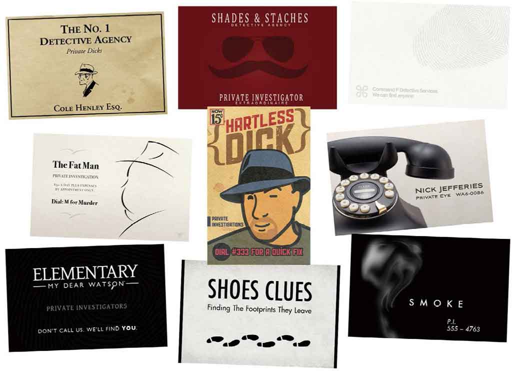
<center class="my_markdown"><b class="my_markdown">当我们把它顺时针旋转 `90deg` 并与其他卡片重叠后，这个孤零零的卡片看起来就好多了。</b></center>

最后我们再做一点润色，给这些卡片添加一些RGBa阴影。

```html
.h-card { 
box-shadow : 
0 2px 1px rgba(0,0,0,.8), 
0 2px 10px rgba(0,0,0,.5); }
```

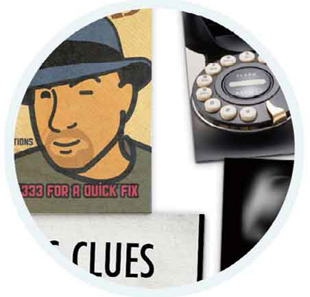
<center class="my_markdown"><b class="my_markdown">放大设计，左侧柔和的RGBa阴影增添了景深。</b></center>

## 设计方案

让我们重新回到Get Hardboiled网站中的办公室外，门上的便签依然还在，但是有人在上面增加了一行。还记得我们之前的HTML吗？一个 `article` 元素？我们将用相同的方式，使用 `aside` 元素在里面新增一条。

```html
<article> 
   <h1>Back soon!</h1> 
      <ul> 
         <li><del>Gone for smokes</del></li> 
         <li><del>Getting booze</del></li> 
         <li>On a job (yeah, really)</li> 
      </ul> 
</article> 
<aside> 
   <p>Something on your mind or just want to say hello,
tweet @gethardboiled</p> 
</aside>
```

我们把第一张便签（ `article` ）重新贴到门上，现在用 `transform` 来扭曲它。

```html
article { 
transform : skew(-5deg, -2deg); }
```

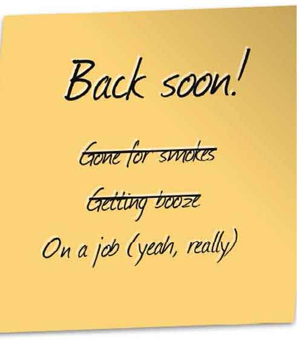
<center class="my_markdown"><b class="my_markdown">试着修改扭曲值，角度的微小变化会带来一些有趣的效果。</b></center>

现在我们把使用 `aside` 便签放到第一张的上方并扭曲它，以使其显得更加突出。

```html
aside { 
position : absolute; 
top : 100px; 
left : 70%; 
z-index : 10; 
transform : skew(5deg, -5deg); }
```

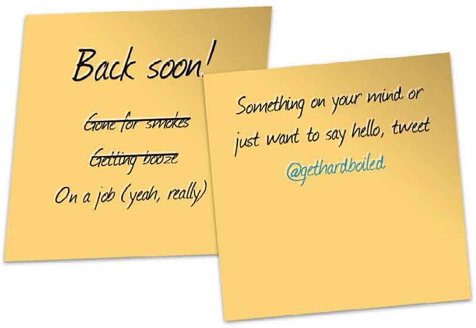
<center class="my_markdown"><b class="my_markdown">通过几行简单的CSS，将这两个语义元素转换到设计中，就特别符合Get Hardboiled网站主题了。</b></center>

## 3D转换

2009年，苹果公司宣布，MacOSX10.6SnowLeopard操作系统的Safari浏览器开始支持3D转换，元素的3D定位属性会显著增强设计的景深效果。

苹果公司的建议已经被W3C接受，而且在写作本书时，3D转换已经被所有现代浏览器支持。

## 3D透视

透视是实现元素3D效果的关键。需要使用 `transform` 属性将它们放进一个三维空间内。为了产生 `perspective` ，我们需要把它应用于父元素，而不是元素本身。我们不需要特殊的3D HTML元素，只需要一个div元素和一个使用了 `hb-3d` class值的父元素就够了。

```html
<div class="hb-3d"> 
<div class="item"> […] </div> 
<div class="item"> […] </div> 
<div class="item"> […] </div> 
<div class="item"> […] </div> 
</div>
```

在每个元素里面，我们添加两个 `div` 元素用来放置小说的封面图片和内容简介。

```html
<div class="item__img"> 
    
</div> 
<div class="item__description"> 
   <h3 class="item__header">Finger Man</h3> 
   <p>This Finger Man story originally featured an unnamed 
narrator.</p> 
</div>
```

我们现在开始添加样式，使用小屏手机的用户将看到一个简单的二维布局，元素只是简单地水平排列。我们将给父元素 `hb-3d` 添加 `display:flex;` ，然后给每个元素添加 `flex:1;` ，并加上外边距、内边距和一个蓝色的宽边框。

```html
.item { 
flex : 1; 
margin-right : 10px; 
margin-bottom : 1.35rem; 
padding : 10px; 
border : 10px solid #ebf4f6; }
```

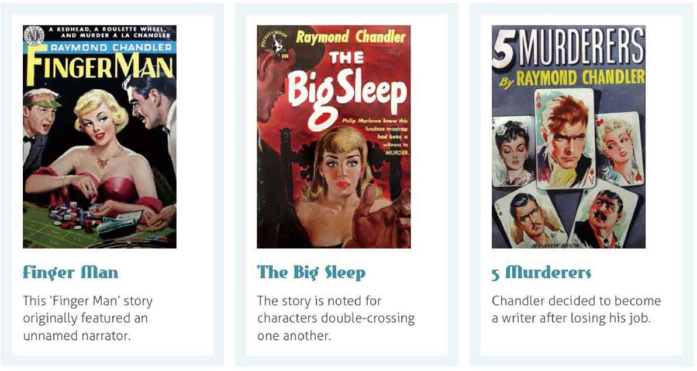
<center class="my_markdown"><b class="my_markdown">这个界面看起来很整洁，但是并没有什么亮点。</b></center>

3D布局需要浏览器窗口有足够大的宽度。现在开始定义这些样式。我们在媒体查询内部，为每个元素添加一个 `45deg` 的 `rotate` 转换。我们不需要外边距、填充和边框，所以把它们删掉。

```html
@media (min-width: 48rem) { 
.item { 
transform : rotateY(45deg); 
margin : 0; 
padding : 0; 
border-width : 0; } 
}
```

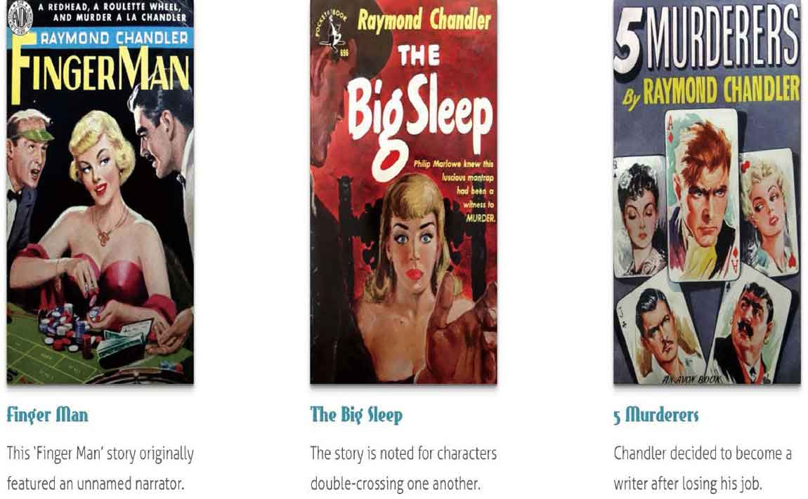
<center class="my_markdown"><b class="my_markdown">当在二维空间旋转这些部分时，它们像是被压扁了。</b></center>

```html
@media (min-width: 48rem) { 
.hb-3d { 
perspective : 500; } 
}
```

提高或者降低 `perspective` ，会对每个元素产生如下图所示的影响。

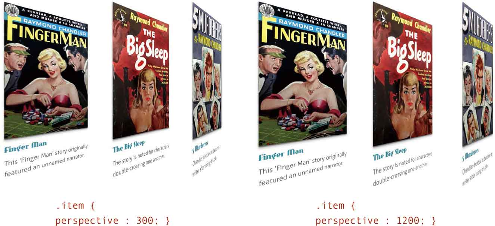
## 改变视角

当我们观察3D转换的元素时，默认视角是在元素的水平和垂直的正中心。我们可以用像素px、em或者百分比中的任意单位值来改变 `perspective-origin` 的位置。如果使用百分比来定义，当设置为 `0 50%` 时，视角将在左边偏下的位置；而设置为 `50% 0` 的话，视角将在水平中心，并且非常靠上。

```html
@media (min-width: 48rem) {
.hb-3d {
perspective-origin : 50% 50%; }
}
```

看一下不同的原点位置是如何改变我们在这些元素上的视角的。

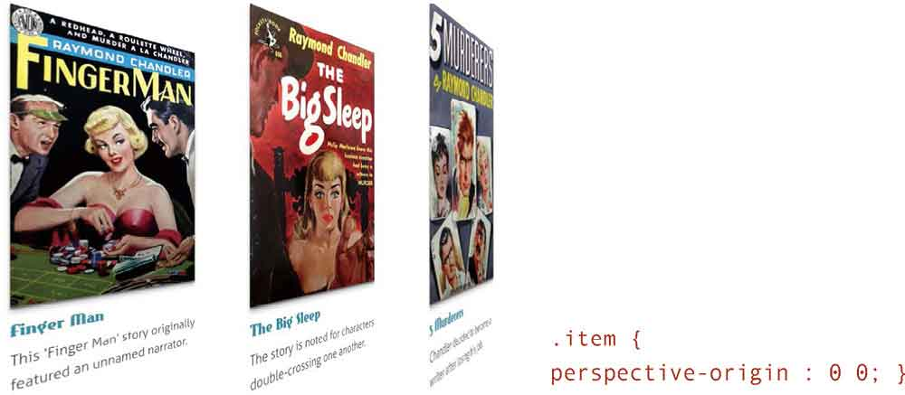
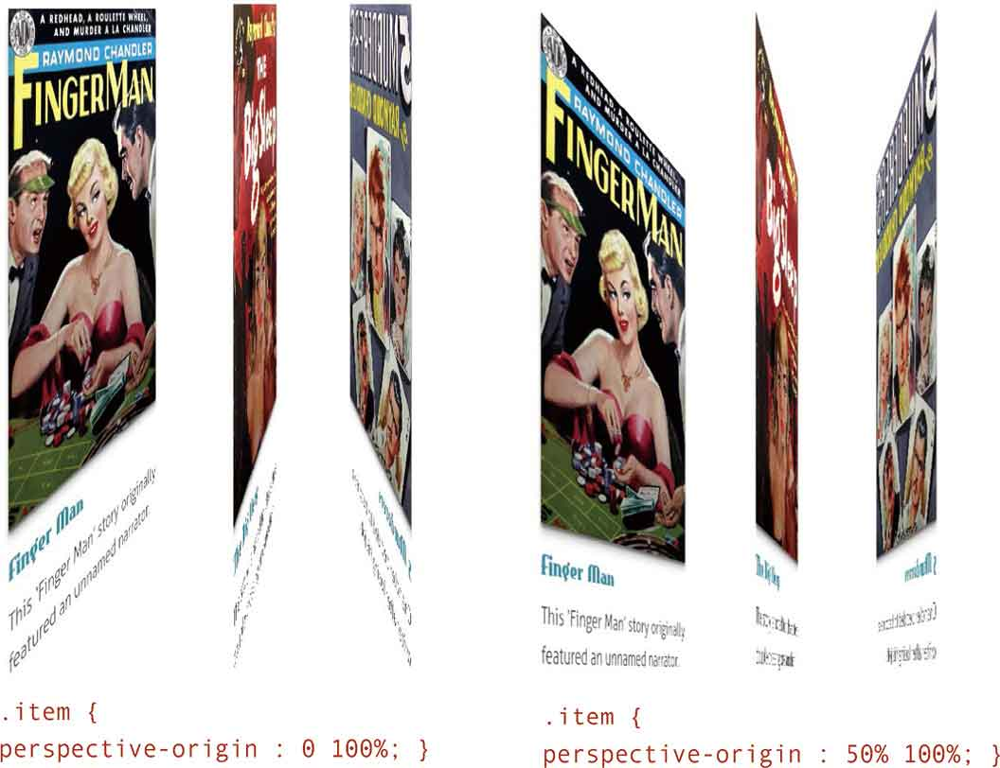
## 专业3D设计

首先，CSS2赋予了我们元素定位和层叠的能力，所以我们可以使用 `z-index` 来放置它们。而CSS3引入了 `translate` ，它用来沿着x轴或y轴移动元素。现在3D变换又带来了 `translateZ` ，可以用来移动元素，以控制元素和观察者之间的距离。

为了演示 `translateZ` ，我们继续构建Get Hardboiled网站的3D界面。首先，我们将给这些封面图片添加样式，定义一个宽的边框。

```html
@media (min-width: 48rem) { 
.item__img img { 
border-color : #9bc7d0; } 
.item__img img:hover { 
border-color : #eceeef; }
```

下一步，给内容简介添加宽度 `width` 和内边距 `padding` ，并通过相对定位使它们移动 `150px` 。同样，也给它们设定背景色和边框。

```html
@media (min-width: 48rem) { 
.item__description { 
position : relative; 
top : -150px; 
padding : 11px; 
width : 160px; 
background-color : #dfe1e2; 
border : 10px solid #ebf4f6; } 
}
```

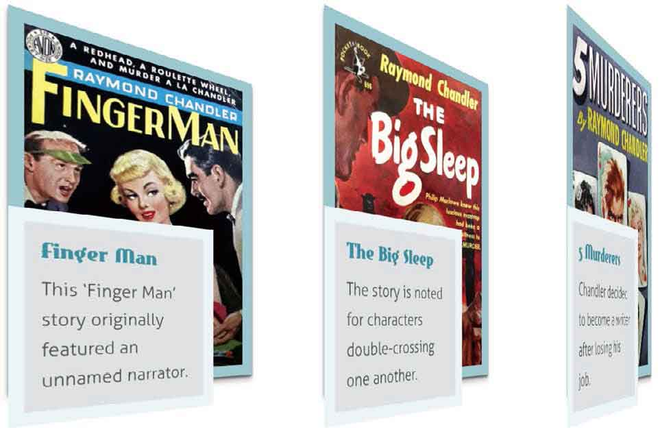
随着基础知识的进一步了解，我们将通过最后一个组件，使界面彻底实现3D效果。

## 3D透视

一般情况下，当在一个元素上应用透视时，它的子元素还是保持二维的平面状态。 `transform-style` 属性给了我们一系列的选项值，这些值要么使这些元素保持在那个平面上，要么脱离那个平面。

在这个设计中，我们将为每一个元素应用 `preserve-3d` 属性，并使用t `ranslateZ` 将内容简介设置为3D模式。同时通过定义，让内容简介向用户靠近 `80px` 。

```html
.item { 
transform-style : preserve-3d; } 
.item__description { 
transform : translateZ(80px); }
```

## 使用box-shadow加强景深

为了加强这些设计元素的景深效果，为内容简介和封片图片加上RGBa的阴影。

```html
.item__img img { 
box-shadow: 0 5px 5px 0 rgba(0, 0, 0, 0.25), 
0 2px 2px 0 rgba(0, 0, 0, 0.5); } 
.item__description { 
box-shadow: 0 5px 5px 0 rgba(0, 0, 0, 0.25), 
0 2px 2px 0 rgba(0, 0, 0, 0.5); }
```

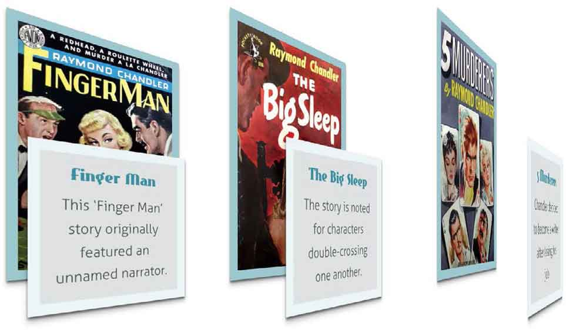
<center class="my_markdown"><b class="my_markdown">我们可以在支持3D转换的浏览器中，使用 `box-shadow` 为元素添加景深。</b></center>

## 添加交互

这个界面即将设计完成，但是你可能已经发现，由于 `perspective` 的增加，这些内容简介变得难以阅读了。为了解决这个问题，当鼠标悬停在元素上时，让它正向面对用户就好了。做到这一点，只需要在鼠标悬停时把y轴的旋转值设置为 `0` 就可以了。

```html
.item:hover { 
transform : rotateY(0); }
```

为了获得更极致的效果，我们还将内容简介元素的 `translateZ` 属性值从80像素减小为 `5px` ，同时将它向右移动 `20px` 。

```html
.item:hover .item__description { 
transform : translateZ(5px) translateX(20px); }
```

当这些内容简介移动到新位置时，它们阴影的投射位置就是错误的了。可以通过改变这些阴影的模糊半径和透明度来使它们更自然。

```html
.item:hover.item__img img { 
box-shadow : 0 5px 15px rgba(0,0,0,.25); } 
.item:hover .item__description { 
box-shadow : 0 10px 15px rgba(0,0,0,.5); }
```

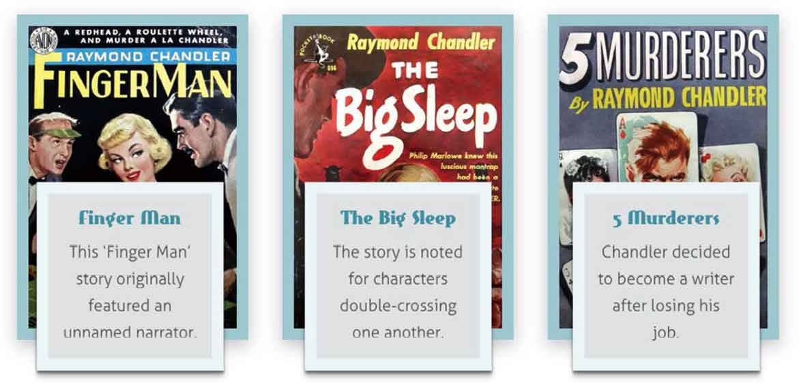
<center class="my_markdown"><b class="my_markdown">现在用鼠标划过这个界面来体验3D旋转吧。</b></center>

## 收尾

最后用动画把所有的改变操作串联起来。

```html
.item { 
transition-property : transform; 
transition-duration : .5s; 
transition-timing-function : ease-in-out; } 
.item__description { 
transition-property : transform, box-shadow; 
transition-duration : .25s; 
transition-timing-function : ease-in-out; }
```

等等，这是什么？！这是我们留的一个悬念。


