# 第19章　CSS过渡

> 过渡属性可以在任意几秒（ `s` ）或毫秒（ `ms` ）内改变一个或多个样式。到目前为止，这些时间单位只被用于听觉样式表中。如果需要在四分之一秒（ `.25s` ）内完成平滑的过渡，我们为过渡添加0.25秒（ `.25s` ）的持续时间。
> 如果把持续时间设置为 `0` ，或者忽略了这个属性，那么状态将会立刻发生改变，不会有任何过渡。

### 过渡持续时间

在网页和APP中，状态的变化会对用户使用界面的感受产生很大的影响。如果变化太快，交互会显得很不自然；如果变化太慢，哪怕只有几毫秒，界面就会显得有些呆板和生硬。

当我们将一个链接改成按钮形式时，我们往往会通过改变它的背景色来改变鼠标悬停状态时的外观。

```html
.btn { transition-duration : .25s; }
```

```html
.btn { 
background-color : #bc676c; } 
.btn:hover { 
background-color : #a7494f; }
```

默认情况下，这些样式变化是即时的，但通过使用CSS过渡，我们可以让变化在特定的时间长度内发生，并可以控制变化的速度和延迟。

```html
.btn { 
transition-property : background-color; }
```

我们可以通过动态伪类选择器来触发CSS过渡，例如 `:hover` 、 `:focus` 、  `:active`  和  `:target` 。首先，要确认哪个或哪些属性需要过渡。在我们这个按钮上，只需要过渡它的背景色，因此我们这样来使用 `transition-property` 。

```html
.btn { 
transition-property : background-color; 
transition-duration : .25s; }
```

注意我们是如何把过渡声明添加到要过渡的元素上，而不是元素的其他状态例如 `:hover` 状态上。

```html
.btn { 
transition-property : #a7494f; }
```

通过此处的声明，按钮的背景色将会在四分之一秒（ `.25s` ）的时间内平滑地在红色的两种色调之间过渡。

我们可以把过渡应用到任何块级或文本元素，以及 `:before` 和 `:after` 等伪元素上。

### 组合过渡

当我们有两个或多个属性需要过渡——例如，背景色和文本颜色——那么可以将每个属性用逗号分隔。

```html
.btn { 
background-color : #bc676c; 
color : #fff; 
transition-property : background-color, color; }
```

或者，我们可以利用 `all` 关键字把多个属性组合到一个声明中。

```html
.btn { 
transition-property : all; }
```

### 延迟过渡

在现实世界中，我们与之交互的许多对象并不是在按下按钮或触发时立即开始变化。默认情况下，CSS过渡从它们启动的那一刻开始，我们称之为零点。我们可以通过在零点和过渡开始之间增加延迟来实现物理真实感。指定若干毫秒（ms）或若干秒（s）的延迟时间。

```html
.btn { 
transition-property : background-color; 
transition-duration : .25s; 
transition-delay : .1s; }
```

从零点到背景颜色变化开始之间，我们只添加0.1秒（ `.1s` ）的延迟，当属性返回到原始状态时也会应用同样的延迟。

### 加速过渡

加速取决于我们选择的 `transition-timing-function` 属性值。例如，线性过渡 `linear` 将会在整个过渡过程中保持恒定速度，而 `ease` 过渡将会在样式变化过程中逐渐减慢。另外还有三个关键字可以进一步变化过渡的速度，如下所示。

| `ease-in` | 开始缓慢，并逐渐加速 |
| :-----  | :-----  | :-----  | :-----  |
| `ease-out` | 开始较快，并逐渐减速 |
| `ease-in-out` | 慢速开始，然后变快，慢速结束 |

我们在按钮上指定一个线性 `linear` 过渡。

```html
.btn { 
transition-property : background-color; 
transition-duration : .25s; 
transition-delay : .1s; 
transition-timing-function : linear; }
```

W3C的CSS3过渡模块还包括沿一个自定义的贝塞尔曲线绘制 `transition-timing-function` 的能力。用数学方法来定时是很有趣的，但超出了本书的介绍范围。

### 应用多个过渡

当需要过渡两个或多个属性的时候，我们可以将它们组合成一个由逗号分隔的列表，然后分别为每一个指定持续时间、延时和时间函数的值。首先，我们把多个过渡用常规的方式写出来。

```html
.btn { 
transition-property : background-color, color; 
transition-duration : .25s, .25s; 
transition-delay : .1s, .1s; 
transition-timing-function : linear, linear; }
```

多个过渡的持续时间、延迟或时间函数值是相同的，那么我们只需要把这些值写一次。

```html
.btn { 
transition-property : background-color, color; 
transition-duration : .25s; 
transition-delay : .1s; 
transition-timing-function : linear; }
```

我们也可以把这些值组合成一个由逗号分隔的字符串。

```html
.btn { 
transition : background-color .25s .1s linear, color .25s .1s  
linear; }
```

当我们需要几个过渡按次序来执行时，可以为每个过渡指定不同的延迟时间。

## 过渡的例子

切记，当你的过渡属性中包含延迟时间 `delay` 时，它一定要出现在持续时间 `duration` 之后。

在前面，我们在网页中建立了一个3D界面，并为你留了一个悬念。如果必要的话，回顾一下，因为现在我们要为这些列表项添加过渡和三维空间内的 `45deg` 旋转。为了确保用户可以阅读我们的文本，当鼠标悬停时，我们把这些列表项转回原位来面对用户。

```html
.item { 
transform : rotateY(45deg); 
transform-style : preserve-3d; } 
.item:hover { 
transform : rotateY(0); }
```

这种设置方式，过渡会立即执行。为了让界面的呈现更流畅，添加过渡属性，首先将过渡属性定义为 `transform` 。

```html
.item { 
transition-property : transform; }
```

接下来，指定该过渡需要0.75秒（ `.75s` ），时间函数为 `ease-in-out` 。

```html
.item { 
transition-duration : .75s; 
transition-timing-function : ease-in-out; }
```

当我们想减少一些样式表字节大小时，可以将这些属性组合成一条声明。

```html
.item { 
transition : transform .75s ease-in-out; }
```

为了使3D界面更加具有真实性，通过 `translateZ` 属性使它靠近用户 `80px` 。然后向左后方移动，调整鼠标悬停时投影的强度。

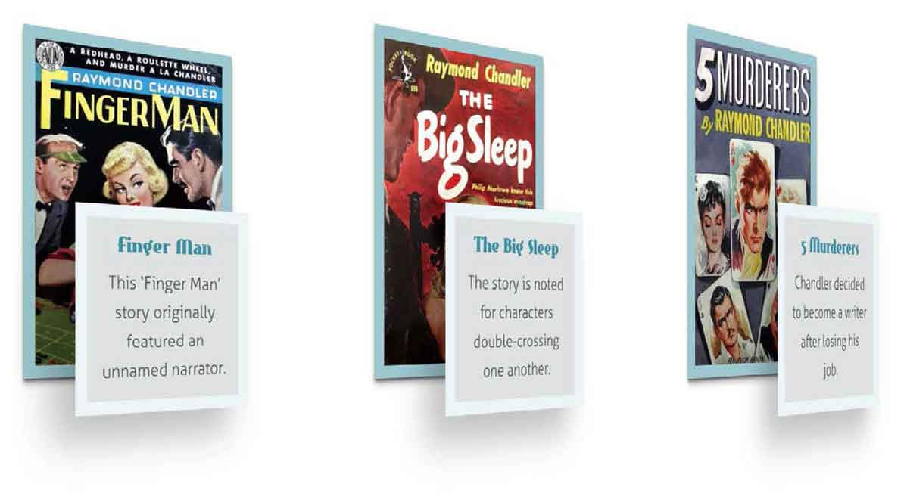
```html
.item div {transform : translateZ(80px); 
box-shadow : -20px 20px 30px rgba(0,0,0,.25); } 
.item:hover .item__description { 
transform : translateZ(5px) translateX(20px); 
box-shadow : 0 10px 15px rgba(0,0,0,.5); }
```

我们将所有的状态变化延迟0.2秒（ `.2s` ）启动，持续0.5秒（ `.5s` ）。

```html
.item__description { 
transition-property : transform, box-shadow; 
transition-duration : .5s, .5s; 
transition-delay : .2s, .2s; 
transition-timing-function : ease-in-out, ease-in-out; }
```

这两个属性的过渡使用了同样的持续时间、延时和时间函数。因此我们可以把两个值组合成一个来简化这条声明。

```html
.item__description { 
transition-property : transform, box-shadow; 
transition-duration : .5s; 
transition-timing-function : ease-in-out; }
```

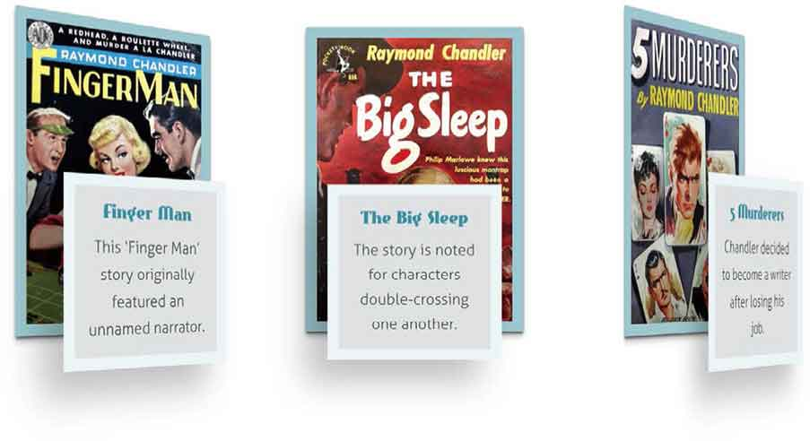
<center class="my_markdown"><b class="my_markdown">我们的设计现在看起来更加的流畅，用户交互也更真实。</b></center>

## 降级处理

如果你或者你的客户还不适应3D界面，我们可以通过过渡来创建一个完全不同的Get Hardboiled网站页面，而不需要对HTML做出任何改变。

```html
<div class="hb-opacity"> 
<div class="item"> 
<div class="item__img"> […] </div> 
<div class="item__description"> […] </div> 
</div>
```

这个设计将为使用小屏幕的用户服务。对他们来说，我们只是实现一个简单的布局，其中列表项垂直排放，图书封面的图像放置在右侧。下面是小屏幕设计的最终预览。

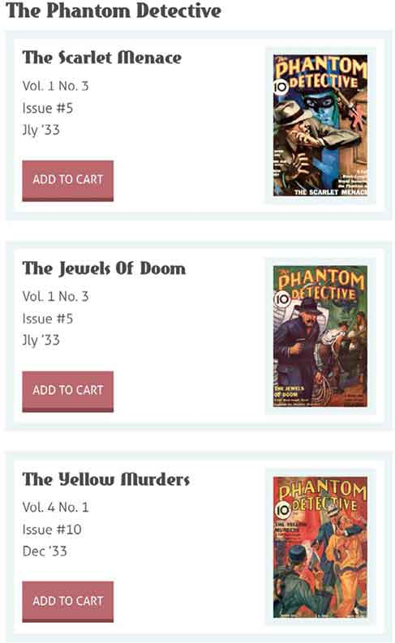
<center class="my_markdown"><b class="my_markdown">正在设计的界面在小屏幕下的浏览效果。</b></center>

我们将使用flexbox来开发。开始构建基础，先为所有的列表项应用 `display:flex` 属性。同样我们还要加一些外边距 `margin` 、内边距 `padding` 以及一条粗粗的边框。

```html
.item { 
display : flex; 
margin-bottom : 1.35rem; 
padding : 10px; 
border : 10px solid #ebf4f6; }
```

小屏幕下的设计与其他情况下不同，我们需要把图书封面图像放置在右侧，而不是按照默认顺序出现在左侧。不过，这对弹性盒模型来说非常简单，我们只需要指定 `flex-direction` 为 `row-reverse` 即可。

```html
.item { 
flex-direction : row-reverse; }
```

现在，我们把注意力集中到这些列表项的内部元素上。给它们设定一个宽度和粗边框，以匹配它们的父元素。

```html
.item__img { 
margin-left : 20px; 
width : 133px; } 
.item__img img { 
border : 10px solid #ebf4f6; 
box-sizing: border-box; }
```

为了使图书简介充分利用宽度和外边距留下来的空间，将 `flex-grow` 属性值设置为 `1` 。

```html
.item__description { 
flex-grow : 1; }
```

现在，我们已经为小屏幕下的列表项添加了样式，下面将要对中、大尺寸的屏幕添加样式。我们添加的任何样式都将被嵌套在媒体查询中，只有在设备需要的时候才应用它们。

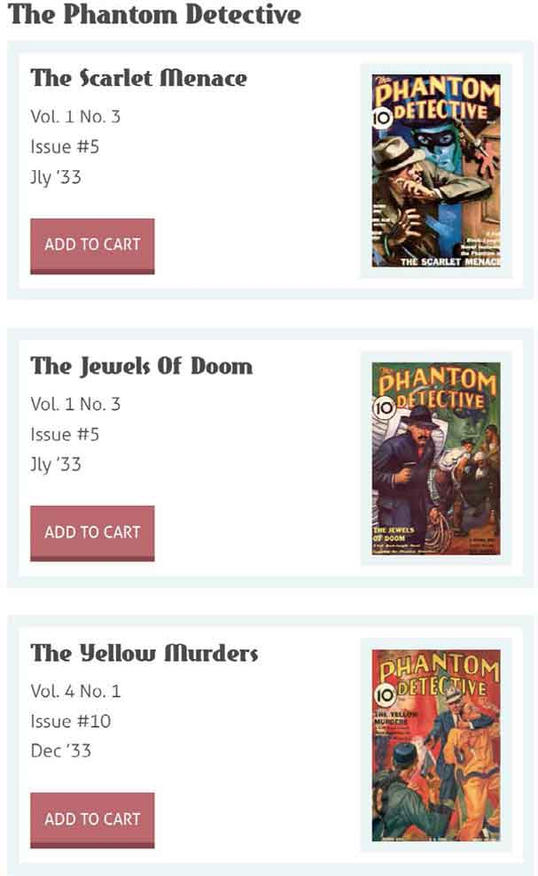
<center class="my_markdown"><b class="my_markdown">列表项的简单堆叠对使用小屏幕手机用户来说非常完美。</b></center>

首先，我们要将外层的容器设置为 `display:flex` ，以便它所有的子元素都将沿着水平轴排列。

```html
@media (min-width: 48rem) { 
.hb-opacity { 
display : flex; } 
}
```

现在，移除我们之前设置的 `display:flex` ，将它替换为 `display:block` 。我们还将覆盖之前的外边距、内边距和边框设置。对每个列表项添加 `position:relative` ，使之成为定位的上下文。

```html
@media (min-width: 48rem) { 
.item { 
display : block; 
margin : 0 20px 0 0; 
padding : 0; 
border-width : 0; 
position : relative; } 
}
```

忘记一切你曾听到的有关绝对定位不够灵活或不适合动态内容的说法。通过精心规划，即使面对最苛刻的情况，绝对定位也可以给我们精确的控制。现在，将图书信息变得比容器更宽，通过使用负的绝对定位值将其移动到左侧。

```html
@media (min-width: 48rem) { 
.item__description { 
position : absolute; 
width : 200px; 
left : -40px; } 
}
```

添加内边距、边框和半透明的背景色，以便于图书信息后面的元素可以透过背景显示出来，这样就完成了样式的添加。

```html
@media (min-width: 48rem) { 
.item__description { 
padding: 20px; 
background-color: rgba(223, 225, 226, 0.95); 
border: 10px solid #ebf4f6; 
box-sizing: border-box; } 
}
```

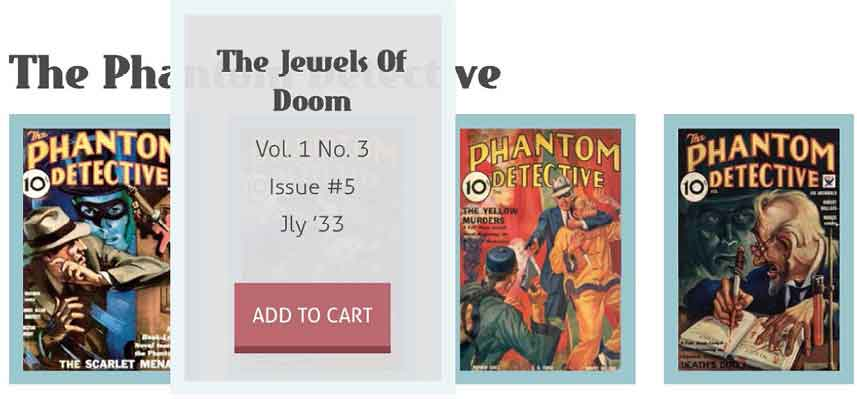
<center class="my_markdown"><b class="my_markdown">图书信息悬浮在图书封面的上方。</b></center>

为了创建弹出的效果，重新定位上述图像顶部的描述。为了确保弹出的活动项总是出现在最靠前的位置，可以给它们一个更高的 `z-index` 值。

```html
@media (min-width: 48rem) { 
.item:hover .item__description { 
top : -80px; 
z-index : 3; } 
}
```

接下来，增加两个RGBa的投影，用逗号将每个值分隔开。

```html
@media (min-width: 48rem) { 
.item:hover .item__description { 
box-shadow : 0 5px 5px 0 rgba(0,0,0,0.25), 
0 2px 2px 0 rgba(0,0,0,0.5); } 
}
```

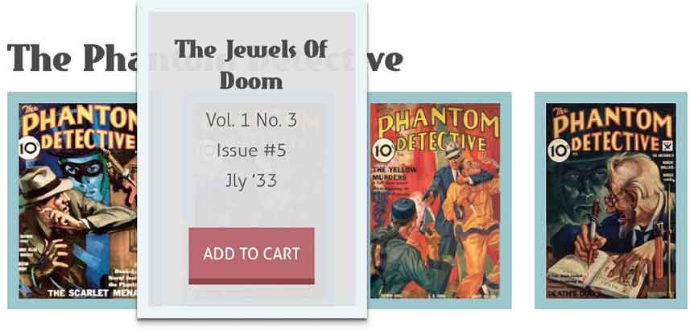
<center class="my_markdown"><b class="my_markdown">通过投影增加深度。</b></center>

通过设置完全透明，来简单地隐藏需要弹出的图书信息。当鼠标悬停时，我们可以再次显示它们。

```html
@media (min-width: 48rem) { 
.item .item__description { 
opacity : 0; } 
.item:hover .item__description { 
opacity : 1; } 
}
```

默认情况下，位置和透明度的变化会立即发生，但我们可以使用过渡属性让它们显得更流畅。首先，定义距离顶部的距离 `top` 和不透明度 `opacity` 为要过渡的属性，并设置半秒（ `.5s` ）的持续时间和时间函数来减慢过渡的过程。

```html
@media (min-width: 48rem) { 
.item .item__description { 
transition-property : top, opacity; 
transition-duration : .5s; 
transition-timing-function : ease-out; } 
}
```

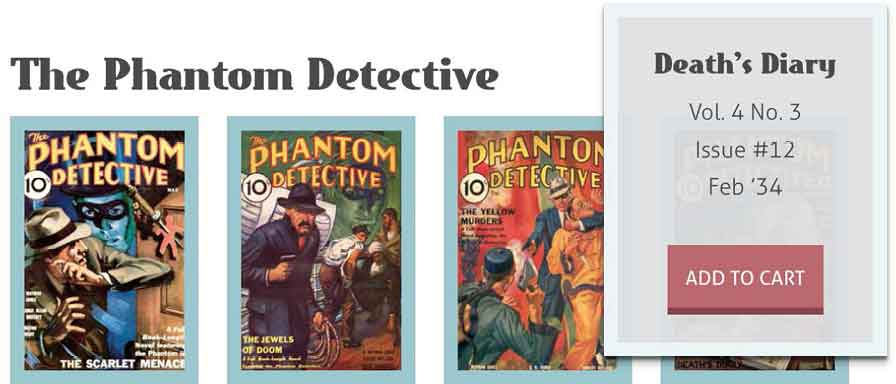
<center class="my_markdown"><b class="my_markdown">现在当用户的鼠标悬停在项目列表时，对应的图书信息弹层会淡入和淡出。</b></center>

现在这些弹层在所有的现代浏览器中都能正确的渲染。但是对于那些能力比较差的、不支持过渡和透明度的浏览器呢？它们会怎样处理这个界面？

不支持过渡的浏览器将会安全地忽略掉它们，我们应该记住Dan Cederholm提醒我们的，网页在所有的浏览器中的表现不需要完全一致。

## 进阶效果

接下来的界面具有完全不同的外观和用户体验。点击一本书，将会显示一个包含内容简介的面板。我们用CSS定位、透明度和过渡来创建这个面板。我们可以重用上个例子中的HTML，但是这一次我们需要为每一个列表项创建一个 `id` ，以便我们可以直接定位它们的片段。

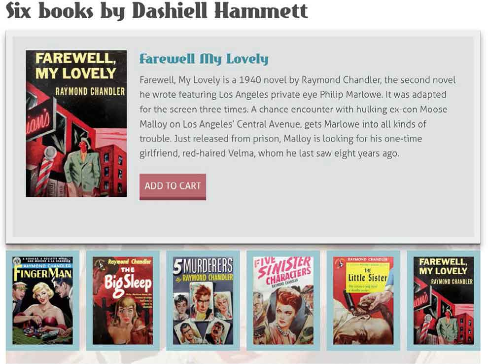
<center class="my_markdown"><b class="my_markdown">这是我们创建的Get Hardboiled网站界面的早期效果。</b></center>

```html
<div class="hb-transitions"> 
   <div id="hb-transitions-01" class="item"> 
      <div class="item__img"> […] </div> 
      <div class="item__description"> […] </div> 
   </div> 
</div>
```

我们还需要一个指向它父元素的锚点。

```html
<div id="hb-transitions-01" class="item"> 
<a href="#hb-transitions-01"></a> 
</div>
```

正如我们一开始为使用小屏幕的用户做设计时，把列表项设计成简单的垂直列表。这一次我们也同样使用弹性盒模型来布局。由于我们需要把图书封面展示在右侧而不是按照默认的顺序排列，我们同样将 `flex-direction` 设置为 `row-reverse` 。

```html
.item { 
display : flex; 
flex-direction : row-reverse; 
margin-bottom: 1.35rem; 
padding: 10px; 
border: 10px solid #ebf4f6; }
```

在每个列表项内部，我们为每个图片设置一定的左外边距来把它和内容简介分隔开，并为它设置一个宽度。

```html
.item__img { 
margin-left : 20px; 
width : 133px; }
```

为了使内容简介充分利用图书封面左侧空余的空间，使用 `flex-grow` 属性，并将值设为 `1` 。

```html
item__description { 
flex-grow : 1; }
```

现在我们的设计已经满足了小屏幕手机用户，现在我们把关注点放在使用大屏幕手机上。我们所添加的任何样式都将嵌入在媒体查询中，只有在设备需要的时候才应用它们。

首先我们为 `hb_transitions` 区域增加尺寸，然后将它设置为没有任何偏移量的相对定位，以便它成为任何有定位的子元素的定位上下文。

```html
@media (min-width: 48rem) { 
.hb-transitions { 
position : relative; 
height : 500px; 
width : 710px; } 
}
```

<center class="my_markdown"><b class="my_markdown"></b></center>

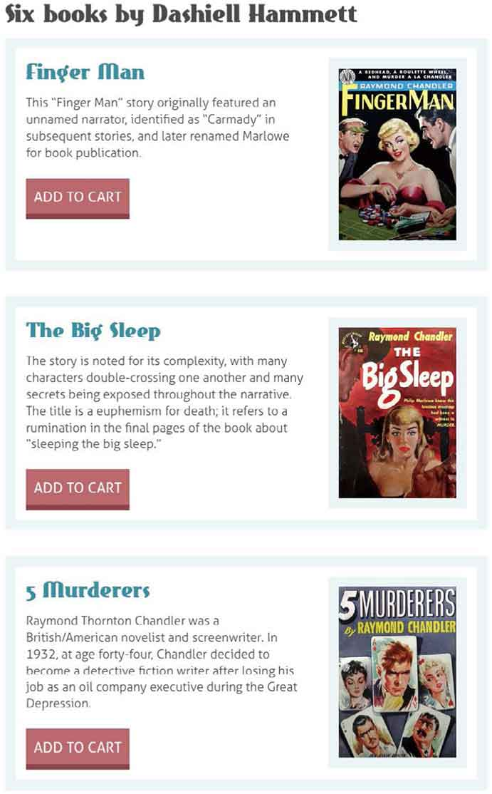
<center class="my_markdown"><b class="my_markdown">列表在小屏幕下的展示很完美。</b></center>

接下来，为内联图片设置尺寸和位置，使它们整齐地排列在面板的底部。稍后，我们将使用同样的图片作为背景，因此它们的实际尺寸需要比看起来要大一些。

```html
@media (min-width: 48rem) { 
.item__img { 
position : absolute; 
top : 330px; 
width : 110px; 
height : 160px; } 
#hb-transitions-01 .item__img { left : 0; } 
#hb-transitions-02 .item__img { left : 120px; } 
#hb-transitions-03 .item__img { left : 240px; } 
#hb-transitions-04 .item__img { left : 360px; } 
#hb-transitions-05 .item__img { left : 480px; } 
#hb-transitions-06 .item__img { left : 600px; }
```


<center class="my_markdown"><b class="my_markdown">即便在最苛刻的情况下，绝对定位也能给我们提供更好的控制。</b></center>

我们希望仅仅在用户点击图书封面时才出现内容简介，所以我们让内容简介足够小，以便于定位在图书封面的后面。将 `overflow` 设置为 `hidden` ，将确保过长的内容不会溢出而毁掉设计。

```html
@media (min-width: 48rem) { 
.item__description { 
z-index : 1; 
position : absolute; 
top : 335px; 
left : 5px; 
width : 100px; 
height : 150px; 
overflow : hidden; } 
#hb-transitions-01 .item__description { left : 0; } 
#hb-transitions-02 .item__description { left : 120px; } 
#hb-transitions-03 .item__description { left : 240px; } 
#hb-transitions-04 .item__description { left : 360px; } 
#hb-transitions-05 .item__description { left : 480px; } 
#hb-transitions-06 .item__description { left : 600px; } 
}
```

现在，给这些内容简介设置一个较低的 `z-index` 值，从而把它们放置在图片的后面。了确保在我们需要的时候才能看到它们，将 `opacity` 设置为 `0` ，这样它们就变成了完全透明的。

```html
@media (min-width: 48rem) { 
.item__img { 
z-index : 2; } 
.item__description { 
z-index : 1; 
opacity : 0; } 
}
```

此前，我们故意将锚点指向它的父列表元素。正是这个锚点和 `:target` 伪类选择器确保了可以触发内容简介的变换。重置内容简介的透明度和位置，然后调整它们的大小，使它填满列表面板的顶部。添加左侧较大的内边距，很快左边就会被背景图片填充。

```html
@media (min-width: 48rem) { 
.item:target .item__description { 
opacity : 1; 
top : 0; 
left : 0; 
width : 100%; 
height : 320px; 
padding : 20px 20px 0 190px; } 
}
```

现在，为每一段内容简介设置相同的背景和边框属性。

```html
@media (min-width: 48rem) { 
.item:target .item__description { 
background-color: #dfe1e2; 
background-origin: padding-box; 
background-position: 20px 20px; 
background-repeat: no-repeat; 
background-size: auto 220px; 
border: 10px solid #eceeef; 
box-sizing: border-box; } 
}
```

接下来，为每一段内容简介添加唯一的图书封面背景图。

```html
@media (min-width: 48rem) { 
#hb-transitions-01:target .item__description { 
background-image : url(transitions-01.jpg); } 
#hb-transitions-02:target .item__description { 
background-image : url(transitions-02.jpg); } 
#hb-transitions-03:target .item__description { 
background-image : url(transitions-03.jpg); } 
#hb-transitions-04:target .item__description { 
background-image : url(transitions-04.jpg); } 
#hb-transitions-05:target .item__description { 
background-image : url(transitions-05.jpg); } 
#hb-transitions-06:target .item__description { 
background-image : url(transitions-06.jpg); } 
}
```

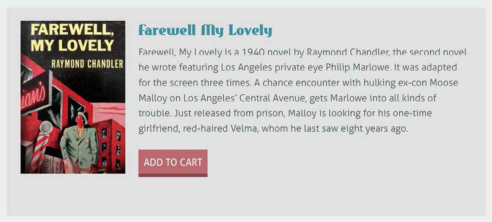
<center class="my_markdown"><b class="my_markdown">面板部分已经大致完成，当用户点击一本书的封面，包含内容简介的面板就会浮现在上面。</b></center>

现在，我们将利用过渡使交互显得更顺畅，使界面更生动。对于每段内容简介，我们将过渡四个属性—— `top` 、 `width` 、 `height` 和 `opacity` ，用逗号将它们分隔。

```html
@media (min-width: 48rem) { 
.item__description { 
transition-property : top, width, height, opacity; } 
}
```

最后，为每个属性添加一个持续时间。

```html
@media (min-width: 48rem) { 
.item__description { 
transition-duration : .5s, .5s, .75s, .5s; } 
}
```

<center class="my_markdown"><b class="my_markdown"></b></center>

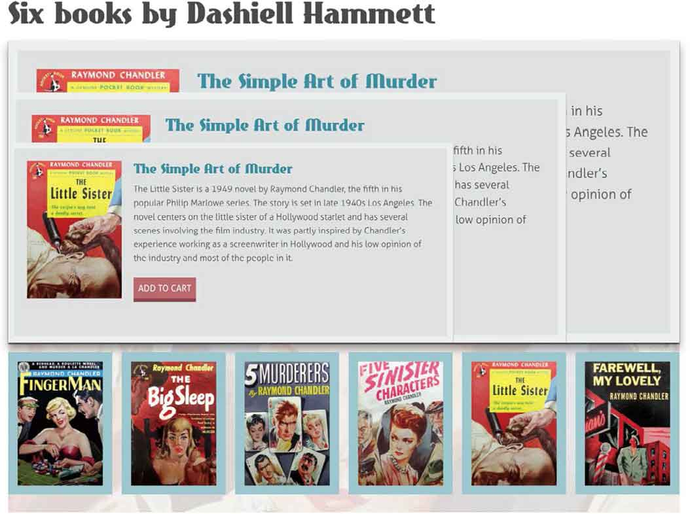
<center class="my_markdown"><b class="my_markdown">`top` 、 `width` 和 `height` 的变化将持续0.5秒（ `.5s` ）， `opacity` 的变化将持续0.75秒（ `.75s` ）。</b></center>

## 横竖屏设计

当HTML写得足够健壮，我们的设计将更容易适应不同的浏览环境，包括那些可以横竖屏切换的设备。虽然我们刚刚完成的宽屏幕下的布局在纵向模式下显示得很好，但在横向模式下并不合适。

我们将改变父级区块的高度来开始这种布局。

```html
@media (min-width: 48rem) { 
.hb-landscape { 
position : relative; 
width : 760px; 
height : 500px; } 
}
```

接下来，调整这些内联图片的大小和位置，使它们在面板的左侧形成一个新的网格。

```html
@media (min-width: 48rem) { 
.item__img { 
position : absolute; 
width : 100px; 
height : 150px; } 
#hb-landscape-01 .item__img { 
top : 0; 
left : 0; } 
#hb-landscape-02 .item__img { 
top : 0; 
left : 120px; } 
#hb-landscape-03 .item__img { 
top : 0; 
left : 240px; } 
#hb-landscape-04 .item__img { 
top : 170px; 
left : 0; } 
#hb-landscape-05 .item__img { 
top : 170px; 
left : 120px; } 
#hb-landscape-06 .item__img { 
top : 170px; 
left : 240px; } 
}
```

<center class="my_markdown"><b class="my_markdown"></b></center>

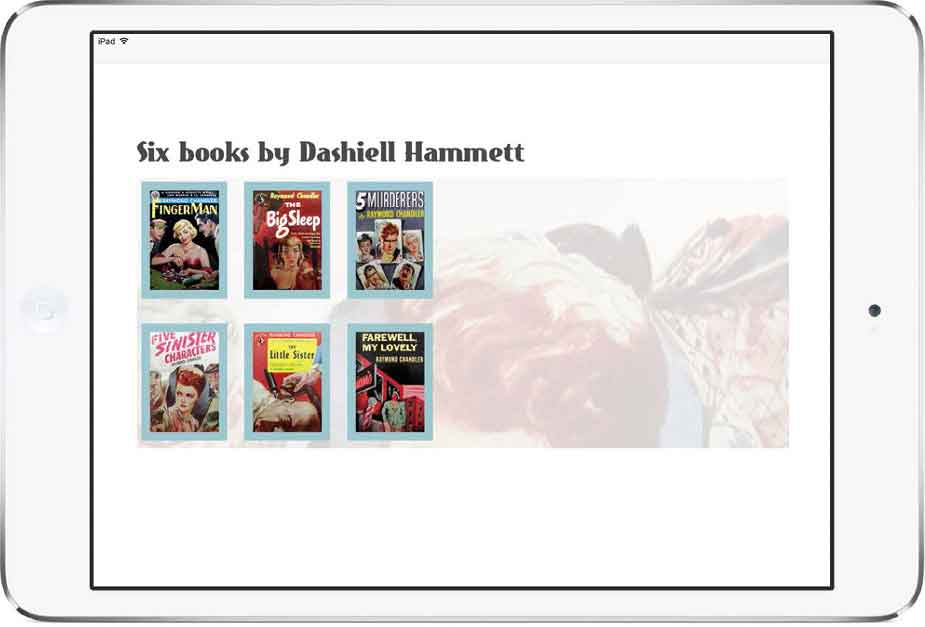
<center class="my_markdown"><b class="my_markdown">将图片布局到网格中。</b></center>

现在我们需要让描述足够小，将它们隐藏在对应的封面图后面。

```html
@media (min-width: 48rem) { 
.item .description { 
position : absolute; 
width : 100px; 
height : 10px; 
overflow : hidden; } 
#hb-landscape-01 .item__description { 
top : 0; 
left : 0; } 
#hb-landscape-02 .item__description { 
top : 0; 
left : 120px; } 
#hb-landscape-03 .item__description { 
top : 0; 
left : 240px; } 
#hb-landscape-04 .item__description { 
top : 170px; 
left : 0; } 
#hb-landscape-05 .item__description { 
top : 170px; 
left : 120px; } 
#hb-landscape-06 .item__description { 
top : 170px; 
left : 240px; } 
}
```

为每段内容简介设置一个比相应图片更低的 `z-index` 值，并将它们的 `opacity` 设置为 `0` ，作为过渡的初始状态。

```html
@media (min-width: 48rem) { 
.item__img { 
z-index : 2; } 
.item__description { 
z-index : 1; 
opacity : 0; } 
}
```

使用 `:target` 伪类选择器将 `opacity` 重置为 `0` ，将内容简介重新定位并调整大小，使它填满面板的右侧。增加内边距、背景色和粗边框来完善外观。

```html
@media (min-width: 48rem) { 
.item:target .item__description { 
top : 0; 
left : 360px; 
width : 390px; 
height : 280px; 
padding : 20px; 
opacity : 1; 
background-color: #dfe1e2; 
border : 10px solid #ebf4f6; } 
}
```

对于这个版本，我们将只过渡两个属性—— `height` 和 `opacity` 。

```html
@media (min-width: 48rem) { 
.item__description { 
transition-property : height, opacity; } 
}
```

为每个属性设置过渡持续时间： `height` 为0.5秒（ `.5s` ）， `opacity` 为0.75秒（ `.75s` ）。

```html
@media (min-width: 48rem) { 
.item__description { 
transition-duration : .5s, .75s; } 
}
```

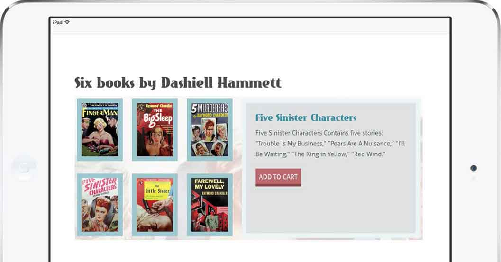
<center class="my_markdown"><b class="my_markdown">提供了一个横向的替代布局。</b></center>

## 打破传统

一个网页或APP的体验，对于是否能够黏住用户有着巨大的影响。你已经学会了如何添加巧妙的过渡，既可以取悦用户又可以让界面看起来赏心悦目。

在我们设计的三种界面中，通过特定的过渡效果使同样的HTML结构支撑了三种截然不同的界面，照顾小屏幕手机用户的同时也不损害大屏幕手机用户的体验。现在它已经很不同凡响了。


