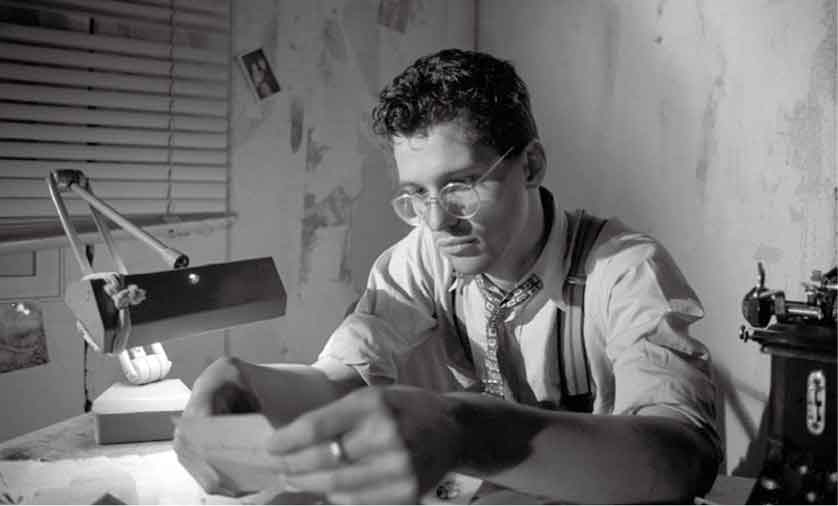
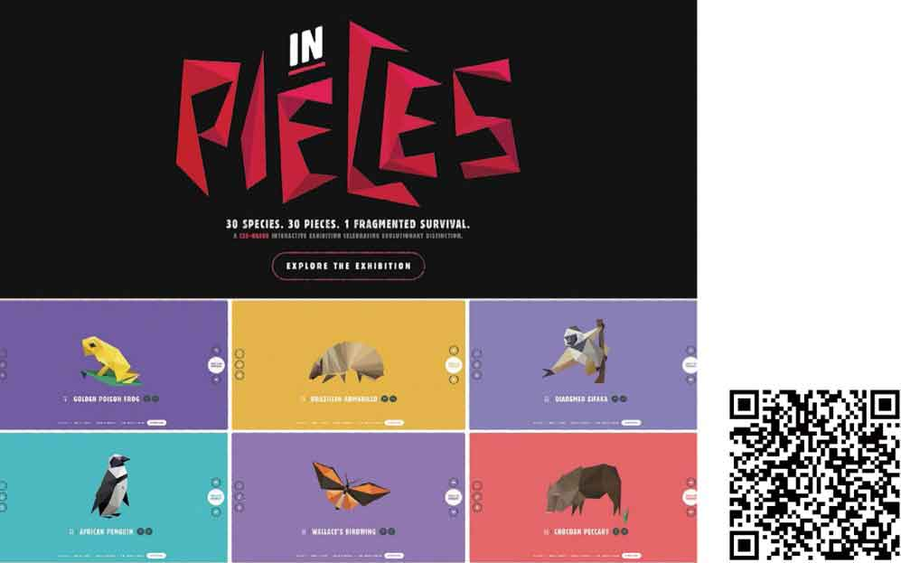

# 第1章　超越平凡的Web设计

在孩提时代，我就对侦探小说很着迷。是的，侦探小说。既不是乡间别墅谋杀案，也不是密室推理小说，这些类型的小说从来都不是我喜欢的风格。我所指的是雷蒙德•钱德勒（Raymond Chandler）、达希尔•哈米特（Dashiell Hammett），以及我个人最喜欢的米奇•斯皮兰（Mickey Spillane）等作家所创作的那种坚韧有力的小说。

现在回到本书的最开始，读一读那段引言，那可不是我在参加客户会议或W3C CSS工作组会议时所做的笔记，尽管直接使用笔记的内容很容易。那段话摘自我最喜欢的一部侦探小说——米奇•斯皮兰（Mickey Spillane）所著的经典“硬汉”侦探小说《My Gun Is Quick》。

即便不是侦探小说迷，你应该也听说过或者看过一些“硬汉”电影。你或许熟悉亨弗莱•鲍嘉（Humphrey Bogart）刻画的私人侦探 Sam Spade。这部电影改编自达希尔•哈米特于1941年出版的小说《马耳他之鹰》。这是历史上非常精彩的一部侦探电影，仅次于那部《谁陷害了兔子罗杰》。

演员斯塔西•基齐（Stacey Keach）的表现如何呢？20世纪80年代，他在Spillane的电视剧《Mike Hammer》中的表演算不上硬气，然而总比没得看强。

没错，就是下面这个家伙。

<b class="my_markdown">你对这类小说感兴趣吗？我真希望你立马就去读一读，可以从那些经典的小说开始，越老越好，例如小说家达希尔•哈米特的《马耳他之鹰》或雷蒙德•钱德勒的《长眠不醒》。对怪咖侦探、贵妇与警察内鬼的故事感兴趣吗？Mickey Spillane的小说是我的最爱。你可以从《My Gun Is Quick》和《复仇在我》开始。</b>

从20世纪20年代开始，硬汉派侦探小说就充斥着暴力、犯罪场面。罪犯虽然凶狠，但英雄也充满了个性，他们从不掩饰真相，从不耍小聪明。作为读者，我们需要知道真相，不管事实是多么腐败不堪。

各种硬汉派侦探小说里的这些主角让我着了迷，如Hammett描写的Sam Spade，Chandler笔下的Philip Marlowe，特别是Spillane小说里所描写的Mike Hammer。

## 硬派的作风

身为侦探的主角们每天的工作，就是用枪指着别人的太阳穴，或者一拳揍烂坏蛋的五脏六腑。别人搞不定的事情，只要主角出马准能办成。他们不需要规则，那是为胆小鬼和无能警察准备的东西。

硬汉侦探有时会和警察一起破案，但硬汉总是深入险境，因为在必要的时候，他们从不受条条框框的限制，从来都是按照自己的规则来破案。当然，法律、法规和惯例很重要，但有时只有通过伸张正义才能获得实现这些规则。当人们不能做那些他们认为正确的事情时，人们就需要这些不畏险境的英雄出手相救。

这些英雄们特别擅长做警察和其他人搞不定的事情，因为他们的行动并不受规则及惯例的限制。我们为他们加油打气，并全力支持，不管这些人多么不羁和残酷，因为我们需要他们。作为前端工程师，我们可以从这些硬汉身上学到很多东西，本书的灵感便来源于此。

## 硬派的设计

为了创造最好的设计体验而永不妥协，才称得上够硬派。推翻限制、打破或创造新的规则，毫不畏惧，这才是我们的本色，并且要让网站在任何可能的情况下都具有更强的适应性。在这个套路里，需要毫不犹豫地充分利用新技术。

说起来简单，做起来并不容易，但如果你已经准备好挑战自己，深呼吸，稳住神，准备迎接一个漫长的夜晚吧。

## 致故步自封的人

无论是在现实生活中和还是在虚拟网络中，我们需要规则、约定和标准。但是，我们应该利用它，而不是定义它，更不是限制它。虽然网络已经有25年的历史（当我在写这段的时候），我们已经提出了它的标准，例如W3C标准组织，充当了所谓的Web标准技术，如HTML、CSS和JavaScript的监护人的角色。

我们还建立了一系列最佳实践，如移动优先、渐进增强和响应式Web设计等，指导人们使用这些技术来构建极富可用性——跨浏览器兼容、方便残障人士、视觉上更吸引人、搜索引擎优化——的网站。

但是，世界还远远不完美，这些标准和最佳实践至今都也只是“建议”，W3C甚至使用这个词来形容他们维护的规范。

除了迫于同行的压力和常识之外，并没有法人实体或者其他机构可以强制浏览器厂商和互联网专业人员采用这些标准并做出最佳实践。如果这本书是为他们写的，这将是一个完全不同的书。

当我五年前第一次写这本书的时候，Web设计的标准做法是，创建一个在所有浏览器中看起来和用起来都相同的网站，而不去管它们的性能如何。要做到这一点意味着要委曲求全，例如需要避免使用某些技术，因为有些浏览器不支持此项技术。

这就让你心满意足了么？

当然不行！这个套路无法让你建立出色的网站，并且这种过时的做法阻碍了我们的进步，让我们不思进取。作为互联网的守护者，我们所做的最糟糕的事，莫过于不思进取的老旧观点无动于衷。

“我们必须做我们的老板和客户想做的事儿！我们要做他们所期望的事情！”

在这方面我算是个老手了。我深知，在帮助客户实现想法的时候，完全可以使用最新的Web特性，充分展示我们的创造力。这才是硬派的Web设计。

在寻找超越习以为常的方法之前，让我们扪心自问，为什么我们对待全新的Web技术会如此谨慎？

## 你也在抱怨吗？

当我的第一本书《超越CSS》在2006年出版的时候，支持CSS3新特性的浏览器还非常少。只有Firefox支持CSS3多栏布局，只有Safari浏览器支持多背景图片。《超越CSS》中由于提及这两个高级CSS属性而在业界广受赞誉。

等我五年后写了本书的第一版的时候，情况已经完全不一样了。早期独领风骚的IE桌面浏览器，其市场份额不断萎缩，其竞争对手的浏览器此时已经取得优势，移动端浏览器也在快速发展。

彼时我们有一系列很棒的CSS属性，并且大部分已经得到了浏览器的支持，包括IE9。此外，还有很棒的CSS工具任由我们使用。你可能会想，我们可以利用这些条件来做些伟大的事情。

事实上呢？并非如此。我们中的大多数人总是盯着做不到的事情，而不是我们能做的。很多人抱怨局限性，而不是拥抱可能性。大多数人不停地埋怨，而不是感到兴奋。

<b class="my_markdown">使用基于Web标准的HTML、CSS和JavaScript，能创作出令人怦然心动的作品，例如Bryan James创作的的“30个CSS碎片拼图，30种濒危灭绝动物”。</b>

## 你还在用老套路吗？

网页设计和开发变革的速度前所未有。HTML、CSS和JavaScript等技术已经发展成熟。

使用智能手机和平板电脑来访问网站和APP的人数呈井喷式增长，且已经超过了PC端的访问数量。响应式Web设计已经不再仅仅是一个概念，而是一个被广泛接受的网站设计方法。

Web设计和开发的方式正在发生巨大的变化，针对响应式设计的要求，许多设计师抛弃了以往从设计页面开始的方式，转变为从设计组件化系统着手。我们已经彻底改造了HTML和CSS样式指南，把它们变成了成熟的模板库，它们就是你的设计工具，而不再是简单的文档。

为了管理大型网站的样式表，开发人员使用Sass为CSS添加了继承、混入和变量，他们还为HTML和CSS引入了命名方法，包括BEM（块、元素，修饰符），这使得HTML元素和CSS样式之间的关系更加清晰。

最后，我们不再需要说服老板使用响应式Web设计——因为是他们要求这样做的。

## 打破传统

在接下来的几章，针对如何使用新兴技术这一话题，我会挑战一些早已被普遍认同的想法。然后，我会制定一个计划，即如何在创造性地推进工作的同时，满足所有人的需求。

我热衷于使用最先进和最新的工具来做出最好的设计，因此我可能会有话直说，所以别指望我会轻声细语地告诉你。

