# 第20章　多列布局

> 首先，与其他同类设备相比，iPad具有不同的尺寸和配置，改变了很多人对于电脑的认知。平板电脑可以做很多事情，但我最常用它来展示响应式以及横竖屏下的布局改变。我有时候会在项目结束后用它来给客户演示效果。当我们纵向拿着iPad（或者在低分辨率显示器下看）的时候，单列显示Get Hardboiled网站首页的内容就很有必要了。因为它充分利用了空间，文字读起来也会很舒服。
> 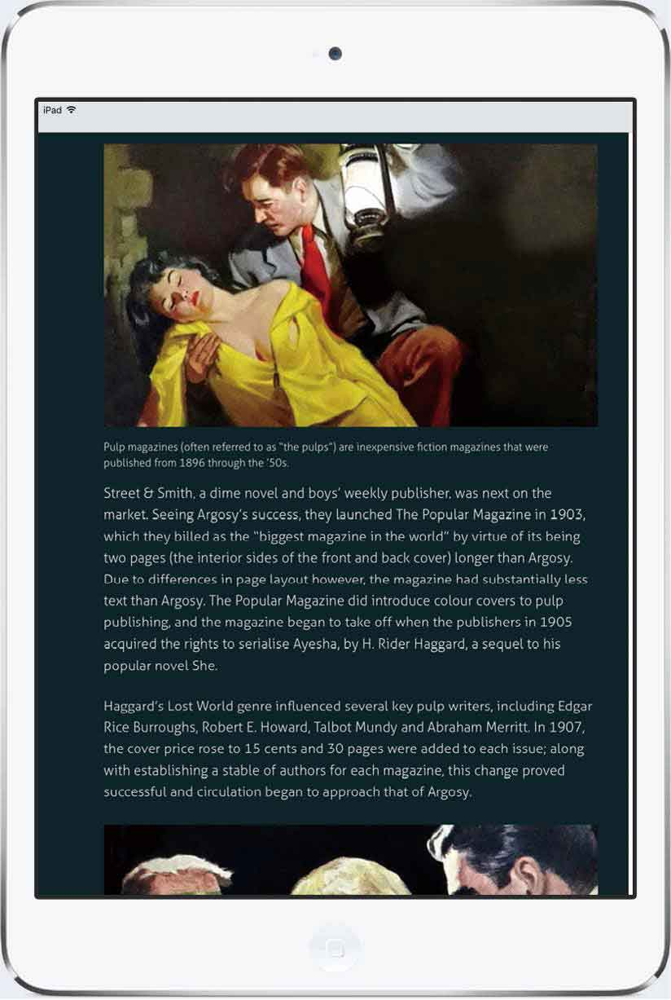
> <center class="my_markdown"><b class="my_markdown">单列显示在iPad竖屏时效果很好。</b></center>
> 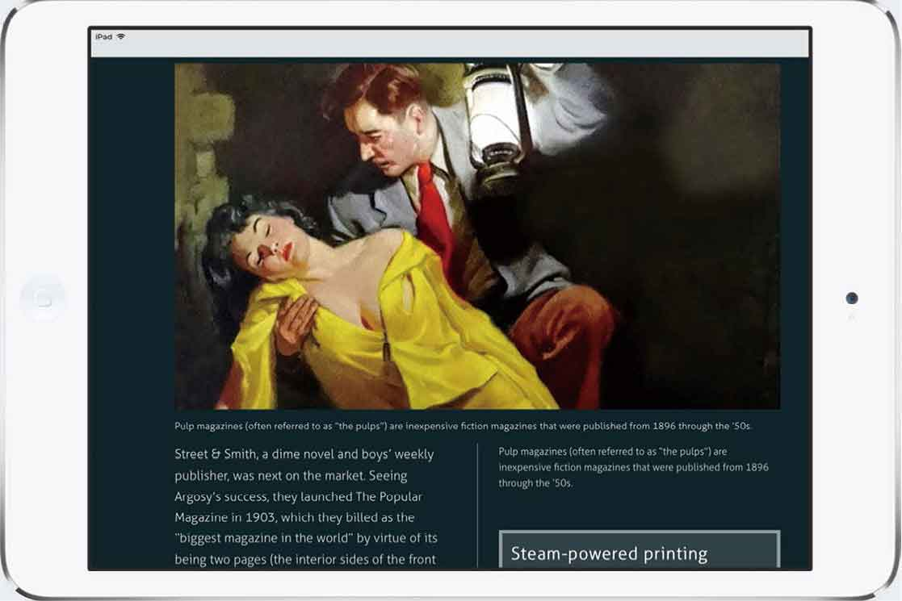
> <center class="my_markdown"><b class="my_markdown">两列相对窄些的内容在iPad横屏时更具可读性。</b></center>
> 将iPad变成横屏（或使用更大的显示器），单列的显示看起来并不合适，因为现在一行的长度阅读起来很不舒服。为了提高横向的阅读体验，我们将使用两列，并将它变得相对窄一些。
> 如果布局可以自动改变列的数量从而优化用户的阅读体验，是不是很难以置信？使用CSS多列布局，就可以做到。

> Firefox 和 WebKit都通过它们的私有前缀实现了CSS的多列布局，因此需要加上这些前缀。下面是W3C的官方语法。
> 在写本章的时候，Microsoft Edge、Opera Mini以及iOS和Mac OS上的Safari浏览器都已经实现了无前缀的CSS多列布局。

## 亲手操作列布局

### 浏览器私有前缀

网页是一种特殊的媒介，与印刷品有着很大的不同，但是，比如杂志或报纸等印刷媒介上的设计思路，可以给Web设计带来启发。版式设计师在杂志上使用的多栏布局让我大开眼界。这就是为什么我常常觉得大多数网站布局的缺乏想象力，尤其是在响应式设计时代。这种状态急需改变，而CSS多列布局正是其中一种方法。

不借助表现型标记，直接通过CSS多列布局创建多列文本，这种做法已经有十年了。我在《超越CSS》这本书中曾经写过，五年前在本书第一版中又写过一次。我在我参与的所有研讨会上都会教授CSS多列布局。但很遗憾的是，每当我问有多少人用过它时，只有很少的人会举手示意。我希望本书可以激发你使用CSS多列布局。

```html
section { 
-moz-column-width : 32rem; 
-webkit-column-width : 32rem; 
column-width : 32rem; }
```

正如其名，CSS多列布局提供了一种仅仅使用CSS来创建多列布局的方法，而不借助额外的标记、浮动或其他的布局方式。

在“Get Hardboiled”的入口页面，我们就可以看到一个多列布局的例子。对于这个设计，我们将使用列来让内容具有更好可读性。为了实现这个目标，我们一般会增加很多区块来分割内容区，然后让它们通过浮动来创建列。

```html
<div class="col"> 
<p>Raymond Thornton Chandler was an American novelist and screenwriter. In 1932, at age forty-four, Chandler decided to become a detective fiction writer after losing his job as an oil company executive during the Great Depression.</p> 
</div> 
<div class="col"> 
<p>Chandler published seven novels during his lifetime (an eighth in progress at his death was completed by Robert B. Parker). All but Playback have been made into motion pictures, some several times. In the year before he died, he was elected president of the Mystery Writers of America.</p> 
</div>
```

这项常用的技术并没有什么本质上的错误，它很容易实现，更重要的是，这种方法很可靠。所以毫无疑问，我们可以看到很多的网站上都在使用这种方式。然而在如今这个响应式设计的时代，我们必须要考虑到很多不同的屏幕尺寸，因此这项技术的缺点远远超过了它的优点。

## 列宽和数量

当我们使用CSS多列布局时，可以改变列的数量和宽度来适应不同的屏幕宽度和屏幕方向，这是一件非常简单的事情。我们可以通过两种方式来实现：第一种是定义列的数量；第二种是指定列的宽度。

首先，我们要重写Get Hardboiled网站文章的HTML结构，移除这些表现型的区块，只在 `section` 元素中留下结构化的内容。

```html
<section> 
<p>Raymond Thornton Chandler was an American novelist and screenwriter. In 1932, at age forty-four, Chandler decided to become a detective fiction writer after losing his job as an oil company executive during the Great Depression. His first short
story, 'Blackmailers Don't Shoot', was published in 1933 in Black Mask, a popular pulp magazine. His first novel, 'The Big Sleep', was published in 1939. In addition to his short stories, Chandler published seven novels during his lifetime (an eighth in progress at his death was completed by Robert B. Parker). All but Playback have been made into motion pictures, some several times. In the year before he died, he was elected president of the Mystery Writers of America.</p> 
</section>
```

并不需要在标记里划分区块，因为我们现在可以用样式表替代这些工作。首先我们用 `column-width` 属性来指定列的宽度，使用包括像素在内的多个单位，但我更喜欢用与文字大小相关的 `rem` 来描述列的宽度。

```html
section { 
column-width : 32rem; }
```

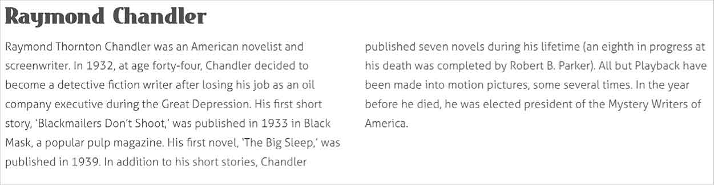
<center class="my_markdown"><b class="my_markdown">如果父级元素变宽，浏览器将会添加新列。当父级元素缩小时，浏览器将会每次删除一列，同时重绘文本来适应布局。</b></center>

我选择了 `32rem` ，是因为对于1.6rem的文字大小，它可以提供一个阅读起来很舒适的行的长度，每列大概有45到75个字符。在小屏幕上，浏览器将仅有一列。当屏幕宽度足以显示多个 `32rem` 宽的列时，浏览器将会动态地显示前两个、三个，甚至更多的列。

### 列数

我能想到一些需要指定列的数量而不是列的宽度的设计场景，这种情况下我们将使用 `column-count` 属性。

对于小屏幕来说，内容区域只需要显示一列。我们并不需要特意指定，因为浏览器将会自动这样显示。由于在中型或大屏幕上使用多列布局更有意义，因此我们把 `column-count` 声明写在媒体查询中。

```html
@media (min-width: 48rem) { 
section { 
column-count : 2; } 
}
```

当浏览器的宽度大于 `48rem` 时，文本将会排成两列。同样的，当我们需要三列时，我们将使用下一条声明，并将媒体查询的最小宽度设置得更大一些。

```html
@media (min-width: 64rem) { 
section { 
column-count : 3; } 
}
```

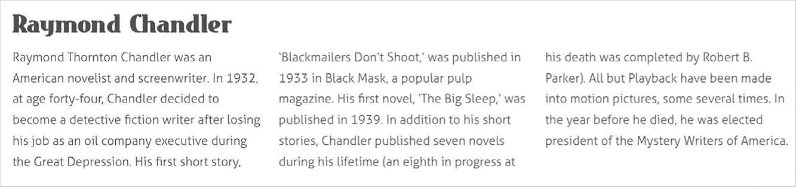
<center class="my_markdown"><b class="my_markdown">响应式布局中，这些列的宽度会有所不同，以适应不同宽度的父容器，但是列的数量会保持不变。</b></center>

### 列的简写方式

由于 `column-width` 和 `column-count` 两个属性并不重叠和冲突，我们可以把两个 `columns` 属性合并成一条更短的声明，就像这样。

```html
@media (min-width: 48rem) { 
section { 
columns: 32rem 2; } 
}
```

### 列间距

留白是提高可读性的重要因素，列与列的间距有助于定义不同的阅读区块。我们将在列之间插入间距，可以使用像素来指定间距的大小，但在响应式设计中，使用更加灵活的单位 `rem` 会更好一些。我们将间距定义为 `4rem` 宽。

```html
@media (min-width: 48rem) { 
section { 
column-gap : 4rem; } 
}
```

为了让设计可以根据用户正在使用的屏幕灵活变化，我们会在大尺寸屏幕上增加列与列的间距。

```html
@media (min-width: 64rem) { 
section { 
column-gap : 6rem; } 
}
```

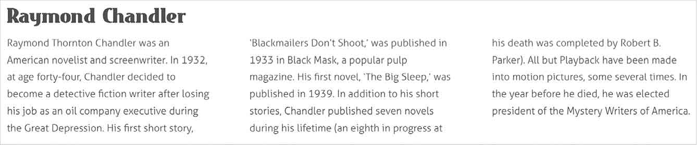
<center class="my_markdown"><b class="my_markdown">一个好的响应式设计不仅仅是自适应布局，它还包括对很多元素做一些微小的变化，以便更好的适应用户的屏幕。</b></center>

### 列分割线

在Web设计中，横向分割线非常重要，它本身有个元素标签—— `hr` 。但垂直分割线也同样重要。虽然垂直分割线并没有自己的HTML元素，但它拥有CSS多列属性，我们将指定 `column-rule` 的宽度，并使用像素来定义。

```html
section { 
column-rule-width : 2px; }
```

我也经常要在响应式临界点增加列规则的宽度。在更宽的屏幕上，让列分割线的宽度变得更大。

```html
@media (min-width: 64rem) { 
section { 
column-rule-width : 3px; } 
}
```

当然，我们也可以指定列分割线的颜色。

```html
section { 
column-rule-color : #ebf4f6; }
```

最后，我们可以定义列分割线的样式。主要的样式有虚线、点状虚线和实线，但你也可以使用其他任何 `border-style` 的值。你如果知道 `groove` 、 `ridge inset`  和 `outset` 四个值也是可用的，一定会很兴奋。

```html
section { 
column-rule-style : solid; }
```

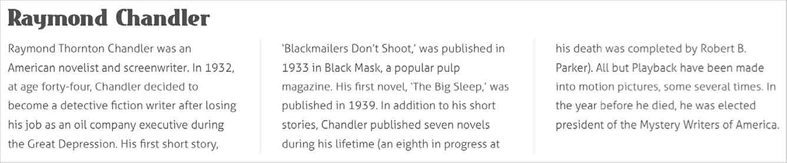
<center class="my_markdown"><b class="my_markdown">CSS列实现起来快速、简便，并且现代浏览器对其有很好的支持。</b></center>

## CSS列应用实例

我常常在想， CSS列易于实现，浏览器的支持力度也不错，为什么很少有人使用它。我想，可能是老旧浏览器的支持不足，导致开发者不愿意去使用它。但老实说，我认为人们不用CSS列是因为自身缺乏想象力，不知道应该在什么情况下使用它。

在与其他设计师得交谈中我了解到，大多数人看到CSS列的时候，最先想到的是把正文分成区块，这让人很容易联想到杂志和报纸的排版。显而易见，多列布局在印刷媒体中表现得很好，但它在网络中并不一定是最佳选择。下面以Get Hardboiled网站中的文章为例。

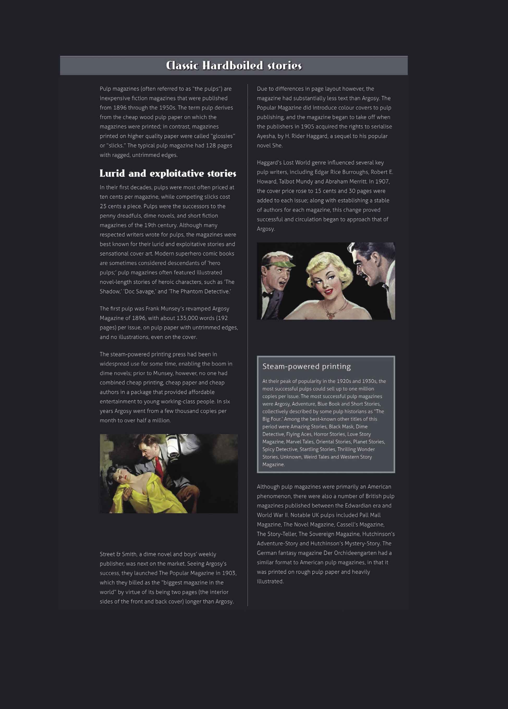
<center class="my_markdown"><b class="my_markdown">把大的文本区域分成多列，并不总是最好的选择，它也可能会带来更差的用户体验。</b></center>

对于多列布局设计有两个重要的提示。第一，也是最重要的一点，通过添加列，我们提供了一个非常规的、很可能更不方便的用户体验。虽然我们在杂志和报纸上已经熟悉了从上到下的读完一列再去读下一列，但在网络上我们还不适合这样做。

阅读体验在小型或中型尺寸的屏幕上可能会不太友好，因为这些列可能超过了屏幕窗口，人们不得不滚动页面来继续阅读。

### 通栏

幸运的是，有一个CSS多列的属性可以帮助我们提升用户的阅读体验，我们只需要在使用的时候认真考虑一下。让我们退回前面的例子。如果我们可以定义整体布局的高度，那么对于多列布局的长文章可以表现得很好，但在响应式设计中这是不太可能的。多列布局对于短文章会非常有效，并具有独特的外观。

为了实现这种较短的列布局需求，我们不需要添加额外的元素，只需要为某些元素添加 `column-span` 属性即可。例如，大标题或者图片元素 `figure` 。

```html
figure { 
column-span : all; }
```

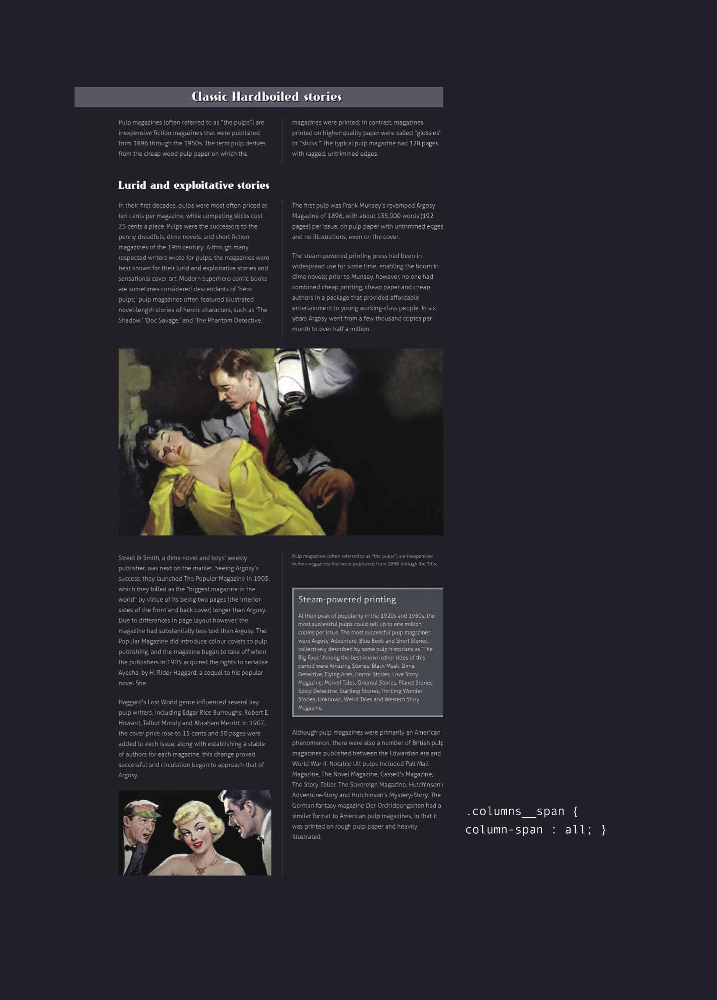
<center class="my_markdown"><b class="my_markdown">使用跨越列元素来创建更短的多列区域可以提高设计的可用性。</b></center>

可以看到把页面分成多个比较短的多列布局，使页面结构更加清晰，同时也减少了读者眼睛移动的距离，大大提升了阅读体验。

### 截断列内容

当我们把内容分割到两列显示时，它会自动均匀分布以达到平衡。但实际上，这常常会导致一些难以预料的结果。

幸运的是，我们可以通过 `break-inside` 属性来确保元素展示在一起。我们将它应用在一个类名为 `columns__break` 的元素上，就像这样。

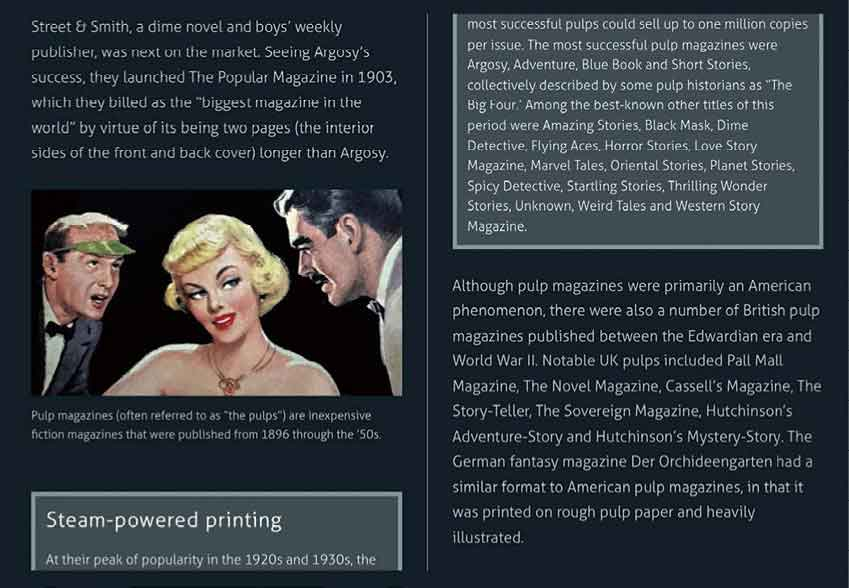
```html
.columns__break { 
break-inside : avoid; }
```

平行列间的内容有时候是相关联的，就像这个被拆分开的区块一样。

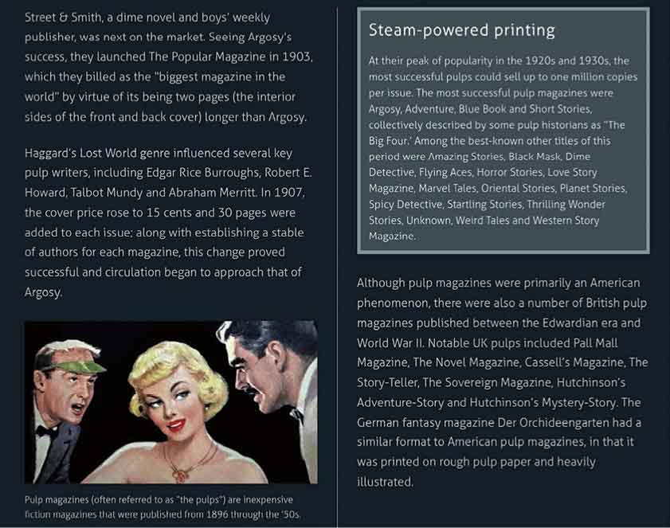
不过可悲的是，写这本书的时候，我们需要采取一些不太方便的方法，来确保元素在所有浏览器中都可以保持在一起展示。这里涉及了三种不同的属性：第一种用于Blink和WebKit内核的浏览器（包括Google、Chrome、Opera和Safari）；第二种用于Firefox；第三种用于IE10和IE11。

```html
.columns__break { 
-webkit-column-break-inside : avoid; 
page-break-inside : avoid; 
break-inside : avoid; }
```

在较长的正文中使用CSS多列布局时， `column-span` 和 `break-inside` 都是解决可读性问题的非常有用的属性。但确保多列布局提高用户阅读体验的最好的办法是，仔细的规划和一点点想象力。

### 将列表按列显示

不难想象，我们也可以在内容模块中使用CSS多列布局提升外观和可用性。事实上，CSS多列布局在达到特定的响应式临界点，最大化利用空白区域方面非常有用。

我的脑海中立刻浮现出的一个例子，就是一个包含了一系列侦探杂志的列表。

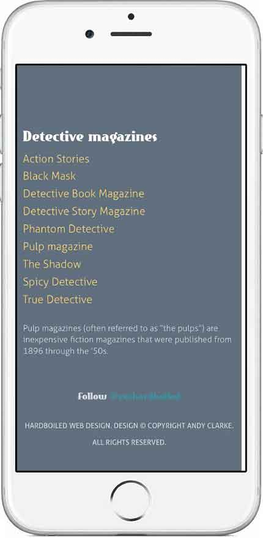
<center class="my_markdown"><b class="my_markdown">在小屏幕中展示侦探杂志列表。</b></center>

```html
<ul class="list--columns"> 
<li>Action Stories</li> 
<li>Black Mask</li> 
<li>Detective Book Magazine</li> 
<li>Detective Story Magazine</li> 
<li>Phantom Detective</li> 
<li>Pulp Magazine</li> 
<li>The Shadow</li> 
<li>Spicy Detective</li> 
<li>True Detective</li> 
</ul>
```

我们不需要添加太多的样式来保证列表在小屏幕下的效果，其默认垂直布局的效果就已经很完美了。

同样的垂直布局在列表很窄时仍然非常适合，例如大尺寸屏幕布局中的侧边栏。然而，在中型尺寸的屏幕上，包括智能手机的横屏模式和各种尺寸的平板电脑，这种垂直布局会产生大量的空白，这样无法对有限的空间充分利用，所以我们可以把CSS多列布局和媒体查询结合起来使用来改善这种情况。

我们已经为列表增加了 `list--columns` 类，在小屏幕下不需要任何特殊的样式。当用户的屏幕尺寸是中等大小，我们将列表分为三列。 `column-rule` 在这里可能不太合适，但 `column-gap` 可以帮助我们分隔这些列表项，尤其是那些包含文字很长的项。

```html
@media (min-width: 48rem) { 
.list--columns { 
column-count : 3; 
column-gap : 4rem; } 
}
```

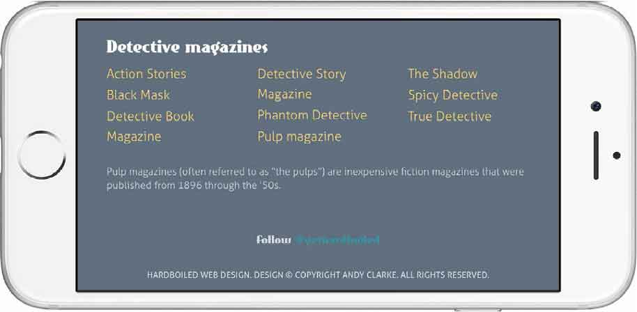
<center class="my_markdown"><b class="my_markdown">在中等大小的屏幕上更好地利用可用空间。</b></center>

在媒体查询的临界点，列表将会在空白区域进行延伸。这个布局在大尺寸屏幕上将不再能正常工作，虽然它的窄列容器会转变成为一个侧边栏。让这个布局同样在临界点适用很简单，我们只要简单地用另一个媒体查询将 `column-count` 设置为 `1` 。

```html
@media (min-width: 64rem) { 
.list--columns { 
column-count : 1; } 
}
```

现在，简单的杂志列表在三个响应式临界点之间使用，确保最大化利用可用空间。对我来说，这种对细节的关注可以让设计从平凡提升到非凡。这完全就是响应式设计。

### 增加标题列数来改进图片设计

每当我看到缺乏想象力的网页图片和图注（用于说明图片内容的文字）设计时，我都会感到很失望。全屏宽度的图像是Web设计的大势所趋，你可能会以为设计师将会在图注设计上有所创新，然而可悲的是，大多数的设计仍然坚持图片加单列图注的常规模式。

使用弹性盒模型来改变图注的位置，将会对图片的设计产生巨大的影响。现在我们可以做到更多，通过多列布局让它看起来更加与众不同。

我们不需要对图片元素 `figure` 的标签进行任何改变，只需要为图注 `figcaption` 标签增加一个 `figcaption__columns` 类即可。

```html
<figure> 
    
   <figcaption class="figcaption__columns">Hardboiled heroes are
almost always down at heel, usually broke, often drunk and living
on a diet of black coffee and smokes – hey, that sounds like
most web designers I know. They have a good woman to help them
stay on the straight and narrow but don't always treat her as
well as they should. When a glamorous redhead walks in the room,
a hardboiled hero can't help but turn his head.</figcaption> 
</figure>
```

乍一看，图片看起来还可以接受，但仔细看，这么小的图注字号导致每一行会有很多的文字。即便是只有几行，阅读起来也很不舒服。我们可以调整它的字号来适应这种设计，但是这可能会使图注在视觉上与正文内容难以区分。我们可以通过多列布局来改善这种情况，同时保证文字的大小不变。


<center class="my_markdown"><b class="my_markdown">图注太长了，无法让人舒适地阅读。</b></center>

这一次，我们指定每一列的宽度为 `32rem` ，如果浏览器有足够的空间，浏览器会尽可能多地创建新的列。小屏幕无法享受到多列布局的便利，因此我们通过媒体查询为中等尺寸屏幕做相应的定义。

```html
@media (min-width: 48rem) { 
.figure--classic figcaption { 
column-width : 32rem; 
column-gap : 4rem; } 
}
```

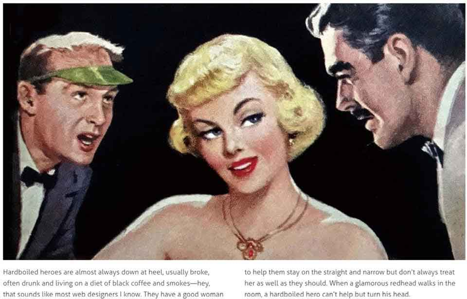
<center class="my_markdown"><b class="my_markdown">将标题分割为多列，阅读起来更舒适有趣。</b></center>

我们已经在图注 `figcaption` 的列之间增加了 `4rem` 的间距，为了提升大尺寸屏幕下的视觉效果，我们同样也添加一个距离 `figcaption` 元素 `4rem` 的左边距。

```html
@media (min-width: 64rem) { 
.figure--classic figcaption { 
margin-left : 4rem; } 
}
```

<center class="my_markdown"><b class="my_markdown"></b></center>

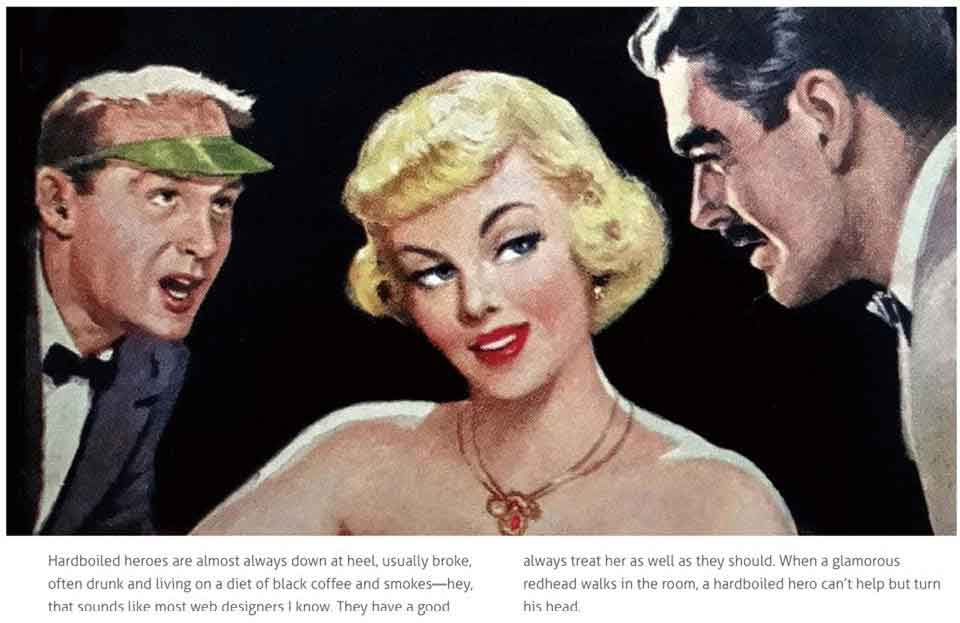
<center class="my_markdown"><b class="my_markdown">添加一些大小等于列间距的边距，让图片看起来更加生动、有趣。</b></center>

### 老旧浏览器的应用

到目前为止，我们一直致力于围绕支持CSS多列布局的现代浏览器进行开发，那么对不支持这些属性的老旧浏览器应该怎么做呢？答案很简单，什么都不做。因为不支持多列布局的浏览器会自动忽略它们的样式，用一列文字来替代。这看起来有点简单粗暴，但这是公平的。因为还在使用老旧浏览器的用户根本不会知道自己错过了什么。

在支持多列布局和不支持多列布局的浏览器中，我们可以使用 `@support`  CSS特性查询方法来调整图注文字的大小。

```html
.figure--classic figcaption { 
font-size : 1.6rem; } 
@supports ( column-width : 32rem ) { 
.figure--classic figcaption { 
font-size : 1.4rem; } 
}
```

然而，不支持CSS多列布局的老旧浏览器不太可能会理解 `@support` 的含义。那么，当一个设计决定了我们必须区分浏览器的时候，可以使用Modernizr来检测是否支持，然后为我们的设计提供替代方案。

由于我们只关注为那些不支持CSS多列布局的浏览器提供替代方案，我们可以使用Modernizr检测的类名（ `.no-csscolumns` ）来隔离这些样式，就像这样。

```html
.no-csscolumns { 
.figure--classic figcaption { 
font-size : 1.6rem; } 
}
```

## 打破传统

现代浏览器对CSS多列布局已经有了很好的支持，对于那些尚未支持CSS多列布局的浏览器也都实现了优雅的降级，然而很少有设计师和开发者使用它，这让我感到非常遗憾。我理解，用户可能因为可用性的问题而不采用CSS多列布局，但我们只是需要一点精心的规划和想象力便能克服这些问题，让多列布局的设计更加独特、更加有趣。我希望本章能够鼓舞你们使用CSS多列布局，并在下一个设计中好好利用它。

## 这是一件轻而易举的事

在CSS高级进阶部分：背景融合和滤镜增加了设计的深度；3D场景下的转换、缩放、旋转和倾斜完成了我们曾经无法单独利用CSS实现的效果；CSS过渡使状态的改变更加流畅、简单的动画成为可能，并让设计变得更加生动；最后，CSS多列布局使网页排版能够适应各种尺寸的屏幕和多种类型的设备。


