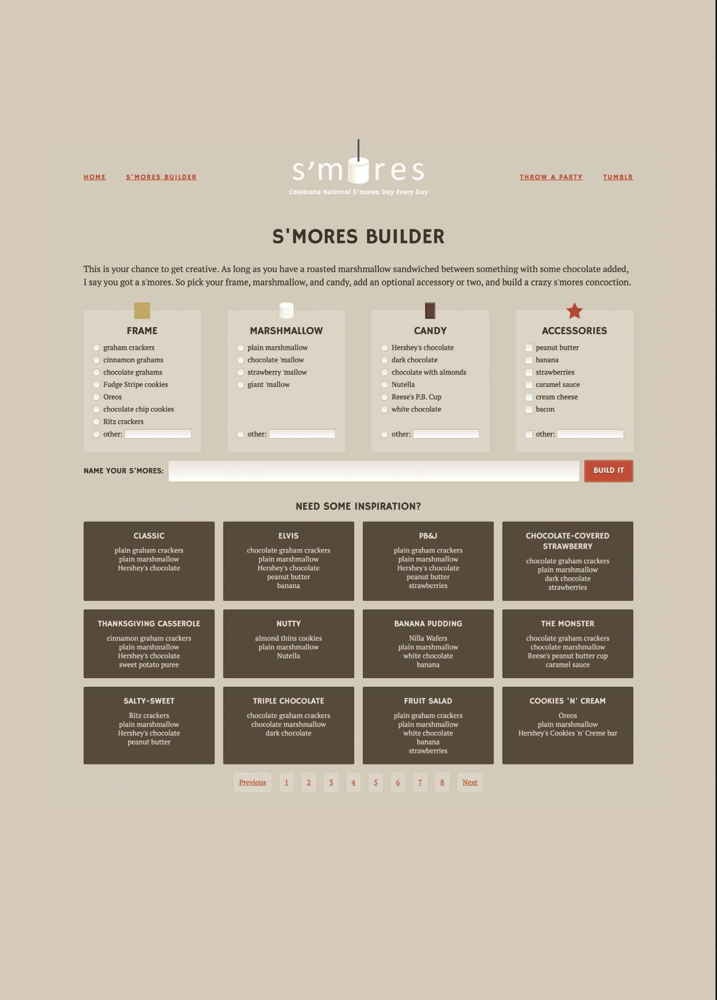
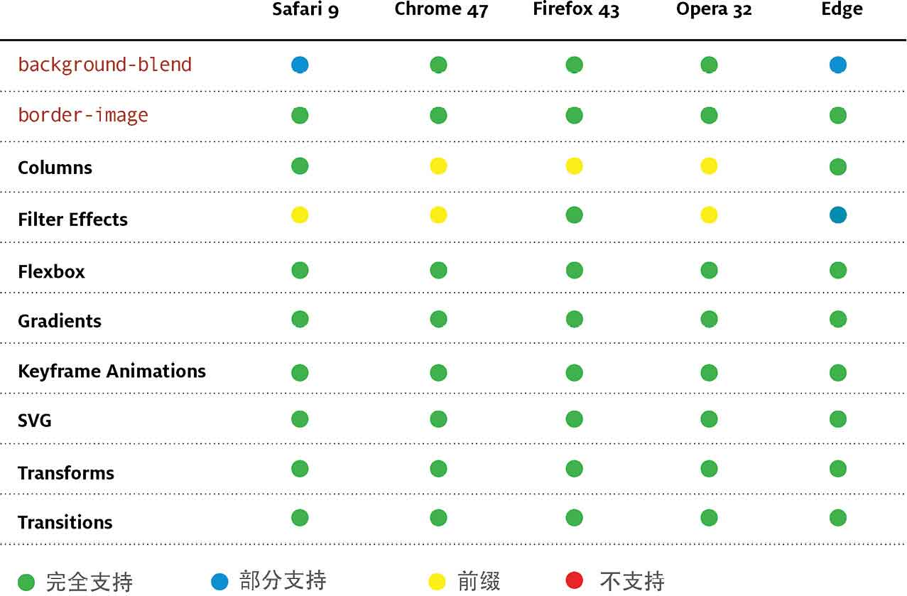

# 第2章　Web设计的峥嵘岁月

渐进增强一直是现代Web开发的基础之一，我第一次接触到这个概念是在Dave Shea的博客上,当时他介绍了所谓的MOSe——Mozilla、Opera和Safari增强。你应该对Dave有所耳闻，就是他创造了CSS禅意花园。

Dave是这样解释MOSe方法的：

“在IE浏览器上创建一个基本的功能页面，你可以在拥有高级选择器的现代浏览器里添加额外的功能，等等，这是我们可以在未来几年持续前进的唯一方法，让我们拥抱它吧。”

Dave建议我们应该首先为低级浏览器创建一个最低可用页面，尤其针对IE的早期版本，然后在支持CSS的子选择器、兄弟选择器和属性选择器的现代浏览器里应用更多的样式。你会注意到，Dave讨论页面应该如何工作，而不是应该如何设计。

## 渐进增强

同年早些时候，Steve Champeon 开始推广渐进增强概念。他同Jeffrey Zeldman一样，是Web标准的创建人之一。

“与其优雅降级，不如渐进增强。首先为最新的、不同功能的设备构建文档，通过单独的逻辑继续增强这些文档表现。不要让基准设备承担过多的责任，而应该让使用现代浏览器的用户拥有更加丰富的体验。”

许多人将渐进增强概念视为设计开发网站的理想方法。从对Web特性支持较少的浏览器上开始，设计一个仅能提供最基本体验的网页，然后再在高级和现代浏览器上，根据其所支持的特性，实现不同细节的分层设计。

这意味着在实际操作时，优先使用老旧浏览器支持较为成熟的CSS选择器和属性，而对于较新的属性则谨慎使用。理论上这种渐进增强的方法是行得通的，但是在实践中，我们又该如何选择不同的增强方案，才能发挥这种设计原则的最大潜力？尽管Steve在文章中使用了术语“包容性的网页设计”，但我确信，他从未打算让我们与功能差劲的浏览器纠缠，限制我们的渐进增强创作思路。就算他提过这样的想法，你能猜猜他和Dave的那些文章是什么时候的吗？2003年！

## 时代更迭

2003年，巨大的30GB容量的iPod可算是个潮物，在那一年，如果你的工作是设计、开发网页或者仅仅是浏览网页，你肯定使用过下面这些软件。

+ Mac OS X 10.2 (Jaguar)
+ Windows XP (SP2)
+ Adobe Photoshop CS
+ Macromedia Dreamweaver 7
+ Microsoft FrontPage 2003
+ Internet Explorer 6
+ Apple Safari 1
+ Mozilla Phoenix/Firebird
+ Opera 7

随着时间的流逝，我们会不断升级软件，然而在实践渐进增强方面，我们总是固执地坚守着以前的常识。

### 沉醉其中

这并不是说渐进增强不值得称赞，事实恰恰相反。

+ 基本内容和功能应该总是可访问的。
+ 应该使用简洁、清晰和语义化的标记。
+ 样式表应该可以实现视觉设计的所有方面。
+ 网页的交互行为应尽可能交给脚本来完成。

我们在开发时遵循这些原则，页面的可用性或可访问从来不依赖CSS或者JavaScript。当我们使用有意义的HTML标签时，它将变得更轻量、更具有适应能力。CSS使得在各种尺寸和类型的屏幕上的排版更容易。

渐进增强的理念不止如此，然而我们必须小心谨慎，不要因为坚持其原则或应用其理念而限制了自己的创造力，特别是在视觉设计方面。我们必须不断地重新评估如何应用这些原则，从而避免我们的作品变得平庸。

## 老旧浏览器和过时设备

Zoe Gillenwater在她的演讲“使用弹性布局提高响应能力”中提到了CSS中flexbox布局的应用，她提倡使用弹性布局在设计中实现渐进增强。但问题是，在渐进增强实践中，往往会为了迁就还在使用老旧浏览器和过时设备的用户，而放弃使用先进的CSS属性，甚至放弃使用flexbox这样强大的工具。

增强或改善，往往意味着从底部开始。仅仅针对各种浏览器普遍支持的特性进行Web设计是远远不够的，这也是造成当今许多网页如此平庸的原因。我们使用新的CSS特性作为一种工具时，需要为使用新浏览器和设备的用户设计更多、更好的体验，就如Dan Cederholm所说“为新版浏览器用户提供增强的文档，以便让他们获得更加丰富的体验。”

<b class="my_markdown">在过去的几年里，Zoe提出了很多非常有指导意义的Flexbox实战案例，具体查阅：zomigi.com/publications/#pub-fwd。</b>

因为我们首先开始为老旧的浏览器设计，所以离最终的卓越设计还差着十万八千里。

### 抖个机灵

我们绝不能被那些老旧的浏览器与过时的设备限制了创造力。相反，我们应该利用新技术，为每一位用户的每一次浏览，设计出最好的体验。这样我们可以充分利用一切能力更强的浏览器和新兴技术，实现更高和更优的设计。

我猜你现在肯定在想优雅降级的事儿？

### 踌躇不前

渐进增强的另一面——优雅降级——确保当样式和脚本不可用或无法被浏览器解析时，用户依然可以访问网页的内容。采用优雅降级方法，意味着网站的功能永远都是可用的，尽管一定程度上也许是低保真的设计，好在它的内容仍然可以访问。

## 优雅降级就够了么？

在老旧的或功能较弱的浏览器中，考虑可用性是我们能做的最基本，也是最重要的部分。但是优雅降级这个术语，意味着我们应该妥协。

去xx的优雅。

硬派的方法，是进一步推进优雅降级，并发挥我们的创造天赋去设计，不仅只针对设备的屏幕大小，而且也要考量其浏览器的功能。我们需要重新理解优雅降级，并面对今天这个领域所遇到的挑战。

如果要创建令人期待且鼓舞人心的网站，我们必须打破过往渐进增强和优雅降级的经验藩篱。只是鼓励人们去使用高性能或者对Web特性支持良好的浏览器，是远远不够的。

相反，我们应该充分利用新的技术，并且精心设计每一次用户体验，以便于充分发挥用户使用的浏览器的潜力。这可能意味着最终页面跟设计稿有很大不同，有时在不同的浏览器或设备上差异更大。

对于一些人来说，这种方法似乎太激进，甚至有些偏执。但这种方法更好地利用了当今的技术，充分释放创造性，令用户体验和设计达到更高水平，并让我们开发出更鼓舞人心和富有想象力的网站与应用。

## 拥抱新特性

在渐进增强和优雅降级的概念刚提出时，网络是一个与今日完全不同的环境。在浏览器新特性支持领域，两款竞争的浏览器间鲜有差异。而今天一切都改变了，优秀的现代浏览器支持各种Web特性，而老旧的浏览器的支持性很差，二者之间的鸿沟越来越大。下面是一些最新的CSS选择器和属性，在现代浏览器中有着稳定和良好的表现。

+ 对任何元素的选择器绑定样式不再使用 `id` 跟 `class` 属性。
+ 以多种方式实现透明效果，包括RGBa、 `opacity` 属性和CSS滤镜。
+ 以更多的方式让背景跟边框一起生效。
+ 使用偏移、旋转、缩放和拉伸，实现元素变形。
+ 应用过渡特效，实现微妙的交互效果。
+ 制作以前只能通过JavaScript或Flash实现动画的逐帧动画。

当前桌面浏览器对CSS属性的支持情况

CSS作为高自由度的创作工具，帮助我们实现了很多惊艳的Web体验。如果在创作中不充分利用它们，是多么短视和愚蠢啊。如今，在掌握这些技术的前提下，我们为什么不去使用这些属性呢，哪怕只用其中的一个。

那么到底是什么在阻止我们?

只不过是几个陈旧的想法罢了。

## 打破传统

渐进增强和优雅降级，都不应该被教条或不经大脑地应用在我们的Web设计中。相反，它们提供了一个新的起点，而现在，我们要重新定义响应式设计的原则，以适应不断变化的网络。

