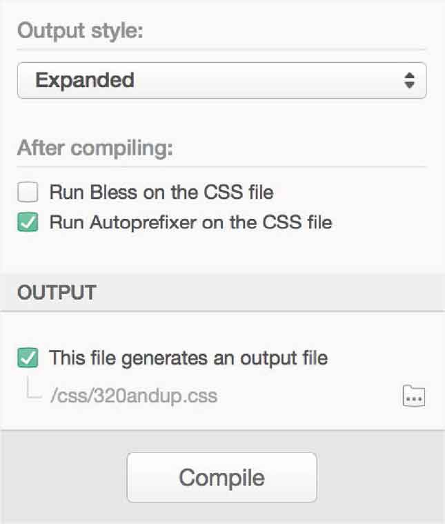
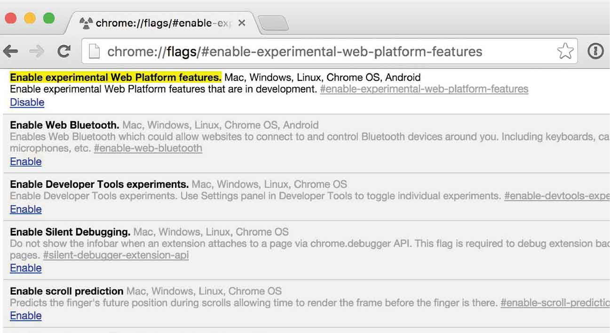

# 第3章　Web标准之路

人们经常误认为W3C是用来创造新技术的，但其实它是一个标准化机构，而不是创新机构，它的工作是将现有技术标准化。CSS工作组规范作家Elika Etemad总结出该组织的作用：

“这个工作组是为规范化而存在的。如果没有人对实现某些东西感兴趣，那么我们制定这些标准就是在浪费时间。另外，如果只有一个实施者来做这些事，我们就不可能提出跨平台的标准。”

很长一段时间以来，我都认为W3C的CSS工作组是先创新，然后发布草案和建议。例如W3C提出建议，浏览器厂商来采用它们（或者不采用），现实却是，当标准达成共识的时候才会去采用。

“如果CSS工作组有多个独立完整和互操作性的实现方案被广泛采用，那么它的工作就被认为是成功的。”

假设我们在意标准，并且希望我们的作品符合这些标准。那如果我们在使用某些新技术时，它的标准还没制定完成怎么办？如果我们硬要按照标准来设计，那么我们将会错过许多的创作机会。

因此，我们不必等待HTML或CSS模块成为W3C的议案，现在我们可以使用大多数新兴的标准。

## 不存在CSS3规范这样的东西

与CSS的早期版本相比，CSS3不是一套单一独立的规则，它被划分为了多个模块。CSS工作组根据优先级分别开发每个模块：

“CSS2以后，W3C Recommendation Track单独地提出了一系列开发中的模块，其中包括语法模块、级联和继承，当然还包括打印、页面布局和呈现等许多方面。”

CSS3的模块化是件好事，这样浏览器厂商可以按照他们的时间表，逐步发布新的功能。这对我们来说也是件好事，因为这允许我们逐步地熟悉和使用每个模块，而不是等待完整的大而全的规范。

## 标准制定

CSS工作组的章程上显示了目前正在开发的模块，这不是一个详尽的清单，我选择了与我们最相关的10个模块。

| **CSS 动画** | w3.org/TR/css3-animations |
| :-----  | :-----  | :-----  | :-----  |
| 使用关键帧，随着时间的推移改变css属性值来实现动画。这些关键帧动画的行为可以通过指定时间、重复的次数、重复的行为来控制 |

| **CSS 背景和边框** | w3.org/TR/css3-background |
| :-----  | :-----  | :-----  | :-----  |
| 使我们能够控制背景图片的大小、重复一个合适的背景图、在盒模型的边框和圆角上使用背景图 |

| **合成和混合** | w3.org/TR/compositing |
| :-----  | :-----  | :-----  | :-----  |
| 混合模式允许我们使用若干个元素来做混合背景，你可以在Adobe Photoshop里找到类似的工具 |

| **滤镜效果** | w3.org/TR/filter-effects |
| :-----  | :-----  | :-----  | :-----  |
| 使用CSS来为元素添加滤镜效果，像Adobe Photoshop里的滤镜工具一样 |

| **CSS 弹性布局** | w3.org/TR/css3-flexbox |
| :-----  | :-----  | :-----  | :-----  |
| CSS布局中一个重要的新工具，弹性布局使我们能过轻松实现水平和垂直两个方向上元素的排列 |

| **CSS 栅格布局** | w3.org/TR/css3-grid-layout |
| :-----  | :-----  | :-----  | :-----  |
| 一种将可用空间划分成列和行的新标准，我们这本书不详细介绍CSS栅格布局 |

| **CSS 多列布局** | w3.org/TR/css3-multicol |
| :-----  | :-----  | :-----  | :-----  |
| 无需额外标记来生成伪列，并控制它的数量和宽度，以及列间距和分配器 |

| **CSS 形状** | w3.org/TR/css-shapes-1 |
| :-----  | :-----  | :-----  | :-----  |
| 使我们能够在CSS文本流周围设置形状。形状可以是几何图形、多边形或者长方形，也可以通过alpha通道图像来创建 |

| **CSS 转换** | w3.org/TR/css3-transforms |
| :-----  | :-----  | :-----  | :-----  |
| 匹配许多SVG提供的控件，CSS通过这个模块去控制元素的移动、旋转、缩放和倾斜 |

| **CSS 过渡** | w3.org/TR/css3-transitions |
| :-----  | :-----  | :-----  | :-----  |
| 和动画不同，CSS过渡使一个属性使用css来代替脚本，在两种状态间平滑过渡，例如在正常和划过之间改变超链接的颜色 |

## 厂商特定的前缀

我在后面的章节展示CSS，你很快就会发现一个反复出现的主题——并不是所有的浏览器都支持用同一种方式来使用相同的属性，例如，Edge和Safari在Mac OS X和iOS上原生支持多列布局。

```html
.content {  
   columns : 10rem;  
}
```

但是，在其他浏览器上使用多列布局，需要使用厂商特定的前缀。例如，针对Chrome、Opera和安卓浏览器，需要使用 `-Webkit-` 前缀，Firefox需要 `-moz-` 前缀。因此，要实现跨浏览器的多列布局，意味着你要先写几遍带厂商前缀的属性，然后才是W3C约定的没有前缀的语法。

```html
.content {  
   -moz-columns : 10rem; 
   -Webkit-columns : 10rem; 
   columns : 10rem;  
}
```

如果你觉得写多个厂商前缀的属性太繁琐，Autoprefixer是一个方便的工具，它从浏览器普及率以及可用的CSS属性支持数据来解析CSS，然后添加厂商的前缀。

你也可以使用Lea Verou的 `-prefix-free` ，只要在页面的任何一个地方引入这个脚本，它就会在需要的地方，为每一个外链或内嵌的样式表，添加那些厂商的特定前缀。


<center class="my_markdown"><b class="my_markdown">你可以根据自己的开发环境，以多种方式使用Autoprefixer。那我呢？我把Autoprefixer集成到CodeKit中，然后每天用这个工具把Sass编译成CSS。</b></center>

标准产生之前，编写带厂商前缀的属性列表是一件很麻烦的事。因此，2010年彼得•保罗•科赫（PPK）呼吁浏览器厂商停止使用它们。

“厂商前缀让开发人员的样式表变得累赘。为什么我们非得用好几个声明才获得一个单一的效果呢？兄弟们，让我们停止厂商前缀这个无稽之谈，适可而止吧。”

对此我持不同的意见。如果新属性没有厂商前缀，而在每个浏览器的显示效果各不相同，那么PPK又该抱怨了。

难道多写几个厂商前缀属性要花很多时间吗？什么？你以为做一个专业的开发人员很容易？那么我有一个妙计：我们不写盒模型hack，但事实上，没有任何人能做到。

厂商前缀起初只是浏览器厂商和CSS2规范用来警告我们的，而不是让我们真地去使用它们。

在现实中，厂商前缀通常还是必要的，它使得我们今天可以使用新的属性。在考虑到快速变化的网络前提下，建议还是使用厂商特定的前缀，以便安全地使用这些新属性。

“我们不建议您在实际应用中使用这些扩展，那些未实现的CSS属性最好是用来做测试或者尝试。”

但是，网络现在最需要的不是安全，它需要我们充分利用新的标准的技术，这样我们就可以创造一些神奇的事情。

## 厂商的前缀属性有效吗？

在标准的制定过程中，属性保留通过破折号（-）或者下划线（_）来为特定的厂商添加前缀。使用这些在样式表本身技术上是无效的，但无效的样式表相对于我们现在使用CSS标准来说，代价很小。

## 浏览器标记

毫无疑问，一般情况下我们是受益于厂商特定前缀的，因为在W3C将新的CSS属性确立标准之前很早的时候，它们就允许我们在测试，甚至是正式的代码中使用这些新的CSS属性。

正如任何实验性技术一样，当浏览器厂商认为某个CSS属性不会再改变时，你就可以不再加特定前缀了。

然而，我们常常在样式表中保留过时的前缀，即使在多年后它们已经不再必要。比如，我们仍然会在很多网站、创作工具和框架里看到 `border-radius` 这个已经过时的前缀。

在Chrome里，仍然支持属性前缀 `-Webkit-` 。谷歌实现了一个系统的标记，用户必须在自己的浏览器中启用这些实验性属性。这些标记可以让你尝试新的CSS属性，同时厂商还正在不断完善它。CSS形状就是这样一个例子，并没有厂商前缀来支持形状，用户必须启用实验性网络平台功能，以便看到它们。


<center class="my_markdown"><b class="my_markdown">想在Chrome里看CSS形状或者其他实验性的特性的话，在Chrome的地址栏里输入chrome://flags/，然后在实验性平台商搜索并启用实验功能。</b></center>

在我看来，让用户了解标记的存在这是非常罕见的。使得我们无法在生产代码中使用实验性的属性，虽然这有时在短期内造成了不便，但从长远来看，我们和我们的用户都将受益于这个实验性功能沙盒。

## 打破传统

CSS3包含一系列独立的模块，这会让我们产生“等某个属性规范提出后再去使用这个属性”的想法。相反，通过使用厂商前缀，我们现在就可以使用这些属性，没必要等待。然而即使越来越多的新CSS属性被浏览器支持，浏览器和设备能力之间也会有一些差异。我们不能总是在用小技巧来消除这些差异，我们应该学会接受它们。


