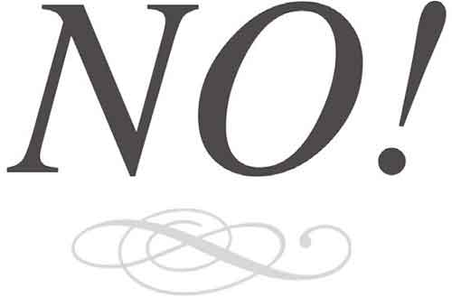
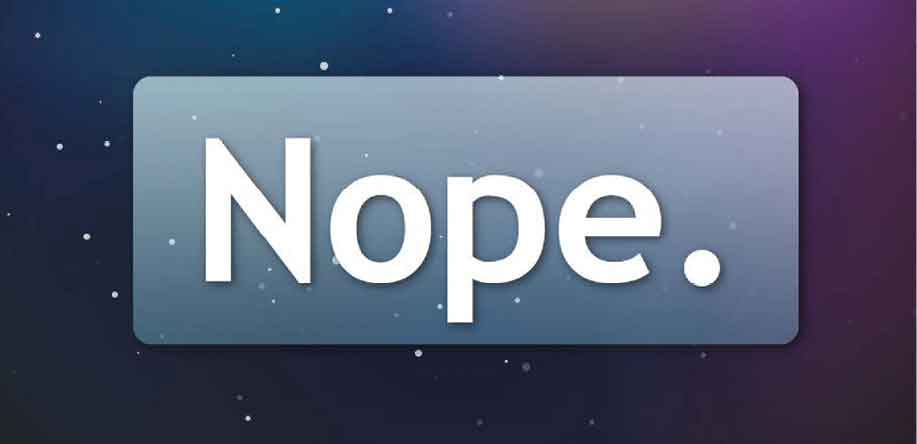
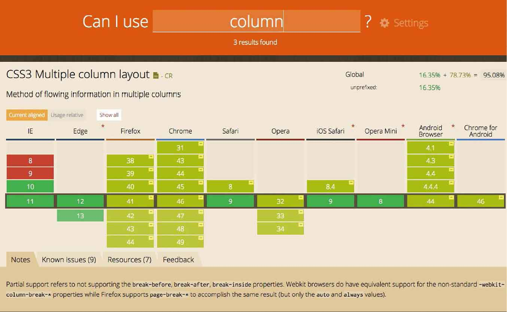
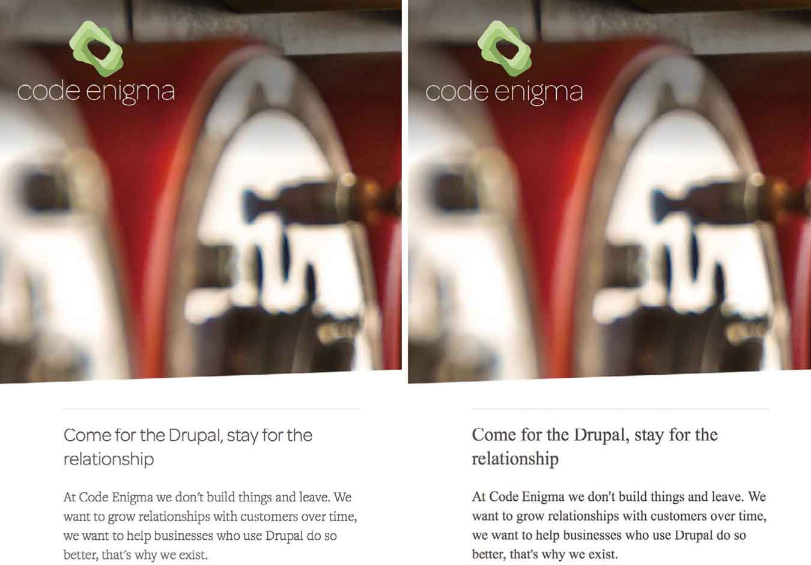
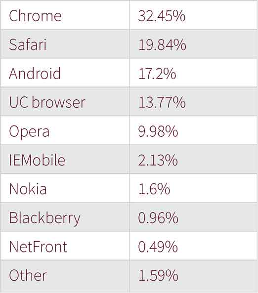

# 第4章　浏览器差异化呈现

长久以来，人们先入为主地认为网站在不同浏览器中的显示效果应该是一致的，而这恰恰阻碍了技术的发展。

Dan Cederholm 说道：“网站在不同浏览器上的呈现效果必须是一样的吗？”“不！”他很肯定。当然，他是对的。

<b class="my_markdown">当我们使用Safari 这种表现能力强的浏览器的时候，我们能看到@font-face属性很好地呈现出来。</b>

<b class="my_markdown">当我们使用Opera mini 这种表现度不够好的浏览器的时候，web font的属性是表现不出来的。不过无所谓，反正用户也不知道真实情况。</b>

那么关于体验呢？Dan 最爱的域名也回答了这个问题，“做网站需要在每个浏览器中都有相同的体验吗？（dowebsitesneedtobeexperiencedexactlythesameineverybrowser.com）

当然不需要。

<b class="my_markdown">在这个网站上移动鼠标，实际的体验会根据你使用的浏览器而有所区别。</b>

Dan也许在挑选域名上很有天分，但他不是第一个提出这个问题的人。

“如果要在所有的平台上做到展现一致，我们将陷入无止尽的挣扎中。我们不可能让网站在PDA和 21 寸的显示器上看起来是一样的。也不可能让它和盲文描述是一致的。尽管这些都在变化，但仍然存在浏览器厂商对W3C标准的支持不一致的情况。不去管这些，就让他们看起来不一致吧。”

Rachel Andrew 在 2002 年的时候就写道：为何直到今天，咱们仍然为同样的问题而纠结争论，特别是在屏幕如此多样化的一个时代，从电视到手机、平板、甚至是高分辨率PC。当然有些人仍然认为当我们访问某个网站的时候，在每个浏览器上呈现出来的就应当是一样的，不过他们过一段时间就会分裂成两个阵营。

## 响应式设计

网站在每个浏览器上呈现不同的效果，这并不是一个新出现的观点，早在2000年，John Allsopp就开创性地提出了这个观点。

“每一个设计师都知道的打印媒介控件， 在Web 媒介中也同样需要，这是一个控制打印页的功能函数。我们应该拥抱变化，Web设计应该保持灵活性，不要那么多限制。首先，我们应该接受老事物的衰退。”

在这本书第1版面世发行的几个月之前，Ethan Marcotte 很巧妙地提出了几个已经存在的方法和技术，包括流式栅格、弹性媒体和媒体查询，详见《移动优先与响应式Web设计》 （<a class="my_markdown" href="['http://www.epubit.com.cn/book/details/1649']">http://www.epubit.com.cn/book/details/1649</a>）。

五年后，响应式Web设计已经逐步成为网页设计的标准方法，这也是网页设计的标志性改变。它帮助设计者应对不断变化的局面，响应式设计也说服我们的老板和客户们：因为它能够解决浏览器和设备多样性带来的问题。

## 浏览器支持意味着什么

许多组织保留着哪些浏览器支持他们的网站的数据矩阵。如今，众多浏览器和设备厂商激烈斗争，他们中的大厂重新定义了支持的含义（像英国政府数字化服务描述的那样）：内容正确显示，关键功能良好运行。

对于英国政府数字化服务而言，人民群众对在 Gov.uk 上获取内容和信息吐槽不断，所以他们测试了使用率在2%以上的每一款浏览器。不像其他组织有专门的质量管控团队，或者市场部门专注于他们的网站细节，使得在每个浏览器上的每一个像素都是完美的。所以他们明白了：

“不是所有的浏览器对网页都按照同样的方式渲染，它们在使用CSS、HTML和JavaScript 方面有不一样的地方。”

接受“并不是所有浏览器对网站的渲染方式都是一样的”这个观念，将会让我们能够抛弃像素级设计还原，专注于为每个浏览器提供恰当的体验。

BBC也认同像素级完美渲染的优先级，不能凌驾于内容可读性之上。它的浏览器支持分为三个级别。

+ 级别1：支持
+ 级别2.：部分支持
+ 级别3.：不支持

他们接受在这些支持级别间小的变化，甚至接受使用新兴的技术，只要他们在用户访问基本内容或功能上不妥协。

“使用新技术去支持新的浏览器特性，这并没有错，但是必须保证用户能访问你的基本内容。”

BBC 并没有定义新技术和新的原则。他们没有考虑一系列的浏览器支持问题，而是思考做出什么样的设计能够影响他们的用户。

+ 对于用户来说，核心体验是什么？
+ 当检测到用户使用了支持特殊功能（例如web font、geolocation等）的现代浏览器，我们如何提高用户体验?

考虑到这些特性可以开发出一个个的小功能，这带给我的感受要比浏览器分级要好得多。啰唆一句，当被客户问起我们支持哪些浏览器时，我想改一下问题：因为我们要么不支持浏览器，要么不支持他们。

## 精细化设计

当浏览器没有实现一个新兴的特性的时候，不要完全地对它进行分级或者排斥。相同的浏览器对不同的新特性会有非常棒的支持。例如，Safari 已经完全实现了弹性布局，但是只部分支持多列布局。我们应该根据具体情况来选择使用新特性，而不是直接给浏览器分级。

<b class="my_markdown">caniuse.com并不是唯一的浏览器特性支持程度的查询工具，包括像 Autoprefixer 这样的编译工具，一样可以帮助我们来完成这样的工作。</b>

有些时候，设计元素很重要，我们需要让每个人看到的或体验到的是一致的。比如说公司的标志logo， 这是客户想让所有人看到的，logo的颜色、logo的字形，当然还有很多没那么重要的设计元素，需要区别对待。

考虑到特殊属性的影响，那么问题的关键就是如何保证设计的保真度。在实践中，当我们把一个元素添加到设计中时，我们考虑的是如何让更多的人，超越一系列的浏览器，所见或所感是一致的。

例如，Web 字体有多重要？ 在某些场景下，字体的选择对公司标志的重要性，与内容的可读性是一样的。

多列布局怎么样？用CSS渲染？ 它们重要到需要每个人都得看到？或者我们可以允许它们优雅降级？或者更牛的，设计一个替代品出来？现在来考虑一下圆角、渐变和透明度，它们对你的设计保真度到底有多重要？

## 弥散圆

在我从事Web工作之前，我曾在使用广角摄像机方面受过专业的训练，这些电影摄像机的特点是利用摇摆和倾斜运动，在图像中创造一个清晰的画面。

在摄影中，即使是最好的镜头也不能把光线聚在一个点上。取而代之的是，镜片将光线聚于一个点或者圆上。尽管这些圆很小，但它们仍有尺寸，这就是“弥散圆”。

弥散圆越大，照出来的照片会越不清晰，反之亦然。这些是高级摄影技术的基础，没有照片有完美的聚光，也无法做到真正的锐利，相反，照片只能是尽可能清晰。

### 尽可能清晰

虽然模块化和原子化设计被很多人采用，有时候客户还是希望我们能用Photoshop来演示如何完成网站或者应用程序的外观设计。

这些图像将包括每一个设计元素：品牌、颜色、各种形式的排版、背景图、边框和渐变。我们可以认为这就是高保真、清晰的设计。

但这些元素对设计完整性有多重要？一个特殊的字体对于一个品牌的用户体验是否至关重要？背景混合有多重要？列是真的需要吗？

这些决定将确定元素应该怎样跨浏览器和设备，具备不同的功能。我们致力于在他们之间达成一致，为了帮助做出这些决定，我们可以从弥散圆的原则中学习。

<b class="my_markdown">字体的选择对于设计的完整性有多重要？左侧使用是具有设计特色的Web字体，右侧使用的是系统字体。</b>

### 有意义的讨论环境

用三个同心圆来表示比较直观。

+ 最里面的环应该包含设计元素，这是最核心的。如果布局和排版必须保持一致，将它们放在这个圆中。
+ 在中间的圆中，放置重要的元素，但不是至关重要的，这是个人的设计经验之谈。举个文本的例子，文本被放置在CSS创建的列中，对于支持多列布局的浏览器，浏览器自动渲染列，对于不支持的浏览器，我们需要调整字体来适应没有列这种情况。
+ 最外层的元素是允许优雅降级的。如果没必要在所有的浏览器中实现背景混合或滤镜，就使用JavaScript来节省时间。

我已经发现，弥散圆原则在解释浏览器之间的自然差异方面是个很有用的技术。它设置了更现实的期望和更有意义的讨论环境。最重要的是，它使大家都能够在设计的优先权方面做出更好的决定。

## 提升品牌形象

一些公司有质量管控团队，他们确保品牌的每个像素都是完美的，浏览器的差异化体现对他们来说有损于品牌形象，这被认为不完善的。

这些团队的品牌价值理念，不应该还停留在跨浏览器的完美表现和保持各种设备的功能完整性。这些现在或许没改变，但迟早会到来的。

我们应该向老板保证，差异化会提升我们的品牌，因为我们能精确地调整用户体验。差异化为我们创造了机会，我们应该接受它。

## 亲爱的客户

在Stuff & Nonsense工作很幸运， 我们的客户很懂技术，他们很尊重我们的工作，他们认为我们的时间和他们的钱应该花在创造性的响应式设计上，而不是浪费在高保真还原上。但并不是世界上所有的客户都像他们这样。

一些人对改变浏览器和设备的适应性知之甚少，我们怎么样让他们理解“不必让每个浏览器的呈现效果必须一样？ ”我经常听说，那是前端工程师应该考虑的事情。对此，我非常反对。我们的工作不是教育用户，而是设计、创造不可思议的网站。

如果客户提出一些棘手的问题怎么办，比如“为什么网站在不同的浏览器或者不同的设备上呈现的不一样？”你要向他解释： 这和裁缝做衣服一样，根据不同浏览器对属性的支持程度以及设备不同的尺寸，量体裁衣，这样才能合身。这样会对客户产生积极的影响，而不是让他们以为这是缺陷。

如果你和一个传统厂商合作，比如大商业公司、政府部门或者学校，你怎么样向他们表达你的观念：你们公司的网站是可接受的，反应良好的，甚至是专业的呢？

解释这些问题，远比五年前的时候简单多了。那时候，绝大部分人还使用PC，不同浏览器的差别非常难以理解。现在的情况好多了，大家使用的设备的多样性也比PC 时代多多了。

<b class="my_markdown">移动端浏览器使用情况，2015年2月至6月。</b>

## 打破传统

现实是，互联网已经改变了，我们的工作、我们的客户必须改变观念，打破以往的“一个尺寸适配所有”的方式。没有两个浏览器是完全相同，我们应该致力于开创新技术，摒弃“一个网站在所有的地方看起来都一样”的观念。

固执坚守以前的这种想法，将会持续地浪费我们、客户和老板的时间与金钱。这也将阻止我们拥抱新变化。为了使这种改变成为可能，我们应该解释道，这种变化不是缺陷，而是一种新的可能，通过响应式设计将提升品牌体验。

