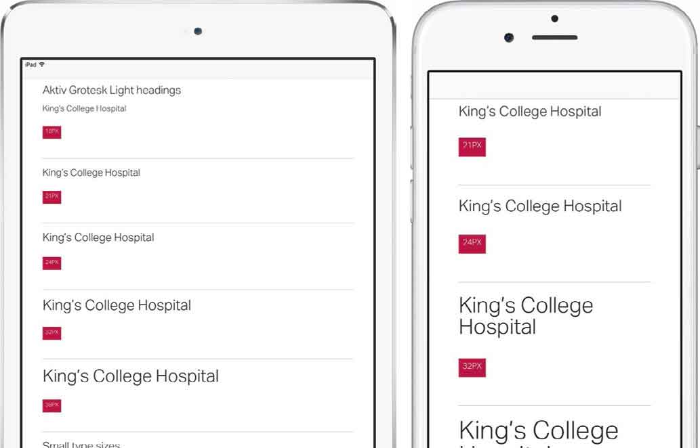

# 第6章　Web设计规范

> 在几乎每一个项目的开始，我们都会问客户是如何看待他们自己的品牌的。我们称之为品牌个性采访,我们会这样问我们的客户：
> “假设你的品牌是一个人。这个人可以是今天真实存在的，也可以是一个历史人物，还可以是某本书或某部电影中的虚构角色。事实上,他不一定是一个真实存在的人。”
> 这不是开玩笑，每次我都会拿摩根•弗里曼举例子。接下来我们问：
> “你觉得品牌的哪个部分吸引你，以及这些特征和你想要如何表达你的品牌。”
> 人们常说，摩根•弗里曼迷人的地方在于他的可靠而且值得信赖。最后，我们要求人们描述出最能体现品牌的六个特征。与此同时，我们也会询问客户不想让品牌呈现出哪些特征。下面有一些特征是我们在访谈中使用的例子。
> + 有趣但不搞笑
> + 机智但不滑头
> + 严肃但不沉闷
> + 专业但不刻板
> + 友好但不客套
> + 时尚但不浮夸
> 我们使用这些问题的答案来在图片库中寻求合适的颜色。当我们第一次与别人合作时，可以通过安排研讨会来解决这些品牌个性的问题。如果是为一个小团队（六人）服务，我们会与每个人讨论上述问题；对于更大的团队，最好让他们分成三人或四人小组分别讨论，在会议结束时，我们把大家聚在一起对比大家的想法。

## 品牌个性采访

当你走进房间，两个人正在为一件事争论，而你恰好知道答案，那么就会产生一种不好的氛围。一场精彩的音乐会或者足球比赛中，也会有令人难以置信的气氛。这往往很难描述，难以确定。这就是你感受到的。在设计中，气氛包括从布局中分离出来的颜色、字体和纹理。在本章中，我们将探讨气氛的概念以及学习如何设计它。

## 从字体开始

当人们看一个设计稿时，经常把焦点放在色彩鲜艳的图形和照片上，但是一个好的设计可能是因为选择了一款个性的字体。这就是为什么我们需要制定Web设计风格指南，我们在客户说一些很外行的话的时候就会用到它。我们首先关注排版元素：标题、段落、各种列表、引用、表单和表格文本，以及其他元素。

当我们设计版式时，通常会平衡个性和可读性。偶尔，我们会发现这两个属性融合于一个字体上，而有时需要组合使用两种字体才行。一种字体作为主要字体，而另一种字体则体现个性的一面。在工作中，我们为选择合适的字体花了大量的时间。

<b class="my_markdown">这种HTML字体元素集合的形式并不罕见，Jeremy Keith的Pattern Primer和Bourbin Bitter也和我们的很类似，你还会发现很多框架都采用这种方法。</b>

<b class="my_markdown">在SETM Learning的设计项目中，我们采用了高度灵活的Bliss字体。在整个网站中，我们使用了它的多种风格和粗细。</b>

<b class="my_markdown">在国王学院医院的项目中，我们使用了Aktiv Grotest和Lexia这两种字体，它们都来自字体设计公司Dalton Maag。</b>

## 活字校样

选择字体只是排版过程中的一部分，在响应式Web设计时，我们需要让版式在诸多不同类型的屏幕上都清晰且可读。这不仅意味着要兼顾不同的屏幕尺寸，同时还要确保排版在低分辨率和高分辨率上显示得一样好。

在过去，我们花了大量的时间和心血使用Photoshop或者Sketch来打磨版式细节。今天，要想实现一个渲染准确的响应式版式，不能再依赖一款图像处理工具了。我们需要使用CSS来设计版面，然后使用HTML在不同设备的浏览器上测试。

我们把这种方法叫做活字校样。这些HTML和CSS文件只包含标题和段落元素。

+ 段落字号： 12px - 21px
+ 标题字号 ：12px - 38px
+ 小文本字号 ：9px - 12px

## 测试可读性

活字校样不仅简单，而且易用。它们帮助我们和客户更好地协同工作，来设计出最好的排版。在协作设计过程中，我们仔细考虑适当的字号，并请客户在他们携带的设备上进行测试，同时鼓励他们邀请其他同事一起参与。

这里有一个案例：在国王学院医院的项目中，我们担心国家卫生服务的标注字体（Frutiger 45)在小屏幕上以较小字号显示时可能会令不易识别。因此，我们寻找了很多与Frutiger 45外观相近的开源字体，并测试了几种备选方案，最后确定使用Dalton Maag的Aktiv Grotest字体。

我们采用了两种活字校样，它们帮助我们在字体间做决定。第一个包含Frutiger 45,另一个是Aktiv Grotest。在我们客户使用的几个设备上并排显示来测试了两者的可读性，这帮助我们迅速做出判断，而且可能比我们看静态视觉效果更加准确。

<b class="my_markdown">就几分钟，国王学院医院的团队就能选择Frutiger（左边）或Aktiv Grotest（右）作为他们新设计的字体。</b>

## 

## 决定最小和最大的尺寸

无论面对什么项目，遇到的第一个挑战就是为特定类型的设备选择合适的字号。我们使用活字校样来帮助决定不同尺寸屏幕上的最小或最大字号。使用什么具体的设备并不重要，确切的尺寸、型号或操作系统也不重要，它们的比例和特征才是最重要的。我们的基本字号由这些设备类型来决定。

+ 较小的智能手机： iPhone 5s
+ 中等的智能手机： iPhone 6s
+ 较小的平板电脑： iPad mini（具有或不具有Retina显示屏）
+ 较大的平板电脑： iPad Air
+ 笔记本电脑： MacBook
+ 台式电脑： iMac

显然，我们喜欢Apple产品，但如果你拥有其他相似类型的智能手机、平板电脑和个人电脑，使用活字校样也会很有效。

## 测试段落、标题和文本

我们先看小屏幕上的段落，把能看得舒服的最小字号设置为最小字体。12px看起来太小，是因为我们的脸没有贴近设备屏幕？，那么13px或14px看起来会舒服一些吗？

然后，将同样大小的文字段落放到大屏幕上来看。这时观看距离会对效果有所影响，我们的眼睛通常会离大屏幕远一些，所以需要看一下字号是否仍然适合，如果不适合，我们还要增大字号来适应更远的观看距离。通过这种方式，我们可以快速为各种类型的设备选择最合适的字号。

<b class="my_markdown">相对于em或rem单位，客户更容易理解px，即像素， 因此我们以px为单位来设置文本字号。当然，在这个过程中，我们会把字体转换为弹性元素。</b>

<b class="my_markdown">活字校样是一种简单的方法，它能够帮助我们为每种类型的设备的标题设置最大的字号。</b>

使用相同的方法，还可以为标题和其他元素确定合适的字号。大标题使设计看起来更引人注目，然而它们更加适合大屏幕；小屏幕上的空间有限，每行只能显示几个词，因此需要谨慎地设置字号，不然看起来很不舒服。我们首先为小屏幕选定合适的标题字号，然后在不同的设备类型上测试。注意观察变化，一直到我们所能测试的最大屏幕。

对于按钮上的小文字、导航和页脚，使用相同的方法，都是先从最小的屏幕开始。

## 添加CSS媒体查询

现在活字校样能让我们快速的确定段落排版最合适的字号，但在以前，我们可能需要打开Photoshop或Sketch。在将样式添加到网页设计风格指南之前，我们会通过CSS媒体查询来匹配我们的设备尺寸，这种方式经常帮助测试我们研究的结果。

我们先使用媒体查询测试了排版，下一步在与客户合作的过程中，我们会展开非正式的讨论。首先把活字校样放到不同类型的设备上，然后让客户来确认排版。我们发现，让客户参与决策有几个好处，他们更容易确认字号，因为我们鼓励客户携带自己的设备，这样我们就可以在自己手头没有的设备上测试这些排版。

## 判断印刷颜色

印刷颜色不是指文本的颜色，而是页面上的文本块的密度。选择合适的密度不仅对设计外观很重要，同时对可读性也很重要，尤其是在响应式Web设计中，它特别有用。

有多种因素会影响印刷颜色：字体、字母间的间隔（在CSS中，我们称之为字母间距 `letter-spacing` ，在其他设计领域称为tracking），以及文本行之间的空间（在样式表里，我们称之为行高 `line-height` ，但在其他领域是指一些非常相似的行距)。

下面看看这三种因素在小屏幕上的截图。

仔细观察这个例子，你应该能看到中间的图会显得比较暗，即使它使用了与其他设备一样的尺寸和颜色。因为我们选择了某种字体，这种字体使设计看起来更黑。

再次使用这个例子，为了让印刷颜色变得更加明亮，我增加了行高 `line-height` 。这样就直接影响了排版的外观。

这就是告诉我们，设置响应式断点的时候，需要密切关注行高 `line-height` 是如何影响排版颜色和可读性的，这和我们关注的字号一样重要。

### 调整行高

根据经验，当文本的宽度变长时，我们应该增加行高 `line-height` ，如在不同尺寸的设备上显示，或者在相同设备的竖屏和横屏旋转。然而，通常设计师只对 `body` 元素设置一次行高 `line-height` ，而忽略调整屏幕宽度和文本长度增加的情况。我们应该不断调整行高 `line-height` ，在响应式断点和活字校样时就开始，在更宽的列和更大的屏幕上，增加文本的行高 `line-height` 。

<b class="my_markdown">我将跨响应式断点调整行高的过程称为比例优先（proportional leading）。我在2010年7月时第一次提出了这个概念。</b>

### 检查字体加粗

随着时间的推移，高分辨率Retina屏幕变得越来越大，从iPhone 4，到iPad，然后是MacBook，最后到iMac。可是，不是每个人都那么幸运地拥有一块高分辨率显示屏。因此，设计师和开发者必须考虑在低分辨率或高分辨下，网页如何渲染。

活字较样再次成为检查字体跨屏幕分辨率的一种好方式。选择并使用一款时髦的细字体之后，必须确保它以低分辨率或高分辨率渲染时都能很好地呈现。

<b class="my_markdown">当以低分辨率渲染较细的文字时（左），我们可以通过给同一款字体加粗来修正它（右）。</b>

## 颜色的运用

在Web设计风格指南里，颜色是设计规范的另一个方面。用户访问网站或使用APP时，颜色可以塑造氛围，唤起用户的情绪反应。我们可以使用颜色来向用户传达交互意图，比如用户可以做、不可以做或者不应该做的事情。下面总结一下网站或APP的交互元素。

+ 链接 `active` 、 `hover` 和 `visited` 状态。
+ 不同类型的表单按钮，包括 `disabled` 、 `active` 和 `hover` 状态。
+ 不同类型的表单输入框。

<b class="my_markdown">我们可以用色彩来强调特定类型的内容，例如给这些内容添加背景和边框。</b>

在设计时，颜色可以让我们通过设计来向用户传达信息，例如“可以点击什么？不能点击什么？已经点击什么？应该谨慎地点击什么?”

依靠Web设计风格指南，就可以恰到好处地选择这些颜色。与静态视觉方案相比，使用风格指南能让我们更加系统地考虑如何使用颜色。这对网站或APP用户非常重要，,因为他们会发现我们的设计非常简单易用。

## 选择颜色

一些客户在一个项目里带来自己的颜色集合，通常是品牌设计规范方案的形式。其他时候他们可能只有那个使用在他们logo上的单一的颜色，我们的工作就是创建一个调色板的颜色来搭配它。我希望每一个设计师都有自己的神奇的方法来创建颜色调色板。在我的工作室,我们一直在到处寻找色彩的灵感。我们已经开发了一些流程,它们帮助我们选择颜色,这些灵感来自于我们的客户，他们告诉我们有关他们的组织和他们的品牌的颜色。

## 确定一组颜色

优秀的设计并不需要一系列复杂的颜色，相反，相对简单的配色更容易将设计感体现出来。在我们的项目中，大部分设计只包括四种颜色甚至更少。我们把选择的颜色归类以下几种。

**主要色：** 最常用的品牌、超级链接和主要背景色，包括按钮。

次要色：经常用来表示交互元素，例如超链接的hover（鼠标悬浮）颜色和点击按钮时的背景色。

**中性色：** 按钮的背景、复选框、表格条纹和其他元素。我们经常在边框和其他水平线上使用深色或浅色的中性颜色。

**强调色：** 强颜色很少使用， 它经常用于与主要色的对比，如报错和警告的背景色，以及边框颜色。

在国王学院医院的项目中，使用的主要颜色就来源于它现有品牌的颜色，这同时也能够反过来影响NHS的品牌设计规范。

再次强调，依靠Web设计风格指南，就可以恰到好处地选择这些颜色。它给参与项目的设计师和开发人员提供了一个参考，并可以帮助客户向公司的其他同事解释为何选择某种颜色。

<b class="my_markdown">Adobe Color CC（color.adobe.com）是一款非常有用的工具，可以用来创建调色板。在国王学院医院项目中，我们用它来定义次要色和强调色，然后在调色板中添加了两种中性颜色，而不是一种。</b>

### 确定色调

2004年5月，我在博客上的第一篇文章里描述了一项技术——从一组核心颜色着手，创建拥有更多颜色的调色板。也就是我在前一节中介绍的，如主要色、次要色、中性色和强调色。

自2004年以来发生了很多变化，令人难以置信，但我仍然在使用这项技术，几乎在每一个项目中都会用到。它非常简单。

+ 创建五个方块，并用你选择的其中一个颜色去填充它们。
+ 调整方块的透明度来稀释颜色强度。我用90%、75%、50%、25%和10%。
+ 用你选择的颜色创建灰暗的色调，并把这五个方块放在一致的黑色底部上。
+ 重复上面的动作，但是这次创建亮色调，并放置在白色方块的底部。
+ 重复每个颜色设置，创建你需要的所有色调。

在STEM Learning公司的品牌设计规范中，四种颜色分别代表科学（Science）、技术（Technology）、工程（Engineering）和数学（Math）。在品牌设计规范下，我们设计了新网站，并提炼出了一个很酷的调色板，中性色和鲜艳色形成了很美的对比。

STEM Learning品牌设计规范中的四个生动的颜色不能满足我们的需要，所以我们使用可靠的技术来丰富调色板，增加更多微妙的颜色。这种技术可能比较老旧，但事实证明，我们创造的调色板恰到好处。

### 测试颜色的可访问性

事实上，许多设计师直到项目的后期才做颜色对比和可访问性测试， 这让我很为难。对我来说，色彩对比和可访问性不应该是测试工作，而是设计任务。所以我们需要在设计过程中关注它们。使用Web设计风格指南最大的好处是，我们更早地关注可访问性，然后花更多时间纠正潜在的问题。

当测试颜色的可访问性时，需要确保元素的背景色有足够的对比，并且里面有一些文本。我们可以改变对比度或选择互补颜色作为背景色和前景色。

在国王学院医院项目的早期，背景色和前景色的对比度不足。

幸运的是，我们在把颜色调色板交给客户之前，就测试了对比度，并调整了设计。

<b class="my_markdown">我觉得在灰度下进行设计对于测试颜色的可访问性非常有效。这不仅让我们把注意力放在对比度上，还能让我们在排版布局时避免被干扰。</b>

有一些很棒的工具可以帮助我们检查颜色组合的对比度，我个人最喜欢的是Lea Verou对比度检查器。这款工具简单便捷，适合所有人使用。

## 添加纹理

当我们创建设计风格指南时，纹理指的是修饰方面，有助于让设计富有个性。纹理包括边界样式、阴影和容器的形状。当然，纹理有时也可以包括拟物设计纹理。所以当你需要时，可以制作人造革和撕纸边缘的效果。

边框和间隔决定着纹理。我相信所有的网站设计中都包含了边框，它们可以是 `solid` 、 `double` 或者 `dashed` 形式。如果要设计一个复古的外观，我们甚至可以使用早起的CSS属性，如 `groove` 和 `ridge` 、 `inset` 和 `outset` 。

再进一步，我们还需要决定边框的宽度，以及这些边框的宽度是否统一。对于一个设计，我们可能希望所有边框一样宽；或者，我们可能会采用不同的宽度来体现立体感。

另一个问题是，如何使用各种分界线样式来创建层次结构。在文章内部的元素 `article` 之间，我们可以使用虚线边界；在文章之间，可以使用实线；紧密的双边框可以表达一个层次结构。

背景也会影响纹理。如何给内容区域阴影使用背景？我们会使用纯色？还是渐变？或者图案？

盒子的设计可以使用纹理。我们把盒子做成圆角还是直角？如果是圆角，那么四个角的半径都是相等的？或者将其中一个角设计得更圆，创造出不寻常的形状?

按钮的外观关乎纹理。我们想让按钮在屏幕上看起来像个真实的物理按键吗？如果想要实现这种拟物化效果，按钮的光影应该是怎样添加？渐变会使按钮看起来很光滑？使用阴影能够将按钮从背景中突显出来吗？我们要不要给它们使用背景或使它们透明？我们会跟随时尚，并添加细的轮廓和大写按钮文本吗？

我们如何对待内联图像？如何给它们添加细边框？如何添加白色粗边框来模拟宝丽来相片？图标采用什么风格？使用图形或手绘?

这些有关纹理的设计决策，能让你的设计独一无二，它或有趣、或敏感、或严肃、或专业，但对用户总是友好的。

## 静态图像的价值

为设计确定风格对于响应式Web设计是个优势，但它也有缺点。当我们分别关注风格和组件时，有时很难把它们形成一个统一的整体。

由于这个原因，设计很容易脱节，缺乏连通性。因此，我们需要基于一点来审视设计的方方面面，以防止上述情况的发生。

在浏览器里讨论设计和静态视觉效果，很容易使人陷入争论。事实上，代码和视觉效果缺一不可。HTML和CSS编辑器和图形工具是最有效的，我们应该使用它们。几乎在每个项目开始时，我们都会在纸上画草图，因为在早期表达想法，铅笔和纸绝对是最好的工具。

当确定了一个方向后，我们开始敲代码，在浏览器里尝试版式布局、原型交互元素和测试早期的设计。毫无疑问，HTML和CSS是这个阶段最好的工具。

在设计排版、色彩和纹理的过程中，我们几乎完全在浏览器中使用HTML和CSS，因为我们知道它给我们最真实的结果。在设计方向之间转换时我们使用代码快速迭代。当需要敏捷灵活时，我们发现代码和浏览器是目前为止最好的工具。

我们喜欢在浏览器中使用HTML和CSS进行设计，但对于某些环节，Photoshop或Sketch工具更好用。说出来可能吓着你，我们经常创建静态视觉效果，有时甚至是完整的Web页面，因为我们希望看到设计的整体，而它可能只是一个标题。

我们会制作关键页面的视觉效果，也许是文章列表或一系列产品、博客或新闻条目，有时甚至是一个主页。因为我们发现，设计关键视觉效果，会让设计更加连贯。

与过去不同的是，我们不会制作出所有页面的视觉效果，那样做没有什么收获，甚至是白费功夫；此外，我们也不会设计小屏或中屏版本，而仅制作台式机版本，因为静态图像从来就不是用来解决响应式设计问题的工具。

当要添加一些额外的设计细节时，使用静态版本的设计依然有效。并且，如果想尝试添加微妙的轮廓、阴影或底纹时，无论你的代码功夫有娴熟，还是应该使用Photoshop或Sketch，它们是不可替代的。

这些小细节会带来很大的改变，可以很容易地将一个普通的设计变得更有趣。现在你可能会问：“哪些方面不能在浏览器中做呢?“事实上，答案是没有。然而图形化工具环境可以让我们远离HTML和CSS代码实现中的实际问题，有助于我们更清晰地关注视觉细节。

## 打破传统

过去五年中，网站和应用设计规范发生了巨大的变化。就像我们设计的响应式网站，设计风格、开发组件已经成为一种越来越普遍的设计实践。我们设计色彩、字体和纹理，开发Web设计风格指南和样式库，并把它们制作成工具，而不仅仅是一纸文档，这帮助我们更清楚地关注响应式断点的设计。

