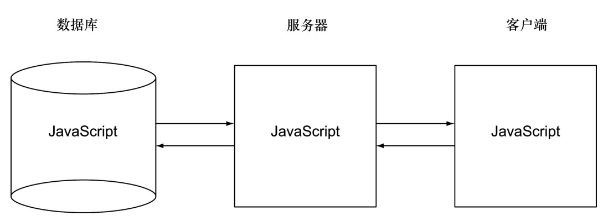

## 
  第1章 第一个单页应用

本章涵盖的内容

定义单页应用

比较最流行的单页应用平台：Java、Flash和JavaScript

编写第一个JavaScript单页应用

使用Chrome开发者工具查看单页应用

探讨单页应用对用户的好处

本书是为Web开发人员、架构师和产品经理而编写的，他们至少要有些JavaScript、HTML和CSS的经验。如果你从来没有涉猎过Web开发，本书就不适合你，但不管怎样还是欢迎购买。有很多非常不错的教初学者开发和设计网站的书，但这一本不是。

希望本书成为很好的设计和构建大规模单页应用的指南，这些应用从前端到后端都使用JavaScript。如图1-1描述，实际上数据库、Web服务器和浏览器应用都使用JavaScript语言。

我们花费了最近的6年时间，主导开发了很多大规模的商业级和企业级单页应用。在这期间，我们不断变更方法以便战胜遭遇的挑战。我们在本书中分享了这些方法，它们帮助我们更快速地进行开发，提供了更好的用户体验，保证了质量，提升了团队的沟通效率。

