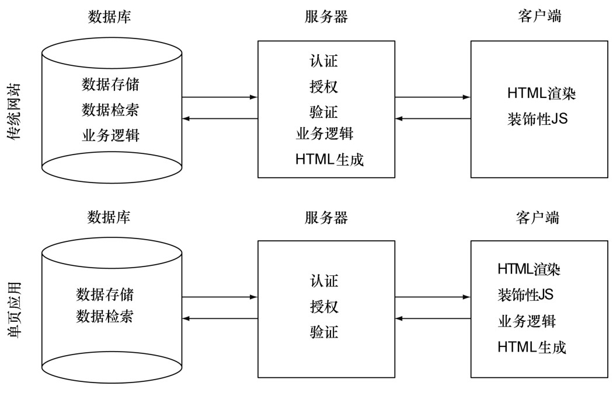

#### 
  1.1.3 我们的关注点

本书演示了如何从前端到后端都使用JavaScript<a class="my_markdown" href="['#anchor7']">[7]</a>来开发有吸引力的、稳健的、可扩展的和易于维护的单页应用。除非另有说明，否则从这一刻起，当提到单页应用时，我们指的就是原生的JavaScript应用，业务和显示逻辑直接使用JavaScript编写，由浏览器执行。JavaScript利用浏览器技术来渲染界面，如HTML5、CSS3、Canvas或者SVG。

单页应用可以使用许多服务端技术。自从这么多的 Web 应用转移到了浏览器端，通常对服务器的要求就大大地降低了。图1-2展示了业务逻辑和HTML的生成是如何从服务端迁移到客户端的。

在第7章和第8章，我们会重点讨论后端，所使用的Web服务器和数据库的语言都是 JavaScript。你可以不选择这种方式或者可能喜欢另一种后端。这没关系，不管后端使用的是什么技术，本书中使用的大部分单页应用的思想和技术都是有效的。但是如果你想从前端到后端都使用JavaScript，那我们已经为你代劳了。

我们在客户端使用的库，包括用来操作DOM的jQuery，还有历史管理和事件处理的插件。我们使用TaffyD B2来提供高性能的、以数据为中心的模型。使用Socket.IO提供在服务端和客户端之间无缝的、近实时的消息传输。在服务端，使用Node.js作为基于事件的Web 服务器。Node.js使用Google V8 JavaScript引擎，擅长处理成千上万的并发连接。在Web服务器上也使用了Socket.IO。使用的数据库是MongoDB，它是一种NoSQL数据库，使用JavaScript原生的数据格式JSON来保存数据，也有JavaScript API和命令行接口。所有这些都是久经考验和流行的解决方案。

开发单页应用所需要编写的JavaScript代码，在规模上至少要比传统网站大一个数量级，这是因为应用的很多逻辑从服务端转移到了浏览器端。开发一个单页应用，可能需要很多开发人员同时编写代码，最终的代码量可能远远超过 100 000 行。以前为服务端开发而保留的约定和规范，在这种规模下工作是必需的。另外一方面，服务器软件已被简化，只和认证、验证和数据服务相关。在演示示例的过程中，请记住这一点。

