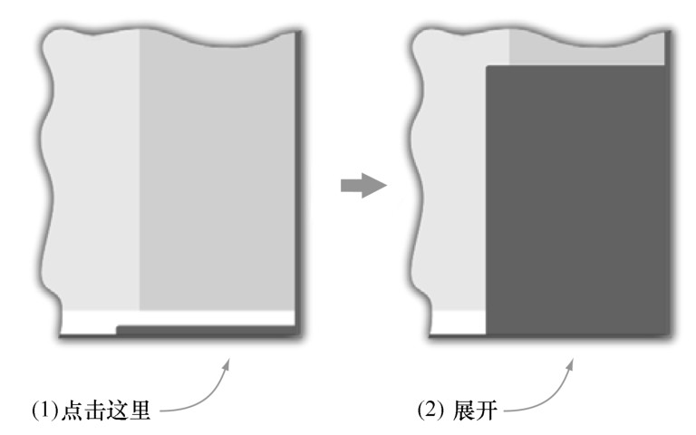

#### 
  1.2.1 定义目标

我们的第一个单页应用，目标不太大，在浏览器窗口的右下角显示一个聊天滑块，你可能在Gmail或者Facebook上见过，和它们是类似的。当应用加载时，滑块是收起的。当点击滑块时，它就会展开，如图1-3所示。再次点击，它又会收起来。

除了打开和关闭聊天滑块以外，单页应用通常还会做很多其他的事情，比如发送和接收聊天消息。为了使这个简介示例相对简单和简洁，我们会省略这些麻烦的细节。借用一句名言，单页应用不是一天建成的。不用担心，在第6章和第8章会再来讲解发送和接收消息。

在接下来的几个小节，我们会为单页应用开发创建一个文件，介绍一些我们喜欢的工具、开发聊天滑块的代码以及强调一些最佳做法。我们在这儿给出了很多需要吸收的东西，并不期望你现在就能理解所有的事情，尤其是我们使用的一些JavaScript技巧。在接下来的几章里面，每一个主题都会更详细地进行讨论，但是现在，请放松，不要担心这些鸡毛蒜皮的小事，知道是什么情况就行啦。

