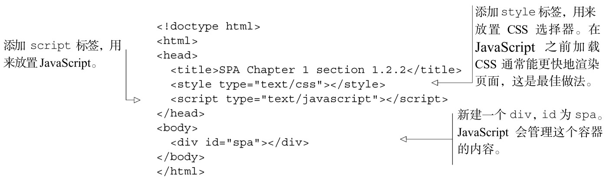

#### 
  1.2.2 创建文件结构

我们使用单个文件spa.html来创建应用，外部库只使用jQuery。一般而言，更好的做法是将CSS和JavaScript分成单独的文件，但开始时使用单个文件，对开发和示例都很方便。我们先规定在哪儿放置样式和 JavaScript，还会添加一个
容器，在其中编写应用的HTML代码，如代码清单1-1所示。

代码清单1-1 “小荷才露尖尖角”——spa.html

现在已经准备好了文件，我们使用Chrome开发者工具来查看应用的当前状态。

