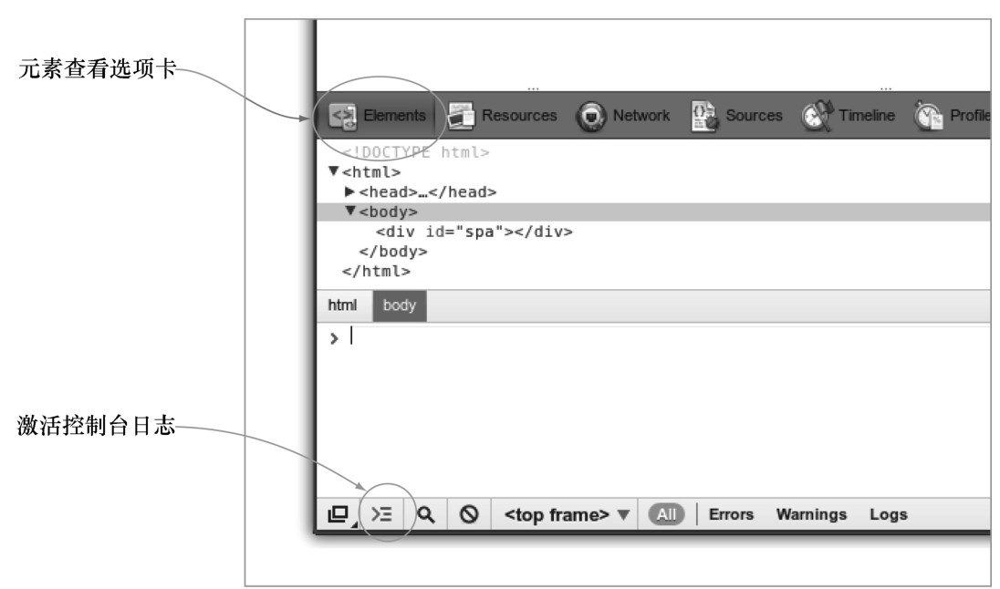

#### 
  1.2.3 使用Chrome开发者工具

使用Google Chrome 打开清单（spa.html）。看到的是浏览器空白窗口，因为还没有添加任何内容。但底层已有所效果了。我们使用Chrome开发者工具查看一下。

可以点击Chrome右上角的扳手图标来打开Chrome开发者工具，选择“工具”，然后选择“开发者工具”（菜单>工具>开发者工具）。这会显示开发者工具，如图1-4所示。如果没有看到 JavaScript控制台，点击左下角的Activate console按钮就能显示控制台。控制台应该是空白的，这意味着没有JavaScript 警告或者错误。这是正确的，因为当前还没有JavaScript。控制台上方的“Elements”区域显示了HTML代码和页面结构。

尽管我们在这里乃至整本书都使用Chrome开发者工具，但是其他浏览器也有类似的功能。比如，Firefox有Firebug，IE和Safari也都提供了它们自己的开发者工具。

在这本书中，当展示清单的时候，我们将经常使用 Chrome 开发者工具，以便确保HTML、CSS和JavaScript可以很好地在一起工作。现在我们来创建HTML和CSS。

