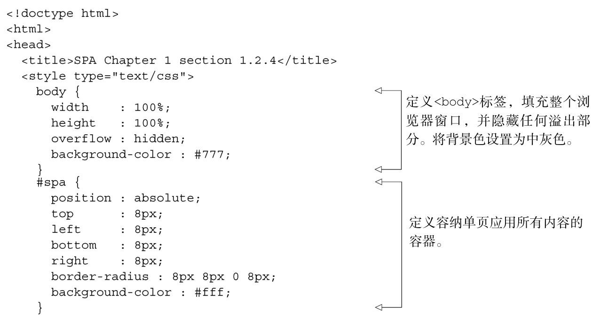
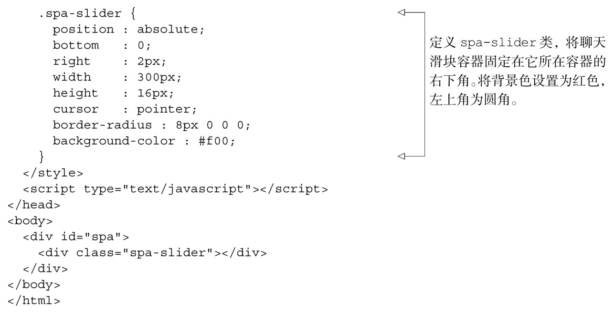

#### 
  1.2.4 开发HTML和CSS

我们需要在HTML中添加一个单独的聊天滑块容器。先在spa.html文件的<style>区块添加容器的样式。对样式部分的修改，如代码清单1-2所示。

代码清单1-2 HTML 和CSS——spa.html

当在浏览器中打开spa.html时，看到的滑块是收起的，如图1-5所示。我们使用了流式布局（liquid layout），界面按显示大小自适应，滑块总是固定在右下角。我们没有给容器添加边框，因为这会增加容器的宽度，从而妨碍开发，因为必须修改容器的大小来适应这些边框。在创建并验证了基本布局之后再来添加边框是很方便的，之后的章节就是这么做的。

现在已经有了视觉元素，该是使用JavaScript给页面添加交互功能的时候了。

