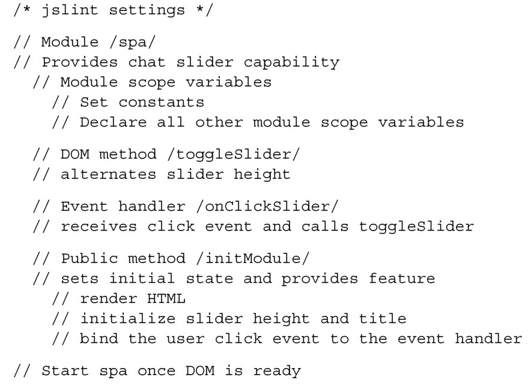
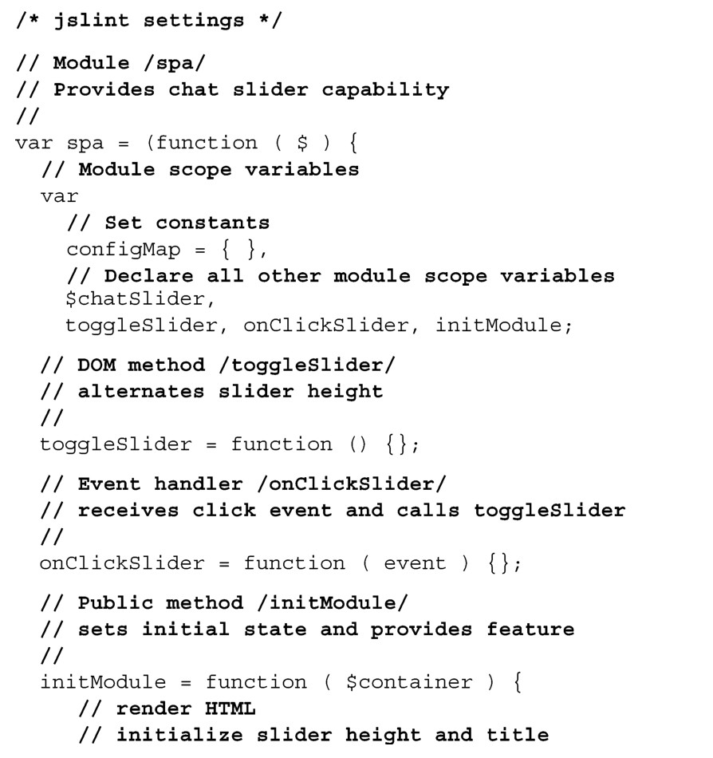
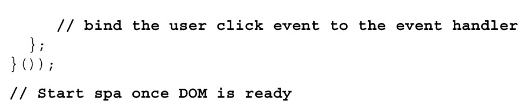
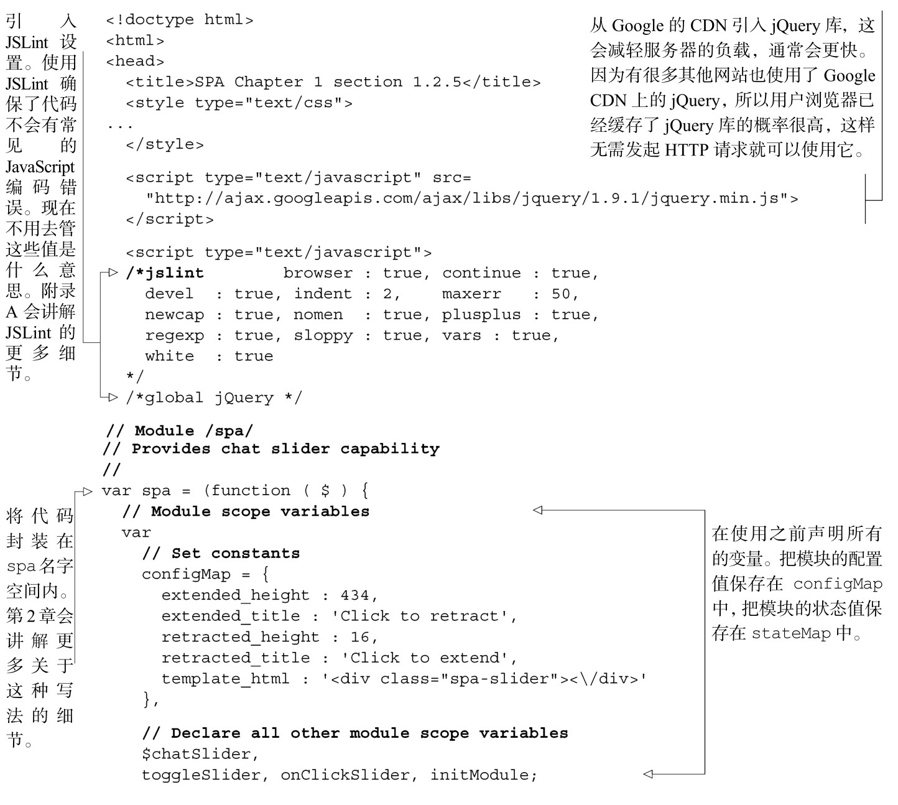
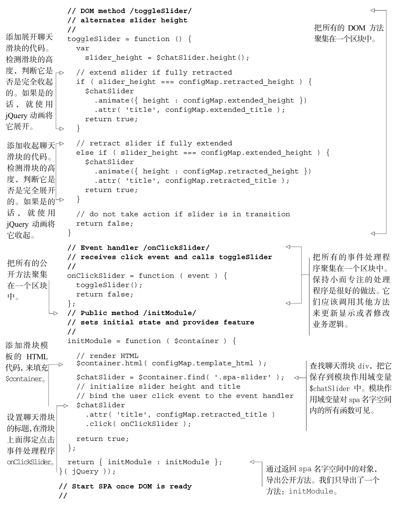
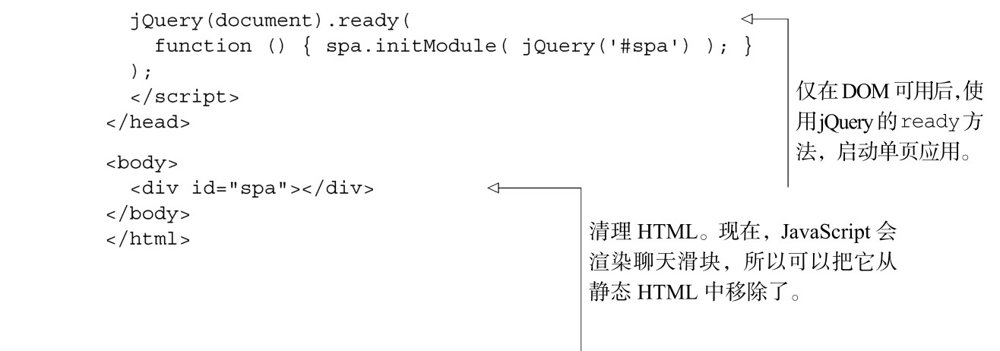
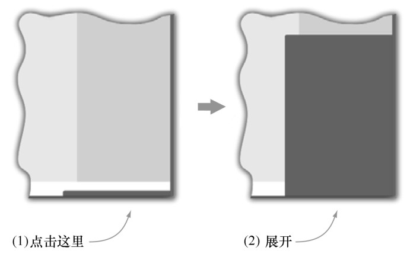

#### 
  1.2.5 添加JavaScript

我们想使用JavaScript 的最佳写法。有个工具会有所帮忙，它就是由Douglas Crockford编写的JSLint。JSLint是一种JavaScript验证器，能确保代码不会破坏很多明显的JavaScript最佳写法。我们也想使用jQuery，它是一种操作DOM的工具，由John Resig编写。jQuery提供了能很容易实现滑块动画的跨浏览器工具。

在编写JavaScript之前，我们先把想要做的事情列个提纲。第一个脚本标签加载jQuery库。第二个脚本标签会包含我们自己的JavaScript，分成以下三个部分。

（1）声明JSLint设置的头部。

（2）spa函数，创建和管理聊天滑块。

（3）一行在浏览器DOM可用时就调用spa函数的代码。

我们仔细地看一下需要spa函数做什么。经验告诉我们，要用一个区块来声明模块变量，包括配置常量。需要一个函数来切换聊天滑块，需要一个接收用户点击事件的函数，它会调用切换函数。最后，需要一个函数来初始化应用的状态。我们把提纲再细化一下，见代码清单1-3。

代码清单1-3 JavaScript 开发，第一轮——spa.html

这是一个好的开端！我们保持注释的原貌，来添加代码。为清楚起见，注释以粗体显示，见代码清单1-4。

代码清单1-4 JavaScript 开发，第二轮——spa.html

现在来进行spa.html的最后一轮开发，如代码清单1-5所示。先加载jQuery库，然后引入自己的JavaScript，其中包括JSLint设置、spa模块和一行在DOM可用时调用spa模块的代码。spa模块的功能现在是完备的。如果你现在没明白所有的事情，请不用担心，这儿有很多需要吸收的知识，在之后的章节我们会更加详细地讲解所有的内容。这仅仅是一个示例来告诉你能做些什么。

代码清单1-5 JavaScript 开发，第三轮——spa.html

不要过于担心JSLint验证，因为在之后的章节会详细地讲解它的用法。但现在需要讲解一些值得注意的概念。首先，脚本顶部的注释设置了验证偏好。其次，这段脚本和设置会通过验证，没有任何错误和警告。最后，JSLint要求函数在使用前就要声明，因此脚本是“从下往上”读取函数的，级别最高的函数在最后面。

我们使用jQuery，是因为它为基础的JavaScript功能提供了最优的、跨浏览器的工具：DOM的选取、遍历和操作，AJAX方法以及事件。比如，使用jQuery的$(selector).animate(...)方法，就能很容易地编写相当复杂的动画效果：在指定的时间周期内，使聊天滑块从收起到展开做高度变化的动画（反之亦然）。滑块的运动，先缓慢地启动，加速，然后再慢慢地停下来。这种运动叫做缓动，需要帧频计算、三角函数和跨主流浏览器的奇特实现知识。如果我们自己来编写，则需要几十行额外代码。

jQuery(document).ready(function)也帮我们节省了很多工作。只有在DOM可用之后才会运行这个函数。传统为此的做法是使用window.onload事件。由于各种各样的原因，window.onload对于要求很高的单页应用来说并不是一种高效的解决方案，尽管在这里区别不是很大。但是编写在所有的浏览器中都能使用的正确代码，是一件痛苦乏味和繁琐的事情 <a class="my_markdown" href="['#anchor8']">[8]</a>。

如前面的示例所示，使用 jQuery所带来的好处，大大地超过了它的成本。在上面的示例中，它缩短了开发时间，减小了脚本长度，并提供了稳健的跨浏览器功能。由于jQuery库压缩后的体积很小，并且用户在他们的设备上很可能已经有它的缓存，因此它的使用成本很低甚至可以忽略不计。图1-6演示了动画完成后的聊天滑块。

现在已经完成了聊天滑块的初步实现，我们使用Chrome开发者工具，来看一下应用实际上是如何工作的。

