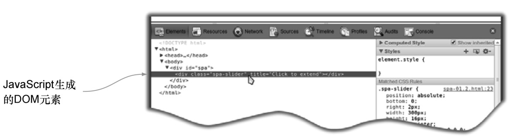
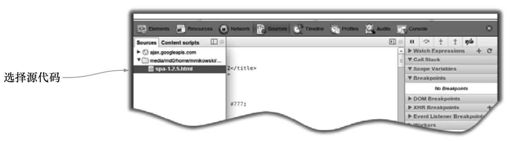
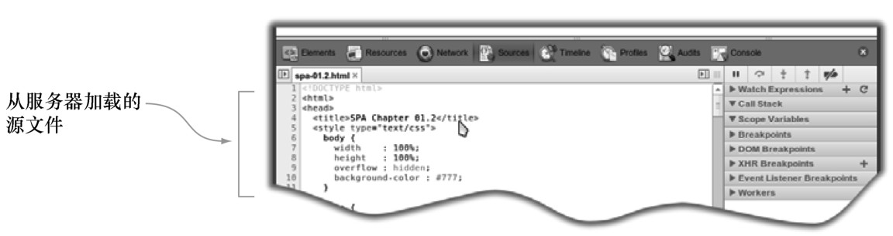
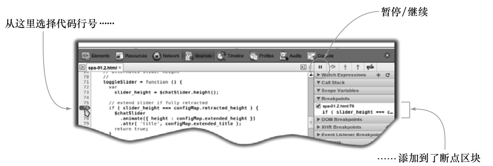
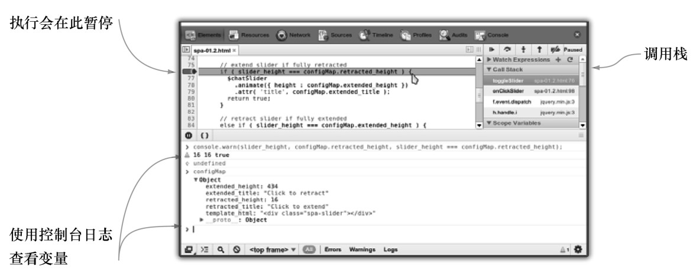
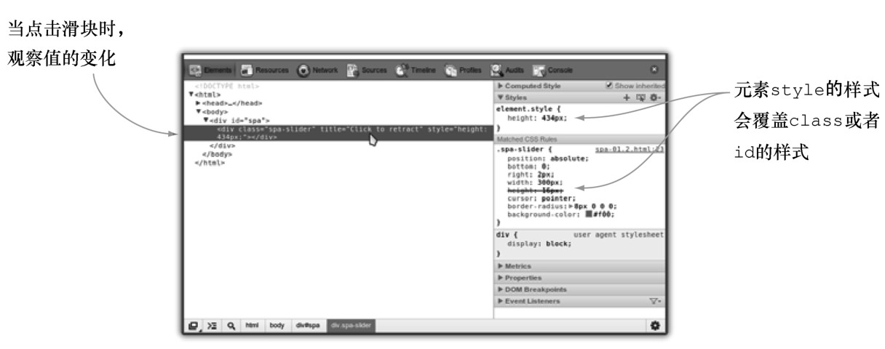

#### 
  1.2.6 使用Chrome开发者工具查看应用

如果Chrome开发者工具你已经用得很顺手了，可以略过此部分内容。如果没有，我们强烈建议你动手试一试。

在Chrome中打开文件spa.html。在它加载完之后，就马上打开开发者工具（菜单>工具>开发者工具）。

你注意到的第一件事可能是，DOM 中有了
元素，它已经被模块更改了，如图1-7所示。随着讲解的深入，我们会向应用中添加更多这样的动态元素。

我们可以研究JavaScript的执行情况，请点击开发者工具顶部菜单中的Sources按钮。然后选择包含JavaScript的文件，如图1-8所示。

在之后的章节，我们会把 JavaScript 放在单独的文件中。但对于这个示例，它是在HTML页面中的，如图1-9所示。需要向下滚动才能找到想要查看的JavaScript。

滚动到第76行时，看到的是一条if语句，如图1-10所示。我们应该想在执行该语句之前查看代码，点击左边的空白处添加断点。每当JavaScript解释器到达脚本的这一行时，它会暂停，所以能查看元素和变量，以便我们更好地理解发生了什么事情。

现在回到浏览器，点击滑块。我们将会看到JavaScript停在了76行的红色箭头上，如图1-11所示。当应用暂停的时候，可以查看变量和元素。可以打开控制台，输入各种变量，按下回车键查看该暂停状态下它们的值。我们发现if语句的条件为真（slider_height为16，configMap.retracted_height为16），甚至可以查看configMap对象这样的复杂变量，如控制台的底部所示。当查看完时，可以点击第76行左边的空白处来移除断点，然后点击右上角的Resume按钮（Watch Expressions的上面）。

一旦点击了 Resume 按钮，脚本会从 76 行继续执行，完成滑块的切换。我们回到Elements选项卡，看一下DOM发生了什么变化，如图1-12所示。在图中，我们看到由类spa-slider提供的height CSS属性（请看右下角的Matched CSS Rules），它被元素style的样式覆盖了（元素的style的样式的优先级比class或者id的要高）。如果再次点击滑块，可以观察到随着滑块的收起，高度实时地在发生变化。

我们简短地介绍了 Chrome 开发者工具，只演示了很小的一部分功能，以便帮助我们理解和改变应用底层正在发生的事情。在开发这个应用的时候，我们会继续使用这些工具，并且建议你花费一些闲暇时间学习一下http://mng.bz/PzIJ上的在线手册。磨刀不误砍柴工。

