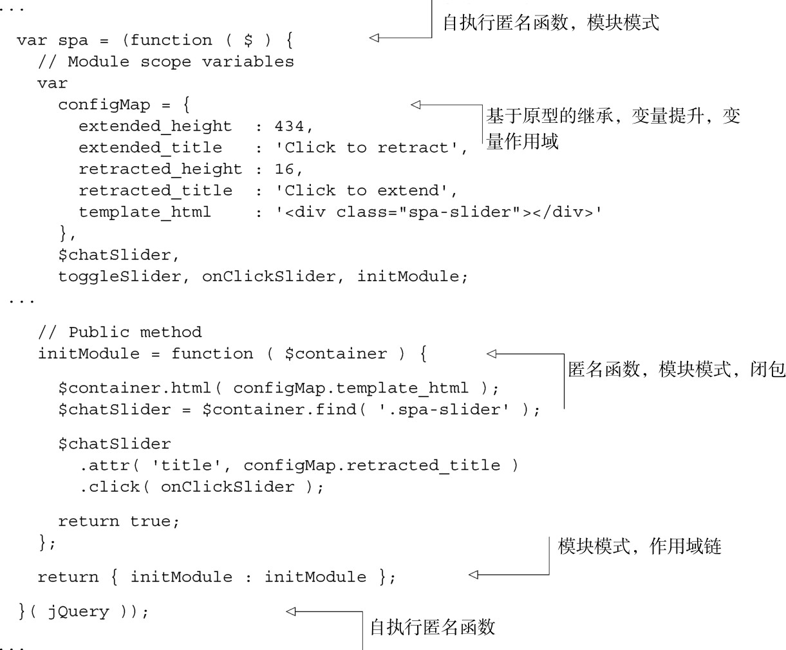
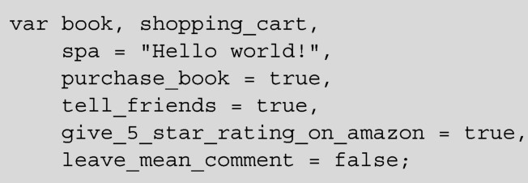
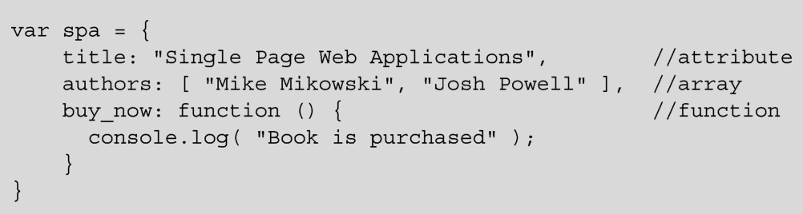

## 
  第2章 温故JavaScript

本章涵盖的内容

变量作用域，函数提升（function hoisting）和执行环境对象

解释变量作用域链（scope chain）以及为什么要使用它们

使用原型（prototype）创建JavaScript对象

编写自执行匿名函数<a class="my_markdown" href="['#anchor10']">[10]</a>

使用模块模式和私有变量

探索闭包的乐趣和好处

本章回顾JavaScript特有的概念，在构建大规模的原生JavaScript单页应用时需要知道这些概念。代码清单2-1中的代码片段是第1章中的，它演示了我们要讲解的概念。如果你完全明白“怎样”和“为什么”使用这些概念，那么可以略读或者跳过本章，直接翻到第3章。

为了能很轻松地跟上示例的思路，你可以复制本章中所有的清单代码，粘贴到Chrome 开发者工具的控制台里面，按下回车键就会执行代码。强烈鼓励你体验一下其中的乐趣。

代码清单2-1 应用中的JavaScript

编码标准和JavaScript语法

JavaScript的语法，对于缺乏经验的人来说可能很困惑。在继续阅读之前，懂得变量声明语块（variable declaration block）和对象字面量（object literal）是很重要的。如果你已经熟悉了这些概念，请放心跳过这一补充说明吧。我们认为很重要的JavaScript语法和良好的编码标准，请参见附录A的完整纲要。

变量声明语块

JavaScript使用关键字var来声明变量。变量可以包含任意类型的数据：数组、整数、浮点数、字符串等。没有指定变量的类型，因此 JavaScript 是一种宽松类型（loosely typed）的语言。即便是在给变量赋了值之后，值的类型也可以通过赋予不同的类型值而改变，所以JavaScript也是一种动态语言。可以用关键字 var 同时声明多个 JavaScript 变量并赋值，它们之间以逗号分隔：

关于变量声明语块的最佳格式，有很多的观点。我们优先考虑在顶部声明变量但不进行定义，其次才是声明变量的同时又定义它。如上面的示例所示，我们也喜欢在行尾添加逗号的方式，但对此不会很严谨，JavaScript引擎也不会在意。

对象字面量

对象字面量是指用大括号括起来的一组以逗号分隔的属性所定义的对象。属性用冒号设置值，而不是等号。对象字面量也可以包含数组，它是用方括号括起来的一组以逗号分隔的成员。可以将属性的值设置为函数来定义方法：

本书广泛地使用了对象字面量和变量声明语块。

