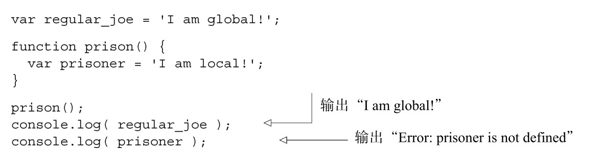
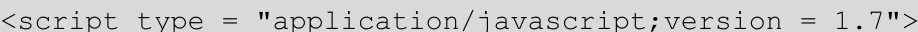
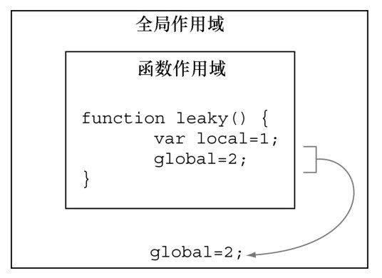
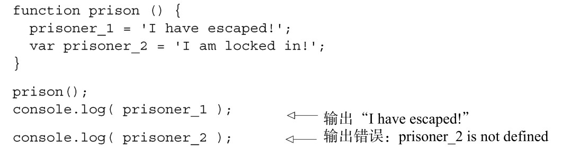
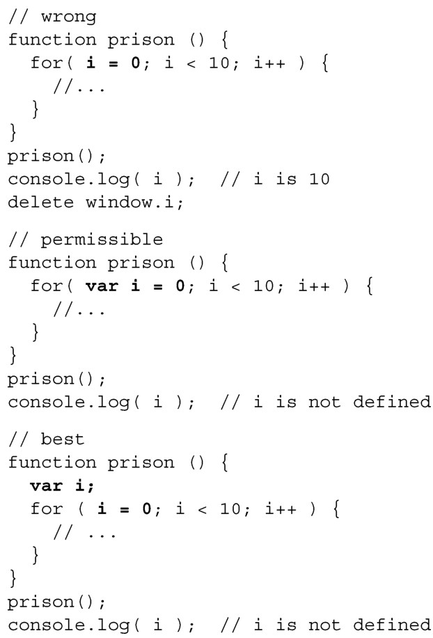
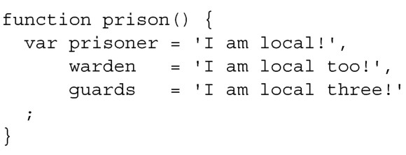

### 
  2.1 变量作用域

先讨论变量的行为和变量在作用域之内还是之外，是一个很好的起点。

在JavaScript中，变量的作用域由函数限定，它们要么是全局的，要么是局部的。全局变量处处可以访问，局部变量只有在声明它的地方才能访问。在JavaScript中，唯一能定义变量作用域的语块就是函数。就是这样。全局变量在函数外部定义，局部变量在函数内部定义。很简单，对不对？

换种方式来看，函数就像监狱（prison），在函数中定义的变量就像囚犯（prisoner）。正如监狱限制囚犯不让他们从监狱的围墙逃跑，函数限定了局部变量不让它们逃脱到函数之外，如下列代码所示：

JavaScript 1.7、1.8、1.9+和块作用域

JavaScript 1.7引入了let语句，它是一种全新的块作用域（block scope）构造器。很可惜，尽管JavaScript已有1.7、1.8和1.9的标准，但就算是1.7标准也没有在所有的浏览器上面实现。在浏览器还未兼容这些JavaScript新特性之前，我们假定不存在JavaScript 1.7 +的标准。尽管如此，我们还是来看下它是如何工作的：

要使用JavaScript 1.7，在script标签的type属性上添加版本即可：

这只是体验了下JavaScript 1.7+，另外还有很多变化和新特性。

要是真这么简单那该多好。你遇到的第一个关于JavaScript作用域的陷阱可能是，可以在函数中声明全局变量，只要省略 var 关键字即可，如图2-1所示。和所有其他的编程语言一样，使用全局变量几乎总是一种不明智的想法。

这么写是不好的——不要让你的囚犯逃走。另外一个经常出现这种陷阱的地方是，在声明for循环的计数器时忘了写var。请挨个运行下面的prison函数：

我们更喜欢在函数的顶部声明变量的写法，因为此时变量的作用域是相当清晰的。在for 循环初始化语句中声明变量，可能会导致人们认为变量的作用域被限定在 for 循环中，如同其他的一些语言。

我们把这种逻辑扩展一下，将所有的JavaScript声明和大多数的赋值合在一起，放在声明它们的函数顶部，这样变量的作用域就清晰了：

使用逗号将局部变量的定义合并在一起，使之一目了然，并且可能更重要的是，不大可能会发生无意的拼写错误以及创建了全局变量而不是局部变量。另外，你有没有注意到它们的对齐方式是那么漂亮？发现了没，从表面上来看，最后的分号像是变量声明语块的闭合标签？我们在附录A中会谈论这种和其他格式化JavaScript代码的方法，提升可读性和可理解性。变量提升是JavaScript另外一种有趣的特性，和声明局部变量息息相关。请看下一小节。

