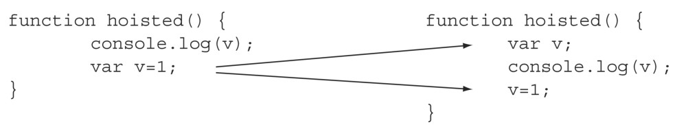
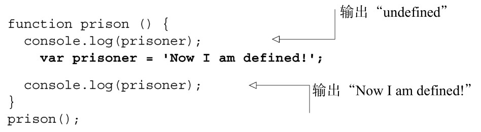
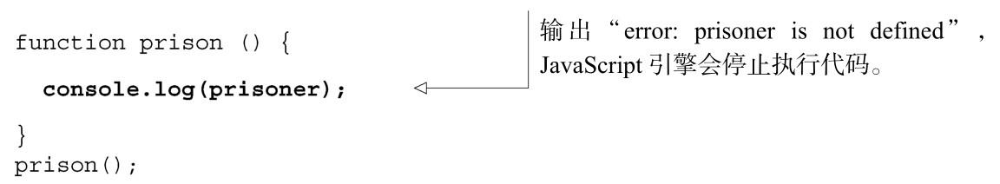
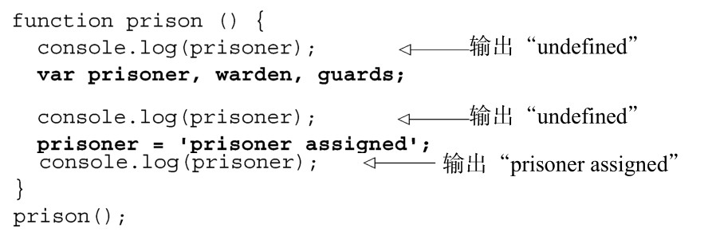
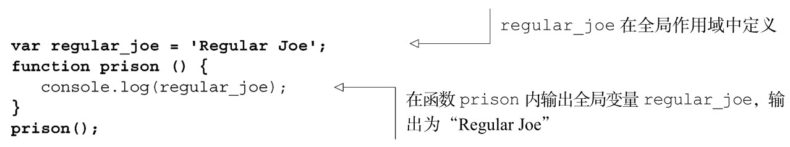
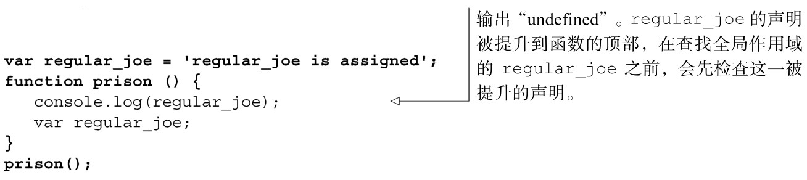

### 
  2.2 变量提升

在 JavaScript 中，当变量被声明时，声明会被提升到它所在函数的顶部，并被赋予undefined值。这就使得在函数的任意位置声明的变量存在于整个函数中，尽管在赋值之前，它的值一直为undefined，如图2-2所示。

JavaScript引擎并没有重写代码：每次调用函数时，声明都会重新提升

作为和图中代码的对比，我们尝试访问一个没有在局部或者全局声明过的变量，这会导致JavaScript运行时错误，JavaScript代码会停止在语句执行的地方：

因为变量声明总是被提升到函数作用域的顶部，所以在函数的顶部声明变量总是最好的做法，更好的是使用单个var语句。这和JavaScript的做法是一致的，避免了我们在前面的图中所演示的那种困惑。

这种作用域和提升行为，有时结合在一起时会引起某些惊人的表现。请看下面的代码：

执行prison函数时，console.log()请求输出regular_joe，JavaScript引擎首先在局部作用域内检查 regular_joe是否已被声明。由于 regular_joe未在局部作用域内声明，然后JavaScript引擎检查全局作用域，找到了它的定义并返回了它的值。这叫沿着作用域链往上查找。但是如果变量在局部作用域内也声明了呢？

这是否违反直觉或者令人困惑？我们来看一下JavaScript在底层处理提升的方式。

