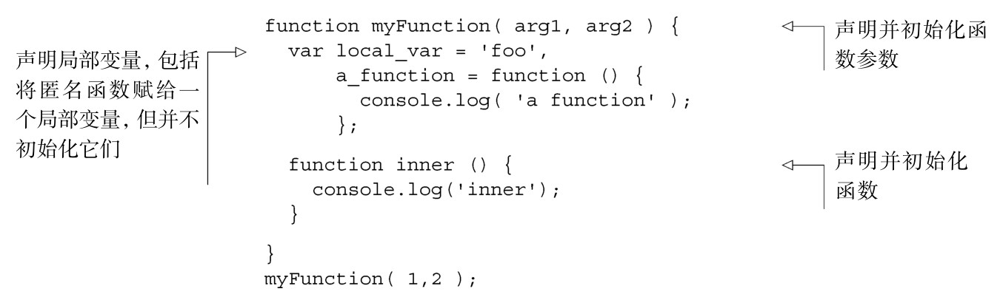
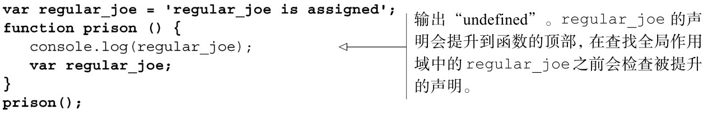
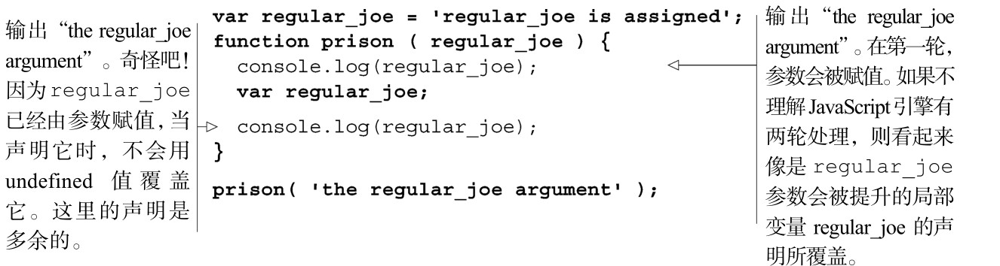

#### 
  2.3.1 提升

当秘密被揭开的时候，和各种各样的魔术把戏一样，几乎令人失望。秘密是JavaScript引擎在进入作用域时，会对代码分两轮处理。第一轮，初始化变量；第二轮，执行代码。我知道，这很简单。我不知道为什么通常不用这些术语来描述。我们再更深入地研究一下 JavaScript 引擎在第一轮期间所做事情的细节，因为有一些很有趣的影响。

在第一轮（见代码清单2-2），JavaScript引擎分析代码，并做了以下3件事情。

（1）声明并初始化函数参数。

（2）声明局部变量，包括将匿名函数赋给一个局部变量，但并不初始化它们。

（3）声明并初始化函数。

代码清单2-2 第一轮

在第一轮，局部变量并未被赋值，因为可能需要在代码执行后才能确定它的值，而第一轮不会执行代码。参数被赋值了，因为在向函数传递参数之前，任何决定参数值的代码都已经运行了。

我们可以对比在演示函数提升时的最后一段代码，来证明参数值是在第一轮设置的，见代码清单2-3。

代码清单2-3 变量在声明前是未定义的

在prison函数中声明regular_joe前，它是未定义的，但是如果regular_joe作为参数传入，它在声明前就有值了，见代码清单2-4。

代码清单2-4 变量在声明前有值

如果你看得云里雾里，没关系。尽管我们已经解释过了，在执行函数的时候，JavaScript引擎对它进行了两轮处理，而且在第一轮，它保存了变量，但是我们没明白它是如何保存变量的。明白JavaScript引擎是如何保存变量的将有希望消除剩余的困惑。JavaScript引擎把变量作为属性保存在一个对象上，这个对象称为执行环境对象。

