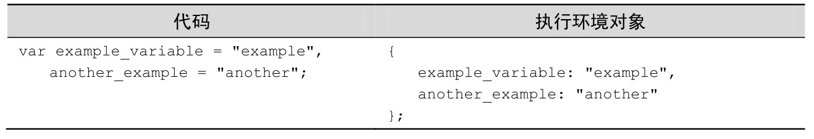
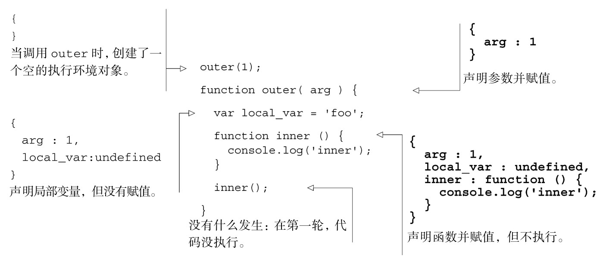
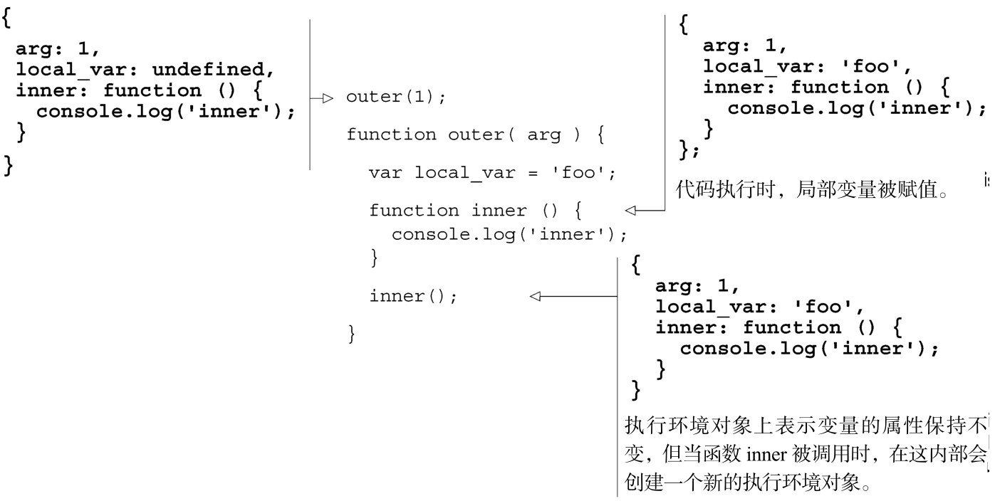

#### 
  2.3.2 执行环境和执行环境对象

每当函数被调用的时候，就会产生一个新的执行环境。执行环境是一种概念，是运行中的函数的意思，它不是对象。这就好比运动员在奔跑的环境中或者在跳跃的环境中。我们可以把运动员在奔跑的环境中，说成奔跑中的运动员，正如我们可以说成运行中的函数，但行话不是这么说的。我们称之为“执行环境”。

执行环境由函数在执行时发生的所有事物组成。这和函数声明是分离的，因为函数声明描述了当函数执行的时候会发生什么事情。执行环境是指函数的执行。

所有在函数中定义的变量和函数都是执行环境的一部分。在开发人员谈论函数的作用域时，执行环境也是其所指的一部分。如果变量在当前执行环境中可访问，则变量在作用域内，这是“如果在函数运行时变量可访问，则该变量在作用域内”的另外一种说法。

属于执行环境部分的变量和函数，被保存在执行环境对象中，执行环境对象是对执行环境的 ECMA 标准实现。在 JavaScript 引擎中，执行环境对象是一种对象，并且不是在JavaScript 中可以直接访问的变量。间接地访问执行环境对象是很容易的，因为每次使用变量，就是在访问执行环境对象的属性。

之前我们讨论了JavaScript引擎是如何分两轮处理执行环境的，声明和初始化变量，但是这些变量保存在哪里呢？JavaScript 引擎把声明和初始化的变量当作执行环境对象的属性。请看一下表2-1中的示例，它演示了变量是如何保存的。

有可能你从来都没听说过执行环境对象。在Web开发者社区，一般不会谈论它，大概是因为执行环境对象是 JavaScript 实现层面的东西，并且在开发的时候是无法直接访问的。

理解执行环境对象是理解本章剩余内容的关键，所以我们来研究一下执行环境对象的生命周期以及创建它的JavaScript代码，见代码清单2-5。

代码清单2-5 执行环境对象——第一轮

现在参数和函数已被声明并赋值，并且局部变量已被声明，接着进行第二轮处理，执行JavaScript，为局部变量赋予定义的值，见代码清单2-6。

代码清单2-6 执行环境对象——第二轮

由于可以在执行环境中调用函数，会产生很多层的深度。在执行环境中调用函数，会创建一个新的嵌套在已存在的执行环境内的执行环境，请看图2-3。

（1）在<script>标签内的所有东西都在全局执行环境中。

（2）调用 first_function，会在全局执行环境中创建一个新的执行环境。在first_function运行时，它有权限访问在调用它时创建的执行环境里面的变量。在这里，first_function 有权限访问在全局执行环境中定义的变量以及在 first_function 中定义的局部变量。我们说这些变量在作用域中。

（3）调用second_function，会在first_function的执行环境中创建一个新的执行环境。second_function有权限访问在first_function的执行环境中的变量，因为second_function是在first_function内部被调用的 <a class="my_markdown" href="['#anchor11']">[11]</a>。second_function也有权限访问在全局执行环境中的变量以及在second_function中定义的局部变量。我们说这些变量在作用域中。

（4）再次调用 second_function，这次是在全局执行环境中调用。这里的 second_function 没有权限访问在 first_function 的执行环境中的变量，因为这次second_function不是在first_function的执行环境中被调用的。也就是说，这次在 second_function 被调用的时候，它没有权限访问在 first_function 中定义的变量，因为它不是在first_function中被调用的。

这里的second_function 执行环境也没有权限访问先前调用的second_function中的变量，因为它们发生在不同的执行环境中。也就是说，当在调用函数时，没有权限访问该函数上一次被调用时所创建的局部变量，下一次调用该函数时，也没有权限访问这一次调用函数时所创建的局部变量。我们说这些不能访问的变量不在作用域内。

JavaScript引擎在执行环境对象中访问作用域内的变量，查找的顺序叫做作用域链，它和原型链一起，描述了JavaScript访问变量和属性的顺序。接下来的几节将讨论这些概念。

