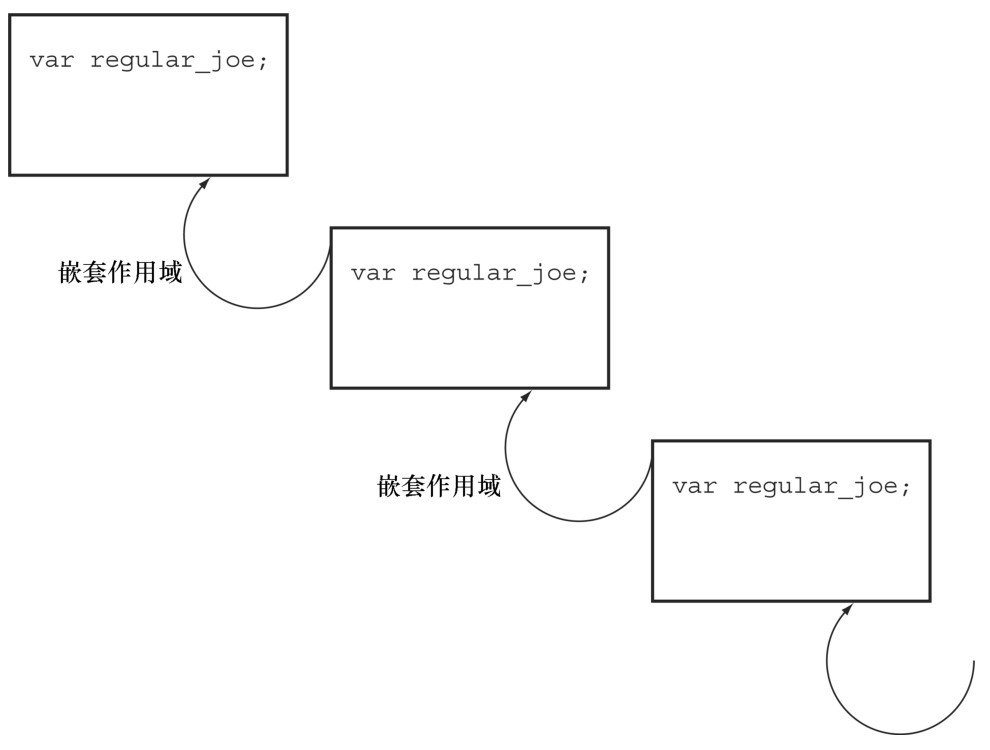
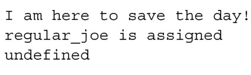
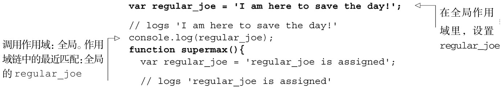
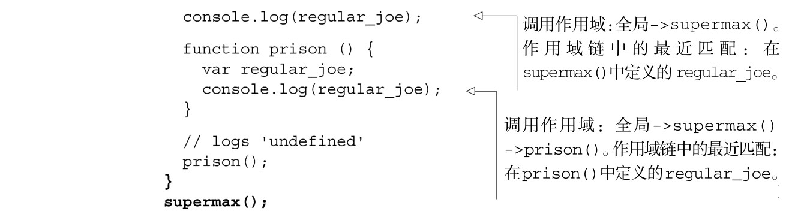
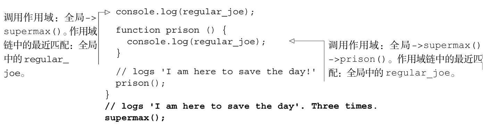
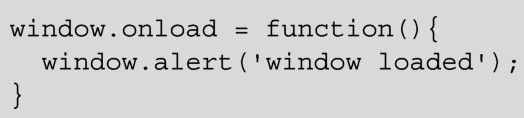
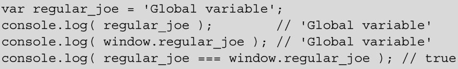

### 
  2.4 作用域链

直到现在，我们讨论的变量作用域主要限制在全局和局部的范围内。这是一个很好的起点，但是作用域是很微妙的，像上一小节讨论的嵌套执行环境。更准确地讲，可以把变量作用域看作链，如图 2-4 所示。当在查找变量的定义时，JavaScript 引擎首先在局部执行环境对象上查找。如果没有定义，则跳出作用域链，到创建它的执行环境中去，并且在该执行环境对象中查找变量的定义，依此类推，直到找到定义或者到达全局作用域为止。

为了演示作用域链，我们来修改先前的一个示例。代码清单2-7中的代码会打印下面的内容：

代码清单2-7 作用域链的示例——每次调用，regular_joe 在作用域内都有定义

在运行期，JavaScript 会检索作用域层级来解析变量名。它从当前作用域开始，然后按它的查找方式回到顶级的作用域，即window（浏览器）或者global（node.js）对象。它使用找到的第一次匹配并停止查找。请注意，这意味着在层级更深的嵌套作用域中的变量，会使用它们的当前作用域替换更加全局的作用域，从而隐藏更加全局的作用域中的变量。这有好处也有坏处，取决于你是否期望它这样。在实际的代码中，你应当努力尽量使得变量名是唯一的：在我们刚才看到的代码中，在三个不同的嵌套作用域里引入了同一名字的变量，这不是最佳做法的例子，它只是用来说明要点的。

在这个代码清单中，从三个作用域中查找变量regular_joe的值。

（1）清单中的第一处console.log(regular_joe)调用在全局作用域里面。JavaScript从全局执行环境对象上开始查找regular_joe属性。它找到了一个，值为I am here to save the day，并使用了这个值。

（2）清单中的第二处console.log(regular_joe)调用在supermax的执行环境中。JavaScript从supermax执行环境对象上开始查找regular_joe属性。它找到了一个，值为regular_joe is assigned，并使用了该属性值。

（3）清单中的第三处console.log(regular_joe)调用在supermax执行环境内的prison执行环境中。JavaScript从prison执行环境对象上开始查找regular_joe属性。它找到了一个，值为undefined，并使用了该属性值。

在上面这个示例中，regular_joe在三个作用域内都定义了值。在下一个版本的代码中，在代码清单2-8中，我们只在全局作用域里面定义了它。现在程序打印了三次“I am here to save the day!”。

代码清单2-8 作用域链的示例——只在一个作用域内定义了regular_joe

在查找一个变量的值时，结果可能来自于作用域链上的任何地方，记住这一点是很重要的。要想控制并明白值来自作用域链上的哪个地方，这取决于我们自己，以免陷入折磨人的编码混乱。附录A中的JavaScript编码标准，列出了很多技巧，有助于我们在这方面所做的努力，我们会一直使用这些技巧。

全局变量和window对象

通常我们所说的全局变量是执行环境顶层对象的属性。浏览器的顶层对象是window对象；在 node.js 中，顶层对象叫做 global，变量作用域的工作方式也不一样。window 对象包含了很多属性，包括对象、方法（onload、onresize、alert、close……），DOM元素（document、frames……）以及其他变量。所有这些属性使用语法window.property来访问。

node.js的顶层对象叫做global。由于node.js是网络服务器不是浏览器，其中可用的函数和属性是很不一样的。

当浏览器中的JavaScript检查全局变量是否存在时，它是在window对象上查找的。

JavaScript 有一种和作用域链类似的概念，称为原型链，它定义了对象到哪查找它的属性定义。我们来看一下原型和原型链。

