### 
  2.5 JavaScript对象和原型链

JavaScript对象是基于原型（prototype-based）的，而当今其他广泛使用的语言全部都使用基于类（class-based）的对象。在基于类的系统中，对象是这样定义的：使用类来描述它是什么样的。在基于原型的系统中，我们创建的对象，看起来要像我们想要的所有这种类型的对象那样，然后告诉JavaScript引擎，我们想要更多像这样的对象。

打个意思相近的比方，如果建筑是基于类的系统，则建筑师会先画出房子的蓝图，然后房子都按照该蓝图来建造。如果建筑是基于原型的，建筑师会先建一所房子，然后将房子都建成像这种模样的。

我们以先前的囚犯示例为基础，对比一下在每种系统中，创建一名囚犯所要的条件有哪些，囚犯属性包括名字、囚犯ID、监禁（sentence）年数和缓刑（probation）年数。

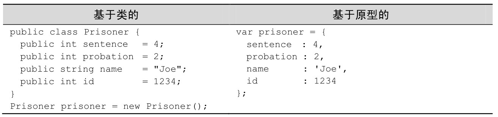
基于原型的对象更简单，并且当只有一个对象实例时，编写更快。在基于类的系统中，你得定义类，定义构造函数，然后实例化对象，该对象是这个类的实例。一个基于原型的对象只要在适当的地方简单地定义它就行了。

基于原型的系统对于使用一个对象的情况比较占优势，但是它也支持更复杂的使用情况，使多个对象共享相似的特性。我们使用先前的囚犯示例，用代码更改囚犯的名字和id，但保持监禁和缓刑的预设年数不变。

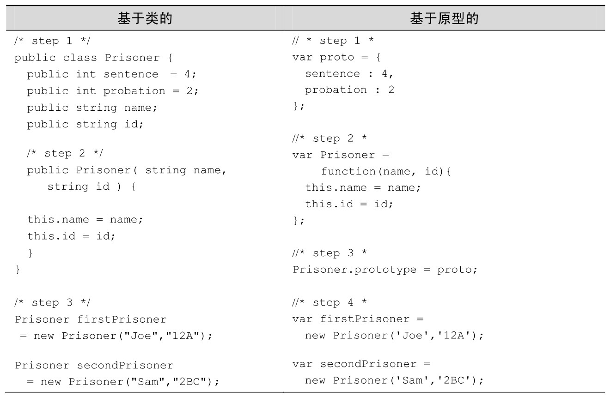
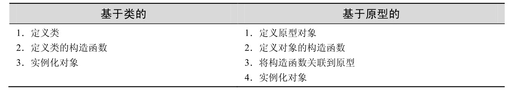
在表2-3中如你所看到的，这两种编程方式遵循类似的顺序，如果你习惯了类，则适应原型应该不难。但是魔鬼在细节中，如果你没有学习基于原型的方法，就从基于类的系统一头扎进了 JavaScript，很容易被某些看起来应该很简单的东西绊倒。我们按顺序逐步地过一遍，看看能学到什么。

在每个方法中，首先创建了对象的模板。模板在基于类的编程中叫做类，在基于原型的编程中叫做原型对象，但是它们的作用是一样的：作为创建对象的结构。

然后，创建了构造函数。在基于类的语言中，构造函数是在类的内部定义的，这样的话，当实例化对象时，哪个构造函数与哪个类配对，就很清晰了。在JavaScript中，对象的构造函数和原型是分开设置的，所以需要额外多一步来将它们连接在一起。

最后，实例化对象。

JavaScript使用了new操作符，这违背了它基于原型的核心思想，可能是试图让熟悉基于类继承的开发人员更容易理解。不幸的是，我们认为这把问题搞混乱了，使得某些应该不熟悉的东西（因此需要学习）仿佛变得熟悉了，导致开发人员一头扎进了开发，直到他们遇到了问题并且花费了好几个小时试图解决bug，而这bug是由于把JavaScript误认为是基于类的系统而产生的。

方法Object.create作为new操作符的替代方案，使用它来创建JavaScript对象时，能增添一种更像是基于原型的感觉。在这本书中，我们只使用 Object.create 方法。使用Object.create来创建表2-3中基于原型的囚犯，应该是如代码清单2-9所示。

代码清单2-9 使用Object.create 创建对象

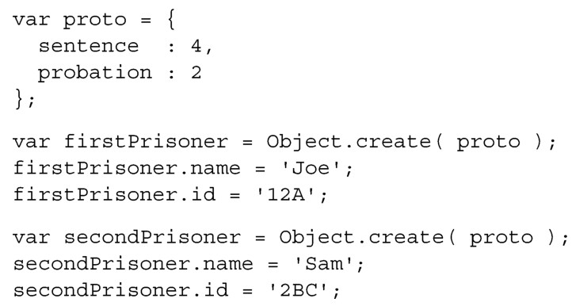
Object.create把原型作为参数并返回一个对象，使用这种方式，可以在原型对象上定义共同的属性和方法，然后使用它来创建多个共享相同属性的对象。手动为每个对象设置name和id是痛苦的，因为会有重复的代码而显得不整洁。另外一种可选的方案是，使用 Object.create 的常见模式是使用工厂函数来创建并返回最终的对象（见代码清单2-10）。所有的工厂函数我们以make<object_name>的形式进行命名。

代码清单2-10 使用Object.create()和工厂函数

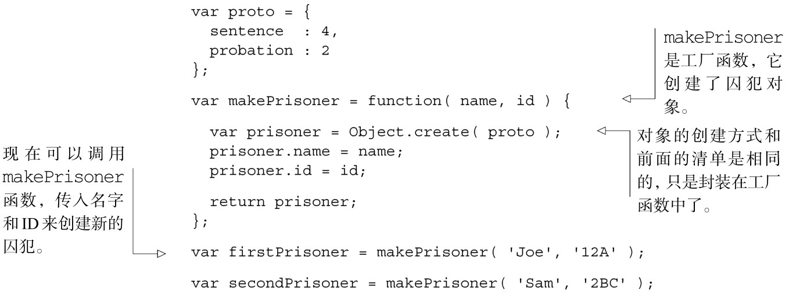
尽管在JavaScript中，有许多创建对象的替代方法（这是开发人员再三争论的话题），一般认为使用Object.create是最佳方法。我们更喜欢这一方法，因为它清晰地说明了原型是如何被设置的。不幸的是，new 操作符可能是最常用来创建对象的方法。我们说不幸，是由于它误导了开发人员以为JavaScript语言是基于类的，遮掩了原型系统的细微差别。

老式浏览器上的Object.create

Object.create在IE 9+、Firefox 4+、Safari 5+以及Chrome 5+中有效。为了在浏览器之间兼容（IE6、7和8，说你呢！），当Object.create不存在的时候，我们需要定义这个方法，而已经实现它的浏览器则不去管它。

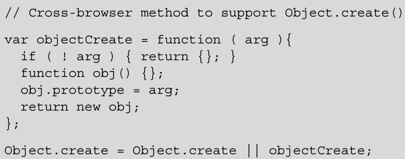
现在已经明白了JavaScript是如何使用原型来创建共享相同属性的对象，我们再深入地挖掘原型链，谈论一下JavaScript引擎是如何实现查找对象的属性值的。

原型链

在基于原型的JavaScript中，对象属性的实现方式和功能不同于基于类的系统。它们有很多的相似点，以至于大多数时候不用很清楚地理解也行，但是不同点在它们丑陋的表面之后，我们为之付出的代价是挫折感和低效率。就像预先学习原型和类之间的基本区别是值得的，所以我们来学习一下原型链。

JavaScript使用原型链来解析属性值。原型链描述了JavaScript引擎如何从对象查找到原型以及原型的原型，来定位对象的属性值。当请求对象的属性时，JavaScript 引擎首先直接在该对象上查找。如果找不到该属性，则查找原型（保存在对象的__proto__属性中），查看原型是否包含了请求的属性。

如果JavaScript引擎在对象的原型上找不到该属性，它就查找原型的原型（原型只是一个对象，所以它也有原型）。依此类推。当JavaScript到达通用的（generic）Object的原型，原型链就结束了。如果JavaScript在原型链上的所有地方都找不到请求的属性，则返回 undefined。由于 JavaScript 引擎会检查原型链，具体细节可能变得错综复杂，但是对于本书，我们只需记住如果在对象上找不到属性，则检查它的原型。

这种“往上爬”的原型链，和JavaScript引擎在作用域链上查找变量定义时的“往上爬”是类似的，如图2-5所示，与图2-4作用域链的思想几乎是一样的。

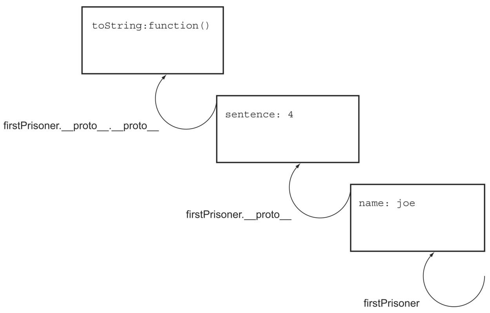
可以使用__proto__属性，手动地在原型链上“往上爬”。

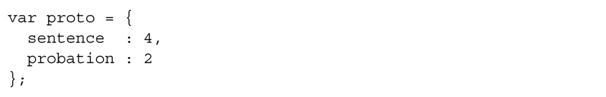
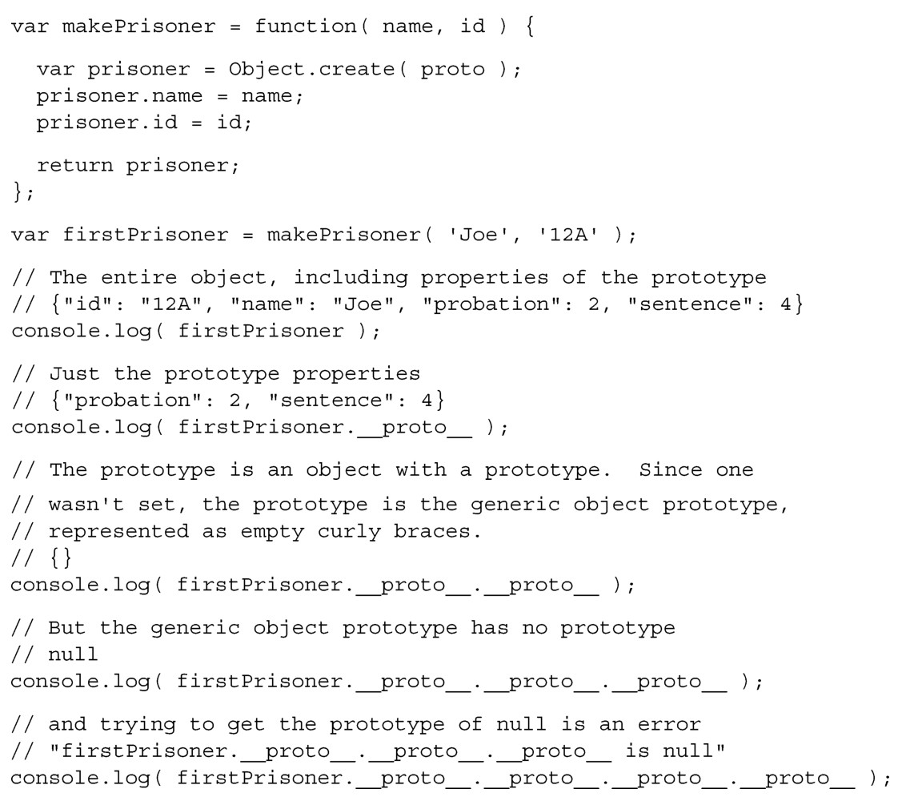
如果请求 firstPrisoner.name，JavaScript 会直接在对象上找到囚犯的名字并返回Joe。如果请求firstPrisoner.sentence，JavaScript在对象上找不到该属性，但在原型上找到了它，返回值为4。如果请求firstPrisoner.toString()，得到的是字符串[object Object]，因为基础对象（base object）的原型有这个方法。最后，如果请求firstPrisoner.hopeless，得到的是undefined，因为该属性在原型链上找不到。表2-4总结了这些结果。

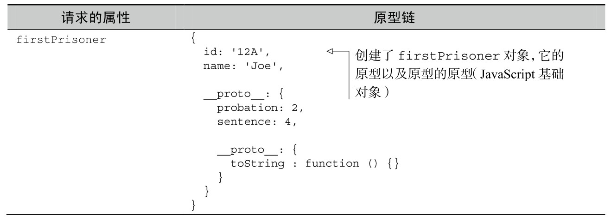
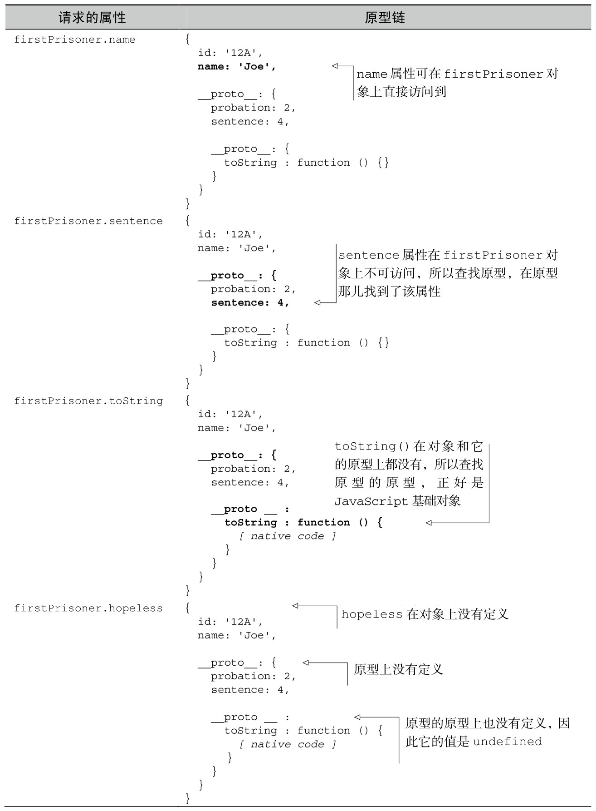
另外一种演示原型链的方法是，更改对象上的某个由原型设置的值，看看会发生什么，见代码清单2-11。

代码清单2-11 覆盖原型

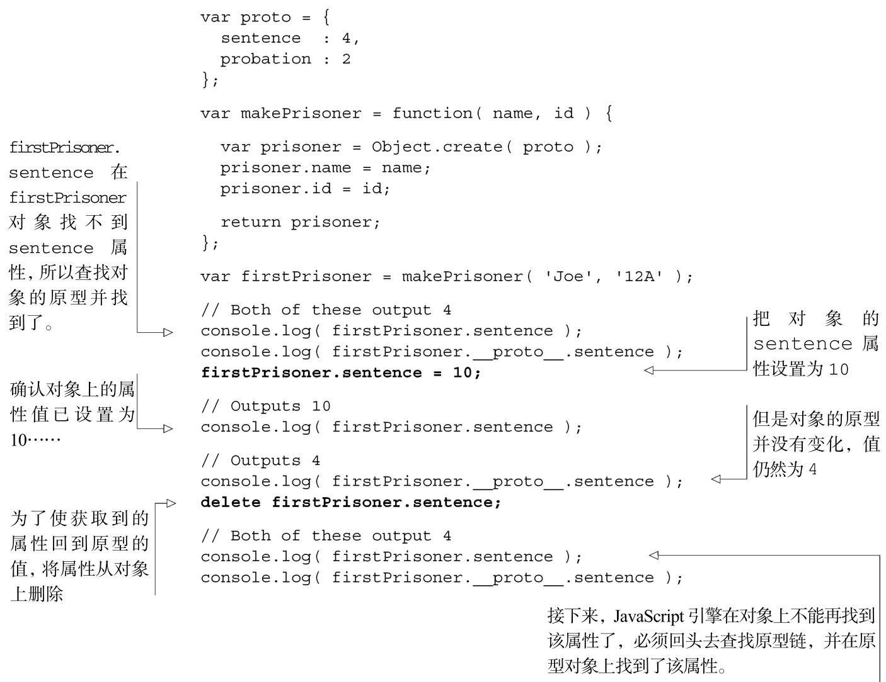
那么如果更改了原型对象的属性值，会发生什么呢？我知道你在思考。

更改原型

原型继承提供了一个很强大的（有潜在危险的）行为，能够使得所有基于原型的对象即刻发生变化。对于熟悉静态变量的人来说，原型上的属性就像是从原型创建的对象上的静态变量。我们再看一下代码。

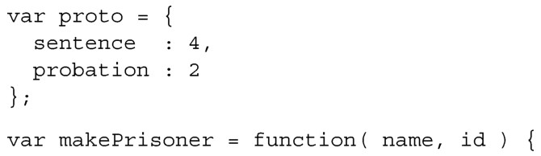
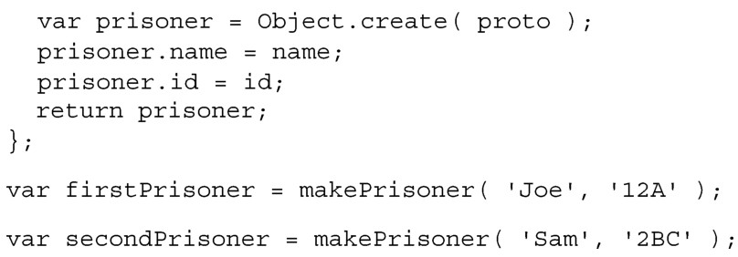
如果在上面示例的最后检查firstPrisoner或者secondPrisoner，会发现继承属性sentence被设置为4。

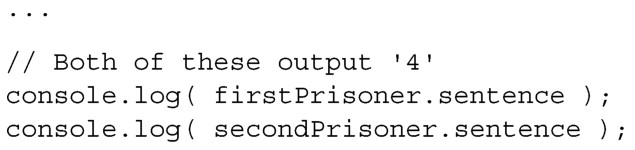
如果更改原型对象，比如设置proto.sentence=5，然后所有之前和之后创建的对象都会变成这个值。因此firstPrisoner.sentence和secondPrisoner.sentence都是5。

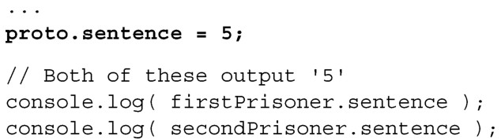
这一行为有好处也有坏处。重要的是它在所有的JavaScript环境中都是一致的，我们知道这一行为，所以能相应地进行编码。

现在已经知道了对象是如何使用原型从其他对象继承属性的，我们来看一下函数是如何工作的，因为它们的行为可能与你期望的不一样。我们也将研究这些差异是如何能提供全书所使用的有用功能的。

