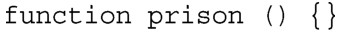
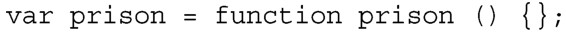
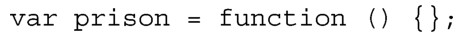
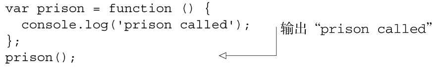

#### 
  2.6.1 函数和匿名函数

在JavaScript中，函数的一个重要特性是：它是一个对象，和其他对象一样。我们都可能见过JavaScript是这么声明函数的：

但也可以使用变量来保存函数：

我们可以使用匿名函数，以便减少冗余（以及减小名字不匹配的机率），它只是声明没有名字的函数的标签。下面是一个用局部变量来保存的匿名函数：

用局部变量保存的函数，调用方式和我们期望的函数调用是一样的：

