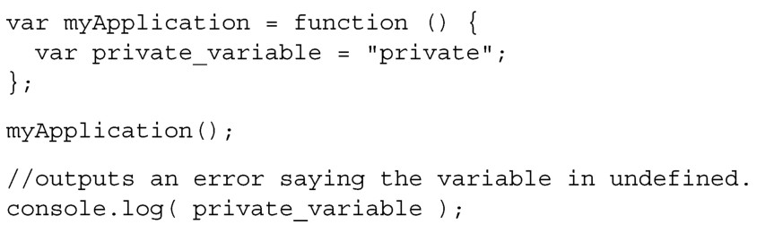
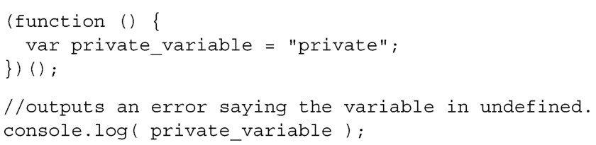
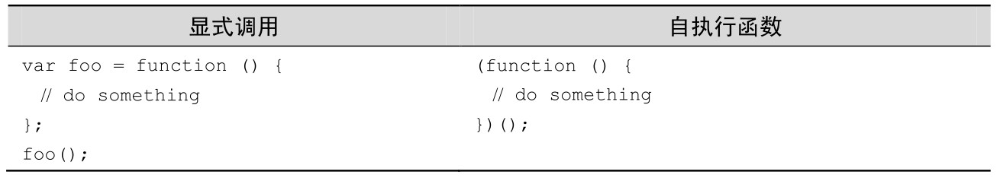
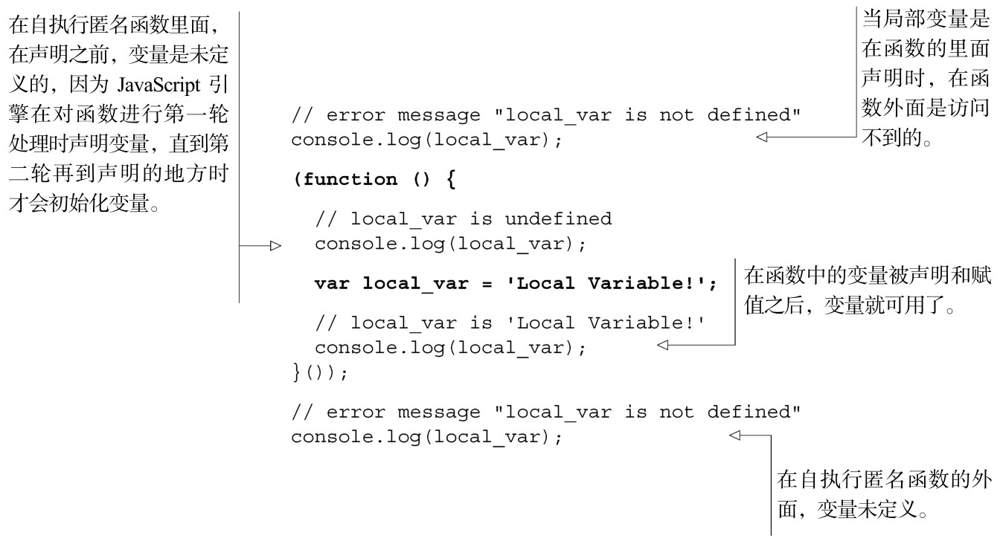
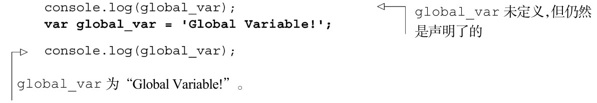
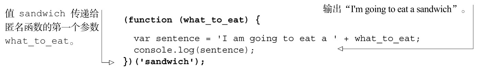
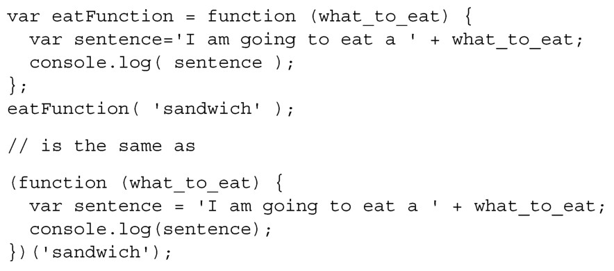

#### 
  2.6.2 自执行匿名函数

在JavaScript中我们遇到的一个问题是，在全局作用域中定义的所有东西在每个地方都是可用的。有时候你不想和所有人共享，不想第三方库共享它们的内部变量，因为这很容易覆盖对方的库，从而导致难以诊断的问题。使用我们所了解的函数，可以把整个程序封装在函数中，调用这个函数，这样外部代码就不能访问到变量了。

但要都用这种方式来写的话，就显得冗长和不灵活。如果不用“定义函数，把它保存给一个变量，然后执行该函数”，这会很不错。如果有简化方法，那当然是很不错。猜怎么着……还真的有！

这叫自执行匿名函数，因为定义它时没有名字并且没有保存给变量，但却立即执行了。我们所做的是用括号把函数括起来，之后跟上一对括号来执行这个函数，如表2-5所示。当把这种语法和显式函数调用放在一起的时候，也没觉得很惊讶吧。

自执行匿名函数被用来控制变量的作用域，阻止变量泄漏到代码中的其他地方。这可用于创建JavaScript插件，不会和应用代码冲突，因为它不会向全局名字空间添加任何变量。在下一小节，我们会演示一种更加高级的用法，整本书都会使用它。它叫做模块模式（module pattern），使我们有办法定义私有变量和私有方法。首先，我们来看一下自执行匿名函数中的变量作用域是如何工作的。如果这看着很熟悉，是因为它和前面的是一模一样的，只是使用了新的语法：

将上述代码与下面的代码作比较：

这里，变量 global_var 污染了全局名字空间，如果代码中或者是项目中的外部JavaScript 库使用了相同名字的变量，就会有产生冲突的风险。你可能经常在 JavaScript圈子内听到术语“全局名字空间污染”，指的就是这个。

使用自执行匿名函数，能解决全局变量被第三方库或者甚至是自己无意编写的代码所覆盖的问题。将值作为参数传给自执行匿名函数，就可以保证这个参数的值在执行环境中是你所期望的值，因为外部代码不能影响到它。

首先，看一下如何向自执行匿名函数传递参数。

不知这种语法是否会使你头晕目眩，它就是把值 sandwich 传给匿名函数，作为它的第一个参数。我们来把这种语法和普通函数作一下对比：

唯一的区别是，变量eatFunction被移除了，使用一对括号把函数定义包了起来。

一个很著名的阻止变量被覆盖的例子是使用jQuery 和Prototype JavaScript 库。它们都大量使用了字符变量$。如果在应用中同时引入了这两个库，则最后添加的库将控制$。将变量传递给自执行匿名函数的技巧，可以用来保证在一块代码里面，jQuery可以使用$变量。

对于这个例子，你应该知道 jQuery 和$变量是彼此的别名。将 jQuery 变量传递给参数为$的自执行匿名函数，就能避免$被Prototype库占用了。

