#### 
  2.6.3 模块模式——将私有变量引入JavaScript

我们可以把应用封装在自执行匿名函数中，使应用免受第三方库（和我们自己）的影响，这是非常不错的，但是单页应用很庞大，不能定义在一个文件中。如果有方法将该文件分成一个个的模块，每个模块都有它们自己的私有变量，这当然是好的。好吧，你将看到我从哪儿入手……这是可以做到的！

我们来看一下如何把代码分成多个文件，但仍然利用自执行匿名函数来控制变量的作用域。

还是不习惯这种自执行匿名函数的语法吗？

我们换个角度来看一下。下面这种有趣的语法：

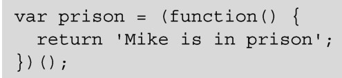
实际上和下面这种语法是一样的：

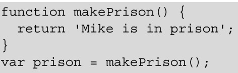
在上面两个示例中，prison的值都是“Mike is in prison”。唯一的实际区别是，当makePrison函数仅需使用一次的时候，在创建和调用这个函数时就不需要保存这个函数。

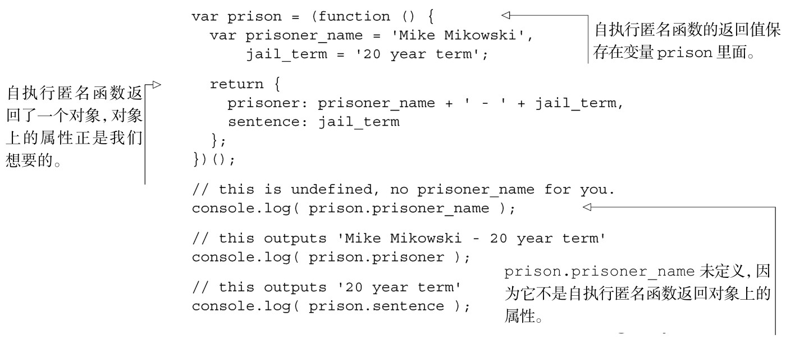
自执行匿名函数会立即执行，返回一个拥有prisoner和sentence属性的对象。匿名函数没有保存在prison变量中，因为匿名函数被执行了：匿名函数的返回值保存在变量prison中。

在全局作用域中只添加了prison变量，没有添加prisoner_name和jail_term变量。在稍大一点的模块中，减少全局变量是很重要的。

我们的对象有一个问题，一旦自执行匿名函数停止执行，在它里面定义的变量没有了，所以它们是不能被更改的。prisoner_name和jail_term不是保存给变量prison的对象的属性，所以它们无法通过prison变量访问。它们用来定义匿名函数的返回对象上的prisoner和sentence属性，并且这些属性可以在prison变量上访问到。

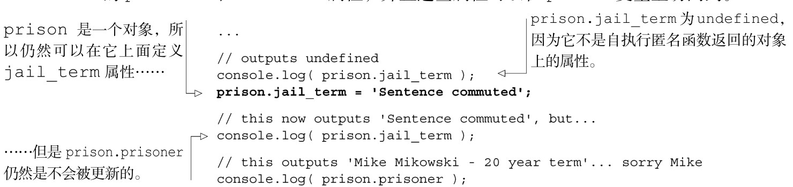
prison.prisoner没被更新，这有几个原因。首先，jail_term不是prison对象或者原型上的属性，它是执行环境中创建的对象变量，prison变量保存了这个变量，并且执行环境已不复存在，因为函数已经执行结束。其次，这些属性只在匿名函数执行时设置了一次，永远不会被更新。为了能更新它们，我们必须把属性转变为方法，每次调用它们时都会访问变量。

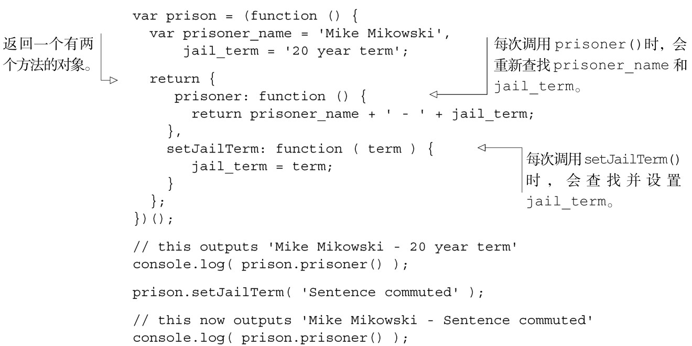
尽管自执行匿名函数完成了执行，方法prisoner和setJailTerm仍然可以访问变量prisoner_name和jail_term。prisoner_name和jail_term像是prison对象的私有变量。它们只能通过匿名函数返回的对象上的方法来访问，不能在该对象或者原型上直接访问。你听说过闭包很难吧。等等，不好意思……我还没解释过怎样才算是闭包吧，我有解释过吗？好吧，我们往回走几步来看看闭包。

什么是闭包？

闭包是一种抽象的概念，理解起来可能比较困难，所以在回答“什么是闭包”之前，我们需要知道一些背景知识。请稍微忍耐一下，在本部分的最后你会得到答案的。

随着程序的运行，它们会因各种事情而占用计算机的内存，比如保存变量的值。如果程序运行了却从不释放不再需要的内存，电脑最终会崩溃。在一些语言中，像 C，内存管理是由程序员处理的，程序员编写代码时花费了很多时间，以便确保在能释放内存的时候就释放掉。

其他语言，像Java和JavaScript，实现了自动释放内存的系统，当代码不再需要时，就从电脑的内存中把它移除。这些自动化系统叫做垃圾回收器（garbage collector），想必是因为不需要的变量占用了空间就臭气熏天吧。关于哪种系统更好，自动的还是手动的，有多种意见，但这已经超出了本书范围。知道JavaScript有垃圾回收器就足够了。

当函数执行完毕时，管理内存的本地方法会将函数中所有创建了的东西从内存中移除。毕竟函数已经执行完毕，所以似乎我们不再需要访问该执行环境中的任何东西了。

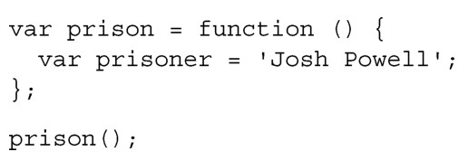
一旦prison完成执行，我们就不再需要访问prisoner变量，所以Josh自由啦。这种模式有点繁琐，所以我们把它转回为自执行匿名函数的模式。

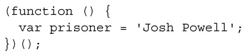
这是同一回事：函数执行完成时，prisoner变量就不再需要保存在内存中了。再见， Josh！

我们把这一段代码粘贴到模块模式中去。

我们仍然不需要在匿名函数执行后访问prisoner 变量。因为字符串Josh Powell已经保存在prison.prisoner中，没有理由再在模块所在的内存中保存prisoner变量，因为它不能再被访问。prison.prisoner的值是字符串Josh Powell，但它不再指向prisoner变量。

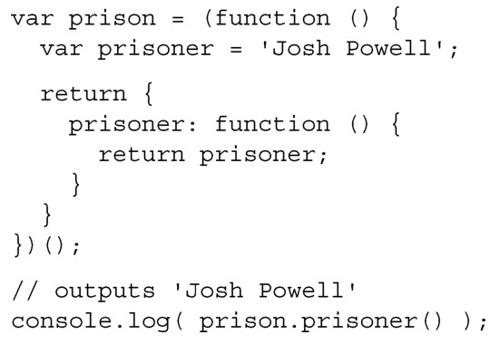
现在，每次执行prison.prisoner时都会访问prisoner变量。prison.prisoner()返回 prisoner 变量的当前值。如果垃圾回收器来把它从内存中移除了，调用prison.prisoner会返回undefined，而不是Josh Powell。

现在我们终于可以回答“什么是闭包”这个问题了。闭包是阻止垃圾回收器将变量从内存中移除的方法，使得在创建变量的执行环境的外面能够访问到该变量。在prisoner函数被保存到prison对象上时，一个闭包就创建了。闭包因保存函数而被创建，在执行环境的外面，可以动态访问prisoner变量，这就阻止了垃圾回收器将prisoner变量从内存中移除。

我们再多看几个闭包的示例。

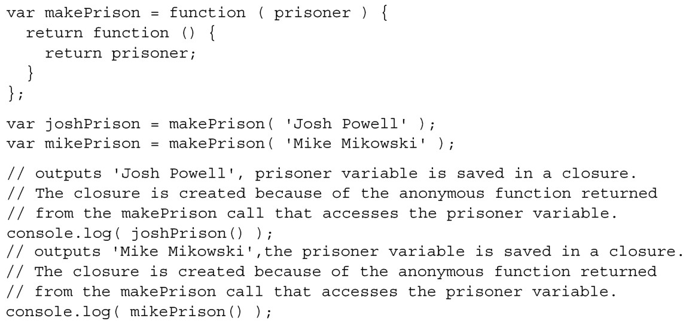
另一种使用闭包的常见情况是，保存变量以便在 Ajax 请求返回时使用。当使用JavaScript对象中的方法时，this指向这个对象：

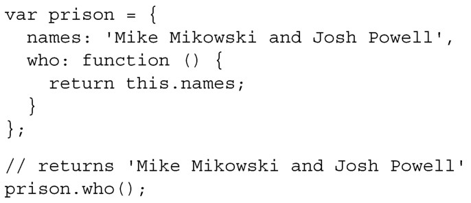
如果是使用 jQuery 来发送 Ajax 请求的方法，则 this 不再指向对象，它指向 Ajax请求对象：

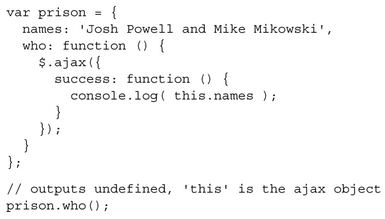
那么如何指向对象呢？使用闭包来营救！请记住，闭包由函数创建，该函数在当前执行环境中访问了某个变量，并将该函数保存给当前执行环境外的一个变量。在下面的示例中，通过把 this 保存给 that，在函数中访问 that，从而创建了一个闭包，当Ajax请求返回时，会执行该函数。Ajax请求是异步的，所以响应来自发送Ajax请求的执行环境之外。

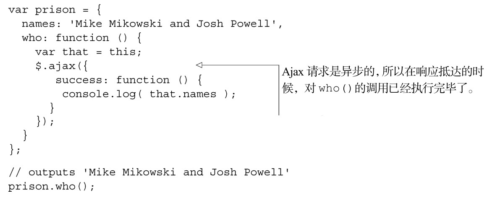
尽管在Ajax请求返回的时候，who()已经执行完毕，但是that变量不会被垃圾回收，在success方法中可以使用该变量。

但愿我们表达闭包的方式，能让你很容易地理解什么是闭包以及它是如何工作的。现在已经理解了闭包是什么，我们再深入地研究一下闭包的机制，看看它是如何实现的。

