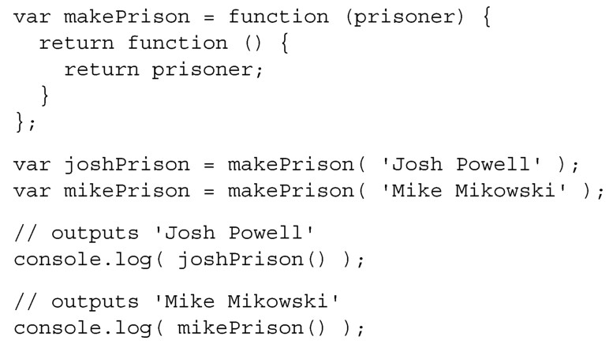
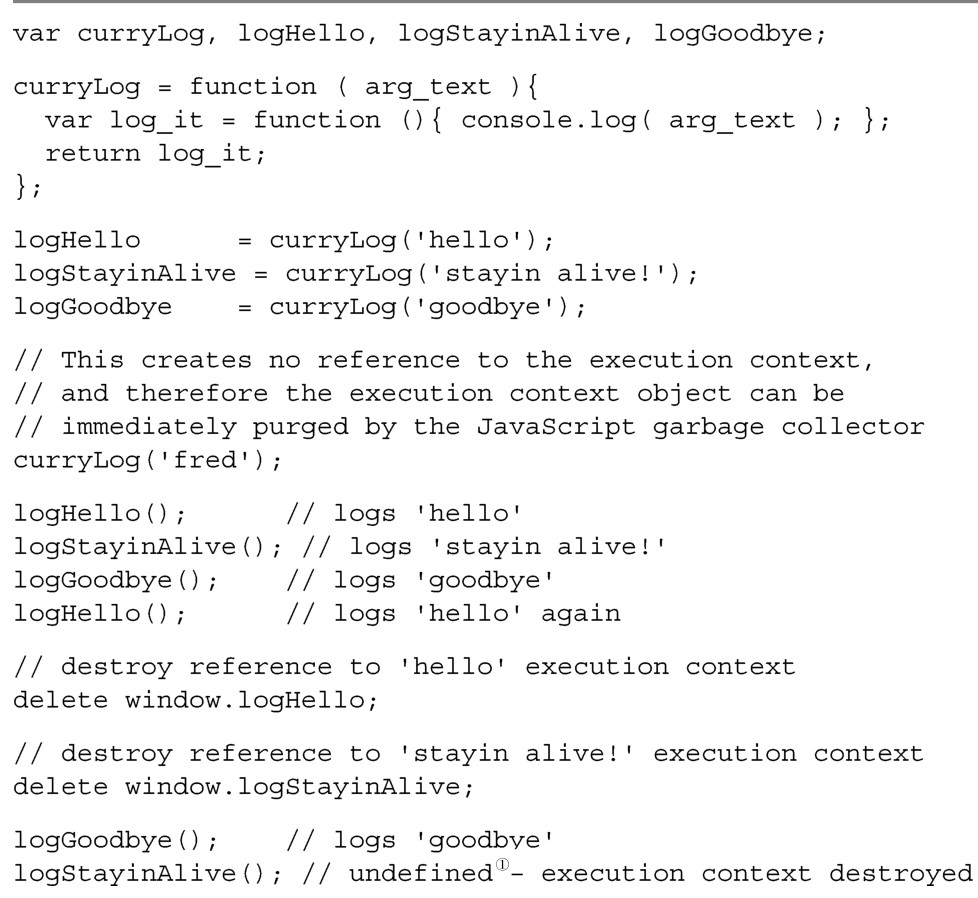
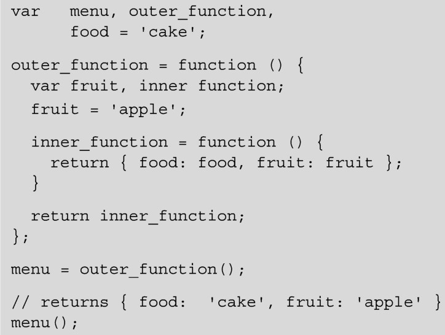
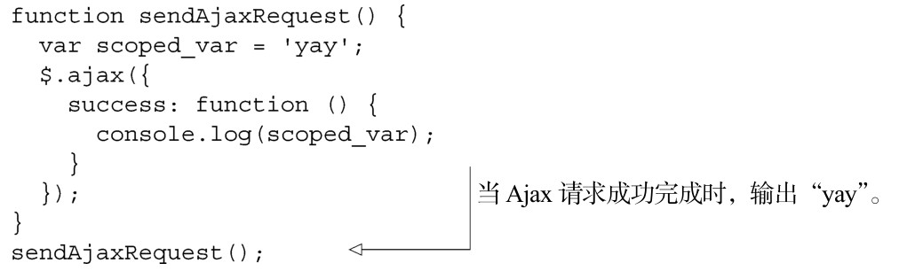

#### 
  2.6.4 闭包

闭包是如何工作的？我们知道了闭包是什么，但还不知道它是如何实现的。答案就在执行环境对象中。我们看一下上一小节的示例：

当调用makePrison时，为这次特定的调用创建了一个执行环境对象，将传入的值赋予prisoner。请记住，执行环境对象是JavaScript引擎的一部分，在JavaScript中不能直接访问。

在前面的示例中，我们调用了两次 makePrison，将结果保存到 joshPrison 和mikePrison。因为makePrison 的返回值是一个函数，当我们把结果赋予joshPrison变量的时候，这个特定的执行环境对象的引用计数置为 1，因为引用计数大于 0，所以JavaScript引擎会保留这个特定的执行环境对象。如果这个引用计数降到0，然后JavaScript引擎会知道要对这个对象进行垃圾回收了。

当再次调用makePrison并赋予mikePrison时，创建了一个新的执行环境对象，这个执行环境对象的引用计数也置为1。此时，有两个指针分别指向两个执行环境对象，两者的引用计数都是1，尽管两者是通过执行同一个函数而创建的。

如果再次调用joshPrison，它会使用“在调用makePrison时所创建的并保存给joshPrison 的执行环境对象”上设置的值。清除保存的执行环境对象的唯一方法（除了关闭网页，聪明的小伙伴们），就是删除joshPrison变量。当删除这个变量的时候，这个执行环境对象的引用计数会降到0，那么在JavaScript空闲的时候就会移除这个对象。

我们把一些执行环境对象立刻销毁掉，看看会发生什么事情，见代码清单2-12。

代码清单2-12 执行环境对象

我们必须记住，每次调用函数时都会创建一个唯一的执行环境对象。函数执行完后，执行对象就会被丢弃，除非调用者引用了它。当然，如果函数返回的是数字，就不能引用函数的执行环境对象。但是，如果函数返回的是一个更复杂的结构，像是函数、对象或者数组，将返回值保存到一个变量上（有时是误用）就创建了一个对执行环境的引用。<a class="my_markdown" href="['#anchor12']">[12]</a>

创建很多层深的执行环境引用链是可能的。当我们需要它时这是一件好事（思考一下对象继承）。但也有不想要这种闭包的时候，因为它们可能会导致内存使用失控（思考一下内存泄漏）。附录A中的约定和工具能帮助你避免无意形成的闭包。

闭包——再谈论一下！

由于闭包是如此的重要，又是JavaScript中令人困惑的部分，在我们学习接下来的内容之前，我们再试着解释一下。如果你已经掌握了闭包，可以不用看下面的内容。

当调用 outer_function 时，创建了一个执行环境。在这个执行环境中定义了inner_function，因为在outer_function执行环境里面定义了inner_function，它有权限访问在 outer_function 作用域内的所有变量，这里是 food、fruit、outer_function、inner_function和menu。当outer_function执行完时，你可能期望在执行环境中的所有东西都会被垃圾回收器销毁。你想错了。因为inner_function的引用保存给了全局作用域中的变量menu，所以它并不会被销毁。在声明 inner_function 的作用域内，需要保留对所有变量的访问权限，它“关闭”了outer_function执行环境的大门，阻止垃圾回收器来移除它们。这就是闭包。

这将我们带回到了第一个示例，我们看一下是否明白为什么在 Ajax 请求返回后， scoped_var还是可以访问的。

之所以可以访问，是因为success方法是在调用sendAjaxRequest时创建的执行环境中定义的，此时scoped_var在作用域中。如果你还是不明白闭包，请不要灰心。闭包是JavaScript中较难的概念之一，如果在读了几遍本节的内容后，依然没有明白，请尽管继续学习接下来的章节。为能理解这个概念，你需要一些更多的实践经验。但愿在阅读到本书的最后时，你将会有足够的实践经验，使用闭包也成了你的习惯。

对JavaScript的探索和一些细节研究到此结束。这次回顾并不全面，但关注的是我们发现的对开发大规模单页应用来说是必需的概念。希望你喜欢本章的内容。

