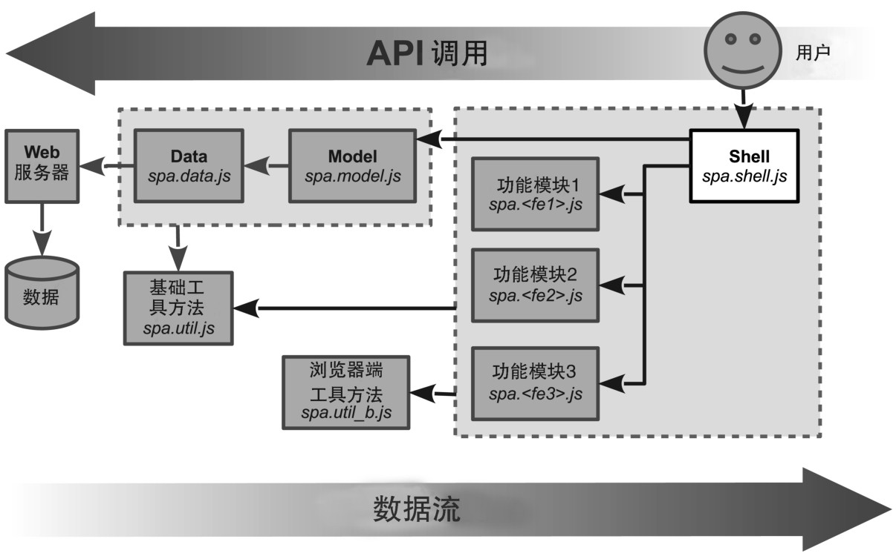

### 
  3.1 深刻理解Shell

Shell是单页应用的主控制器（master controller），在我们的架构中是必需的。可以把Shell模块的角色和飞机的外壳（shell）作一下对比：

飞机外壳（也叫做硬壳或者机身）是飞机的形状和结构。有座椅、小桌板和引擎等配件，使用各种紧固件把它们附着在机身上。所有的配件都被做成尽可能独立工作，因为没人喜欢当Milly阿姨打开小桌板时，导致飞机立即向右侧倾斜。

Shell模块是单页应用的形状和结构。像聊天、登录和导航等功能模块依靠API依附在Shell上。所有的功能模块都被构建成尽可能独立地工作，因为没人喜欢当Milly阿姨在聊天滑块中输入“ROTFLMAO!!! UR totally pwned!”<a class="my_markdown" href="['#anchor1']">[1]</a>时，应用立即关闭了她的浏览器窗口。

Shell只是架构的一部分，是我们从很多商业项目中提炼出来的。这种适用Shell的架构如图3-1所示。首先编写Shell模块是有好处的，因为它是架构的中枢。它是功能模块和业务逻辑以及通用浏览器接口（像URI或者cookie）之间的协调者。当用户点击了后退按钮、登录或者做了其他事情而改变了应用状态，这些状态可以使用书签来标记，Shell会协调这些改变。

习惯了模型-视图-控制器（MVC）架构的读者，可能会把Shell当作主控制器，因为它是协调所有从属功能模块的控制器。

Shell负责以下事情。

渲染和管理功能容器。

管理应用状态。

协调功能模块。

下一章会详细地讲解功能模块的协调方式。本章讲解渲染功能容器和管理应用状态。首先，我们开始准备文件和名字空间。

